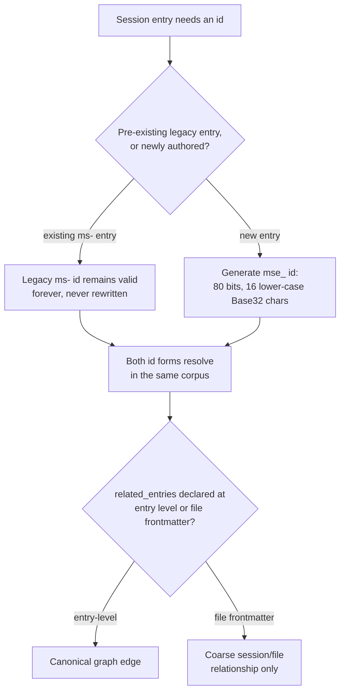

---
tags:
  - session-log-diagrams
diagram_date: 2026-06-15
---

## 2026-06-15 16:40 - Deterministic 80-bit mse_ ids; legacy ms- never rewritten

```yaml
adr_id: adr_entry_id_scheme
grounded_in:
  - ms-a4282580:d2
```


