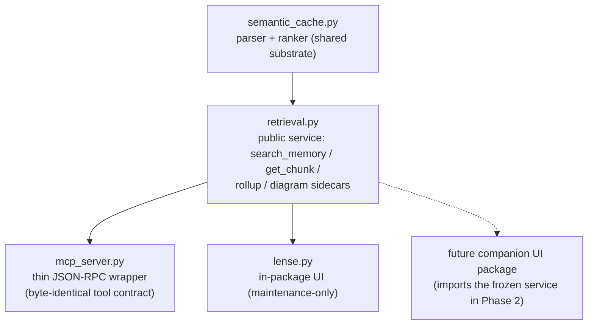

---
tags:
  - session-log-diagrams
diagram_date: 2026-07-05
---

## 2026-07-05 12:20 - Extract public retrieval service (Trail Phase 1)

```yaml
entry_id: mse_3n3mp35ekz08t4zb
```


```mermaid
flowchart TD
  SC["semantic_cache.py<br/>parser + ranker (shared substrate)"]
  RS["retrieval.py<br/>public service: search_memory / get_chunk /<br/>rollup / diagram sidecars"]
  MCP["mcp_server.py<br/>thin JSON-RPC wrapper<br/>(byte-identical tool contract)"]
  LENSE["lense.py<br/>in-package UI (maintenance-only)"]
  TRAIL["future companion UI package<br/>(imports the frozen service in Phase 2)"]

  SC --> RS
  RS --> MCP
  RS --> LENSE
  RS -.-> TRAIL
```
