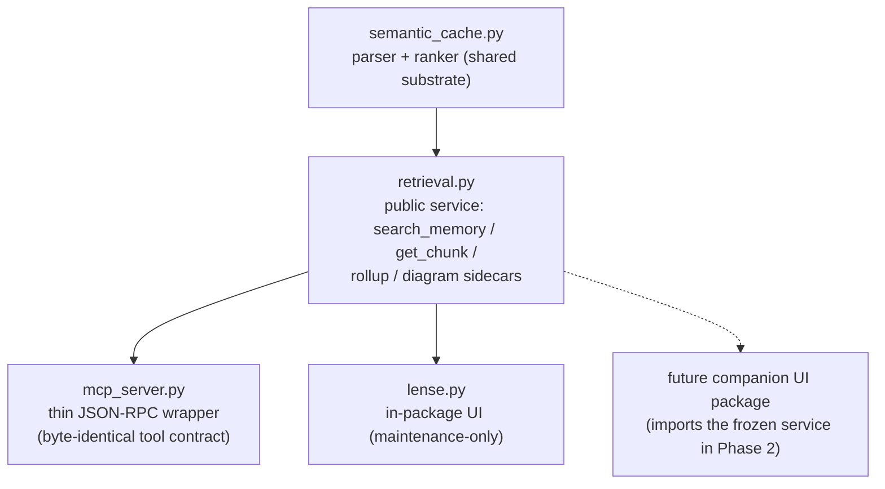
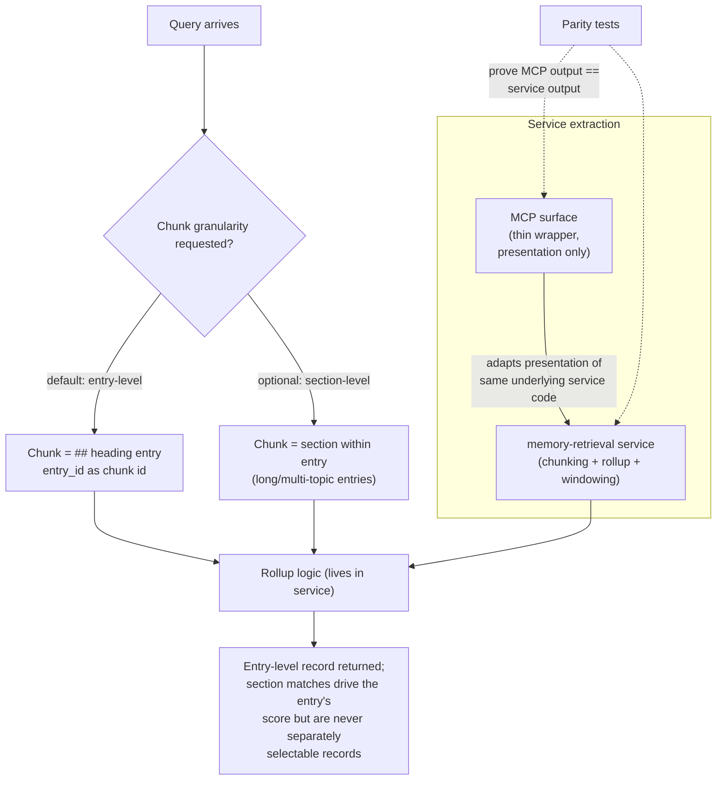

---
tags:
  - session-log-diagrams
diagram_date: 2026-07-05
---

## 2026-07-05 12:20 - Extract public retrieval service (Trail Phase 1)

```yaml
entry_id: mse_3n3mp35ekz08t4zb
```



## 2026-07-05 23:59 - Diagram sidecars: one dated file per day, keyed by entry, deterministically validated

```yaml
adr_id: adr_diagram_sidecar_structure
diagram_status: not_applicable
note: examined 2026-09-01 - this is a file/record format (path pattern, heading+YAML+mermaid block shape, one file per day) plus a flat list of five validation checks (frontmatter, entry_id presence, fence balance, filename-date match, orphan detection). No check is described as depending on or triggering another, and no migration procedure is described (unlike adr_session_layout's diagrammed migrate command); it is the same kind of schema restated as boxes that adr_draft_format and adr_edge_confidence were ruled not_applicable for.
```

## 2026-07-05 23:59 - A proposal moves lane when its acceptance criteria are met, and stays there

```yaml
adr_id: adr_proposal_completion_moves_lane
diagram_status: not_applicable
note: examined 2026-09-01 - this ADR supplies a single trigger (acceptance criteria fully met) for one one-way move into an absorbing "completed" lane; unlike adr_docs_lifecycle_folders (rejected for having no trigger at all), this one does have a trigger, but it is still one edge into a terminal state. The three subjects it names - individual plan document, document collection, source report - are three subjects of the same rule, not three distinct paths, so a diagram would just be the title sentence redrawn as boxes.
```

## 2026-07-05 23:59 - Retrieval: entry-level chunks as default, with optional section granularity

```yaml
adr_id: adr_retrieval_entry_granularity
grounded_in:
  - mse_pwwz3ys324ght2qs:d1
```


