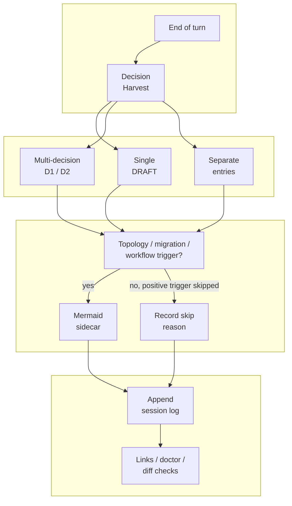
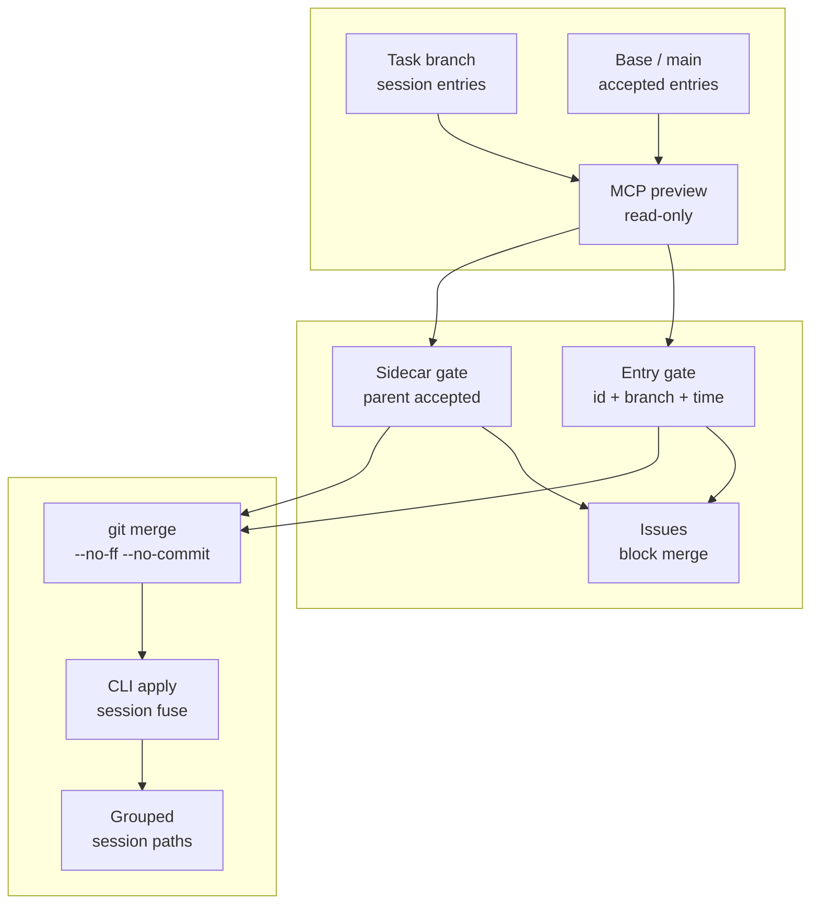

---
tags:
  - session-log-diagrams
diagram_date: 2026-07-10
---

## 2026-07-10 03:28 - Tighten decision harvest and diagram sidecar logging

```yaml
entry_id: mse_m6amd5db4c7s8sfw
```



## 2026-07-10 04:27 - Implement branch-session fuse MCP preview

```yaml
entry_id: mse_81v7vk4x5ys3k2n0
```


