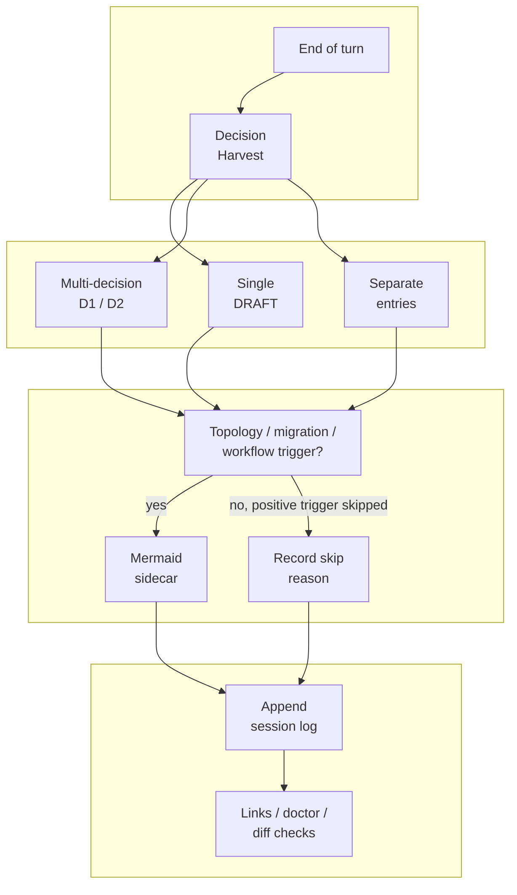
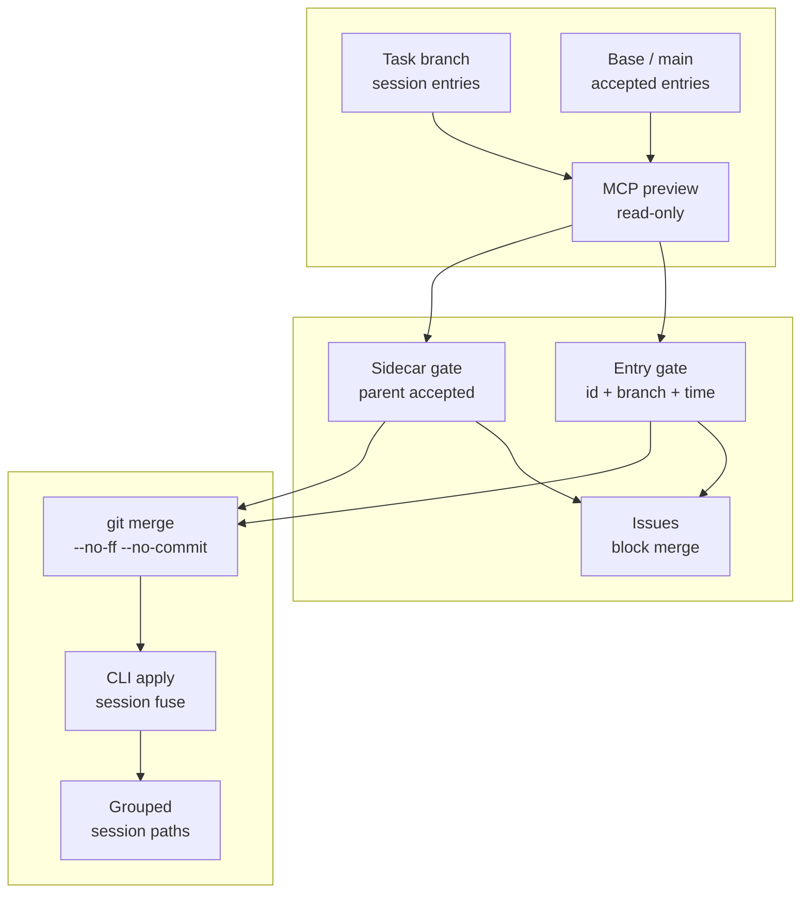
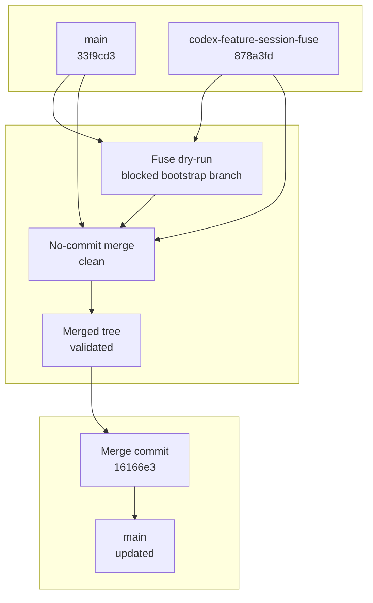
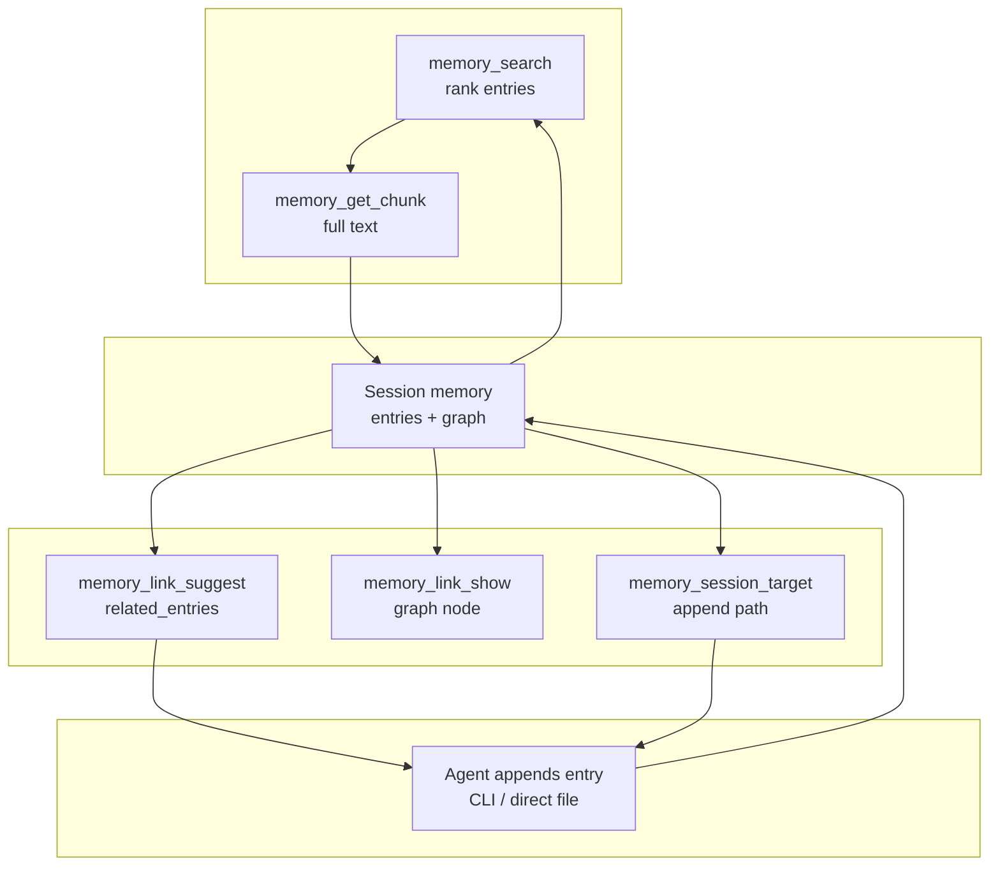
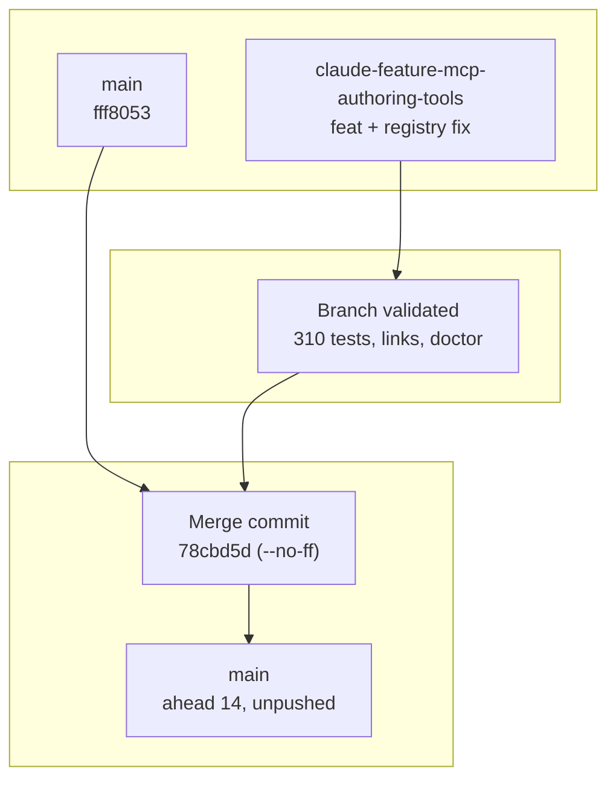
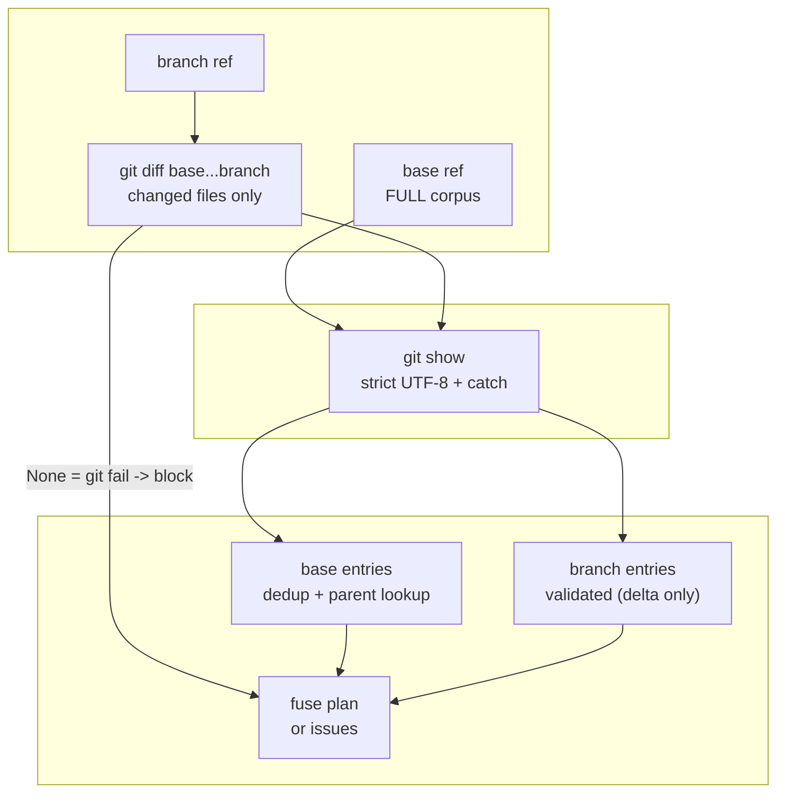
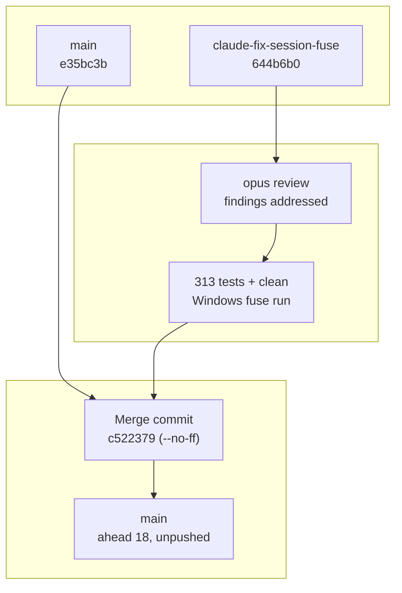
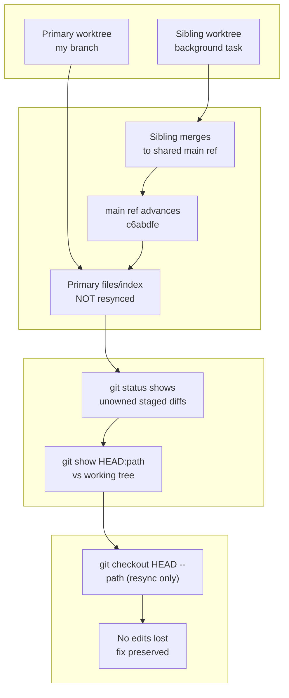
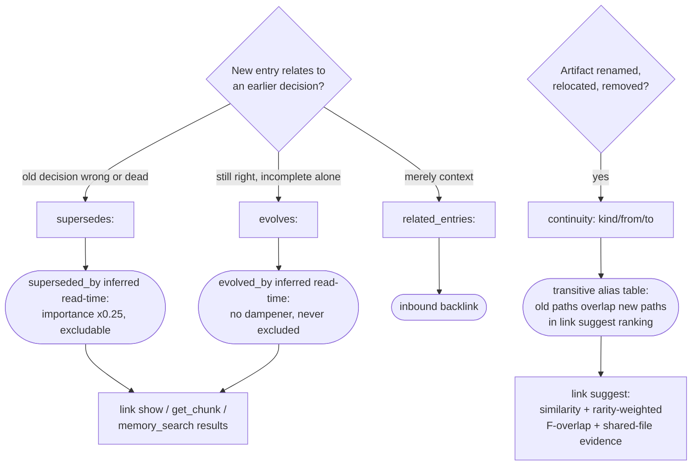

---
tags:
  - session-log-diagrams
diagram_date: 2026-07-10
---

## 2026-07-10 03:28 - Tighten decision harvest and diagram sidecar logging

```yaml
entry_id: mse_m6amd5db4c7s8sfw
```



## 2026-07-10 04:27 - Implement branch-session fuse MCP preview

```yaml
entry_id: mse_81v7vk4x5ys3k2n0
```



## 2026-07-10 04:39 - Merge session fuse preview workflow to main

```yaml
entry_id: mse_9dkkddgb6zjxv4j9
```



## 2026-07-10 05:10 - Add authoring-loop MCP tools (link suggest/show, session target)

```yaml
entry_id: mse_jpfs9yy19bznh18y
```



## 2026-07-10 05:35 - Merge authoring-loop MCP tools to main

```yaml
entry_id: mse_6eek6qvf8cvcbjw6
```



## 2026-07-10 06:20 - Fix session fuse Windows encoding and corpus-scope bugs

```yaml
entry_id: mse_azn6bejpd9xpmh3f
```



## 2026-07-10 06:40 - Merge session fuse fixes to main

```yaml
entry_id: mse_8c5e4m97szmfj8tp
```



## 2026-07-10 11:15 - Harden session-log-check.py: escalation state + language

```yaml
entry_id: mse_ynmnn99kgmqmec5r
```



## 2026-07-10 12:03 - session merge-branch command lifecycle

```yaml
entry_id: mse_dr5eprnhrctqeeg3
```

```mermaid
flowchart TD
  Start([session merge-branch --branch B]) --> Preflight{clean tree,
no merge in progress?}
  Preflight -- no: name dirty paths --> Refuse([refuse, exit 1])
  Preflight -- yes --> DryRun{fuse dry-run
issues?}
  DryRun -- yes --> Abort([abort: no merge state created])
  DryRun -- no, --dry-run flag --> Plan([print plan, exit 0])
  DryRun -- no --> Merge[git merge --no-ff --no-commit B]
  Merge --> Head{MERGE_HEAD exists?}
  Head -- no, rc=0 --> Uptodate([already merged, nothing to do])
  Head -- no, rc!=0 --> GitErr([real git error, exit 1])
  Head -- yes --> Classify{conflicts outside
session files?}
  Classify -- yes --> Manual([leave merge in progress,
manual resolution])
  Classify -- no --> Reset[reset branch-touched session paths
to base content]
  Reset --> Apply[session fuse --apply:
timestamp-sorted rewrite]
  Apply --> Stage[git add sessions sweep]
  Stage --> Commit([git commit --no-edit:
2-parent merge, chronological log])
```

## 2026-07-10 14:04 - Lifecycle edge decision flow and read pipeline

```yaml
entry_id: mse_h5trfwg2yjyjadpp
```


