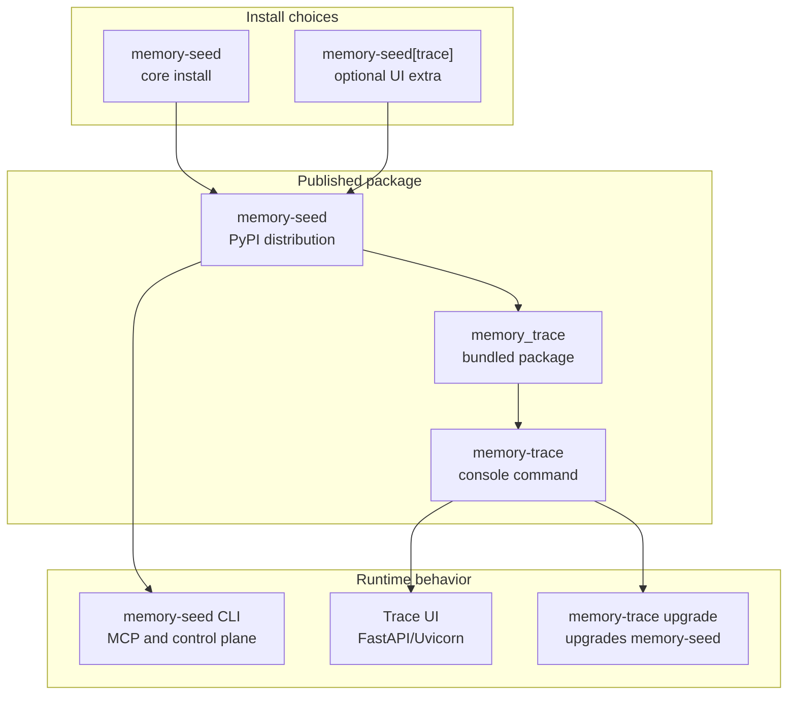
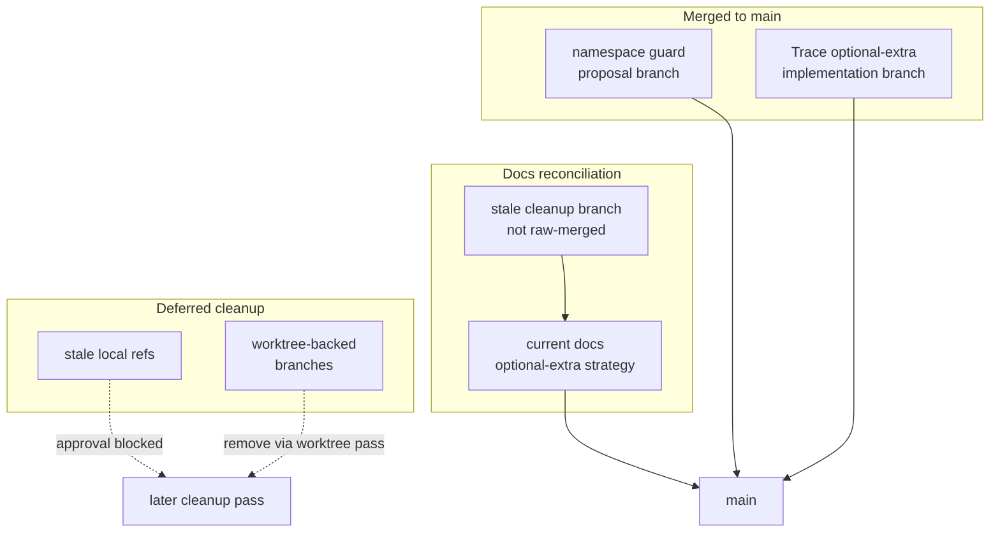

---
tags:
  - session-log-diagrams
diagram_date: 2026-07-12
---

## 2026-07-12 00:38 - Bundle Memory Trace as optional extra

```yaml
entry_id: mse_etm5m5682sseasgm
```



## 2026-07-12 12:15 - Fuse Codex branches and align Trace packaging docs

```yaml
entry_id: mse_kq3ba0cy9nkpqkm0
```


