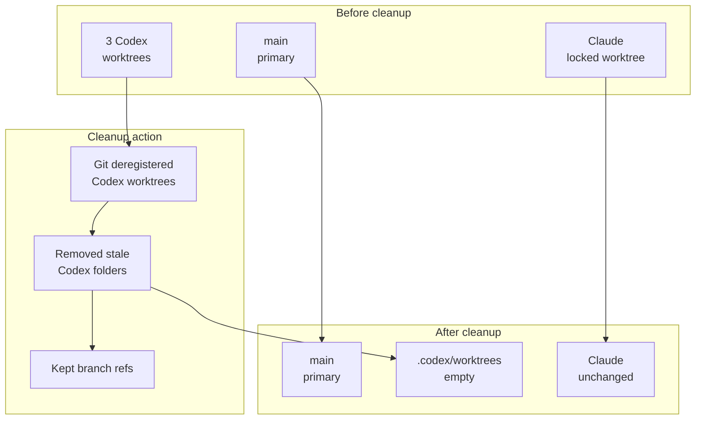

---
tags:
  - session-log-diagrams
diagram_date: 2026-07-13
---

## 2026-07-13 00:13 - Clean remaining Codex worktrees

```yaml
entry_id: mse_992a3jfxfpnecpst
```


```mermaid
graph TD
  subgraph Before["Before cleanup"]
    direction LR
    B1["main<br/>primary"]
    B2["3 Codex<br/>worktrees"]
    B3["Claude<br/>locked worktree"]
  end

  subgraph Action["Cleanup action"]
    direction LR
    A1["Git deregistered<br/>Codex worktrees"]
    A2["Removed stale<br/>Codex folders"]
    A3["Kept branch refs"]
  end

  subgraph After["After cleanup"]
    direction LR
    C1["main<br/>primary"]
    C2[".codex/worktrees<br/>empty"]
    C3["Claude<br/>unchanged"]
  end

  B2 --> A1 --> A2 --> C2
  B1 --> C1
  B3 --> C3
  A2 --> A3
  Before ~~~ Action
  Action ~~~ After
```
