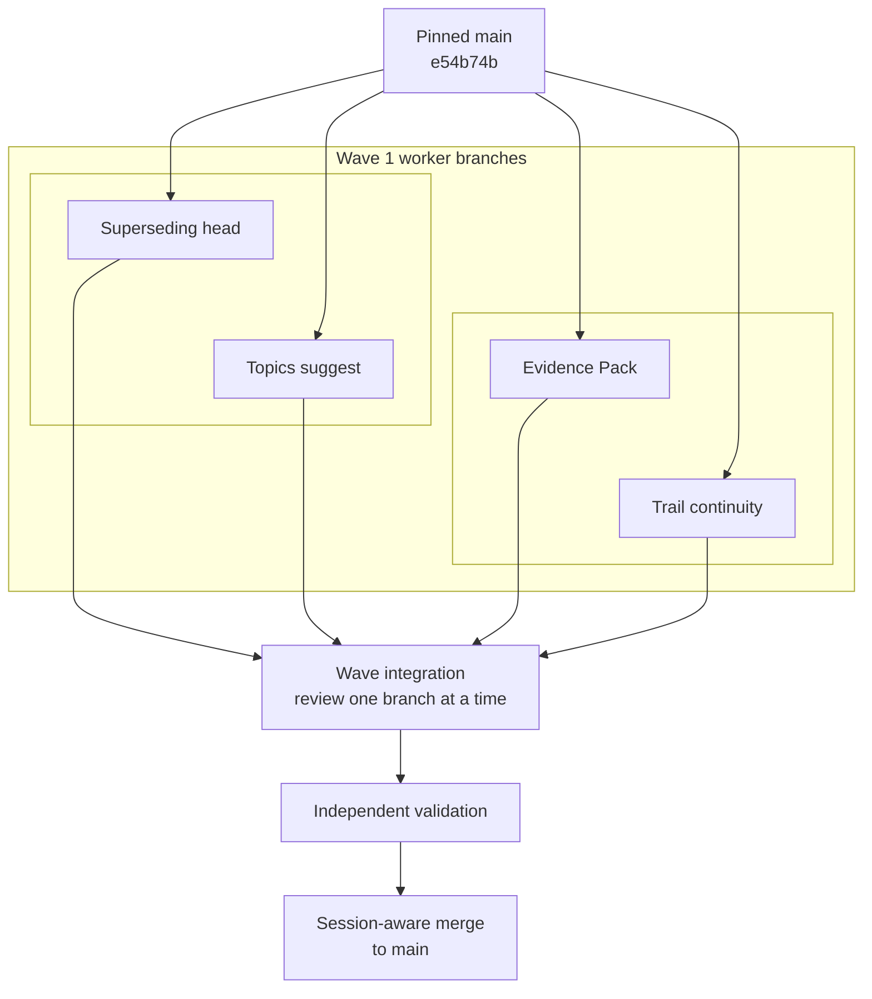

---
tags:
  - session-log-diagrams
diagram_date: 2026-07-15
---

## 2026-07-15 19:08 - Launch long-horizon Wave 1 worker branches

```yaml
entry_id: mse_675taf80bxkmjy7j
```


```mermaid
graph TD
  BASE["Pinned main<br>e54b74b"]

  subgraph WAVE["Wave 1 worker branches"]
    direction TB
    subgraph ROW1[" "]
      direction LR
      A["Superseding head"] ~~~ B["Topics suggest"]
    end
    subgraph ROW2[" "]
      direction LR
      C["Evidence Pack"] ~~~ D["Trail continuity"]
    end
    ROW1 ~~~ ROW2
  end

  BASE --> A
  BASE --> B
  BASE --> C
  BASE --> D
  A --> I["Wave integration<br>review one branch at a time"]
  B --> I
  C --> I
  D --> I
  I --> V["Independent validation"]
  V --> MAIN["Session-aware merge<br>to main"]
```
