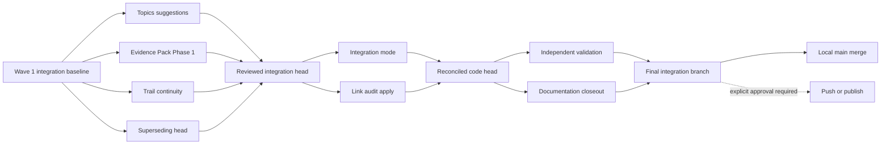

---
tags:
  - session-log-diagrams
diagram_date: 2026-07-16
---

## 2026-07-16 01:02 - Close long-horizon Wave 1 and approve local integration

```yaml
entry_id: mse_v26pem9hsvsbjbge
```


```mermaid
flowchart LR
  B["Wave 1 integration baseline"]
  B --> T["Topics suggestions"]
  B --> E["Evidence Pack Phase 1"]
  B --> C["Trail continuity"]
  B --> S["Superseding head"]
  T --> I["Reviewed integration head"]
  E --> I
  C --> I
  S --> I
  I --> M["Integration mode"]
  I --> L["Link audit apply"]
  M --> R["Reconciled code head"]
  L --> R
  R --> V["Independent validation"]
  R --> D["Documentation closeout"]
  V --> F["Final integration branch"]
  D --> F
  F --> Main["Local main merge"]
  F -. "explicit approval required" .-> P["Push or publish"]
```
