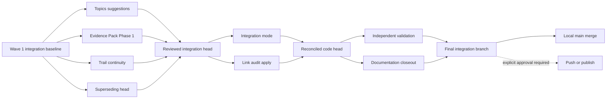
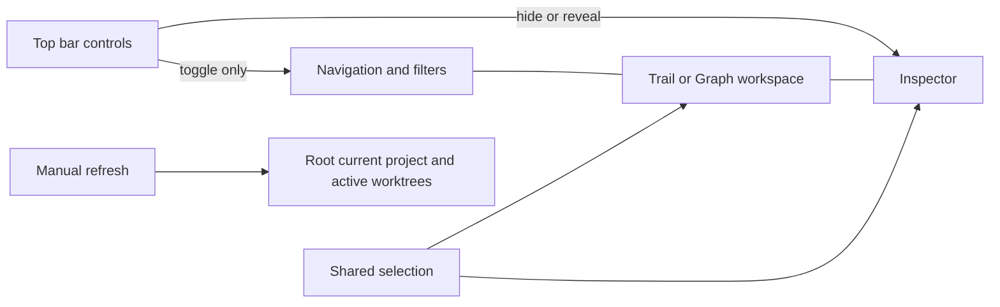
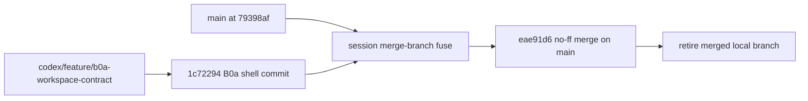
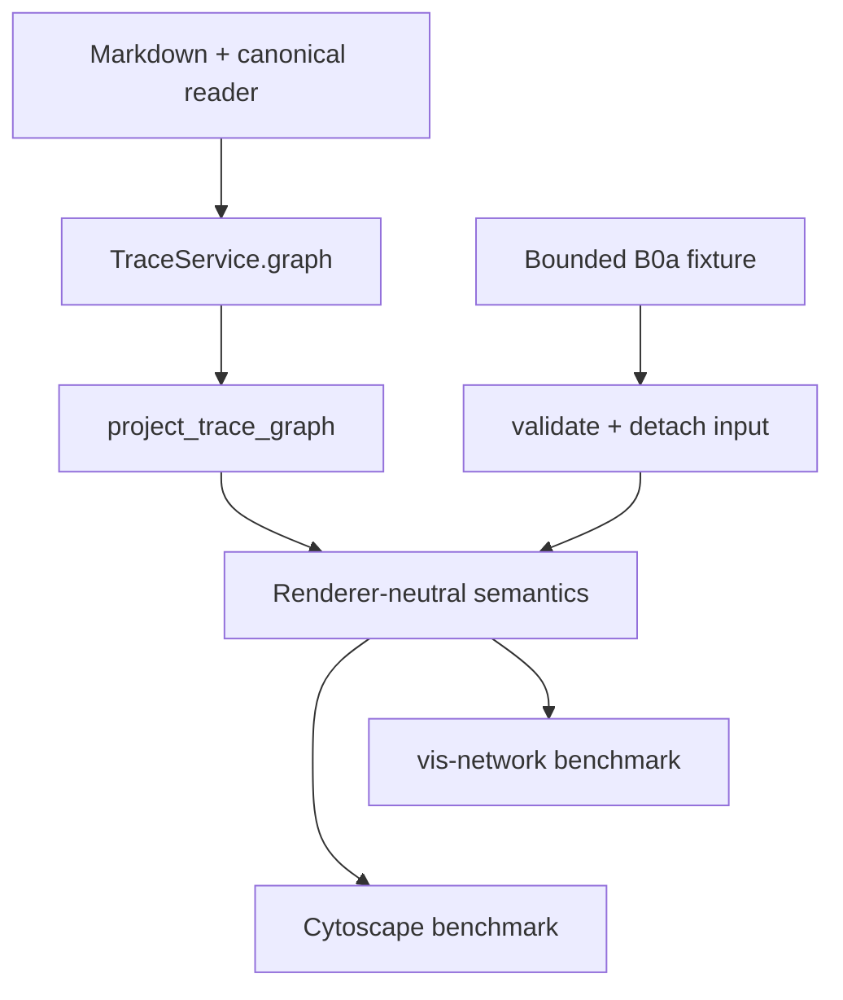
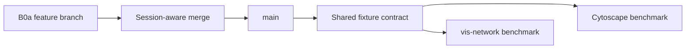

---
tags:
  - session-log-diagrams
diagram_date: 2026-07-16
---

## 2026-07-16 01:02 - Close long-horizon Wave 1 and approve local integration

```yaml
entry_id: mse_v26pem9hsvsbjbge
```



## 2026-07-16 08:40 - Clarify Memory Trace workspace shell and fresh worktree state

```yaml
entry_id: mse_eaxj1wwfse1weh18
```



## 2026-07-16 08:51 - Integrate B0a Memory Trace workspace shell

```yaml
entry_id: mse_7twxefmtphr30604
```



## 2026-07-16 09:13 - Define B0a renderer-neutral graph fixture contract

```yaml
entry_id: mse_p4xr01sbxf5qvkf0
```



## 2026-07-16 09:18 - Integrate B0a renderer-neutral graph contract

```yaml
entry_id: mse_fadg58mgtypvypzt
```


