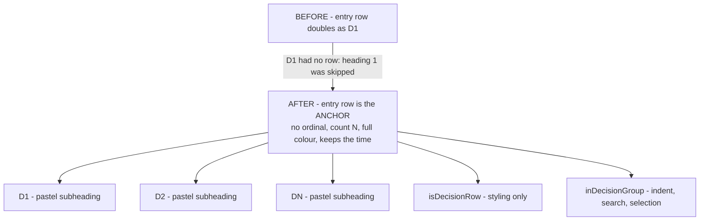
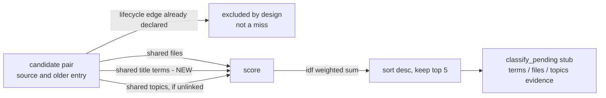
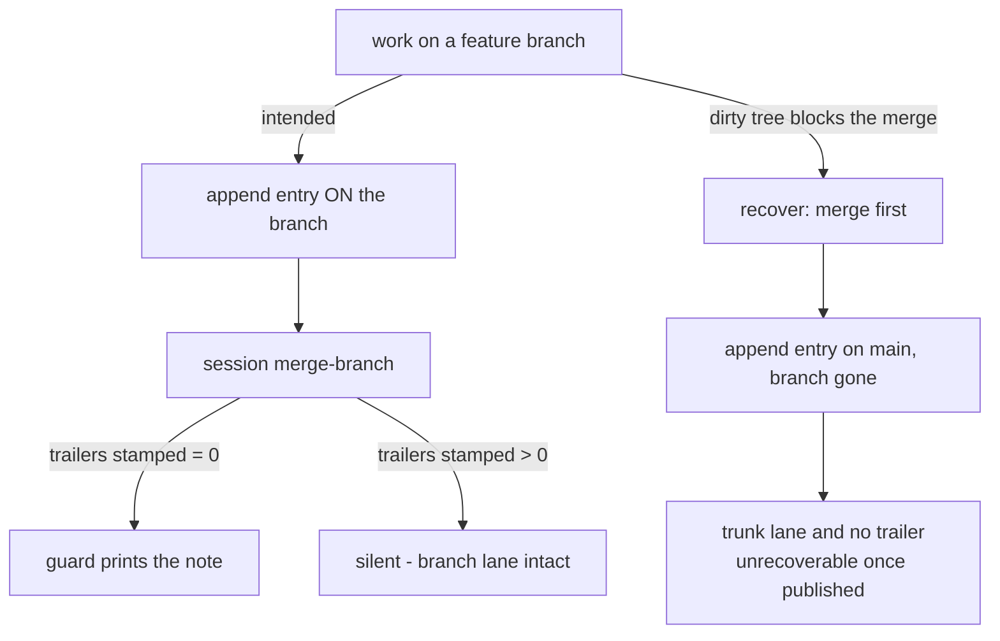

---
tags:
  - session-log-diagrams
diagram_date: 2026-07-21
---

## 2026-07-21 19:47 - Trail D1 rows: the entry row anchors, every decision is a subheading

```yaml
entry_id: mse_t5bbdstgmqzagn2y
```



## 2026-07-21 22:50 - Score link-audit candidates on shared title terms

```yaml
entry_id: mse_p62d4y4df0d8pz4x
```



## 2026-07-21 23:40 - Machine guard for entry-free branch merges

```yaml
entry_id: mse_27jbk0z5nkg4jabe
```


