---
tags:
  - session-log-diagrams
diagram_date: 2026-07-22
---

## 2026-07-22 07:47 - Render diagram sidecars with Mermaid itself

```yaml
entry_id: mse_zwzdjn0m9e34gdth
```

The before/after of D1: one sidecar, three renderers, and which of them understood it. The subset
parser was the odd one out, which is what made it the defect rather than the specification.

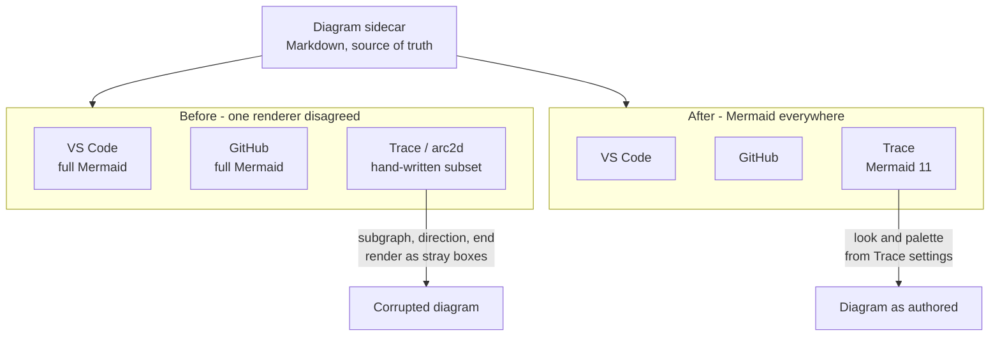

This one carries D2: the two Trace settings that reach Mermaid, and the direction colour travels.
`styles.css` stays the single source of truth because the values are read, never copied.

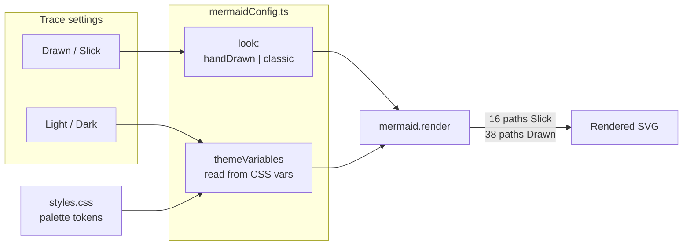

## 2026-07-22 19:17 - Name graph communities after authored topics

```yaml
entry_id: mse_3yvakpxdshc95e68
```

D2's rejected alternatives, with the measurement that killed each. The rule is the surviving path,
not the first one tried.

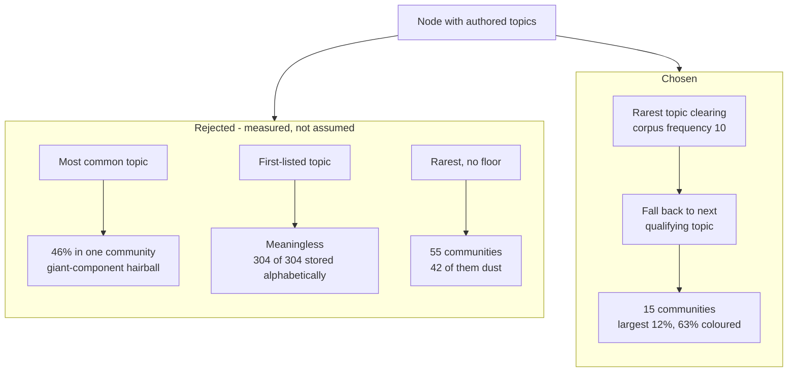

Why §4.3's retention apparatus is not built: it exists to stabilise an unstable identity, and this
identity is stable to begin with.

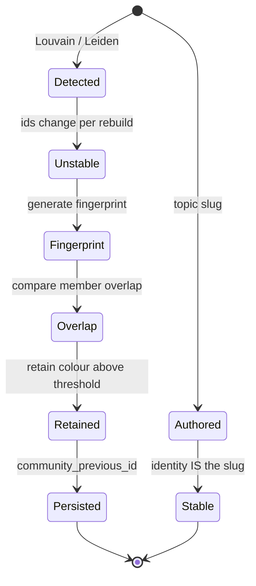

## 2026-07-22 19:35 - Topic becomes an opt-in graph edge

```yaml
entry_id: mse_0qycwt519qdggrpe
```

D1's core claim: the two edge families answer different questions. One is authored about a pair; the
other is an artefact of sorting entries that happen to share a tag.

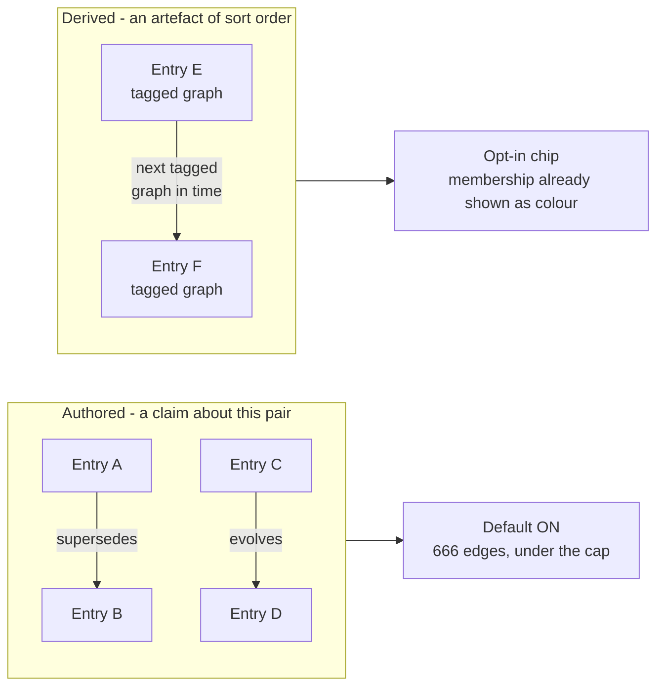

D2's correction. The first measurement used the wrong endpoint's defaults; the corrected one made
the case stronger, because the response with topic is truncated rather than merely large.

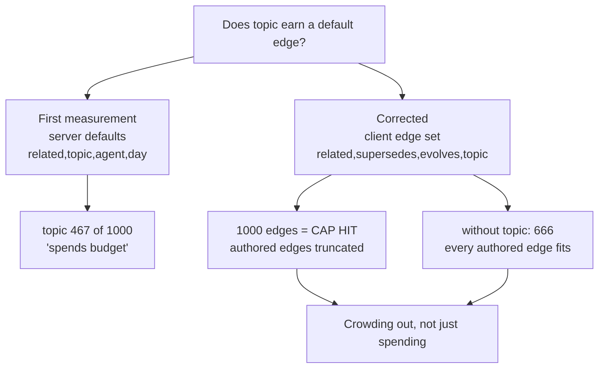

## 2026-07-22 19:50 - Topic community legend, and collision-free community colour

```yaml
entry_id: mse_d2669mmzd9se9cf1
```

D2: the legend did not introduce the collision, it made an existing one visible. Hashing was chosen
for stability, and stability was never the property it failed at.

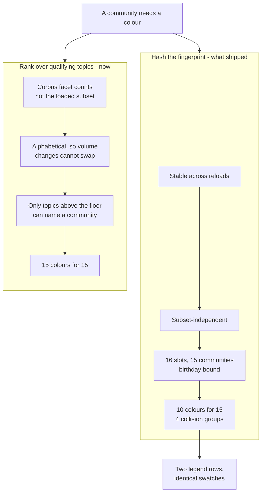

D3: why one derivation. The failure mode of two is silent and reads as a rendering bug rather than
as a duplicated constant.

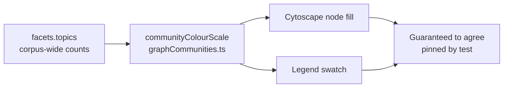

## 2026-07-22 20:09 - Measured community palette and inferred colour for topicless entries

```yaml
entry_id: mse_ftx8e1d5hwysajsz
```

D1: why the palette is generated rather than extended. Distinct hex values and distinguishable
colours are different properties, and only the second one matters on screen.

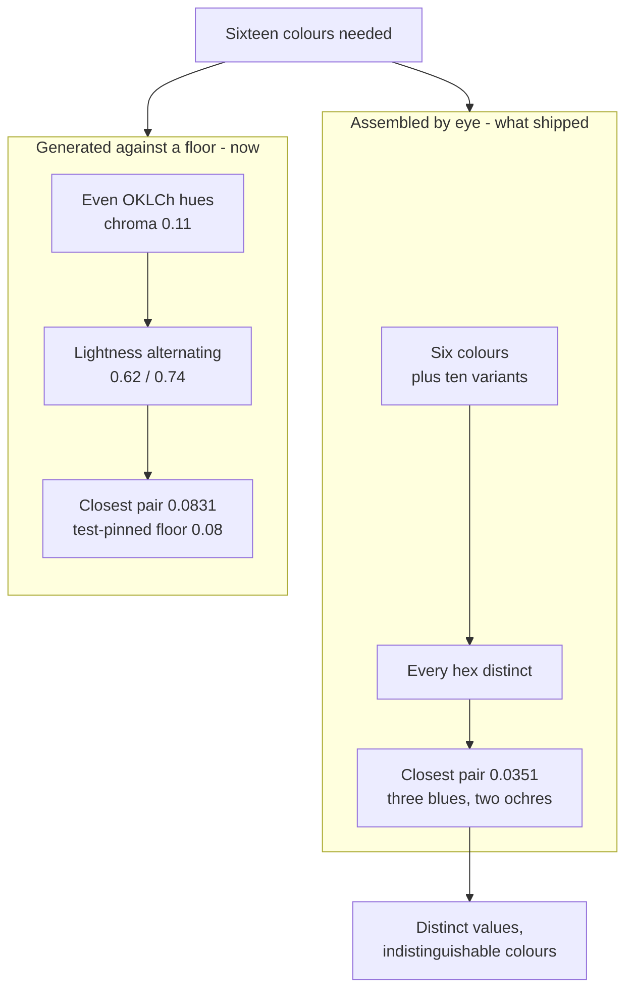

D2: the inference, and the line it deliberately does not cross. One hop keeps this a reading of the
neighbourhood rather than a clustering algorithm.

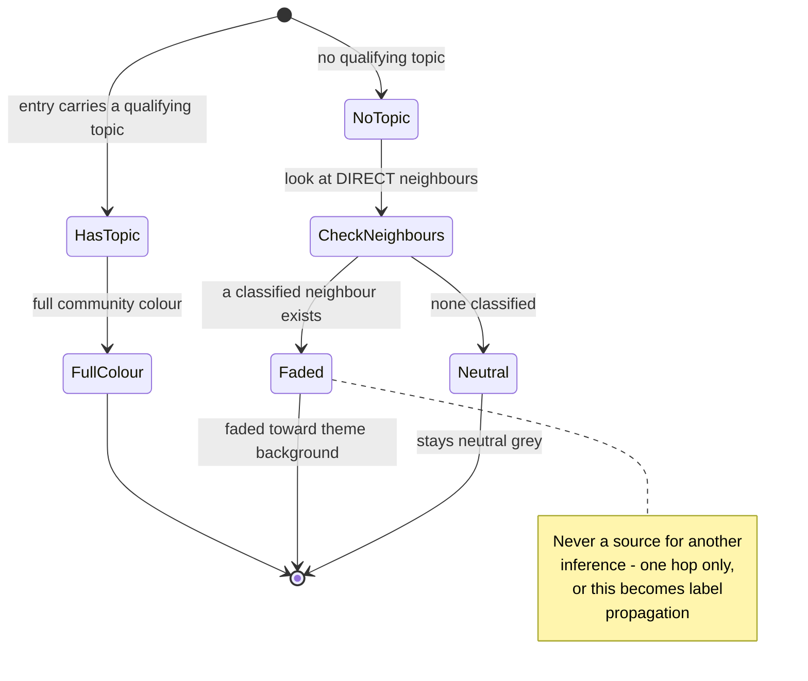

## 2026-07-22 20:28 - Community detection measured and rejected

```yaml
entry_id: mse_kdm34r508j3n1akg
```

D2: why the metric choice decided the answer. The same partition looks like a success or a failure
depending on which number you read, and only one of them is about meaning.

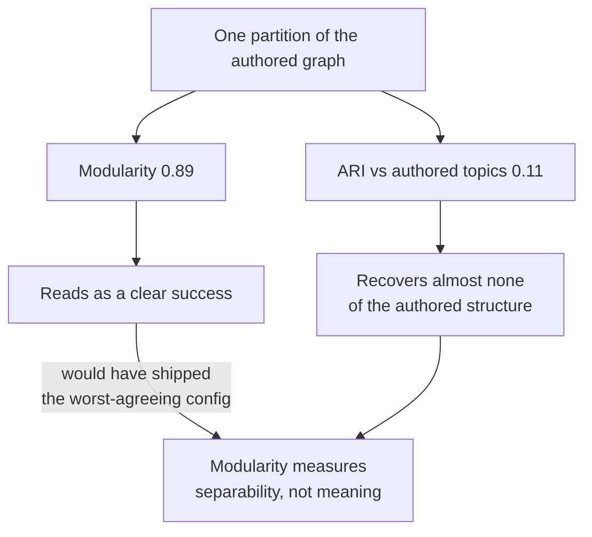

D1 and D3: the decision path, with the control that bounds it. Matched-k is where it ends, and that
step does not depend on the ceiling argument.

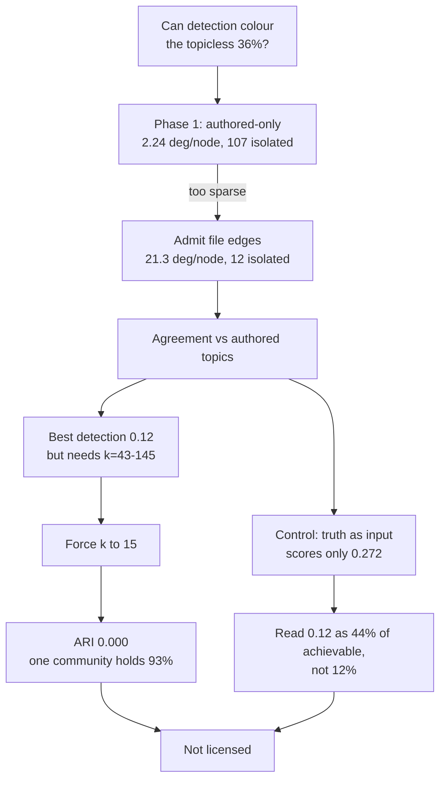

## 2026-07-22 20:46 - Pastel inference with chain residue and collision-proof colour slots

```yaml
entry_id: mse_ajd2qn8gr0mvzvg6
```

D2 and D3 together: how a topicless entry gets its colour. Votes arrive from classified
neighbours and down topicless chains, then blend and scale - membership is never assigned.

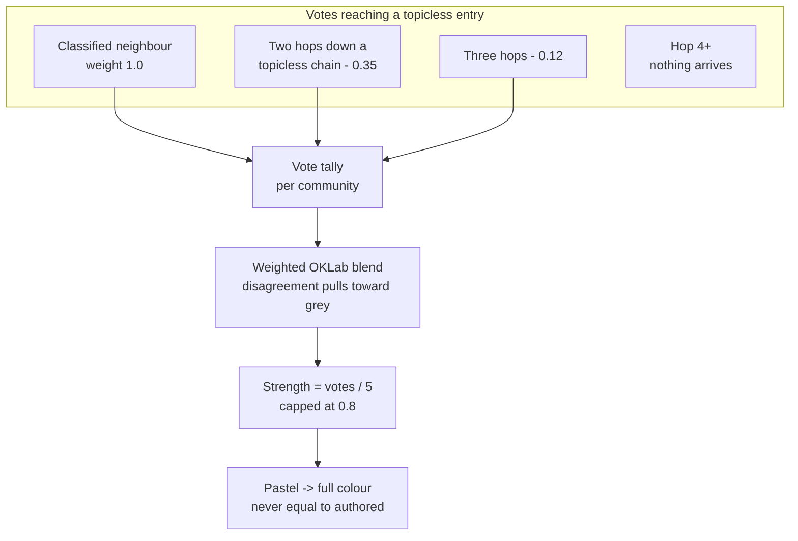

D3's boundary: why this is not label propagation. The walk's corridor is topicless by
construction, and classified nodes are origins only.

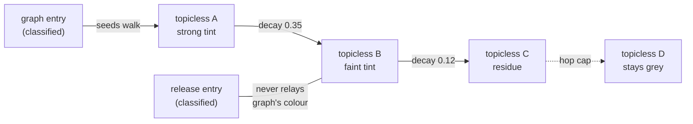

## 2026-07-22 20:58 - Authored-topic nodes wear a rim of their own colour

```yaml
entry_id: mse_2t1x5gtek6c8mhht
```

The provenance ladder a node's paint now encodes. Fill strength is continuous and can climb;
the rim is binary and cannot be borrowed.

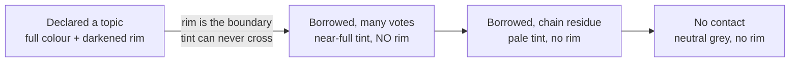

## 2026-07-22 21:18 - Co-occurrence colour wheel and topic-mixture node colours

```yaml
entry_id: mse_aa4tha73d513ptnt
```

D1 and D2: the wheel, and why ordering and mixing ship together. The measured corpus wheel reads
as three semantic arcs, and mixtures only stay in-family because arcs exist.

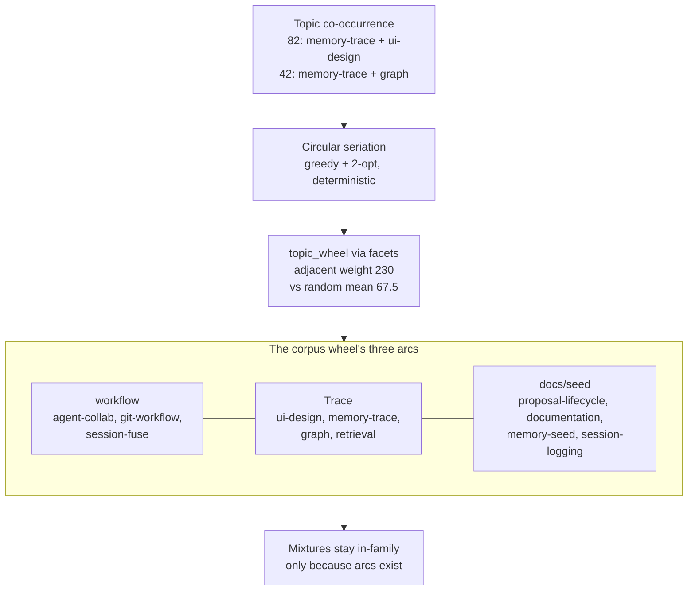

D3: what a node's fill now means, with the limit case kept visible.


## 2026-07-22 22:29 - Full-corpus graph rendering, fit, and bounded force motion

```yaml
entry_id: mse_07veztrwd4w9tfby
```

D1 and D2: one reported number, two independent faults. Neither was a cap.

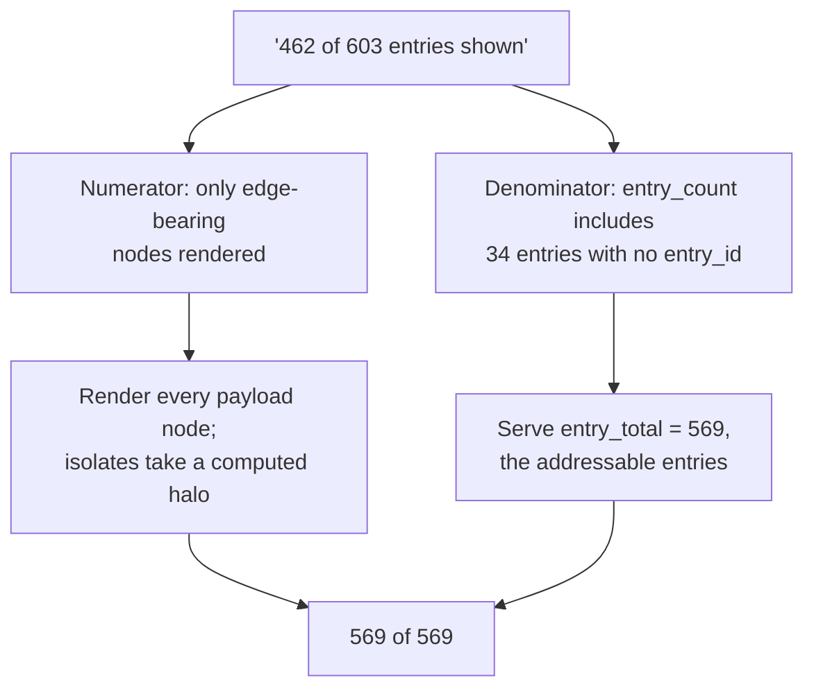

D5: what keeps a drag exploration rather than a claim about the data. Each ring is a different
containment property, and the outermost one is storage.

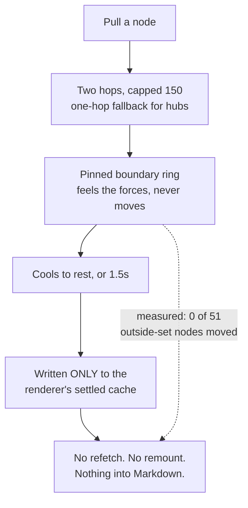

D3: the overflow. Fit was never missing; it was being refused.

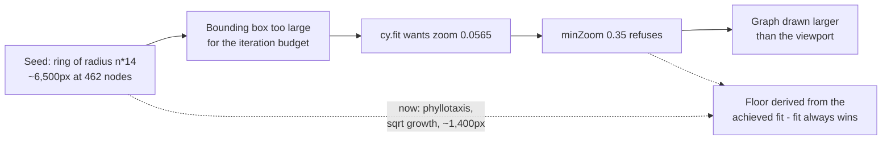

## 2026-07-22 22:49 - Continuous whole-graph physics, benchmarked against Obsidian

```yaml
entry_id: mse_5ezgxb11ssjzqjsr
```

D1: one bound, derived from the wrong quantity, and everything it was preventing. Settle cost and
per-frame cost are different numbers about different things.

```mermaid
flowchart TD
  Bound["6.5: live physics only<br/>at most 150 nodes"]
  Bound --> Cited["Cited: cose settles<br/>467 nodes in 1177ms"]
  Cited --> Wrong["But continuous physics<br/>never pays a settle"]
  Wrong --> Real["One d3 tick, 570 nodes:<br/>1.60ms median, 2.81ms p99"]
  Real --> Budget["16.7ms frame at 60fps<br/>= tenfold headroom"]

  Bound --> P1["Forces hardcoded<br/>- a change meant re-layout"]
  Bound --> P2["Isolates on computed rings<br/>- could not be simulated"]
  Bound --> P3["Motion capped at 150"]
  Budget --> Freed["All three dissolve together"]
  P1 --> Freed
  P2 --> Freed
  P3 --> Freed
```

D2 and D4: what the graph does now. Settled stops being a mode and becomes the resting state, and
every node - linked or not - is held by the same three forces.

```mermaid
stateDiagram-v2
  [*] --> Seeded: cached positions, or spiral
  Seeded --> Running: alpha 1
  Running --> Running: tick, paint, decay
  Running --> Rest: alpha below floor
  Rest --> [*]: rAF loop stops, costs nothing

  Rest --> Running: drag
  Rest --> Running: force slider moved
  Seeded --> Rest: exact cache match, idle at once

  note right of Running
    Every node participates.
    Isolates have no link force,
    so repulsion + centre gravity
    place them - 83 of 107 land
    inside the graph body,
    aspect ratio 1.01
  end note
```

## 2026-07-22 23:04 - Dragging moves nodes again, and pulls what they link to

```yaml
entry_id: mse_8vvw4cq8y114tarw
```

D2: the lock. Two writers for one position, sixty times a second — the pointer always lost.

```mermaid
sequenceDiagram
  participant P as Pointer
  participant C as Cytoscape
  participant S as Simulation
  Note over P,S: Before — the node fights back
  P->>C: drag to (x, y)
  S->>S: tick
  S->>C: paint ALL nodes, including this one
  C-->>P: node snaps to last tick's position
  Note over P,S: After — one writer while held
  P->>C: grab
  C->>S: pin(id, position) — mark grabbed
  P->>C: drag to (x, y)
  C->>S: pin(id, position) — sim follows the pointer
  S->>S: tick
  S->>C: paint every node EXCEPT the grabbed one
  C-->>P: node stays under the pointer; neighbours pull toward it
```

D1 and D3: what the defaults now say, and why one dial went away.

```mermaid
flowchart TD
  Old["Default: Fixed<br/>(carried over from settle-once layout)"]
  Old --> Reads["Under live physics this reads as broken —<br/>everything else moves, this does not"]
  Reads --> New["Default: Reheat"]

  Four["Four sliders<br/>centre, repel, link force, link distance"]
  Four --> Same["Link force and link distance both change<br/>how close connected nodes sit"]
  Same --> Three["Three sliders<br/>distance fixed at 150"]
```
