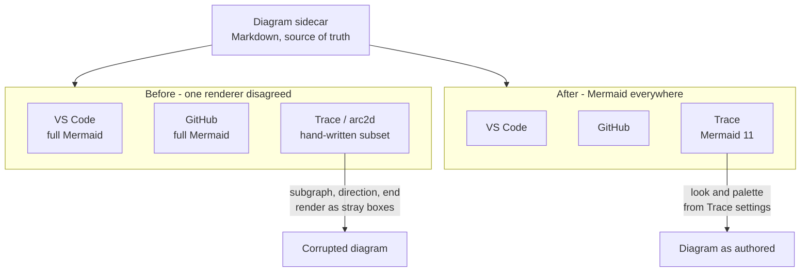
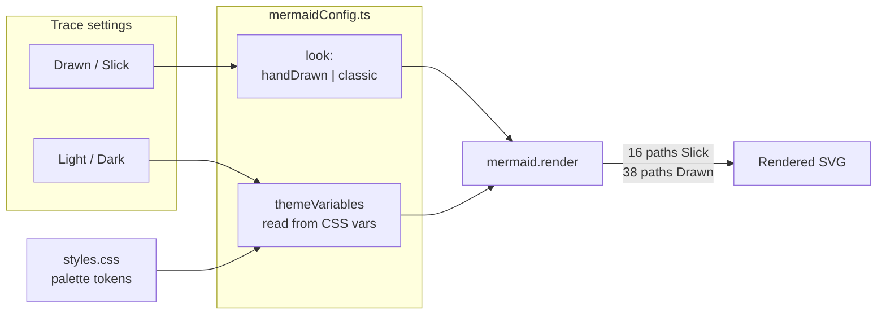
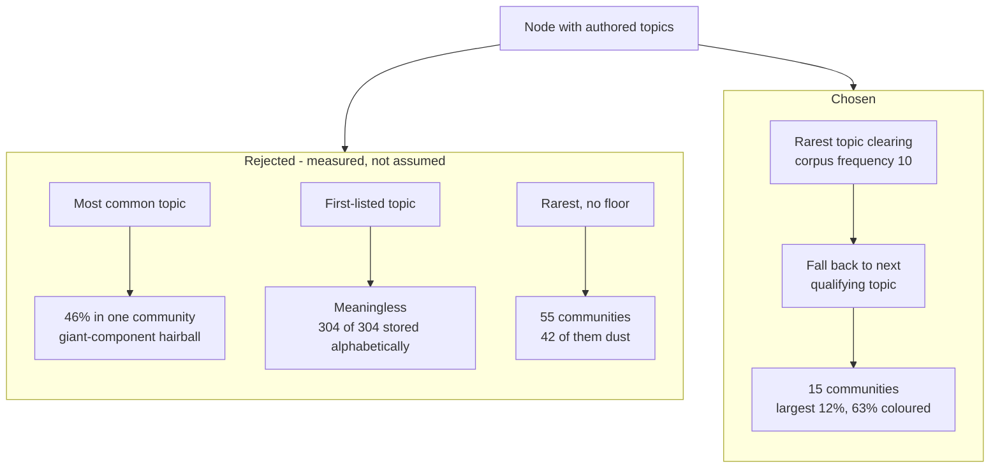
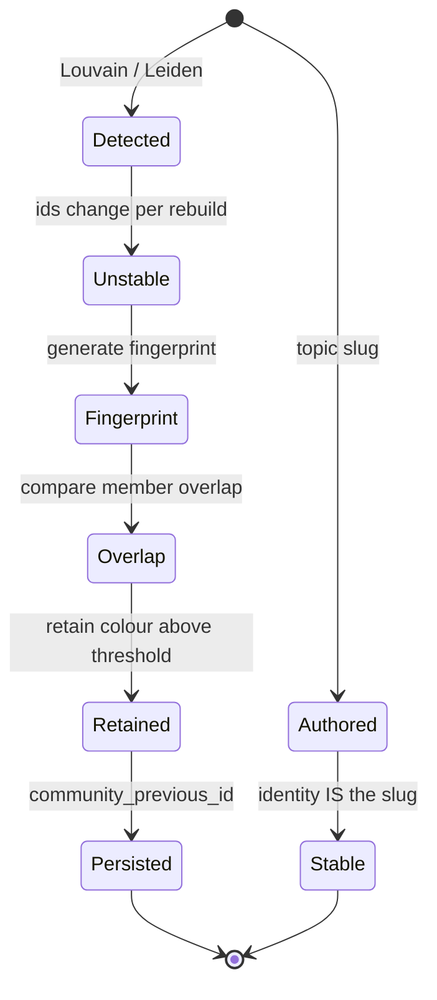
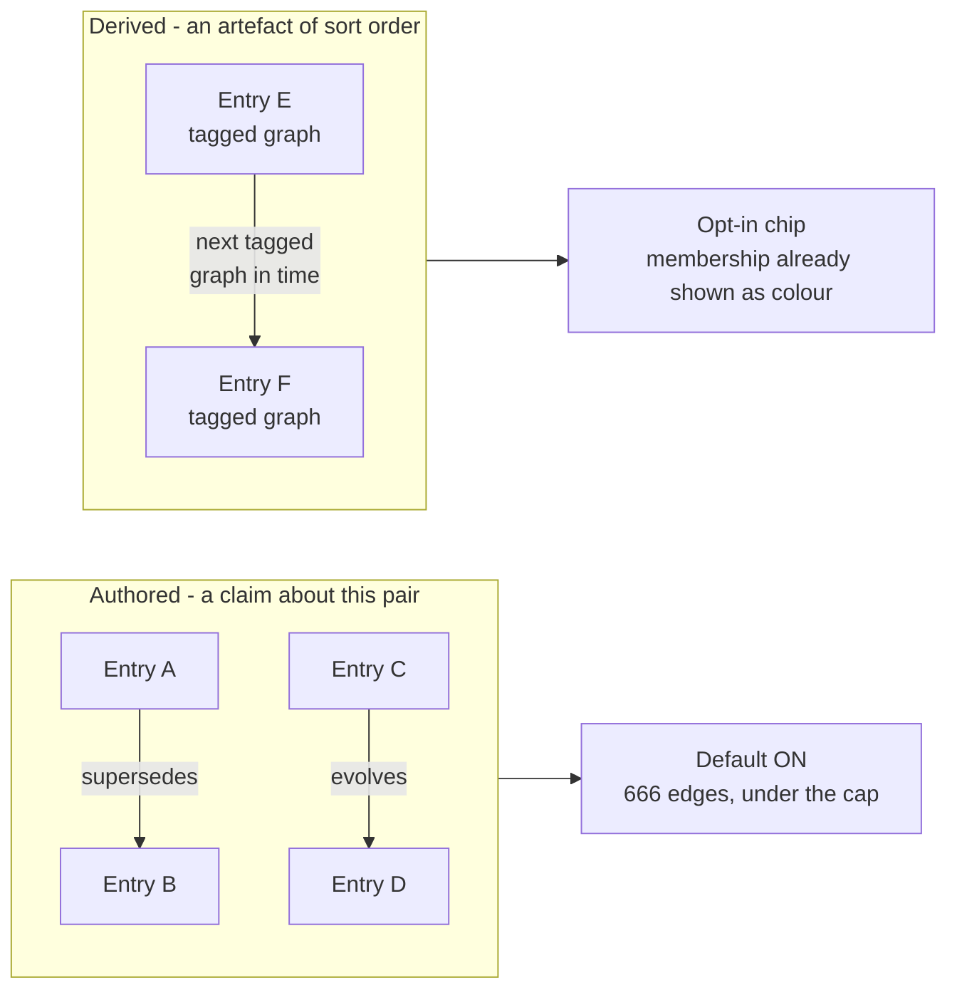
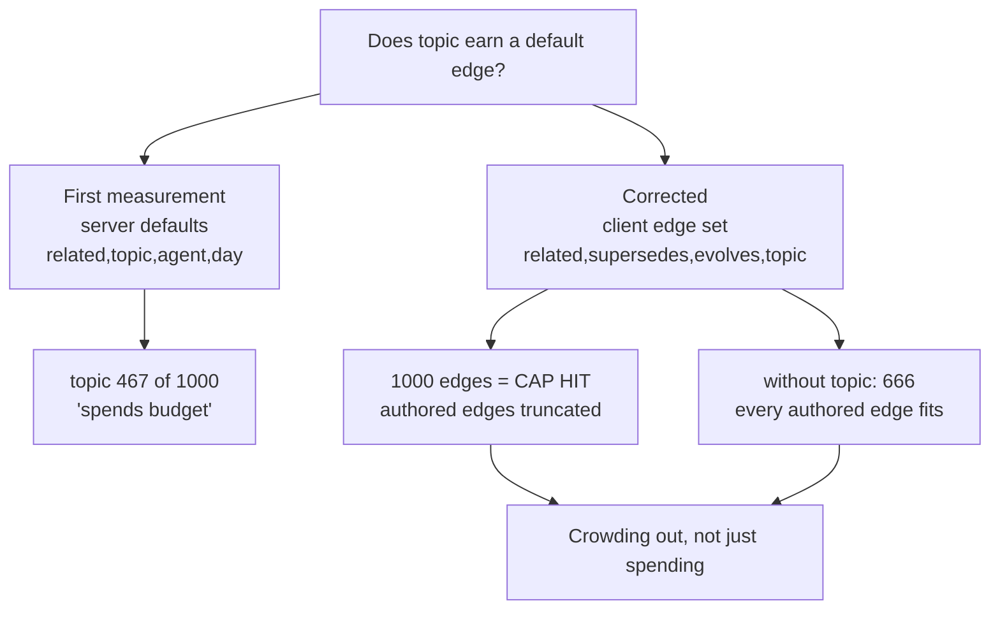

---
tags:
  - session-log-diagrams
diagram_date: 2026-07-22
---

## 2026-07-22 07:47 - Render diagram sidecars with Mermaid itself

```yaml
entry_id: mse_zwzdjn0m9e34gdth
```

The before/after of D1: one sidecar, three renderers, and which of them understood it. The subset
parser was the odd one out, which is what made it the defect rather than the specification.



This one carries D2: the two Trace settings that reach Mermaid, and the direction colour travels.
`styles.css` stays the single source of truth because the values are read, never copied.



## 2026-07-22 19:17 - Name graph communities after authored topics

```yaml
entry_id: mse_3yvakpxdshc95e68
```

D2's rejected alternatives, with the measurement that killed each. The rule is the surviving path,
not the first one tried.



Why §4.3's retention apparatus is not built: it exists to stabilise an unstable identity, and this
identity is stable to begin with.



## 2026-07-22 19:35 - Topic becomes an opt-in graph edge

```yaml
entry_id: mse_0qycwt519qdggrpe
```

D1's core claim: the two edge families answer different questions. One is authored about a pair; the
other is an artefact of sorting entries that happen to share a tag.



D2's correction. The first measurement used the wrong endpoint's defaults; the corrected one made
the case stronger, because the response with topic is truncated rather than merely large.


