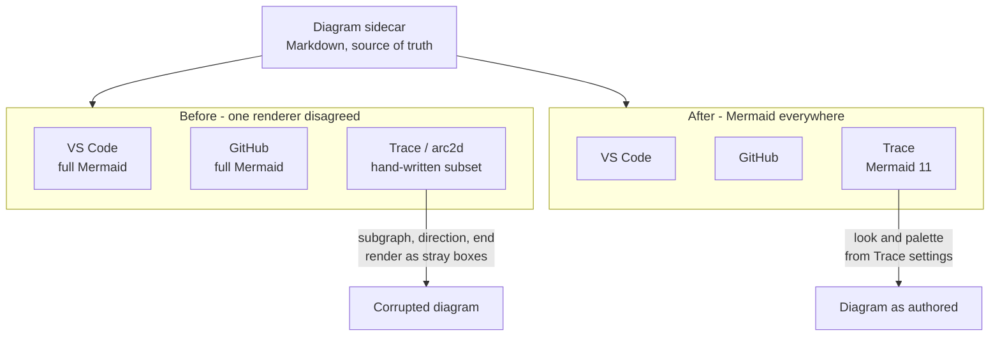
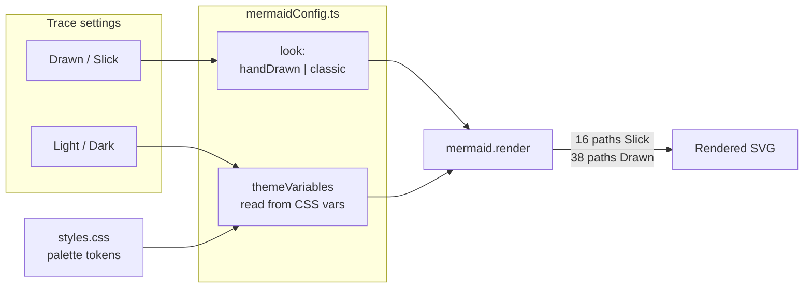

---
tags:
  - session-log-diagrams
diagram_date: 2026-07-22
---

## 2026-07-22 07:47 - Render diagram sidecars with Mermaid itself

```yaml
entry_id: mse_zwzdjn0m9e34gdth
```

The before/after of D1: one sidecar, three renderers, and which of them understood it. The subset
parser was the odd one out, which is what made it the defect rather than the specification.



This one carries D2: the two Trace settings that reach Mermaid, and the direction colour travels.
`styles.css` stays the single source of truth because the values are read, never copied.


