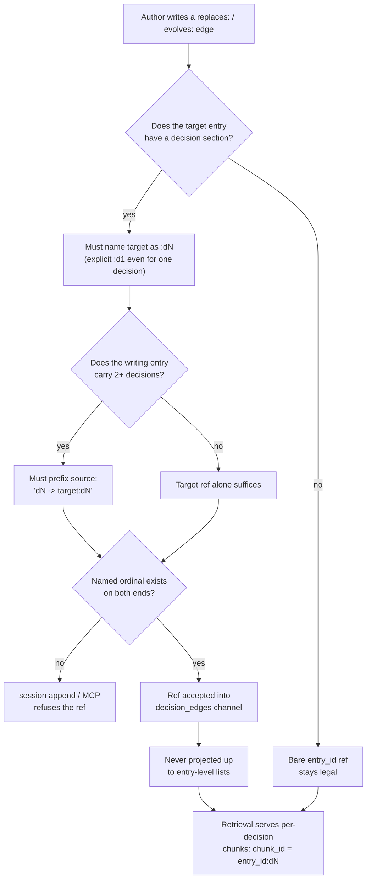

---
tags:
  - session-log-diagrams
diagram_date: 2026-07-24
---

## 2026-07-24 16:40 - Decision identity is (entry_id, dN)

```yaml
adr_id: adr_decision_identity
grounded_in:
  - mse_888p3x61z0kev9cp:d1
  - mse_kdhw53hzp4nh8wwm:d1
  - mse_qeht233q9ebvf2ms:d1
```


