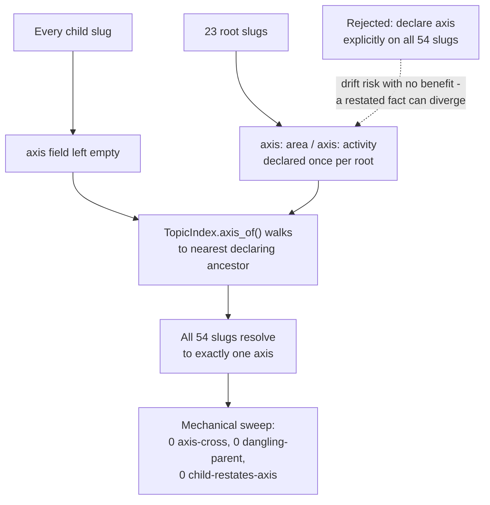

---
tags:
  - session-log-diagrams
diagram_date: 2026-07-26
---

## 2026-07-26 16:40 - Axis declared once per root, children inherit by walking to nearest ancestor

```yaml
adr_id: adr_topic_vocabulary
grounded_in:
  - mse_25zzy3cmdjgrsf69:d1
```


