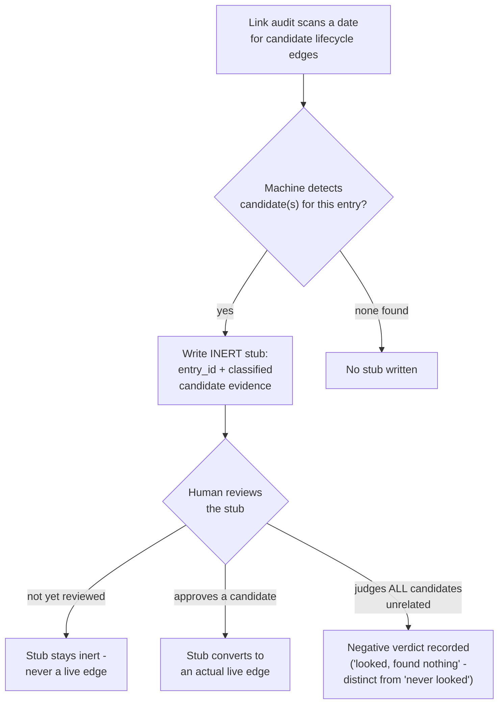

---
tags:
  - session-log-diagrams
diagram_date: 2026-07-29
---

## 2026-07-29 23:59 - Link audit writes inert stubs; only an approval turns one into an edge

```yaml
adr_id: adr_lifecycle_link_audit_workflow
grounded_in:
  - mse_63qcaab119xmyx0b:d2
  - mse_jg33a730vpr4085a:d1
```


