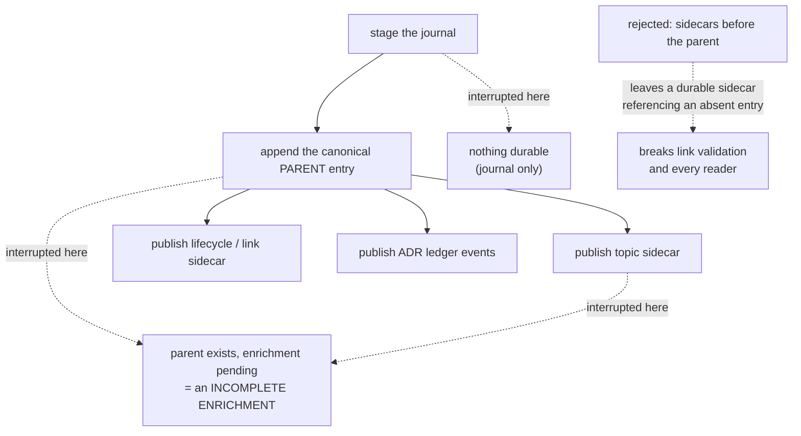
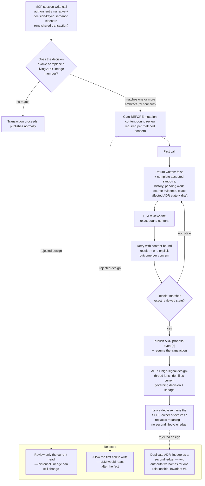
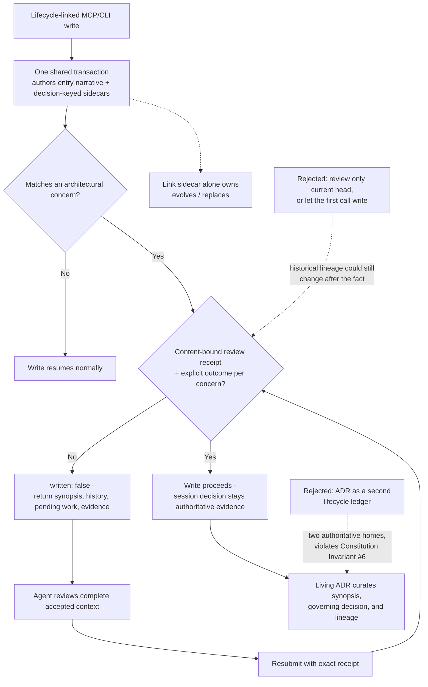

---
tags:
  - session-log-diagrams
diagram_date: 2026-08-03
---

## 2026-08-03 15:40 - Parent-first recoverable sidecar transaction

```yaml
adr_id: adr_parent_first_sidecar_transaction
grounded_in:
  - mse_d06t9bccm3yykfqs:d1
  - mse_17d0qqh34a07qp5b:d2
```



## 2026-08-03 16:40 - MCP decision envelope and mandatory ADR review

```yaml
adr_id: adr_mcp_decision_envelope_review
grounded_in:
  - mse_17d0qqh34a07qp5b:d1
  - mse_ddeat5w29spep3qw:d1
```



## 2026-08-03 16:40 - Shared write transaction binds lifecycle writes to mandatory ADR review

```yaml
adr_id: adr_session_decision_authority
grounded_in:
  - mse_17d0qqh34a07qp5b:d1
  - mse_ddeat5w29spep3qw:d1
```


