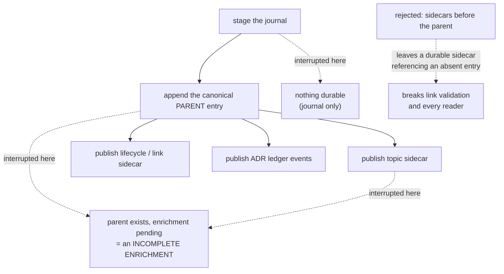

---
tags:
  - session-log-diagrams
diagram_date: 2026-08-03
---

## 2026-08-03 15:40 - Parent-first recoverable sidecar transaction

```yaml
adr_id: adr_parent_first_sidecar_transaction
grounded_in:
  - mse_d06t9bccm3yykfqs:d1
  - mse_17d0qqh34a07qp5b:d2
```


