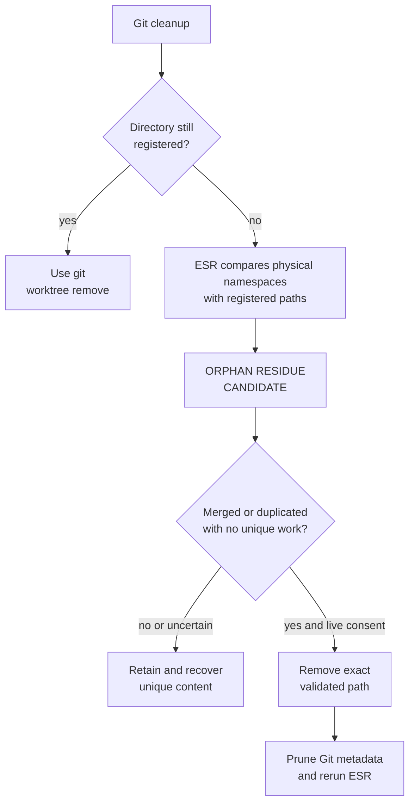
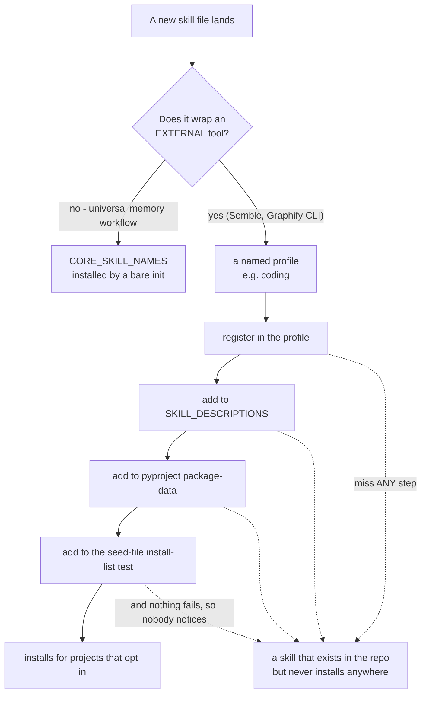

---
tags:
  - session-log-diagrams
diagram_date: 2026-08-04
---

## 2026-08-04 10:36 - ESR orphan-worktree residue flow

```yaml
entry_id: mse_a0g1wacyk50jvsbd
```



## 2026-08-04 18:07 - Optional external-tool skills ship in a profile, never core

```yaml
adr_id: adr_optional_skill_profiles
grounded_in:
  - mse_y7d6qtjgqdfhtmaj:d2
```


