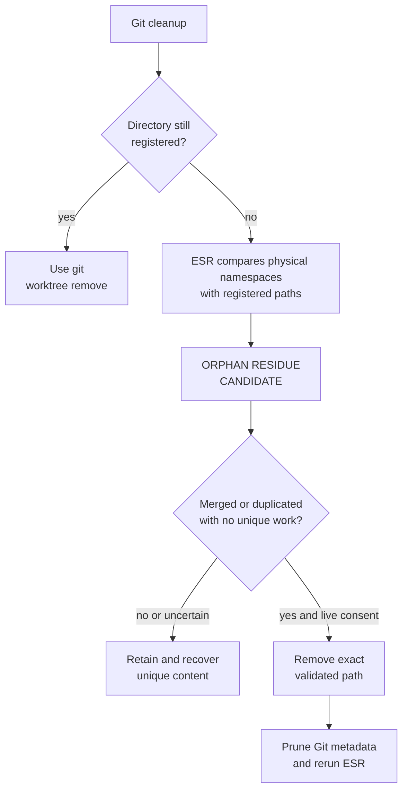

---
tags:
  - session-log-diagrams
diagram_date: 2026-08-04
---

## 2026-08-04 10:36 - ESR orphan-worktree residue flow

```yaml
entry_id: mse_a0g1wacyk50jvsbd
```


```mermaid
flowchart TD
  Cleanup["Git cleanup"] --> Registered{"Directory still<br/>registered?"}
  Registered -->|yes| GitRemove["Use git<br/>worktree remove"]
  Registered -->|no| Compare["ESR compares physical namespaces<br/>with registered paths"]
  Compare --> Candidate["ORPHAN RESIDUE<br/>CANDIDATE"]
  Candidate --> Safe{"Merged or duplicated<br/>with no unique work?"}
  Safe -->|no or uncertain| Recover["Retain and recover<br/>unique content"]
  Safe -->|yes and live consent| Exact["Remove exact<br/>validated path"]
  Exact --> Verify["Prune Git metadata<br/>and rerun ESR"]
```
