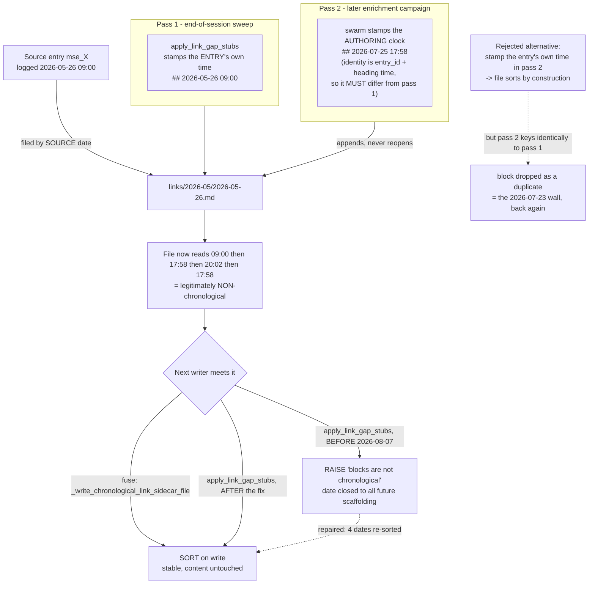

---
tags:
  - session-log-diagrams
diagram_date: 2026-08-07
---

## 2026-08-07 11:56 - Link sidecar: how two rules make a file out of order, and what the writer does

```yaml
entry_id: mse_9aggjnyaqrmb545d
```


