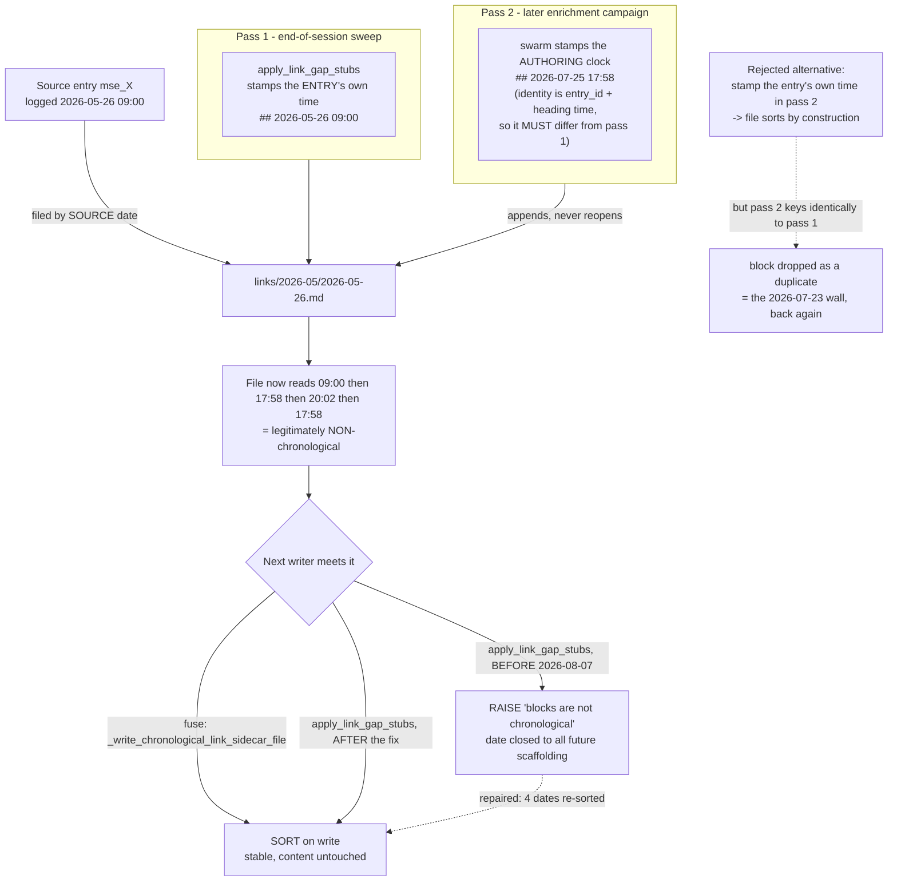

---
tags:
  - session-log-diagrams
diagram_date: 2026-08-07
---

## 2026-08-07 11:56 - Link sidecar: how two rules make a file out of order, and what the writer does

```yaml
entry_id: mse_9aggjnyaqrmb545d
```



## 2026-08-07 14:38 - Plain-Markdown core for file-reading agents

```yaml
adr_id: adr_markdown_substrate
diagram_status: not_applicable
note: examined 2026-08-07 - this ADR is a substrate constraint (keep the core plain Markdown for file-reading agents), not a shape. No components, no ordering, no state transitions to draw; a diagram here would be coverage rather than explanation, which session_logging.md forbids.
```

## 2026-08-07 15:45 - Commercial material separated from product docs

```yaml
adr_id: adr_business_separation
diagram_status: not_applicable
note: examined 2026-08-07 - a folder ownership rule (business/ holds dossiers, docs/ holds specification). Two labelled boxes restate the sentence without adding structure; there is no flow between them and nothing moves from one to the other.
```

## 2026-08-07 15:45 - Topology-community detection rejected

```yaml
adr_id: adr_community_detection_rejected
diagram_status: not_applicable
note: examined 2026-08-07 - a rejection recorded for the why-not. The feature was measured against corpus density and not built, so there is no mechanism in the corpus to draw; drawing the rejected design would depict something that does not exist.
```

## 2026-08-07 15:45 - DRAFT record format

```yaml
adr_id: adr_draft_format
diagram_status: not_applicable
note: examined 2026-08-07 - a record FORMAT (D/R mandatory, A/F/T optional, multi-decision subsections). Field presence is a schema, not a shape; the ordering is a document layout already shown literally by any entry.
```

## 2026-08-07 15:45 - Structured per-edge confidence

```yaml
adr_id: adr_edge_confidence
diagram_status: not_applicable
note: examined 2026-08-07 - defines a field's shape, {ref, confidence, tier} keyed to an edge token. A YAML record drawn as boxes is the same record with worse typography. How that confidence is CONSUMED (fading in graph and Trail) is a separate concern and would be that concern's diagram.
```

## 2026-08-07 15:45 - Encoding policy owned by core

```yaml
adr_id: adr_encoding_policy
diagram_status: not_applicable
note: examined 2026-08-07 - an ownership constraint (UTF-8, LF, NFC enforced by Memory Seed core, never duplicated in Memory Trace). It says where a rule may live, not how anything flows; the one-way dependency it implies is drawn where it is structural, in adr_trace_boundary.
```

## 2026-08-07 15:45 - Legacy .AGENTS/ compatibility preserved

```yaml
adr_id: adr_legacy_agents_compat
diagram_status: not_applicable
note: examined 2026-08-07 - a standing promise (support continues unless explicitly deprecated). There is no branch to draw: both layouts are read by the same code path, and the deprecation process it defers to has not been exercised.
```

## 2026-08-07 15:45 - Automated topic backfill rejected

```yaml
adr_id: adr_topic_backfill_rejected
diagram_status: not_applicable
note: examined 2026-08-07 - a rejection: scoring-gated automated backfill was refused in favour of curated per-batch attribution. The adopted alternative is one worker judging one batch, which has no branching to show.
```

## 2026-08-07 15:45 - Trail lanes derived, never authored

```yaml
adr_id: adr_trail_derived_lanes
diagram_status: not_applicable
note: examined 2026-08-07 - states a CONSTRAINT on a derivation (lanes come from lifecycle edges and no authored edge is added to produce them), not a pipeline. The edge model it derives from is drawn in adr_edge_kinds and adr_forward_only_edges.
```
