---
tags:
  - session-log-diagrams
diagram_date: 2026-08-07
---

## 2026-08-07 11:56 - Link sidecar: how two rules make a file out of order, and what the writer does

```yaml
entry_id: mse_9aggjnyaqrmb545d
```

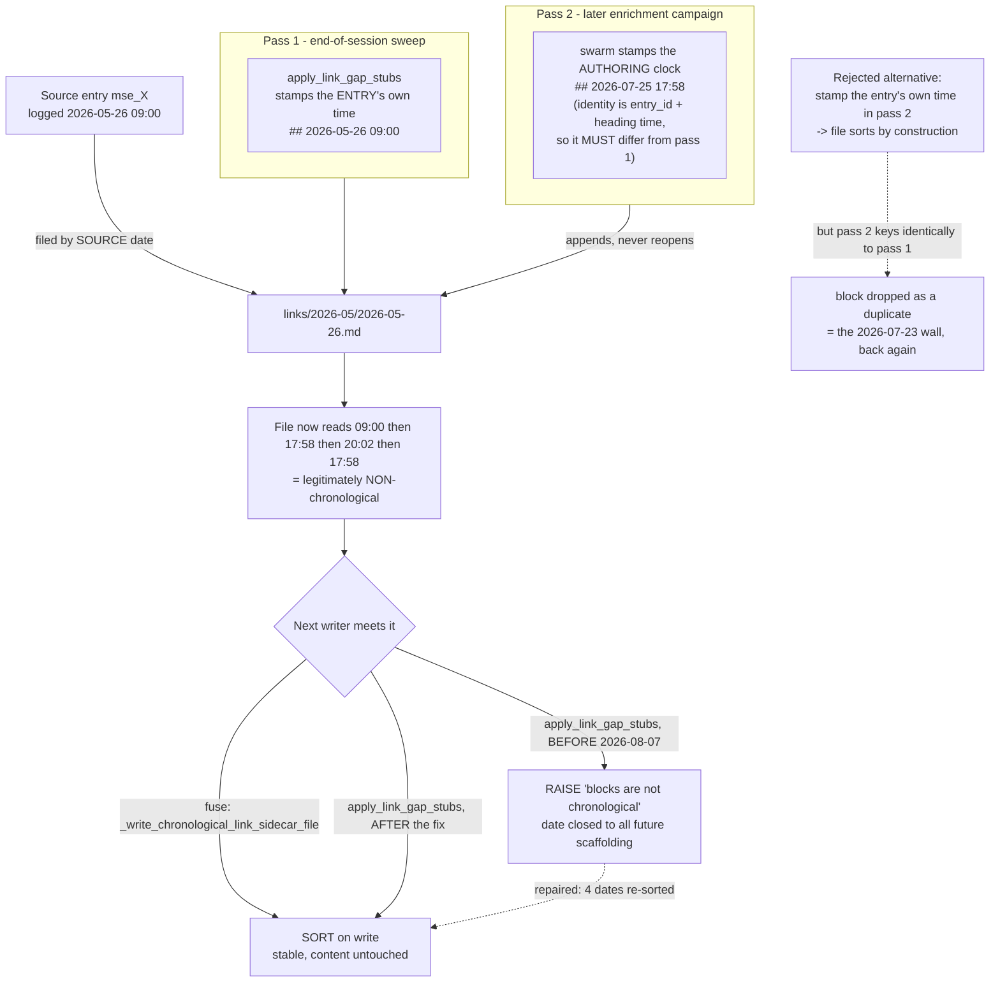
```mermaid
flowchart TB
  E["Source entry mse_X<br/>logged 2026-05-26 09:00"]

  subgraph P1["Pass 1 - end-of-session sweep"]
    S1["apply_link_gap_stubs<br/>stamps the ENTRY's own time<br/>## 2026-05-26 09:00"]
  end

  subgraph P2["Pass 2 - later enrichment campaign"]
    S2["swarm stamps the AUTHORING clock<br/>## 2026-07-25 17:58<br/>(identity is entry_id + heading time,<br/>so it MUST differ from pass 1)"]
  end

  E -->|"filed by SOURCE date"| F["links/2026-05/2026-05-26.md"]
  P1 --> F
  P2 -->|"appends, never reopens"| F
  F --> O["File now reads 09:00 then 17:58 then 20:02 then 17:58<br/>= legitimately NON-chronological"]

  O --> D{"Next writer meets it"}
  D -->|"fuse: _write_chronological_link_sidecar_file"| SORT["SORT on write<br/>stable, content untouched"]
  D -->|"apply_link_gap_stubs, BEFORE 2026-08-07"| REFUSE["RAISE 'blocks are not chronological'<br/>date closed to all future scaffolding"]
  D -->|"apply_link_gap_stubs, AFTER the fix"| SORT

  REFUSE -.->|"repaired: 4 dates re-sorted"| SORT

  ALT["Rejected alternative:<br/>stamp the entry's own time in pass 2<br/>-> file sorts by construction"]
  ALT -.->|"but pass 2 keys identically to pass 1"| COLLIDE["block dropped as a duplicate<br/>= the 2026-07-23 wall, back again"]
```

## 2026-08-07 14:38 - Plain-Markdown core for file-reading agents

```yaml
adr_id: adr_markdown_substrate
diagram_status: not_applicable
note: examined 2026-08-07 - this ADR is a substrate constraint (keep the core plain Markdown for file-reading agents), not a shape. No components, no ordering, no state transitions to draw; a diagram here would be coverage rather than explanation, which session_logging.md forbids.
```

## 2026-08-07 15:45 - Commercial material separated from product docs

```yaml
adr_id: adr_business_separation
diagram_status: not_applicable
note: examined 2026-08-07 - a folder ownership rule (business/ holds dossiers, docs/ holds specification). Two labelled boxes restate the sentence without adding structure; there is no flow between them and nothing moves from one to the other.
```

## 2026-08-07 15:45 - Topology-community detection rejected

```yaml
adr_id: adr_community_detection_rejected
diagram_status: not_applicable
note: examined 2026-08-07 - a rejection recorded for the why-not. The feature was measured against corpus density and not built, so there is no mechanism in the corpus to draw; drawing the rejected design would depict something that does not exist.
```

## 2026-08-07 15:45 - DRAFT record format

```yaml
adr_id: adr_draft_format
diagram_status: not_applicable
note: examined 2026-08-07 - a record FORMAT (D/R mandatory, A/F/T optional, multi-decision subsections). Field presence is a schema, not a shape; the ordering is a document layout already shown literally by any entry.
```

## 2026-08-07 15:45 - Structured per-edge confidence

```yaml
adr_id: adr_edge_confidence
diagram_status: not_applicable
note: examined 2026-08-07 - defines a field's shape, {ref, confidence, tier} keyed to an edge token. A YAML record drawn as boxes is the same record with worse typography. How that confidence is CONSUMED (fading in graph and Trail) is a separate concern and would be that concern's diagram.
```

## 2026-08-07 15:45 - Encoding policy owned by core

```yaml
adr_id: adr_encoding_policy
diagram_status: not_applicable
note: examined 2026-08-07 - an ownership constraint (UTF-8, LF, NFC enforced by Memory Seed core, never duplicated in Memory Trace). It says where a rule may live, not how anything flows; the one-way dependency it implies is drawn where it is structural, in adr_trace_boundary.
```

## 2026-08-07 15:45 - Legacy .AGENTS/ compatibility preserved

```yaml
adr_id: adr_legacy_agents_compat
diagram_status: not_applicable
note: examined 2026-08-07 - a standing promise (support continues unless explicitly deprecated). There is no branch to draw: both layouts are read by the same code path, and the deprecation process it defers to has not been exercised.
```

## 2026-08-07 15:45 - Automated topic backfill rejected

```yaml
adr_id: adr_topic_backfill_rejected
diagram_status: not_applicable
note: examined 2026-08-07 - a rejection: scoring-gated automated backfill was refused in favour of curated per-batch attribution. The adopted alternative is one worker judging one batch, which has no branching to show.
```

## 2026-08-07 15:45 - Trail lanes derived, never authored

```yaml
adr_id: adr_trail_derived_lanes
diagram_status: not_applicable
note: examined 2026-08-07 - states a CONSTRAINT on a derivation (lanes come from lifecycle edges and no authored edge is added to produce them), not a pipeline. The edge model it derives from is drawn in adr_edge_kinds and adr_forward_only_edges.
```

## 2026-08-07 16:10 - Agent-config JSON/TOML merge, never seed-copy

```yaml
adr_id: adr_agent_config_merge
diagram_status: not_applicable
note: examined 2026-08-07 - this is a write-mode constraint (merge, never seed-copy) fixing one handling mode for agent config files during init/update; the ADR does not specify branching (e.g. file-exists vs absent) or the merge algorithm itself, so a diagram would either invent an unstated branch or just restate the title as two boxes.
```

## 2026-08-07 16:10 - Branch-session fuse: branch-only, chronological, immutable relative to base

```yaml
adr_id: adr_branch_session_fuse
```

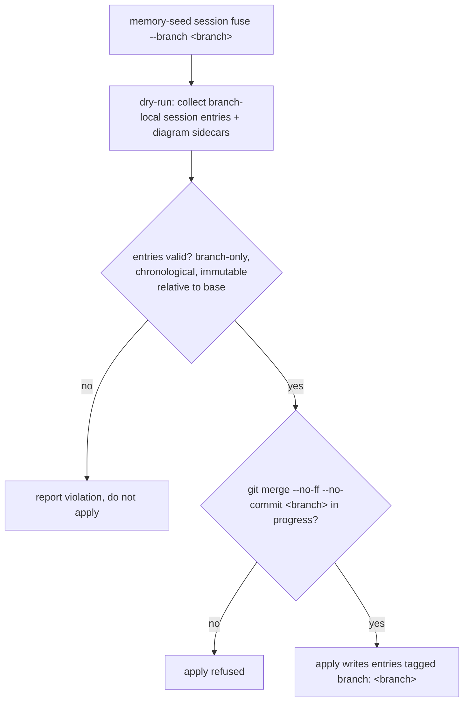
```mermaid
flowchart TB
  A["memory-seed session fuse --branch &lt;branch&gt;"] --> B["dry-run: collect branch-local session entries + diagram sidecars"]
  B --> C{"entries valid? branch-only,<br/>chronological, immutable<br/>relative to base"}
  C -->|no| D["report violation, do not apply"]
  C -->|yes| E{"git merge --no-ff --no-commit &lt;branch&gt; in progress?"}
  E -->|no| F["apply refused"]
  E -->|yes| G["apply writes entries tagged branch: &lt;branch&gt;"]
```

## 2026-08-07 16:10 - Docs taxonomy: folder is lifecycle state

```yaml
adr_id: adr_docs_lifecycle_folders
diagram_status: not_applicable
note: examined 2026-08-07 - a naming assignment, not a flow: eight folder names, each labelled with the class of document it holds (unassessed incoming, active roadmap, live spec, source research, four terminal outcomes). The ADR states no transitions between folders, no ordering, and no trigger for moving a document from one to the next, so any arrows between them would be invented.
```

## 2026-08-07 16:10 - Four never-merged edge kinds, forward-only and acyclic

```yaml
adr_id: adr_edge_kinds
diagram_status: not_applicable
note: examined 2026-08-07 - a four-item edge-kind vocabulary (replaces, evolves, related_entries, evolved_by) plus two graph constraints stated as contract, not mechanism (forward-only, acyclic). The one real derivation fact - evolved_by is the read-time inverse of evolves - is a single relationship, not a structure worth a diagram; showing validation or rejection logic around it would be invented, since the ADR never describes how the constraints are enforced.
```

## 2026-08-07 16:10 - Nearest-runtime discovery walk

```yaml
adr_id: adr_experiment_isolation
```

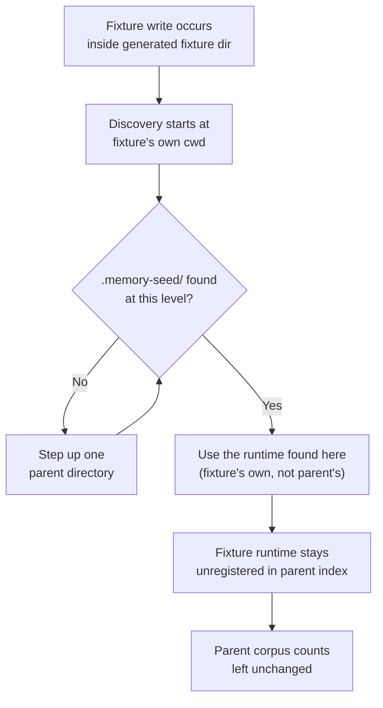
```mermaid
flowchart TB
  Write["Fixture write occurs<br/>inside generated fixture dir"] --> Walk["Discovery starts at<br/>fixture's own cwd"]
  Walk --> Check{".memory-seed/ found<br/>at this level?"}
  Check -->|"No"| Up["Step up one<br/>parent directory"]
  Up --> Check
  Check -->|"Yes"| Use["Use the runtime found here<br/>(fixture's own, not parent's)"]
  Use --> NotReg["Fixture runtime stays<br/>unregistered in parent index"]
  NotReg --> Isolated["Parent corpus counts<br/>left unchanged"]
```

## 2026-08-07 16:10 - Configurable integration mode

```yaml
adr_id: adr_integration_mode
diagram_status: not_applicable
note: examined 2026-08-07 - this is a two-valued configuration setting with a fail-open default, not a topology; the only branch is which command name the mode selects, and the decision sentence already states that directly (a diagram would just re-box the ADR title).
```

## 2026-08-07 16:10 - GitHub Release trigger with manual PyPI gate

```yaml
adr_id: adr_release_topology
```

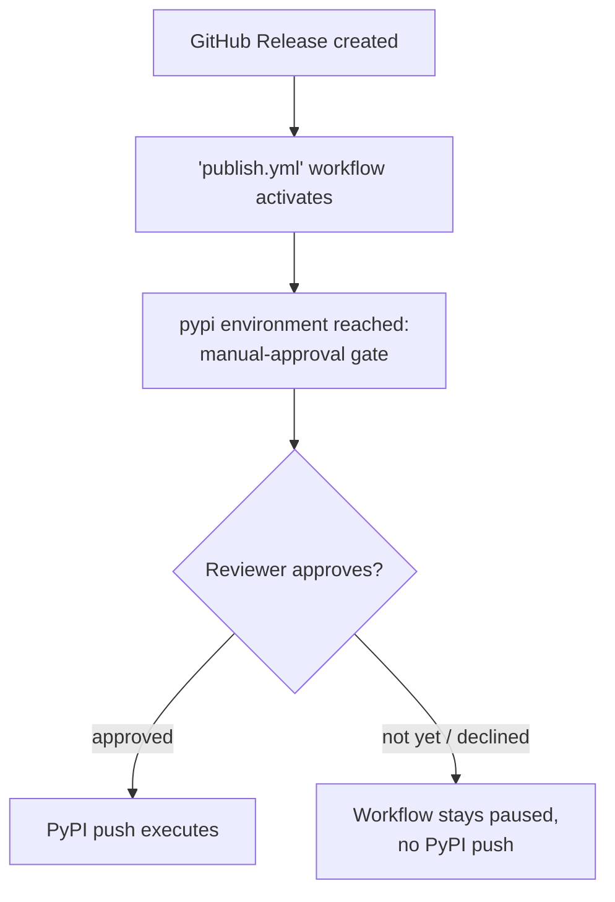
```mermaid
flowchart TB
  RC["GitHub Release created"]
  WF["'publish.yml' workflow activates"]
  ENV["pypi environment reached:<br/>manual-approval gate"]
  D{"Reviewer approves?"}
  PUSH["PyPI push executes"]
  HOLD["Workflow stays paused,<br/>no PyPI push"]

  RC --> WF
  WF --> ENV
  ENV --> D
  D -->|"approved"| PUSH
  D -->|"not yet / declined"| HOLD
```

## 2026-08-07 16:10 - Nearest-ancestor runtime discovery walk

```yaml
adr_id: adr_runtime_discovery
```

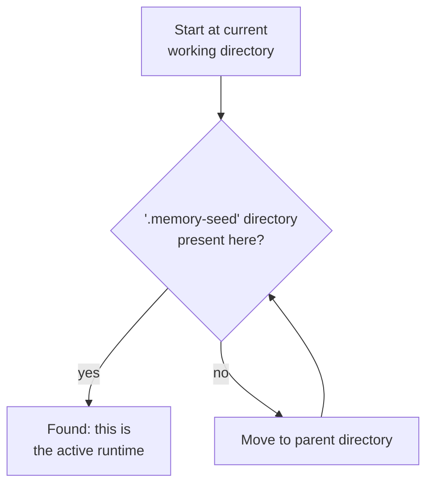
```mermaid
flowchart TB
  S["Start at current<br/>working directory"]
  C{"'.memory-seed' directory<br/>present here?"}
  F["Found: this is<br/>the active runtime"]
  UP["Move to parent directory"]

  S --> C
  C -->|"yes"| F
  C -->|"no"| UP
  UP --> C
```

## 2026-08-07 16:10 - Trace startup incremental; immutable git derivations persist

```yaml
adr_id: adr_trace_incremental_startup
```

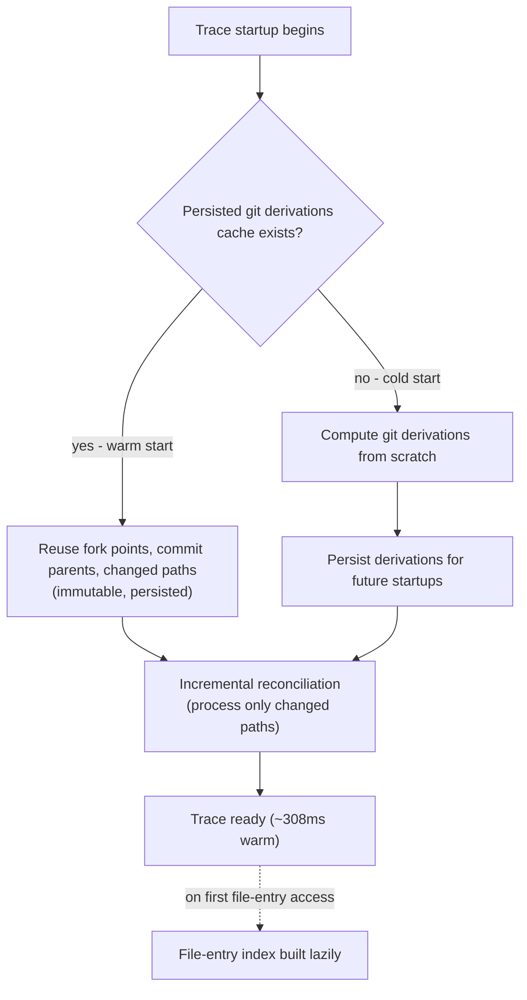
```mermaid
flowchart TB
  A["Trace startup begins"] --> B{"Persisted git derivations cache exists?"}
  B -->|"yes - warm start"| C["Reuse fork points, commit parents, changed paths<br/>(immutable, persisted)"]
  B -->|"no - cold start"| D["Compute git derivations from scratch"]
  D --> E["Persist derivations for future startups"]
  C --> F["Incremental reconciliation<br/>(process only changed paths)"]
  E --> F
  F --> H["Trace ready (~308ms warm)"]
  H -.->|"on first file-entry access"| G["File-entry index built lazily"]
```

## 2026-08-07 16:10 - Worktree=session, branch=task, agent-namespaced branch names

```yaml
adr_id: adr_worktree_convention
diagram_status: not_applicable
note: examined 2026-08-07 - this is a naming and cardinality convention (1 worktree per session, 1 branch per task, branch names formatted as <agent>/<kind>/<topic>), not a process with steps, branching logic, or state transitions; a diagram would just redraw the 1:1 mapping and field format already stated in prose.
```

## 2026-08-07 16:40 - Agent-selective install driven by project.yaml; remove strips only our entries

```yaml
adr_id: adr_agent_selective_install
grounded_in:
  - ms-1bcfcc91:d1
  - ms-1bcfcc91:d3
```

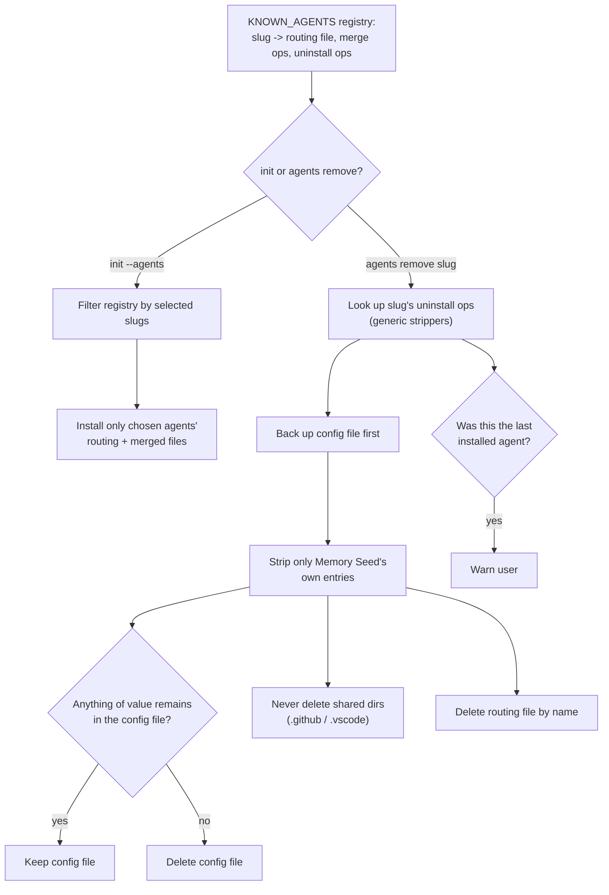
```mermaid
flowchart TB
  A["KNOWN_AGENTS registry:<br/>slug -> routing file, merge ops, uninstall ops"] --> B{"init or agents remove?"}
  B -->|"init --agents"| C["Filter registry by selected slugs"]
  C --> D["Install only chosen agents'<br/>routing + merged files"]
  B -->|"agents remove slug"| E["Look up slug's uninstall ops<br/>(generic strippers)"]
  E --> F["Back up config file first"]
  F --> G["Strip only Memory Seed's<br/>own entries"]
  G --> H{"Anything of value remains<br/>in the config file?"}
  H -->|"yes"| I["Keep config file"]
  H -->|"no"| J["Delete config file"]
  G --> K["Never delete shared dirs<br/>(.github / .vscode)"]
  G --> L["Delete routing file by name"]
  E --> M{"Was this the last<br/>installed agent?"}
  M -->|"yes"| N["Warn user"]
```

## 2026-08-07 16:40 - Archive control-plane snapshots before replacing versioned artifacts

```yaml
adr_id: adr_archive_before_replace
grounded_in:
  - ms-757053d4:d4
```

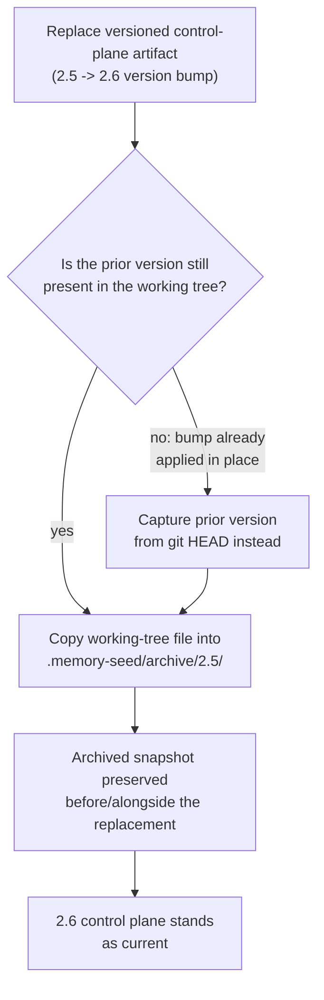
```mermaid
flowchart TB
  A["Replace versioned control-plane artifact<br/>(2.5 -> 2.6 version bump)"] --> B{"Is the prior version still<br/>present in the working tree?"}
  B -->|"yes"| C["Copy working-tree file into<br/>.memory-seed/archive/2.5/"]
  B -->|"no: bump already<br/>applied in place"| D["Capture prior version<br/>from git HEAD instead"]
  D --> C
  C --> E["Archived snapshot preserved<br/>before/alongside the replacement"]
  E --> F["2.6 control plane stands<br/>as current"]
```

## 2026-08-07 16:40 - Control-file authority partition (index/policy/skills/sessions)

```yaml
adr_id: adr_control_file_authority
grounded_in:
  - ms-845042c7:d3
  - mse_ddba1ztxqhasfbwf:d1
```

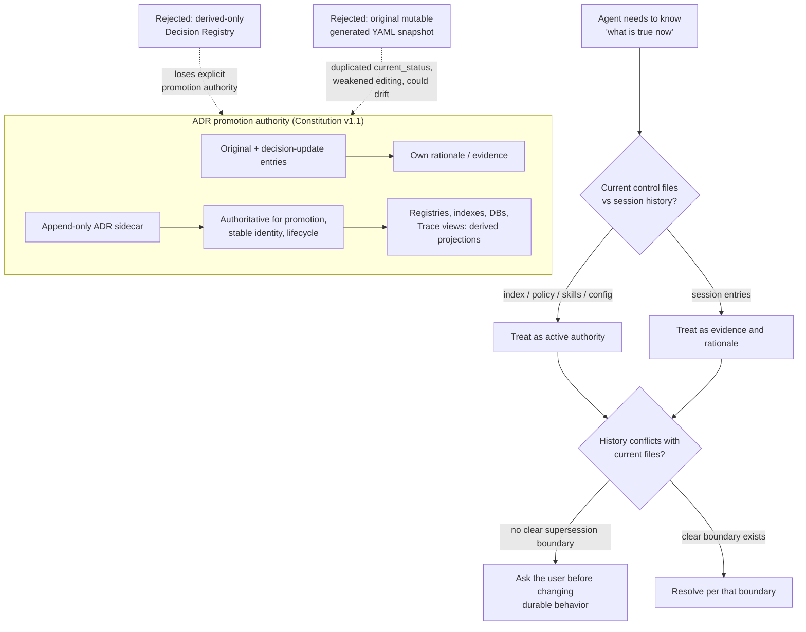
```mermaid
flowchart TB
  Q["Agent needs to know<br/>'what is true now'"] --> S{"Current control files<br/>vs session history?"}
  S -->|"index / policy / skills / config"| A["Treat as active authority"]
  S -->|"session entries"| EV["Treat as evidence and rationale"]
  A --> Cf{"History conflicts with<br/>current files?"}
  EV --> Cf
  Cf -->|"no clear supersession boundary"| ASK["Ask the user before changing<br/>durable behavior"]
  Cf -->|"clear boundary exists"| RES["Resolve per that boundary"]

  subgraph ADR["ADR promotion authority (Constitution v1.1)"]
    P1["Append-only ADR sidecar"] --> AUTH["Authoritative for promotion,<br/>stable identity, lifecycle"]
    ORIG["Original + decision-update entries"] --> RAT["Own rationale / evidence"]
    AUTH --> DER["Registries, indexes, DBs,<br/>Trace views: derived projections"]
  end

  REJ1["Rejected: derived-only<br/>Decision Registry"] -.->|"loses explicit<br/>promotion authority"| ADR
  REJ2["Rejected: original mutable<br/>generated YAML snapshot"] -.->|"duplicated current_status,<br/>weakened editing, could drift"| ADR
```

## 2026-08-07 16:40 - Derived never implicitly overrides write-time

```yaml
adr_id: adr_derived_precedence
grounded_in:
  - mse_dqwvb8gxnn88ch3b:d1
  - mse_x1ha2e26md3q83zv:d1
```

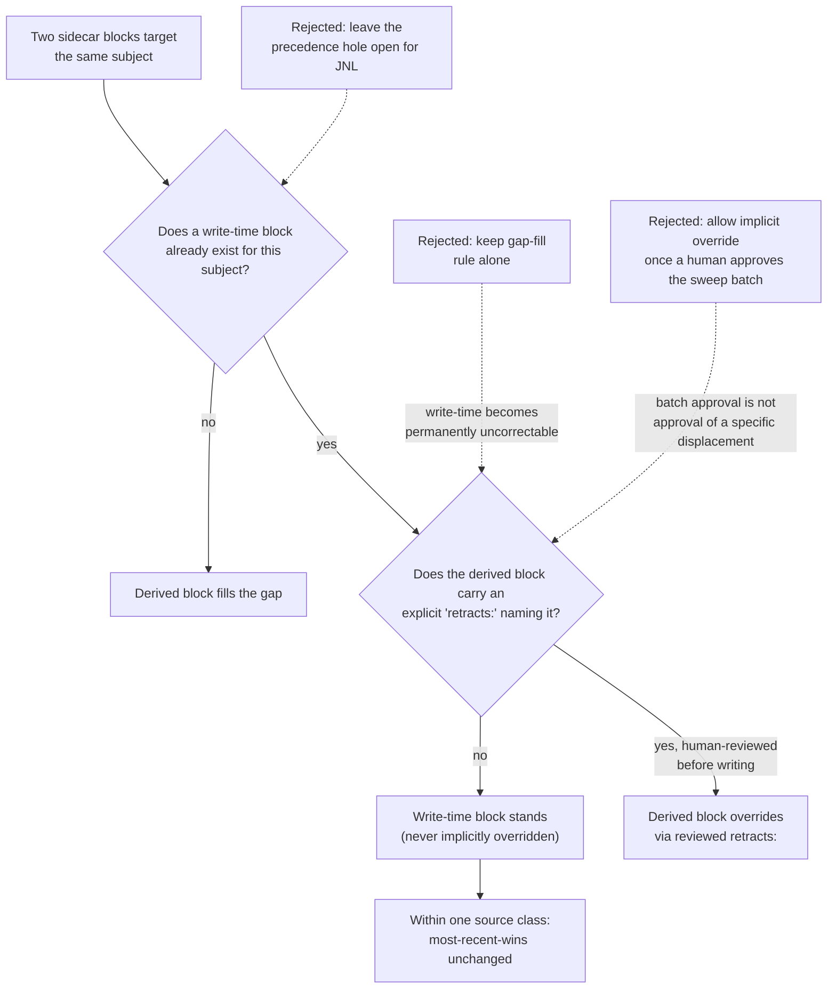
```mermaid
flowchart TB
  A["Two sidecar blocks target<br/>the same subject"] --> B{"Does a write-time block<br/>already exist for this subject?"}
  B -->|"no"| FILL["Derived block fills the gap"]
  B -->|"yes"| C{"Does the derived block carry an<br/>explicit 'retracts:' naming it?"}
  C -->|"no"| STAND["Write-time block stands<br/>(never implicitly overridden)"]
  C -->|"yes, human-reviewed<br/>before writing"| OVERRIDE["Derived block overrides<br/>via reviewed retracts:"]
  STAND --> SAME["Within one source class:<br/>most-recent-wins unchanged"]

  R1["Rejected: leave the<br/>precedence hole open for JNL"] -.-> B
  R2["Rejected: keep gap-fill<br/>rule alone"] -.->|"write-time becomes<br/>permanently uncorrectable"| C
  R3["Rejected: allow implicit override<br/>once a human approves the sweep batch"] -.->|"batch approval is not<br/>approval of a specific displacement"| C
```

## 2026-08-07 16:40 - Non-destructive routing into foreign entry-point files

```yaml
adr_id: adr_foreign_file_routing
grounded_in:
  - ms-7c2f1d90:d1
```

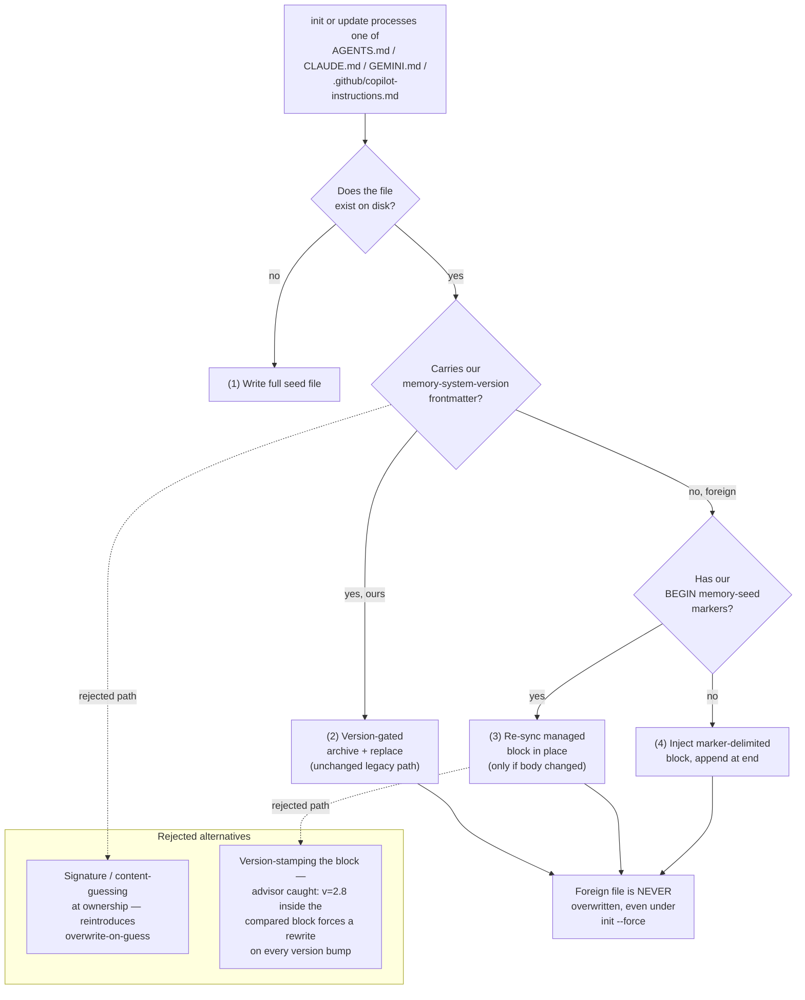
```mermaid
flowchart TB
  START["init or update processes one of<br/>AGENTS.md / CLAUDE.md / GEMINI.md /<br/>.github/copilot-instructions.md"] --> Q1{"Does the file<br/>exist on disk?"}
  Q1 -- "no" --> A1["(1) Write full seed file"]
  Q1 -- "yes" --> Q2{"Carries our<br/>memory-system-version<br/>frontmatter?"}
  Q2 -- "yes, ours" --> A2["(2) Version-gated<br/>archive + replace<br/>(unchanged legacy path)"]
  Q2 -- "no, foreign" --> Q3{"Has our<br/>BEGIN memory-seed<br/>markers?"}
  Q3 -- "yes" --> A3["(3) Re-sync managed<br/>block in place<br/>(only if body changed)"]
  Q3 -- "no" --> A4["(4) Inject marker-delimited<br/>block, append at end"]

  A2 --> NEVER["Foreign file is NEVER<br/>overwritten, even under<br/>init --force"]
  A3 --> NEVER
  A4 --> NEVER

  subgraph REJ["Rejected alternatives"]
    R1["Signature / content-guessing<br/>at ownership &mdash; reintroduces<br/>overwrite-on-guess"]
    R2["Version-stamping the block &mdash;<br/>advisor caught: v=2.8 inside the<br/>compared block forces a rewrite<br/>on every version bump"]
  end

  Q2 -.rejected path.-> R1
  A3 -.rejected path.-> R2
```

## 2026-08-07 16:40 - Forward-only authoring with read-time bidirectional traversal

```yaml
adr_id: adr_forward_only_edges
grounded_in:
  - mse_dvzh6fkn4d98cd6y:d1
```

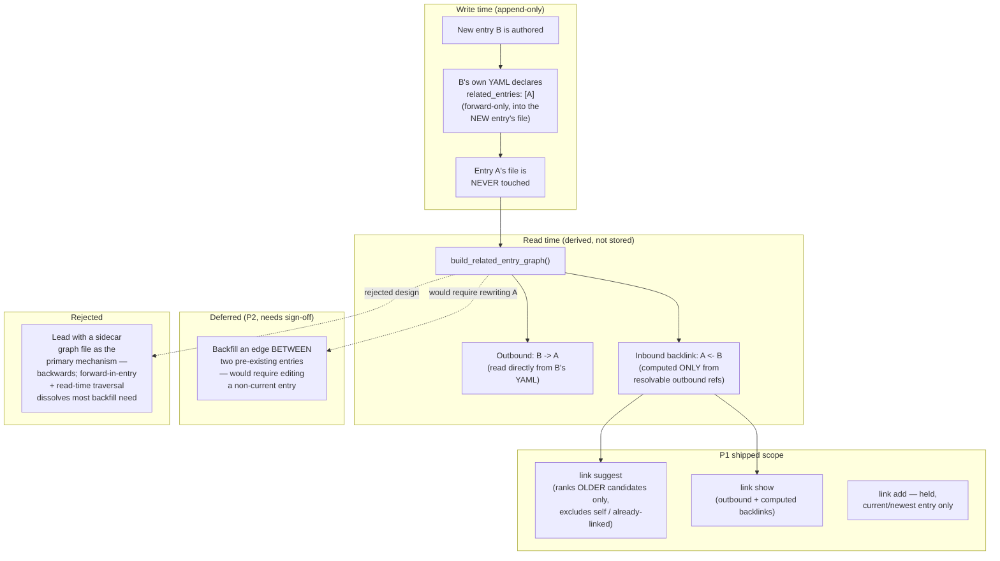
```mermaid
flowchart TB
  subgraph WRITE["Write time (append-only)"]
    NEW["New entry B is authored"] --> DECLARE["B's own YAML declares<br/>related_entries: [A]<br/>(forward-only, into the<br/>NEW entry's file)"]
    DECLARE --> NOEDIT["Entry A's file is<br/>NEVER touched"]
  end

  subgraph READ["Read time (derived, not stored)"]
    GRAPH["build_related_entry_graph()"] --> OUT["Outbound: B -&gt; A<br/>(read directly from B's YAML)"]
    GRAPH --> IN["Inbound backlink: A &lt;- B<br/>(computed ONLY from<br/>resolvable outbound refs)"]
  end

  NOEDIT --> GRAPH
  IN --> SUGGEST["link suggest<br/>(ranks OLDER candidates only,<br/>excludes self / already-linked)"]
  IN --> SHOW["link show<br/>(outbound + computed backlinks)"]

  subgraph SCOPE["P1 shipped scope"]
    SUGGEST
    SHOW
    ADDCMD["link add &mdash; held,<br/>current/newest entry only"]
  end

  subgraph DEFERRED["Deferred (P2, needs sign-off)"]
    BACKFILL["Backfill an edge BETWEEN<br/>two pre-existing entries<br/>&mdash; would require editing<br/>a non-current entry"]
  end

  GRAPH -.would require rewriting A.-> BACKFILL

  subgraph REJ["Rejected"]
    SIDECAR["Lead with a sidecar<br/>graph file as the<br/>primary mechanism &mdash;<br/>backwards; forward-in-entry<br/>+ read-time traversal<br/>dissolves most backfill need"]
  end

  GRAPH -.rejected design.-> SIDECAR
```

## 2026-08-07 16:40 - Append-only link retraction via retracts: blocks

```yaml
adr_id: adr_link_retraction
grounded_in:
  - mse_c3a4z35t4m4rjf1n:d1
  - mse_fsdq53qa5ak68xqh:d1
```

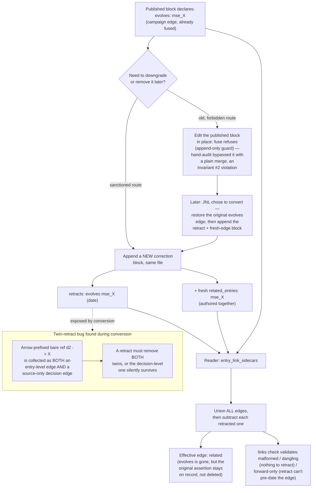
```mermaid
flowchart TB
  PUB["Published block declares:<br/>evolves: mse_X<br/>(campaign edge, already fused)"] --> NEED{"Need to downgrade<br/>or remove it later?"}

  NEED -- "old, forbidden route" --> INPLACE["Edit the published block<br/>in place: fuse refuses<br/>(append-only guard) &mdash;<br/>hand-audit bypassed it with<br/>a plain merge, an<br/>Invariant #2 violation"]

  NEED -- "sanctioned route" --> NEWBLOCK["Append a NEW correction<br/>block, same file"]
  NEWBLOCK --> RETRACT["retracts: evolves mse_X (date)"]
  NEWBLOCK --> FRESH["+ fresh related_entries: mse_X<br/>(authored together)"]

  RETRACT --> READER["Reader: entry_link_sidecars"]
  FRESH --> READER
  PUB --> READER
  READER --> UNION["Union ALL edges,<br/>then subtract each retracted one"]
  UNION --> EFFECT["Effective edge: related<br/>(evolves is gone, but the<br/>original assertion stays<br/>on record, not deleted)"]
  UNION --> VALIDATE["links check validates:<br/>malformed / dangling<br/>(nothing to retract) /<br/>forward-only (retract can't<br/>pre-date the edge)"]

  subgraph TWIN["Twin-retract bug found during conversion"]
    ARROW["Arrow-prefixed bare ref d2 -&gt; X<br/>is collected as BOTH an<br/>entry-level edge AND a<br/>source-only decision edge"]
    MUST["A retract must remove BOTH<br/>twins, or the decision-level<br/>one silently survives"]
    ARROW --> MUST
  end

  RETRACT -.exposed by conversion.-> TWIN

  INPLACE --> CONVERT["Later: JNL chose to convert &mdash;<br/>restore the original evolves<br/>edge, then append the<br/>retract + fresh-edge block"]
  CONVERT --> NEWBLOCK
```

## 2026-08-07 16:40 - Model2Vec default provider; silent lexical degrade; model2vec the only required dep

```yaml
adr_id: adr_semantic_provider
grounded_in:
  - mse_9r00krq403dsmdnq:d1
```

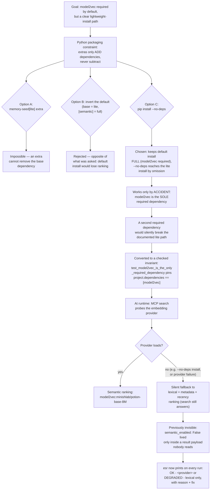
```mermaid
flowchart TB
  ASK["Goal: model2vec required by default,<br/>but a clear lightweight-install path"] --> CONSTRAINT["Python packaging constraint:<br/>extras only ADD dependencies,<br/>never subtract"]

  CONSTRAINT --> OPT1{"Option A:<br/>memory-seed[lite] extra"}
  OPT1 --> REJ1["Impossible &mdash; an extra<br/>cannot remove the base<br/>dependency"]

  CONSTRAINT --> OPT2{"Option B: invert the default<br/>(base = lite,<br/>[semantic] = full)"}
  OPT2 --> REJ2["Rejected &mdash; opposite of<br/>what was asked: default<br/>install would lose ranking"]

  CONSTRAINT --> OPT3{"Option C:<br/>pip install --no-deps"}
  OPT3 --> CHOSEN["Chosen: keeps default install<br/>FULL (model2vec required),<br/>--no-deps reaches the lite<br/>install by omission"]

  CHOSEN --> ACCIDENT["Works only by ACCIDENT:<br/>model2vec is the SOLE<br/>required dependency"]
  ACCIDENT --> RISK["A second required dependency<br/>would silently break the<br/>documented lite path"]
  RISK --> GUARD["Converted to a checked invariant:<br/>test_model2vec_is_the_only<br/>_required_dependency pins<br/>project.dependencies == [model2vec]"]

  GUARD --> RUNTIME["At runtime: MCP search<br/>probes the embedding provider"]
  RUNTIME --> Q2{"Provider loads?"}
  Q2 -- "yes" --> OK["Semantic ranking:<br/>model2vec:minishlab/potion-base-8M"]
  Q2 -- "no (e.g. --no-deps install,<br/>or provider failure)" --> DEGRADE["Silent fallback to<br/>lexical + metadata + recency<br/>ranking (search still answers)"]

  DEGRADE --> INVISIBLE["Previously invisible:<br/>semantic_enabled: False lived<br/>only inside a result payload<br/>nobody reads"]
  INVISIBLE --> ESR["esr now prints on every run:<br/>OK - &lt;provider&gt; or<br/>DEGRADED - lexical only,<br/>with reason + fix"]
```

## 2026-08-07 16:40 - Migrate sessions-layout: legacy flat file to per-user file

```yaml
adr_id: adr_session_layout
grounded_in:
  - mse_ed8zaf52k3eyaxqv:d1
```

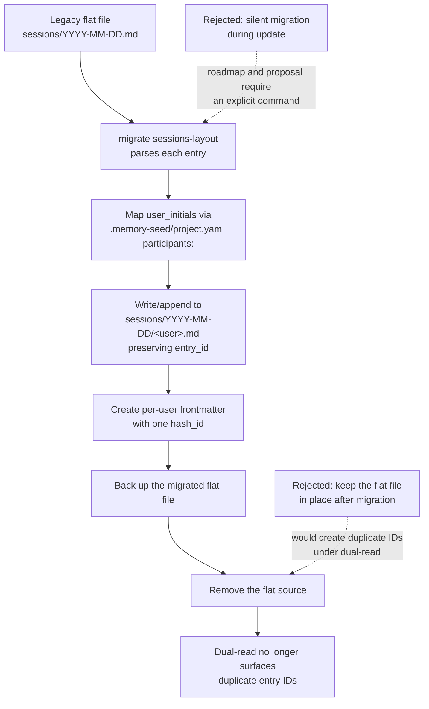
```mermaid
flowchart TB
  L["Legacy flat file<br/>sessions/YYYY-MM-DD.md"] --> P["migrate sessions-layout<br/>parses each entry"]
  P --> MAP["Map user_initials via<br/>.memory-seed/project.yaml participants:"]
  MAP --> WRITE["Write/append to<br/>sessions/YYYY-MM-DD/&lt;user&gt;.md<br/>preserving entry_id"]
  WRITE --> FRONT["Create per-user frontmatter<br/>with one hash_id"]
  FRONT --> BACKUP["Back up the migrated flat file"]
  BACKUP --> REMOVE["Remove the flat source"]
  REMOVE --> NODUP["Dual-read no longer surfaces<br/>duplicate entry IDs"]
  ALT1["Rejected: silent migration<br/>during update"] -.->|"roadmap and proposal require<br/>an explicit command"| P
  ALT2["Rejected: keep the flat file<br/>in place after migration"] -.->|"would create duplicate IDs<br/>under dual-read"| REMOVE
```

## 2026-08-07 16:40 - Sub-project writes route local-detail vs root-visible-summary

```yaml
adr_id: adr_subproject_scoping
grounded_in:
  - ms-0bd3d8b2:d2
  - ms-f776aff0:d1
```

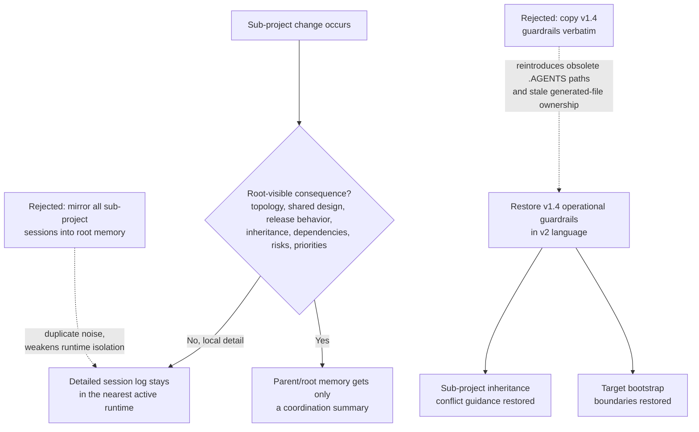
```mermaid
flowchart TB
  CH["Sub-project change occurs"] --> Q{"Root-visible consequence?<br/>topology, shared design, release behavior,<br/>inheritance, dependencies, risks, priorities"}
  Q -->|"No, local detail"| LOCAL["Detailed session log stays<br/>in the nearest active runtime"]
  Q -->|"Yes"| SUMMARY["Parent/root memory gets only<br/>a coordination summary"]
  REJ["Rejected: mirror all sub-project<br/>sessions into root memory"] -.->|"duplicate noise,<br/>weakens runtime isolation"| LOCAL
  G["Restore v1.4 operational guardrails<br/>in v2 language"] --> INH["Sub-project inheritance<br/>conflict guidance restored"]
  G --> BOOT["Target bootstrap<br/>boundaries restored"]
  REJ2["Rejected: copy v1.4<br/>guardrails verbatim"] -.->|"reintroduces obsolete .AGENTS paths<br/>and stale generated-file ownership"| G
```

## 2026-08-07 16:40 - Topic resolution falls back sidecar to authored to hashtag, never unions

```yaml
adr_id: adr_topic_authority
grounded_in:
  - mse_8qmv0m07sy95vjm9:d1
  - mse_ypmrtzfmw4qwtbnn:d1
```

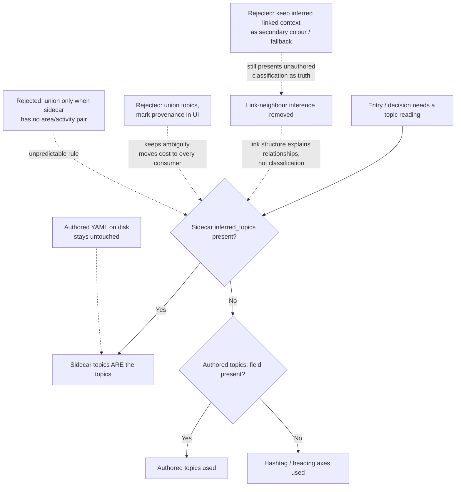
```mermaid
flowchart TB
  E["Entry / decision needs a topic reading"] --> S{"Sidecar inferred_topics present?"}
  S -->|"Yes"| ST["Sidecar topics ARE the topics"]
  S -->|"No"| A{"Authored topics: field present?"}
  A -->|"Yes"| AT["Authored topics used"]
  A -->|"No"| H["Hashtag / heading axes used"]
  LN["Link-neighbour inference removed"] -.->|"link structure explains relationships,<br/>not classification"| S
  DISK["Authored YAML on disk<br/>stays untouched"] -.-> ST
  REJ1["Rejected: union topics,<br/>mark provenance in UI"] -.->|"keeps ambiguity,<br/>moves cost to every consumer"| S
  REJ2["Rejected: union only when sidecar<br/>has no area/activity pair"] -.->|"unpredictable rule"| S
  REJ3["Rejected: keep inferred linked context<br/>as secondary colour / fallback"] -.->|"still presents unauthored<br/>classification as truth"| LN
```

## 2026-08-07 16:40 - Extract memory-trace as a separate distribution, core sheds the web stack

```yaml
adr_id: adr_trace_boundary
grounded_in:
  - mse_fcecj9hpq4qj16ay:d1
```

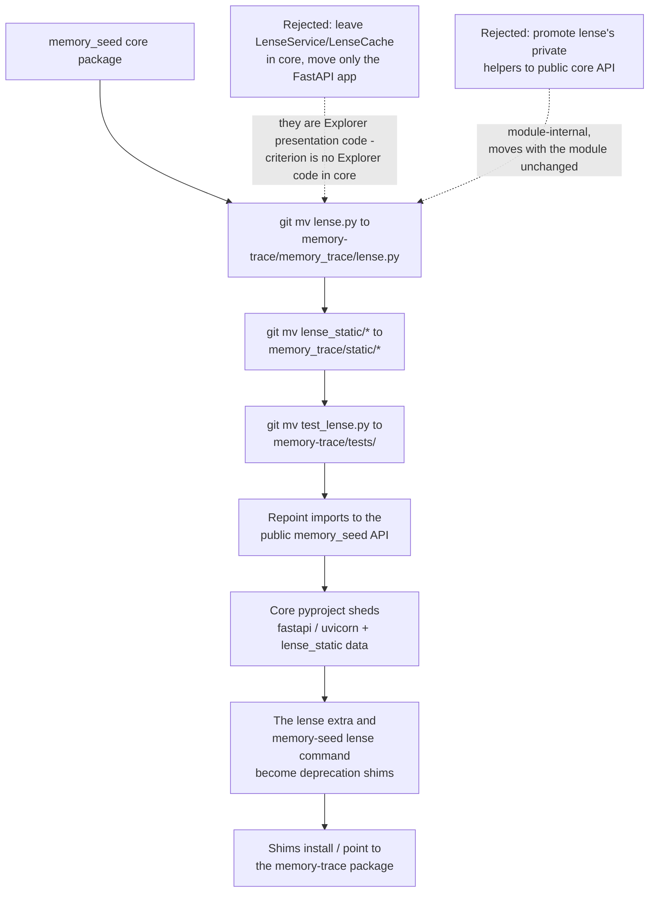
```mermaid
flowchart TB
  CORE["memory_seed core package"] --> MOVE["git mv lense.py to<br/>memory-trace/memory_trace/lense.py"]
  MOVE --> STATIC["git mv lense_static/* to<br/>memory_trace/static/*"]
  STATIC --> TESTS["git mv test_lense.py to<br/>memory-trace/tests/"]
  TESTS --> REPOINT["Repoint imports to the<br/>public memory_seed API"]
  REPOINT --> SHED["Core pyproject sheds<br/>fastapi / uvicorn + lense_static data"]
  SHED --> SHIM["The lense extra and<br/>memory-seed lense command<br/>become deprecation shims"]
  SHIM --> POINT["Shims install / point to<br/>the memory-trace package"]
  REJ1["Rejected: leave LenseService/LenseCache<br/>in core, move only the FastAPI app"] -.->|"they are Explorer presentation code -<br/>criterion is no Explorer code in core"| MOVE
  REJ2["Rejected: promote lense's private<br/>helpers to public core API"] -.->|"module-internal,<br/>moves with the module unchanged"| MOVE
```
