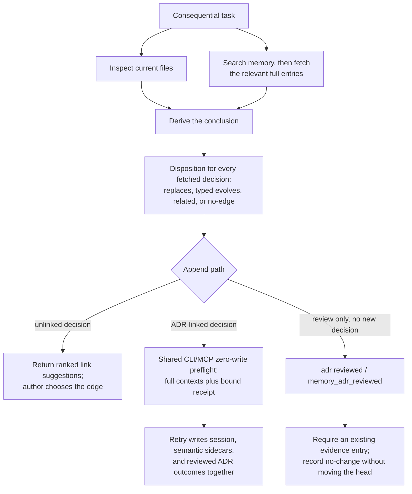

---
tags:
  - session-log-diagrams
diagram_date: 2026-08-10
---

## 2026-08-10 13:00 - Memory-grounded conclusions close the retrieval-to-write loop

```yaml
entry_id: mse_axkrkd339br970kw
grounded_in:
  - mse_axkrkd339br970kw:d1
  - mse_axkrkd339br970kw:d2
```


