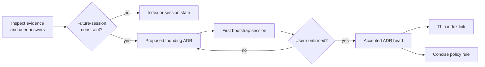
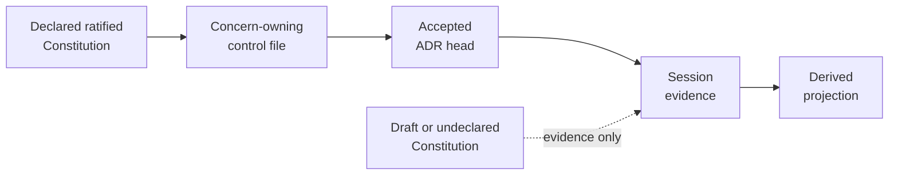
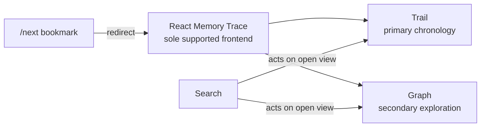

---
tags:
  - session-log-diagrams
diagram_date: 2026-08-11
---

## 2026-08-11 12:32 - Bootstrap durable decisions through ADR authority

```yaml
adr_id: adr_bootstrap_durable_authority
grounded_in:
  - mse_nyqqq37hrgp6qcp3:d1
```



## 2026-08-11 12:33 - Control-file authority partition and precedence

```yaml
adr_id: adr_control_file_authority
grounded_in:
  - mse_p2dgz4af43dhxs4p:d2
```



## 2026-08-11 12:34 - Trail-first React-only Memory Trace

```yaml
adr_id: adr_trace_trail_first_ui
grounded_in:
  - mse_p2dgz4af43dhxs4p:d3
```


