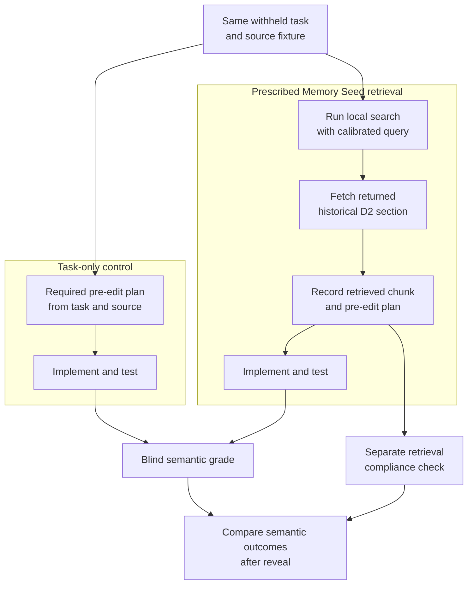

---
tags:
  - session-log-diagrams
diagram_date: 2026-08-18
---

## 2026-08-18 13:21 - Explicit retrieval treatment isolates Memory Seed application

```yaml
entry_id: mse_gnpc8zdndw7qg6xg
```


```mermaid
flowchart TB
  Task["Same withheld task<br/>and source fixture"]

  subgraph Control["Task-only control"]
    CPlan["Required pre-edit plan<br/>from task and source"]
    CCode["Implement and test"]
  end

  subgraph Treatment["Prescribed Memory Seed retrieval"]
    Search["Run local search<br/>with calibrated query"]
    Fetch["Fetch returned<br/>historical D2 section"]
    TPlan["Record retrieved chunk<br/>and pre-edit plan"]
    TCode["Implement and test"]
  end

  Task --> CPlan --> CCode
  Task --> Search --> Fetch --> TPlan --> TCode
  CCode --> Blind["Blind semantic grade"]
  TCode --> Blind
  TPlan --> Receipt["Separate retrieval<br/>compliance check"]
  Blind --> Compare["Compare semantic outcomes<br/>after reveal"]
  Receipt --> Compare
```
