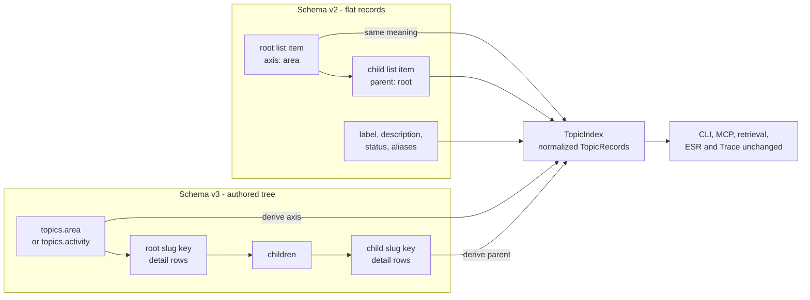

---
tags:
  - session-log-diagrams
diagram_date: 2026-08-18
---

## 2026-08-18 13:32 - Topic structure moves from repeated rows into the YAML tree

```yaml
adr_id: adr_topic_vocabulary
grounded_in:
  - mse_sbq4ar5bq4wyrt69:d1
```


