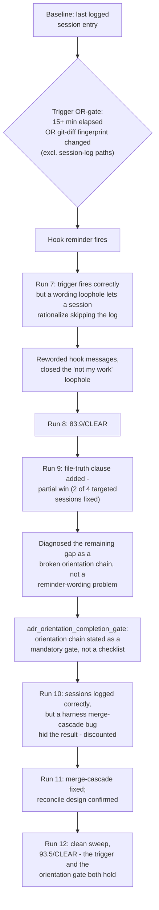

---
tags:
  - session-log-diagrams
diagram_date: 2026-08-31
---

## 2026-08-31 23:59 - Session-log entries are triggered by content change, not elapsed time alone

```yaml
adr_id: adr_session_log_trigger_enforcement
grounded_in:
  - mse_81504w3dkaanm395:d1
  - mse_4e4y2348y7493b37:d1
```



## 2026-08-31 23:59 - Session-log entries are triggered by content change, not elapsed time alone

```yaml
adr_id: adr_session_log_trigger_enforcement
grounded_in:
  - mse_81504w3dkaanm395:d1
  - mse_4e4y2348y7493b37:d1
```


