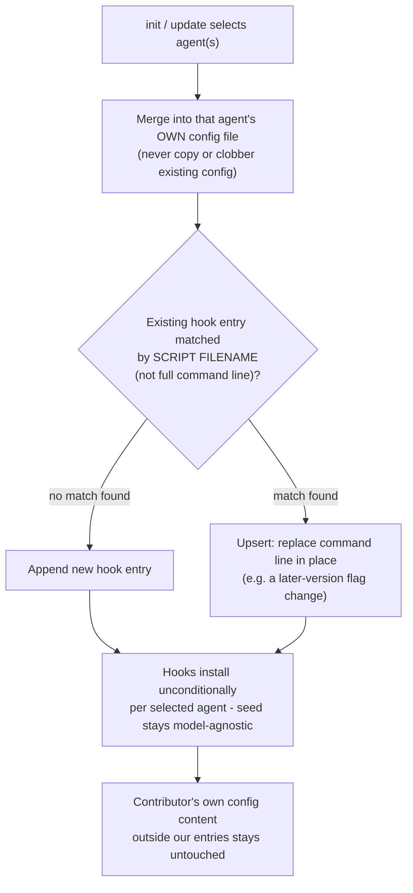
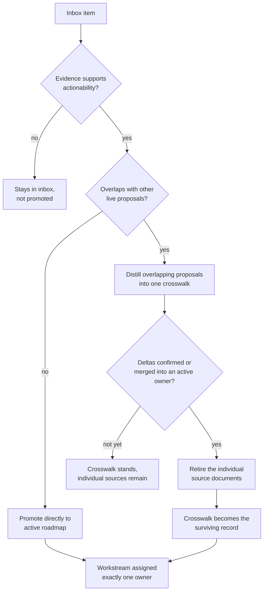
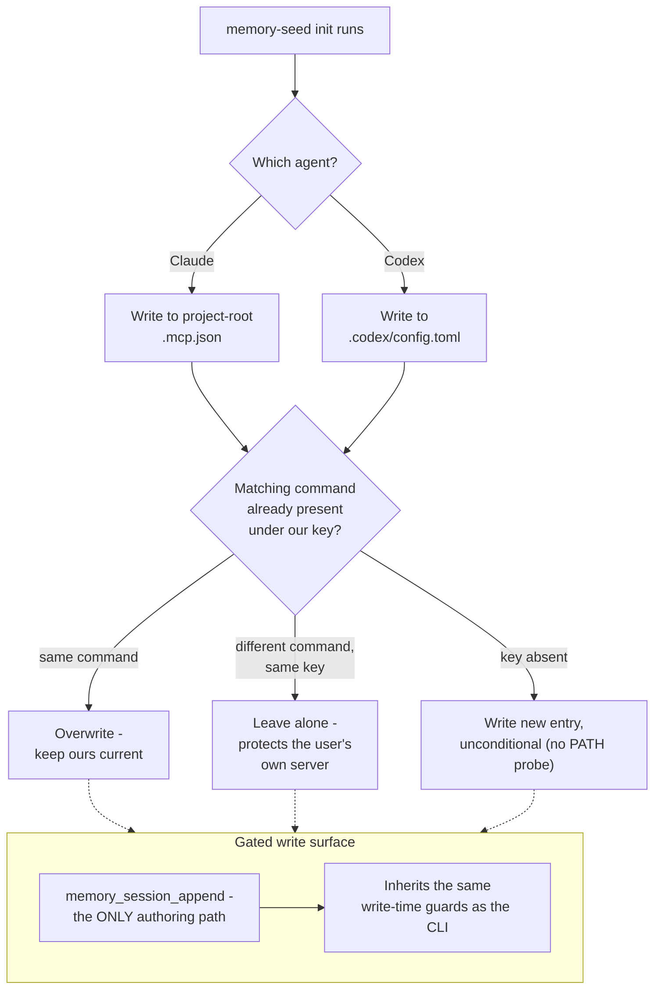
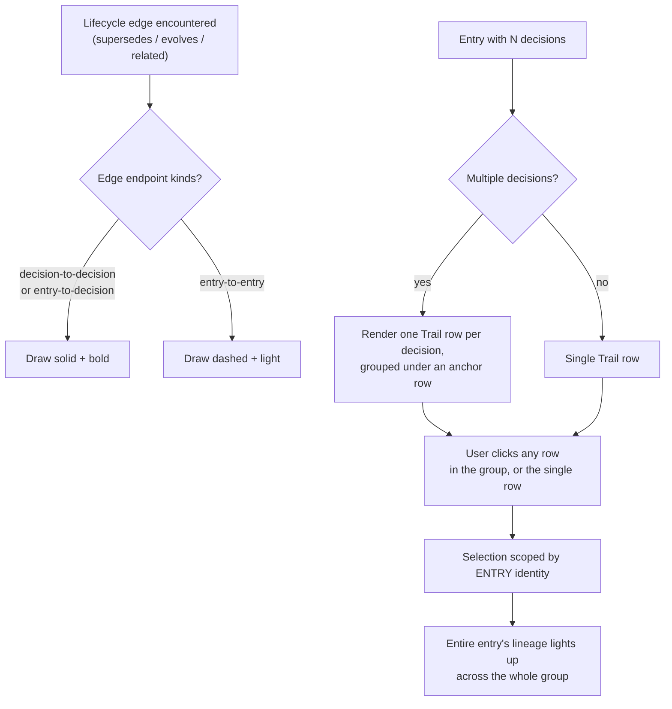

---
tags:
  - session-log-diagrams
diagram_date: 2026-09-01
---

## 2026-09-01 20:00 - Orientation is a mandatory gate, not a numbered checklist

```yaml
adr_id: adr_orientation_completion_gate
diagram_status: not_applicable
note: examined 2026-09-01 - a wording fix strengthening how the orientation chain (AGENTS.md -> agent-rules.md) is phrased in the SessionStart hook and Operating Mode section, so it reads as a mandatory gate rather than a truncatable numbered checklist. The chain itself is two files already named in the title; the ADR's substance is enforcement language for an existing two-step read, not a process with branches or states to draw.
```

## 2026-09-01 20:01 - Hook installation is a per-agent merge, idempotent on script filename

```yaml
adr_id: adr_hook_merge_framework
grounded_in:
  - ms-5e366ef4:d2
```



## 2026-09-01 20:02 - Inbox promotion: conservative triage, one owner per workstream

```yaml
adr_id: adr_inbox_promotion_workflow
grounded_in:
  - mse_2geqfa8tg182a77p:d1
```



## 2026-09-01 20:03 - MCP integration: per-agent config placement, upsert semantics, and a gated write surface

```yaml
adr_id: adr_mcp_integration_surface
grounded_in:
  - mse_vzsef0fmpsde2jh4:d1
```



## 2026-09-01 20:04 - Trail: lifecycle visualization and decision-level row rendering

```yaml
adr_id: adr_trail_lifecycle_visualization
grounded_in:
  - mse_zm2h343r4shfre3j:d2
```



## 2026-09-01 20:05 - Encoding policy is owned by Memory Seed, with explicit check and repair tooling

```yaml
adr_id: adr_windows_encoding_policy
diagram_status: not_applicable
note: examined 2026-09-01 - rejected as a duplicate: this record and adr_encoding_policy both proposed the same head (mse_74ddxsena9nj2afk:d1) stating the same UTF-8/LF/NFC ownership rule, and adr_encoding_policy survives as the live record while this one was rejected. adr_encoding_policy is an ownership constraint with nothing to draw (states where a rule may live, not how anything flows); this rejected duplicate adds no mechanism that would change that verdict.
```

