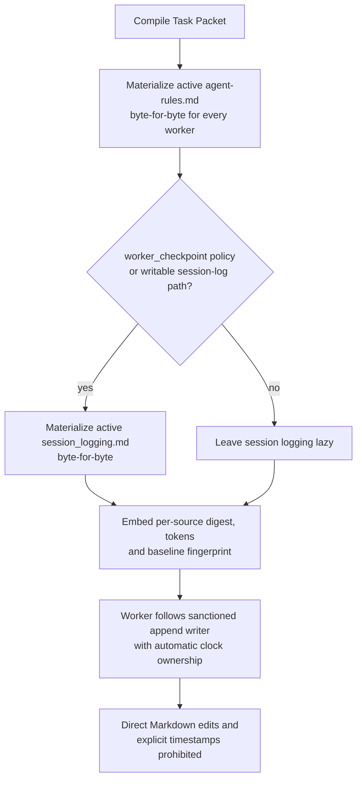

---
tags:
  - session-log-diagrams
diagram_date: 2026-09-06
---

## 2026-09-06 01:22 - Task Packet worker-governance baseline selection

```yaml
entry_id: mse_481b9y78d5t4ct3x
```


```mermaid
flowchart TB
  A["Compile Task Packet"] --> B["Materialize active agent-rules.md\nbyte-for-byte for every worker"]
  B --> C{"worker_checkpoint policy\nor writable session-log path?"}
  C -->|"yes"| D["Materialize active session_logging.md\nbyte-for-byte"]
  C -->|"no"| E["Leave session logging lazy"]
  D --> F["Embed per-source digest, tokens\nand baseline fingerprint"]
  E --> F
  F --> G["Worker follows sanctioned append writer\nwith automatic clock ownership"]
  G --> H["Direct Markdown edits and\nexplicit timestamps prohibited"]
```
