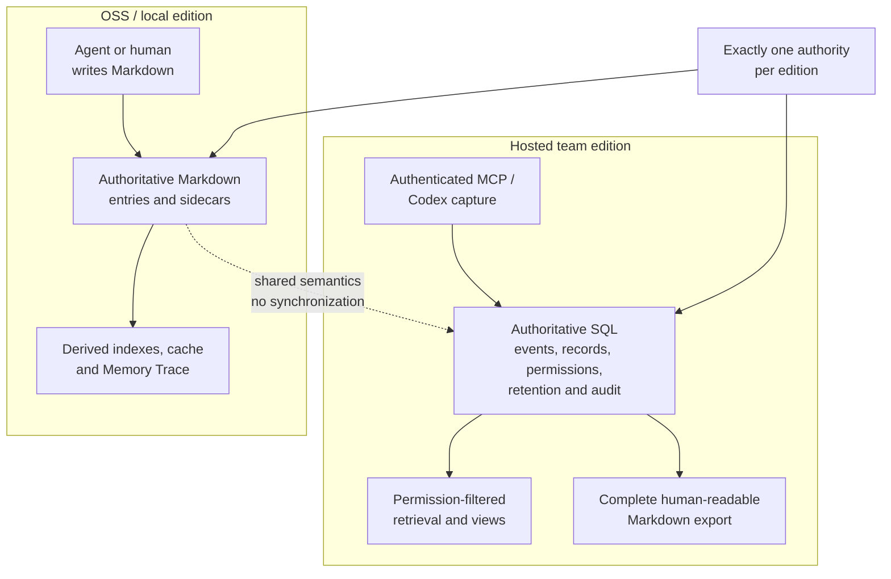

---
tags:
  - session-log-diagrams
diagram_date: 2026-09-19
---

## 2026-09-19 00:54 - Edition-specific memory authority

```yaml
entry_id: mse_kn36asmf96bf5tk1
```


```mermaid
flowchart TB
  Rule["Exactly one authority<br/>per edition"]
  subgraph Local["OSS / local edition"]
    direction LR
    LocalWrite["Agent or human<br/>writes Markdown"] --> LocalStore["Authoritative Markdown<br/>entries and sidecars"]
    LocalStore --> LocalViews["Derived indexes, cache<br/>and Memory Trace"]
  end
  subgraph Hosted["Hosted team edition"]
    direction LR
    HostedWrite["Authenticated MCP /<br/>Codex capture"] --> Sql["Authoritative SQL<br/>events, records, permissions,<br/>retention and audit"]
    Sql --> HostedViews["Permission-filtered<br/>retrieval and views"]
    Sql --> Export["Complete human-readable<br/>Markdown export"]
  end
  Rule --> LocalStore
  Rule --> Sql
  LocalStore -.->|"shared semantics<br/>no synchronization"| Sql
```
