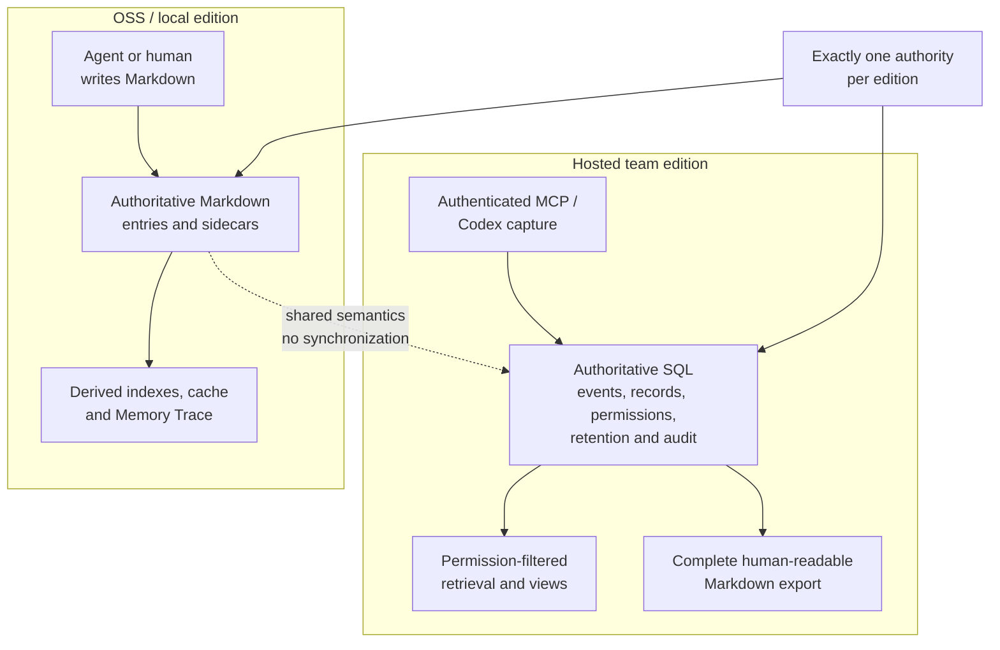
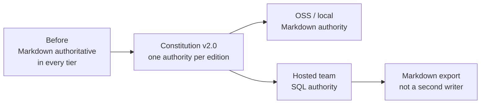
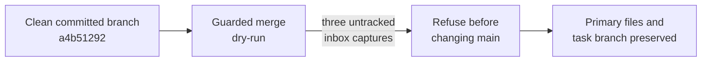

---
tags:
  - session-log-diagrams
diagram_date: 2026-09-19
---

## 2026-09-19 00:54 - Edition-specific memory authority

```yaml
entry_id: mse_kn36asmf96bf5tk1
```



## 2026-09-19 00:55 - Markdown authority becomes edition-specific

```yaml
adr_id: adr_markdown_substrate
grounded_in:
  - mse_kn36asmf96bf5tk1:d1
```



## 2026-09-19 01:11 - Guarded hosted-edition merge blocked by inbox captures

```yaml
entry_id: mse_30v60e8c3xa380yd
```


