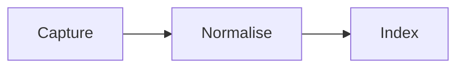
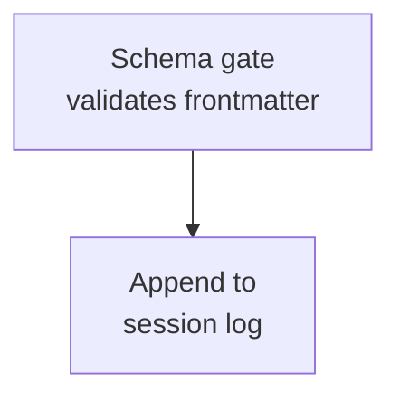
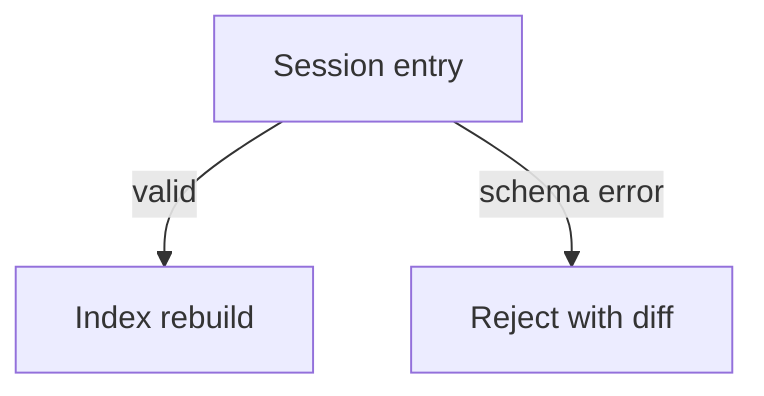
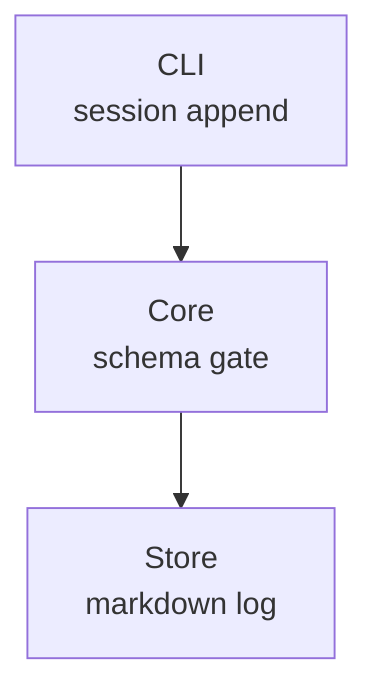

# Compact Mermaid Diagrams Skill

Use this skill after the general diagram rule has already passed: the diagram is genuinely better
than prose because it shows spatial, temporal, dependency, or concurrent structure. Mermaid remains
the default. D2 is only a specialist option for dense architecture diagrams when the target renderer
is known to support it.

## Goal

Produce compact, rectangular Mermaid diagrams that fit normal preview panes without wide horizontal
scrolling, tall isolated baselines, or excessive whitespace — using only syntax the target renderer
actually understands.

## Read This First: `subgraph` Is Not Parsed In Sidecars

Diagram sidecars under `.memory-seed/sessions/diagrams/**` are rendered by the project's own built-in
renderer ("Arc 2d": `memory-trace/client/src/arc2d.ts`, plus its vanilla twin in
`memory-trace/memory_trace/static/app.js`). Both implement a deliberately small subset of Mermaid,
and neither has any `subgraph` support.

The failure is worse than losing the box. `subgraph`, `direction`, and `end` are each parsed as
ordinary node declarations, so they render as **stray rectangles labelled `subgraph`, `direction`,
and `end`** sitting beside the real nodes. A six-line tier block meant to show two grouped nodes
renders five boxes, three of them syntax noise. Do not use `subgraph` in sidecars.

**Scope of this restriction:** it applies to `.memory-seed/sessions/diagrams/**` sidecars only.
Diagrams in ordinary authored Markdown (`docs/**`, `README.md`, and the like) are rendered by
whichever full Mermaid engine the reader has — GitHub's, or an IDE preview — and `subgraph` is
standard Mermaid that those engines render correctly. Grouping is fine there.

When a diagram may be read in both places, author to the sidecar subset. It is the intersection of
Arc 2d and full Mermaid, so it renders correctly everywhere.

## The Supported Sidecar Subset

Everything in this section was verified by running the parser against each form, not read off the
Mermaid syntax docs.

### Diagram headers

| Header | Result |
| --- | --- |
| `flowchart TD` / `flowchart TB` / `flowchart` / `graph TD` | Top-down |
| `flowchart LR` / `graph LR` | Left-to-right |
| `flowchart RL` / `graph RL` | Right-to-left |
| `flowchart BT` | **Top-down** — `BT` is not honoured and does not flip the axis |
| `sequenceDiagram` | Sequence diagram |
| Anything else (`stateDiagram-v2`, `classDiagram`, `erDiagram`, `gitGraph`, …) | Not rendered — the raw source is shown in a `<pre>` block |

Only `LR` and `RL` change the axis. `TD`, `TB`, `BT`, and an omitted direction all produce the same
top-down layout. The header must be the **first line and flush left**: an indented header still
selects the flowchart parser but silently loses the direction and falls back to top-down.

### Flowchart nodes

- Node ids may contain letters, digits, `_`, and `-`. **No spaces** — `My Node --> B` yields a node
  called `My` and drops the rest of the line.
- `A[Label]`, `A(Label)`, and `A{Label}` are all accepted and all draw the **same rectangle**. Shape
  syntax carries no visual meaning here, so pick one form and stay consistent.
- Compound shapes corrupt the label: `A[[X]]` renders `[X`, `A((X))` renders `(X`, `A([X])` renders
  `[X]`, and `A>X]` loses the label entirely. Never use them.
- Surrounding quotes are optional and are stripped. Spaces and parentheses inside a label are fine:
  `A["Rebuild index (fast path)"]`.
- Give a node its label at first mention; later lines can reference the bare id.

### Flowchart edges

- **`-->` is the only arrow that works**, optionally carrying a label: `A -->|on failure| B`.
- `---`, `-.->`, `==>`, `~~~`, and `o--o` do not merely fail to draw a line. The line is not
  recognised as an edge at all, so **the right-hand node is dropped from the diagram entirely**.
- `A -- text --> B` draws the edge but discards `text`. Write `A -->|text| B` instead.
- One edge per line. `A --> B --> C` creates only `A --> B`, and `C` never appears.
- Edge labels cannot contain `|`.

### Everything else becomes a stray box

Only node declarations and `-->` edges are recognised. **Any other line beginning with a word is
parsed as a node declaration and renders as a stray rectangle labelled with that word.** That is what
happens to `subgraph` and `end`, and it happens just the same to `classDef`, `style`, `linkStyle`,
`click`, and a bare `direction`. Leave all of them out.

`%%` comments are ignored safely — unless the comment text contains `-->`, which injects a phantom
node named after whatever follows the arrow. Keep arrows out of comments.

### Sequence diagrams

- `participant Some Name` — participant names **may** contain spaces and hyphens.
- `A->>B: text`, and likewise `->`, `-->`, and `-->>`. An arrow containing `--` renders dashed.
- The `: text` part is required; a message line without it is dropped.
- `Note over …`, `alt` / `else` / `loop` / `end` blocks, and activation markers are ignored cleanly.
  Unlike in flowcharts they leave no stray boxes — they simply do not appear, so do not rely on them
  to carry meaning.

## Language Selection

1. Use Mermaid by default for Markdown-native documentation, especially flowcharts, sequences,
   decision trees, agent workflows, and compact dependency sketches.
2. Choose D2 only when it materially improves readability or maintainability for dense nested
   architecture maps, service dependency diagrams, module/package boundaries, repeated containers, or
   before/after architecture states — and only in authored Markdown, never in a sidecar.
3. Do not use D2 for `.memory-seed/sessions/diagrams/YYYY-MM/YYYY-MM-DD.md` sidecars. Sidecar guidance
   is Mermaid-first, restricted to the subset above.
4. If Mermaid and D2 both express the diagram clearly, choose Mermaid.
5. Do not add any diagram when prose, a short list, or a table would be clearer.

## Compaction Techniques Within The Subset

Grouping is unavailable, so compactness comes from direction, label shape, edge labels, and knowing
when to split. These are the levers that actually exist.

### 1. Choose the direction that matches the shape of the graph

A long chain with little branching reads better left-to-right; a wide fan-out reads better top-down.
This is the biggest single lever and it costs one token.

### 2. Break long labels manually with ` `

` `, ` `, and ` ` all split a label into stacked lines. There is **no automatic
wrapping**: node width is clamped near 260px and a long single-line label simply overflows its box.
Manual breaks are the only way to keep a wordy node readable.

Keep each line short. Two or three lines of two or three words each is the sweet spot.

### 3. Carry grouping in edge labels instead of containers

What a `subgraph` title would have said can usually ride on the edges as a condition or a stage name.
This preserves the meaning the grouping was carrying, without the container.

### 4. Use a label prefix where you would have used a container

When several nodes belong to one tier, say so in their labels rather than boxing them. A short prefix
plus ` ` reads almost as well as a container title.

### 5. Split one dense diagram into two

Two small diagrams under two headings beat one wide one. When a diagram needs more than roughly eight
nodes, or mixes two concerns (a write path and a read path, say), split it. Without grouping there is
no way to keep a large diagram legible, so splitting is the primary tool here rather than a fallback.
Give each half its own fenced block and a one-line caption saying what it covers.

### 6. Keep the node count honest

Prefer the fewest nodes that carry the point. A node that exists only to be passed through — one edge
in, one edge out, no decision — is usually better folded into a neighbour's label.

## Quality Check

Before committing or sharing a sidecar diagram:

- The header is on the first line, flush left, and is `flowchart`, `graph`, or `sequenceDiagram`.
- Every edge is `-->` or `-->|label|`. Search the block for `~~~`, `---`, `-.->`, and `==>` — each one
  is silently deleting a node.
- There is no `subgraph`, `end`, `direction`, `classDef`, or `style` line.
- Every line is a node declaration, a `-->` edge, or a `%%` comment with no arrow in it.
- Node ids contain no spaces, and no compound shapes like `[[ ]]` or `(( ))` appear.
- Long labels are broken with ` ` rather than left to overflow.
- The diagram reads as a rectangle rather than a ribbon or a tower.
- No single node sits alone at the bottom with long vertical strings leading to it.
- The Mermaid block is still semantically fresh; shipped work and roadmap status are not stale.

If a diagram cannot be made legible within this subset, that is a signal to write prose or a table
instead — not a signal to reach for `subgraph`.
