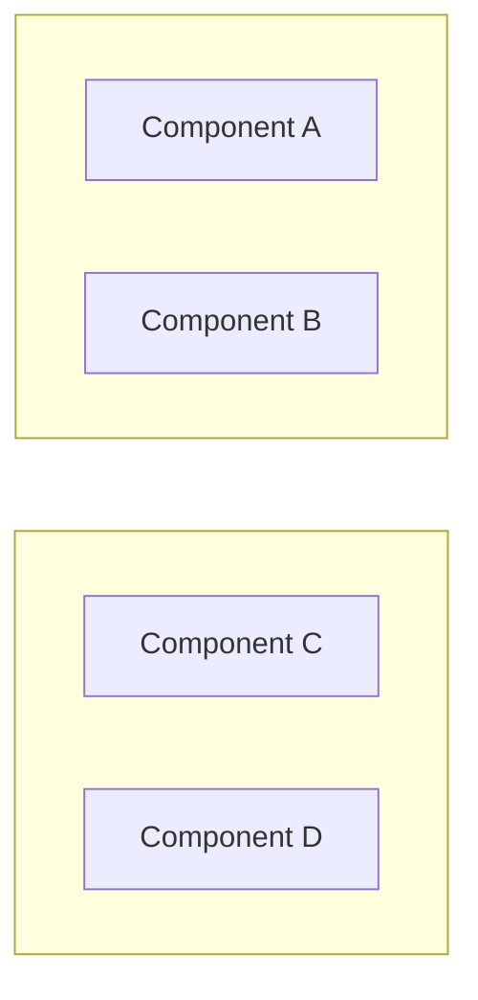
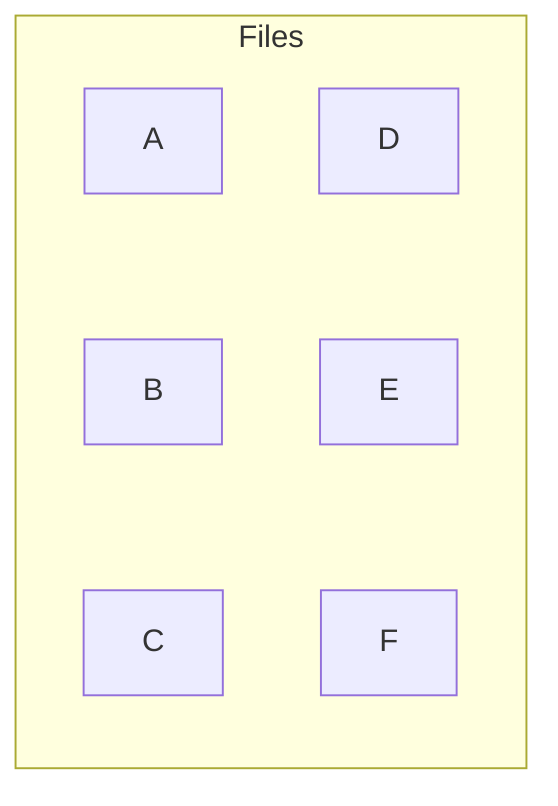
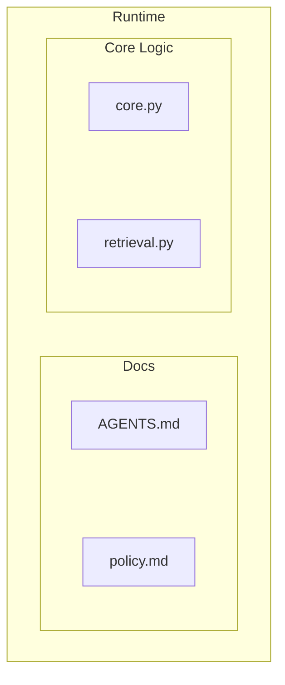

# Compact Mermaid Diagrams Skill

Use this skill after the general diagram rule has already passed: the diagram is genuinely better
than prose because it shows spatial, temporal, dependency, or concurrent structure. Mermaid remains
the default. D2 is only a specialist option for dense architecture diagrams when the target renderer
is known to support it.

## Goal

Produce compact, rectangular Mermaid diagrams that fit normal Markdown preview panes without wide
horizontal scrolling, tall isolated baselines, or excessive whitespace.

## Language Selection

1. Use Mermaid by default for Markdown-native documentation, especially flowcharts, sequences,
   timelines, Git graphs, state diagrams, decision trees, agent workflows, and compact dependency
   sketches.
2. Choose D2 only when it materially improves readability or maintainability for dense nested
   architecture maps, service dependency diagrams, module/package boundaries, repeated containers, or
   before/after architecture states.
3. Do not use D2 for `.memory-seed/sessions/diagrams/YYYY-MM-DD.md` sidecars unless the active
   sidecar plan and renderer explicitly support D2. Current sidecar guidance is Mermaid-first.
4. If Mermaid and D2 both express the diagram clearly, choose Mermaid.
5. Do not add any diagram when prose, a short list, or a table would be clearer.

## Rules

1. Prefer `graph TD` for the whole diagram, then create horizontal rows with tier subgraphs:

2. Do not leave more than three or four loose siblings in one row. Use invisible `~~~` links to
   force a grid:

3. Partition mixed containers into internal sub-clusters instead of one large loose bag:

4. Keep labels short. Break long labels with ` ` or short slash-separated phrases.
5. Keep functional arrows separate from layout links. Use `~~~` only for layout pressure, never to
   imply behavior or dependency.

## Quality Check

Before committing or sharing:

- The diagram reads as a rectangle rather than a ribbon or a tower.
- No single node sits alone at the bottom with long vertical strings leading to it.
- No tier has more than four major siblings.
- Long labels do not overlap nearby nodes.
- The Mermaid block is still semantically fresh; shipped work and roadmap status are not stale.
