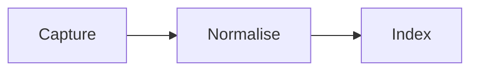
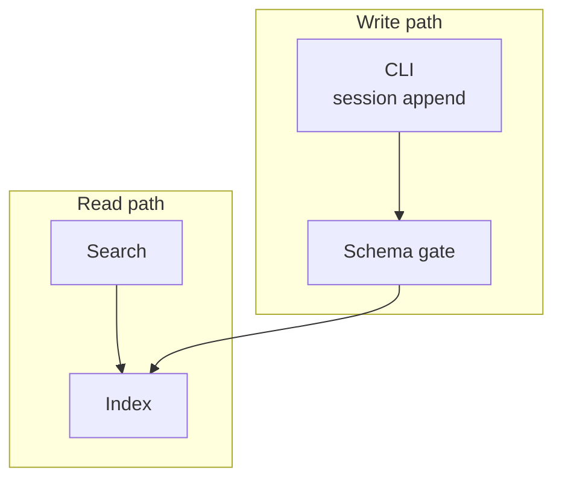
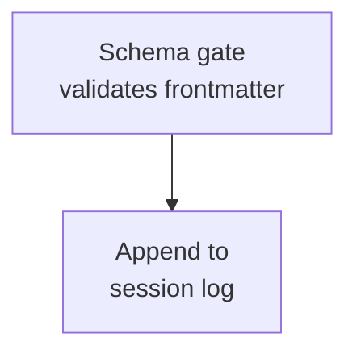
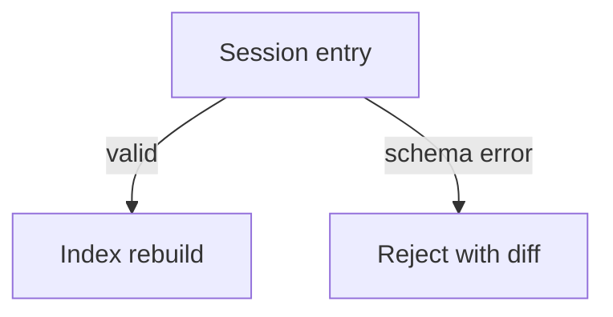
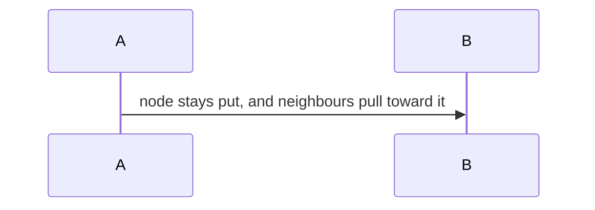
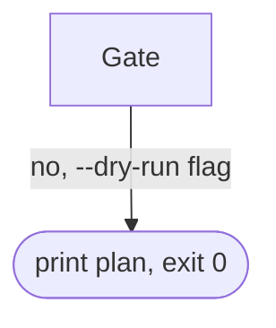

# Compact Mermaid Diagrams Skill

Use this skill after the general diagram rule has already passed: the diagram is genuinely better
than prose because it shows spatial, temporal, dependency, or concurrent structure. Mermaid is the
default. D2 is only a specialist option for dense architecture diagrams when the target renderer is
known to support it.

## Goal

Produce compact, legible Mermaid diagrams that fit normal preview panes without wide horizontal
scrolling, tall isolated baselines, or excessive whitespace.

## Read This First: Sidecars Are Full Mermaid

Diagram sidecars under `.memory-seed/sessions/diagrams/**` are ordinary Markdown. Author them as
**full, standard Mermaid** — the same language you would write in a README. `subgraph` grouping,
every diagram type, styling directives, and the whole arrow vocabulary are all available.

This reverses earlier guidance. Memory Trace used to render sidecars with a hand-written subset
parser, so the skill listed the narrow set of forms that parser understood. Trace now renders
sidecars with Mermaid itself, for a reason that governs the rule: **a sidecar is read in more than
one place.** VS Code renders Mermaid in Markdown preview, GitHub renders it in the browser, and
Trace renders it in the Inspector. A diagram that is correct in the first two must not fail in the
third. The Markdown file is the source of truth and every renderer is a projection over it, so the
language to author in is the standard one, not one tool's dialect.

**One transitional caveat, while it lasts.** Trace still ships a second, older UI at `/` alongside
the current one at `/next`. The older UI keeps the subset parser, so a sidecar using `subgraph` or a
non-`-->` arrow renders correctly in `/next`, VS Code and GitHub, but shows stray boxes in `/`. This
resolves when the older UI retires. Author standard Mermaid regardless — correctness in three
renderers beats accommodating a fourth that is on its way out.

## Choosing A Diagram Type

Mermaid covers around thirty diagram types. Reaching past `flowchart` is usually what makes a
diagram earn its place, because the right type carries structure that a flowchart can only imply.
The ones worth knowing for session and design work:

| Type | Reach for it when |
| --- | --- |
| `flowchart` | Control flow, decisions, dependency and data paths. The default, and the right answer more often than not. |
| `sequenceDiagram` | Ordered interaction between participants over time — request/response, agent handoffs, protocol steps. |
| `stateDiagram-v2` | A thing that occupies one of several states and transitions between them: entry lifecycle, branch status, session phases. |
| `erDiagram` | Entities and their relationships/cardinality — schema and data-model shape. |
| `classDiagram` | Types, fields and their structural relationships in code. |
| `gitGraph` | Branch and merge topology, which is otherwise painful to draw as a flowchart. |
| `timeline` | Events in chronological order when the *when* matters more than the *how*. |
| `gantt` | Scheduled or overlapping work with duration and dependency. |
| `quadrantChart` | Positioning options on two axes — a decision matrix. |
| `mindmap` | Hierarchical breakdown of a concept where edges carry no semantics. |
| `journey` | A user's path through steps, with sentiment per step. |
| `sankey-beta` | Flow volume splitting and merging across stages. |
| `block-beta`, `architecture-beta`, `c4Diagram` | System and deployment structure at varying formality. |
| `pie`, `xychart-beta`, `radar-beta` | Quantities. Prefer a table unless the shape of the data is the point. |

Pick the type that already means what you are drawing. A state machine drawn as a flowchart loses
the fact that the boxes are states; a `stateDiagram-v2` says it in the syntax.

## Diagrams In ADR Sidecars

**A decision recorded as an ADR sidecar should normally carry a diagram.** If a decision was worth
writing down as an architecture decision record, it almost always has a shape — an interaction it
changes, a lifecycle it alters, a topology it rearranges, a boundary it moves. That shape is the
justification, and prose describes it far less efficiently than a diagram does.

Treat "no diagram" as the exception that needs a reason, not the default. Reasonable reasons: the
decision is a single scalar choice (a threshold, a name, a version), or it is a pure policy
statement with no structure to draw. "It would take a while" is not one.

What to draw, in rough order of usefulness:

1. **Before and after.** Two small diagrams, or one with the changed nodes marked. The delta *is*
   the decision, and this is the single most useful ADR diagram.
2. **The mechanism.** The interaction or flow the decision creates, when the decision introduces
   something rather than changing something.
3. **The alternatives.** A `quadrantChart` or a small comparison when the decision was a choice
   between shapes rather than a change to one.

Match the type to the decision: a change to ordering or handoff wants `sequenceDiagram`; a change to
lifecycle or status wants `stateDiagram-v2`; a change to branch handling wants `gitGraph`; a change
to data shape wants `erDiagram`.

## Language Selection

1. Use Mermaid by default for Markdown-native documentation.
2. Choose D2 only when it materially improves readability for dense nested architecture maps,
   service dependency diagrams, module boundaries, or before/after architecture states — and only in
   authored Markdown, never in a sidecar.
3. Do not use D2 for `.memory-seed/sessions/diagrams/YYYY-MM/YYYY-MM-DD.md` sidecars. Sidecar
   guidance is Mermaid-first.
4. If Mermaid and D2 both express the diagram clearly, choose Mermaid.
5. Do not add any diagram when prose, a short list, or a table would be clearer.

## Compaction Techniques

Compactness comes from direction, grouping, label shape, and knowing when to split.

### 1. Choose the direction that matches the shape of the graph

A long chain with little branching reads better left-to-right; a wide fan-out reads better top-down.
This is the biggest single lever and it costs one token.

### 2. Group with `subgraph` when nodes share a tier

Grouping is the most effective compaction tool available: it replaces repeated label prefixes with
one container title, and lets the layout engine pack tiers rather than spreading them.

Give every `subgraph` an explicit quoted title. An untitled one shows its raw id, which is usually
a lowercase token that reads as a mistake.

### 3. Break long labels manually with ` `

` `, ` `, and ` ` all split a label into stacked lines. Two or three lines of two or
three words each is the sweet spot for a wordy node.

### 4. Let edge labels carry conditions

A condition on the edge is usually clearer, and always more compact, than a diamond node followed by
two unlabelled arrows.

### 5. Split one dense diagram into two

Two small diagrams under two headings beat one wide one. When a diagram exceeds roughly a dozen
nodes, or mixes two concerns (a write path and a read path, say), split it — grouping raises that
threshold but does not remove it. Give each half its own fenced block and a one-line caption.

### 6. Keep the node count honest

Prefer the fewest nodes that carry the point. A node that exists only to be passed through — one
edge in, one edge out, no decision — is usually better folded into a neighbour's label.

## Characters That Break The Parser

Two constructs read naturally in English and are parse errors in Mermaid. Both have shipped into
published sidecars, and neither is caught by `links check`, which validates a sidecar's structure but
never parses its Mermaid — a broken block is invisible until someone opens the entry.

**A `;` in sequence-diagram message text.** The semicolon ends the message token; whatever follows is
then read as a new statement and fails. Rewrite with a comma or an em-dash — `#59;` also parses, but
an entity in a sentence is worse to read than the punctuation change.

**A `--` inside a `-- label -->` edge label.** The dashes collide with link syntax, so a label naming
a CLI flag (`--dry-run`) or an em-dash typed as `--` is a lexical error. Either drop to the piped
form, which accepts it, or reword.

A raw newline inside a label parses fine — it is a legibility problem, not a syntax one, and ` `
is still the right fix. Verified against Mermaid 11.16.0.

## Quality Check

Before committing or sharing a diagram:

- The diagram type is the one that already means what you are drawing, not `flowchart` by reflex.
- An ADR sidecar has a diagram, or a stated reason why its decision has no shape.
- Every `subgraph` has an explicit quoted title.
- Long labels are broken with ` ` rather than left to overflow.
- No `;` in sequence-diagram message text, and no `--` inside a `-- label -->` edge label.
- The diagram reads as a rectangle rather than a ribbon or a tower.
- No single node sits alone at the bottom with long vertical strings leading to it.
- The Mermaid block is still semantically fresh; shipped work and roadmap status are not stale.

If a diagram cannot be made legible, that is a signal to split it or to write prose or a table
instead.
