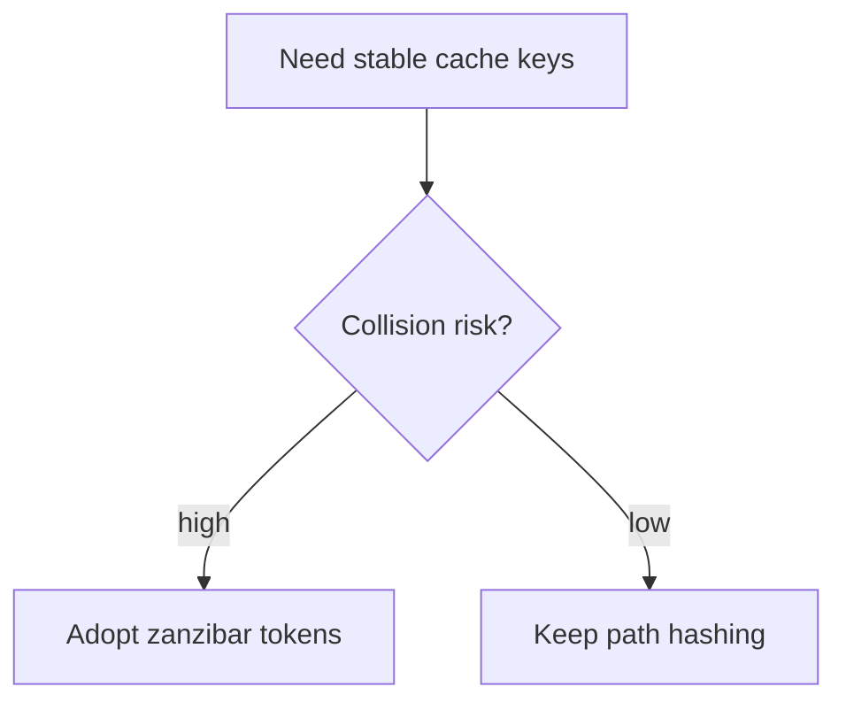

# Session Logging Skill

Use this skill when writing, validating, or repairing Memory Seed session entries.

## Session Log Format

Use dated files under `.memory-seed/sessions/` with file-level frontmatter:

````markdown
---
tags:
  - session-log
  - memory-seed
session_date: 2026-05-02
---

## 2026-05-02 14:35 - Switch cache key to content hash

```yaml
entry_id: mse_0123456789abcdef
user_initials: USER
agent_type: codex
agent_name: null
project_path: .
subproject_path: null
related_entries:
  - ms-db2d715c
```

### Summary

- What changed or what was checked.

### Decision

- D: State the decision that was made or implemented. (mandatory)
- R: Explain the decisive reason in 1-3 bullets. (mandatory)
- A: Alternative considered or rejected, with reason, if it mattered. (optional)
- F: Files, artifacts, or behaviors changed. (optional)
- T: Tests or validation outcome. (optional)
````

`agent_type` is the LLM model or vendor. `agent_name` is the active `.agents/` persona slug, or `null` when no persona is active. `related_entries` is an optional list of related `entry_id` values, legacy `ms-` or current `mse_`, that link this entry to prior entries. It forms the canonical graph edges surfaced by `memory_search` / `memory_get_chunk` and validated by `memory-seed links check`. To fill it, prefer the `memory_link_suggest` MCP tool (or `memory-seed link suggest`), which ranks older candidate entries and returns a paste-ready list instead of guessing. When resolving where to append the entry, `memory_session_target` (or `memory-seed session target`) returns the active target path read-only.

`supersedes` is an optional sibling list of `entry_id` values marking earlier decisions this entry explicitly replaces or deprecates — a typed status edge, kept separate from `related_entries` (relatedness) and never merged with it. Forward-only: reference only entries that already existed when this one was written; `links check` rejects a `supersedes` ref whose target postdates the referencing entry, a self-reference, or a cycle. A superseded entry stays fully retrievable — supersession deprioritizes, never hides. A feature removal with no successor still supersedes the removed feature's decision entries — the removing entry's `D:`/`R:` states that nothing replaces it. The computed inverse (`superseded_by`) is available read-time via `memory-seed link show`, `memory_get_chunk`, and on `memory_search` results; it is never written into any file — `links check` flags a stored `superseded_by:`/`evolved_by:` key as `authored-inverse-field`.

`evolves` is an optional sibling list of `entry_id` values marking earlier decisions this entry extends, refines, or partially replaces **while they remain valid** — a freshness edge, not a retirement. Use the three-way rule: old decision now wrong or dead → `supersedes`; old decision still right but incomplete without this entry → `evolves`; old decision merely context → `related_entries`. Same forward-only guards as `supersedes` (`links check` rejects dangling refs, self-references, postdating targets, and cycles, independently per edge kind). Being evolved never dampens the target's `importance_score` and never feeds `exclude_superseded`. The computed inverse (`evolved_by`) is read-time only — never hand-write it.

`continuity` is an optional list of artifact-lineage items recording that this entry's work renamed, migrated, or removed an artifact — a name-level record (file path, directory, command, or product/concept term), distinct from the entry-level edges above. Each item is `kind: rename|migration|removal` with `from:` (always required) and `to:` (required for rename/migration, forbidden for removal). Values are historical labels like `branch:` — never validated against the live tree, because the old artifact is expected to be gone. Recorded mappings let `link suggest` bridge file-overlap ranking across renames (transitively), so record both the old and new names at the moment of the change:

```yaml
continuity:
  - kind: rename
    from: memory_seed/lense.py
    to: memory_trace/lense.py
  - kind: removal
    from: memory-seed lense command
```

`commits` is an optional list of full 40-character commit SHAs implementing this entry's decision. Backfill it only on the current/newest entry, in the same turn the commit lands — once a later entry exists, adding `commits:` becomes a historical edit requiring explicit user-requested correction. The commit side of the link is the `Memory-Entry: <entry_id>` message trailer (see Working Principles), which needs no backfill window; `memory-seed link commits <entry_id>` reads both sources. `links check` rejects short or malformed hashes always, and unknown hashes when a `.git` repository is present.

`branch` is an optional single scalar naming the git branch this entry's work happened on, captured at record time: read the current branch (`git rev-parse --abbrev-ref HEAD`) when writing a solo entry; for orchestrated multi-agent work the orchestrator backfills it from the Task Packet's `working_branch` when writing the Final Handoff Gate entry. It is a durable historical label like a commit SHA — forward-only, never backfilled onto older entries, and omitted entirely when unavailable (detached HEAD, no repository, or an agent that chooses not to record it). `links check` never checks that the branch still exists: feature branches are routinely deleted after merge, so a vanished branch is expected history, not an integrity error. There is deliberately **no `worktree:` field** — a worktree is an ephemeral, machine-specific local path with no evolution semantics; when that operational detail matters it belongs in the multi-agent handoff record, not the durable entry schema.

Keep new session files in month-grouped folders, such as `.memory-seed/sessions/2026-05/2026-05-02.md`. Generate `entry_id` as a deterministic 80-bit `mse_` ID from metadata only: timestamp, title, user initials, agent type, project path, and subproject path. Legacy `ms-` IDs remain valid and must not be rewritten.

## Decision Diagram Sidecars

When an entry's durable decision logic is genuinely **spatial, temporal, or concurrent** - branching alternatives that were weighed, a sequence across components, a topology - create a Mermaid diagram in a **sidecar file** unless the diagram would add no structure beyond prose. This is still a high bar for routine entries, but branch/worktree/merge topology, old-to-new layout migrations, schema or compatibility flows, multi-agent concurrency, command lifecycle flows, and retrieval/data pipelines are positive triggers for a sidecar.

- Location: `.memory-seed/sessions/diagrams/YYYY-MM/YYYY-MM-DD.md` — **one file per date**, mirroring the month-grouped session-log convention, so a human browsing the filesystem without the Explorer can find a day's diagrams next to that day's session log. Existing legacy sidecars under `.memory-seed/sessions/diagrams/YYYY-MM-DD.md` remain readable.
- File shape: append a heading block shaped exactly like a session entry — `## <timestamp> - <title>`, followed by a fenced ` ```yaml ` block naming `entry_id:` (required — the single link to the entry it accompanies), followed by one or more fenced ` ```mermaid ` blocks. Multiple diagrams logged the same day append to the same date file, in ascending time order, exactly like session logs.
- Match the heading timestamp to the entry's own heading timestamp when practical — it's a human convenience for eyeballing the session log and the diagrams file side by side, not a required key (`entry_id` is the only thing validated).
- Never inline diagrams in the session entry itself — the prose log stays clean, diffable, and append-only. The sidecar is the diagram's home; readers and the Explorer UI render it beside the entry.
- Sidecars are frozen point-in-time records of the decision **as made**; do not edit them when later decisions supersede the entry (supersession is visible through the live graph, not by rewriting the diagram).
- Same high bar as the Mermaid Working Principle: prose is the default for ordinary entries; never add a sidecar just for coverage. When a positive trigger above is present and no sidecar is written, state the reason briefly under `A:` or `Follow-up`.
- `links check` validates sidecars: `malformed-diagram` (filename isn't a valid `YYYY-MM-DD.md` date, no heading+yaml block found, missing `entry_id`, no ```mermaid block, or unbalanced fence), `orphan-diagram` (`entry_id` resolves to no known entry), `diagram-date-mismatch` (the entry's actual session date differs from the diagrams filename date).

Example sidecar (`.memory-seed/sessions/diagrams/2026-07/2026-07-05.md`):

````markdown
---
tags:
  - session-log-diagrams
diagram_date: 2026-07-05
---

## 2026-07-05 13:10 - Cache key decision flow

```yaml
entry_id: mse_0123456789abcdef
```


````

## Local Identity and Session Layout

Two related but separate mechanisms:

- **Identity** (`.memory-seed/local.yaml`, gitignored): the active local user, set via `memory-seed user set <slug>`. Once configured, `user_initials` in new entries should reflect that user, resolved against `.memory-seed/project.yaml`'s `participants:` registry (`slug` / `initials` / `display_name`).
- **Layout** (flat vs. per-user file): purely a function of how many participants are registered, not whether identity is configured. `session_target()` writes shared flat logs to `.memory-seed/sessions/YYYY-MM/YYYY-MM-DD.md`. It only switches to `.memory-seed/sessions/YYYY-MM/YYYY-MM-DD/<user>.md` once `participants:` lists 2 or more entries; with 0 or 1, it stays on the shared flat month-grouped file regardless of a configured user. Per-user files exist to avoid concurrent-author merge conflicts, which isn't a concern until there is a second author to conflict with. An explicit `--user <slug>` CLI override bypasses this gate (a deliberate one-shot choice).

Practical effect: configuring identity alone never fragments an existing single-author project's log. Only registering a second `participants:` entry does — at that point `memory-seed migrate sessions-layout` can split existing flat history if wanted. Historical flat/day files remain readable; use `memory-seed migrate sessions-month-layout` when you explicitly want to reorganize old files into month folders.

**No local identity configured?** The SessionStart hook offers once, then never repeats regardless of whether the offer was accepted (tracked by a gitignored `.memory-seed/.identity-offer-stamp` file, written on first offer). This is optional and skippable — most projects are solo and don't need it. If offered, ask the user for a preferred slug/initials/display name, then run `memory-seed user set <slug>` and add a matching `participants:` entry.

**Consistency check:** `memory-seed doctor` warns (non-fatal) when a configured local user's slug has no matching `participants:` entry — that leaves `user_initials` unresolvable for multi-user tooling (`migrate sessions-layout`, `links check`) even though `session_target()` still works.

## Append-Only Chronology

The session file is strictly append-only and must stay in ascending time order.

- Append every new entry to the end of the day's file. Never insert an entry above an existing one.
- Append each entry at the physical end of the file; never insert above an existing entry.
- The entry heading timestamp is the actual current clock time at the moment you write it.
- Never reuse a time from context, memory, or an earlier message.
- Never backdate an entry to when the work happened.
- If recording work completed earlier, still stamp the heading with the current time and describe the original timing in the entry body if it matters.

## Reason Rules

DRAFT is the baseline decision-record format for session entries. A DRAFT decision record is the default whenever a turn produced a decision or durable change.

- D = Decision
- R = Reason
- A = Alternatives considered or rejected
- F = Files, artifacts, or behaviors changed
- T = Tests or validation

`D` and `R` are required for every meaningful decision. `A`, `F`, and `T` are optional when not relevant.

- Do not invent reason.
- If reason is inferred, label it `Inferred reason`.
- If reason is unknown, write `Reason not recorded`.
- Alternatives are optional unless they affected the decision or tradeoff.
- If an approach was **attempted and failed** or proved incompatible during the session, log it under `A` even when not explicitly asked to — this is empirical evidence for future sessions, not an optional nicety. State what was tried and why it failed in one line; that's enough for a future agent to skip it without re-deriving the failure.
- Use `D1`, `D2`, and similar labels only inside a multi-decision entry.
- Do not rewrite old logs solely to match the newest schema unless the user explicitly asks.

## Decision Harvest

Before choosing the entry shape, harvest the durable decisions made this turn.

1. List the accepted choices that changed project behavior, user workflow, file layout, schema,
   migration behavior, policy, skill behavior, agent coordination, release behavior, or architecture.
2. Count rejected alternatives, failed attempts, and compatibility constraints separately; they belong
   under `A:` unless they became their own accepted decision.
3. If exactly one durable choice remains, use the single-decision shape.
4. If two or more durable choices belong to one coherent task, use the multi-decision shape with
   `D1`, `D2`, and so on. Do not bury accepted decisions as rationale, implementation detail, or
   alternatives under one broad `D:`.
5. If durable choices affect unrelated subsystems, write separate entries instead of one
   over-compressed multi-decision entry.
6. If a single-decision entry is still used after considering multiple candidate decisions, make the
   consolidation explicit in `R:` or `A:` so future readers know why the choices were treated as one.
7. Ask: does any harvested decision **replace, remove, or evolve** an earlier entry's decision?
   Replace or remove → `supersedes`; extend-while-still-valid → `evolves`; merely related →
   `related_entries` only. `memory_link_suggest` surfaces candidates with shared-file evidence to
   make this concrete.
8. Ask: did this turn **rename, relocate, or remove any artifact** (file, directory, command,
   concept/product name)? If so, record a `continuity:` block with the old and new names — that
   mapping is what keeps file-overlap ranking and traceability working across the change.

`F` fields should support later lexical search. Prefer exact changed file paths and filenames as
standalone tokens, backtick-quoted and repo-relative (backtick-quoted path tokens are what
machine extraction reads for file-overlap ranking). Avoid ellipses (`...`), brace groups
(`{app.js,styles.css}`), or folder-only shorthand when specific files matter; use prose grouping
only after the exact paths are present.

## Entry Shapes

### Meaningful decision entry

Use for one durable decision.

```markdown
### Summary

- Summarize the coherent task.

### Decision

- D: State the decision. (mandatory)
- R: Explain the decisive reason in 1-3 bullets. (mandatory)
- A: Alternative considered or rejected, with reason, if it mattered. (optional)
- F: Files, artifacts, or behaviors changed. (optional)
- T: Tests or validation outcome. (optional)
```

### Small work entry

Use for routine edits, small fixes, or verification-only work with no real decision. Do not invent reason.

```markdown
### Summary

- What changed or what was checked.

### Validation

- Command or check and outcome, if relevant.

### Follow-up

- Only include if there is residual risk or a next action.
```

### Multi-decision session entry

Use one entry when several decisions belong to one coherent task, plan, or user goal. Split entries when decisions affect unrelated subsystems, sub-projects, or goals.

```markdown
### Summary

- Summarize the coherent task.

### Decisions

#### D1 - Short decision name

- D: State the choice. (mandatory)
- R: Explain the decisive reason in 1-3 bullets. (mandatory)
- A: Alternative considered or rejected, with reason, if it mattered. (optional)
- F: Files, artifacts, or behaviors changed. (optional)
- T: Tests or validation outcome. (optional)

#### D2 - Short decision name

- D: State the choice. (mandatory)
- R: Explain the decisive reason in 1-3 bullets. (mandatory)

### Implementation

- Summarize changed behavior, not every file.

### Validation

- Commands or checks and outcomes, not full output.

### Follow-up

- Residual risks or next actions.
```
