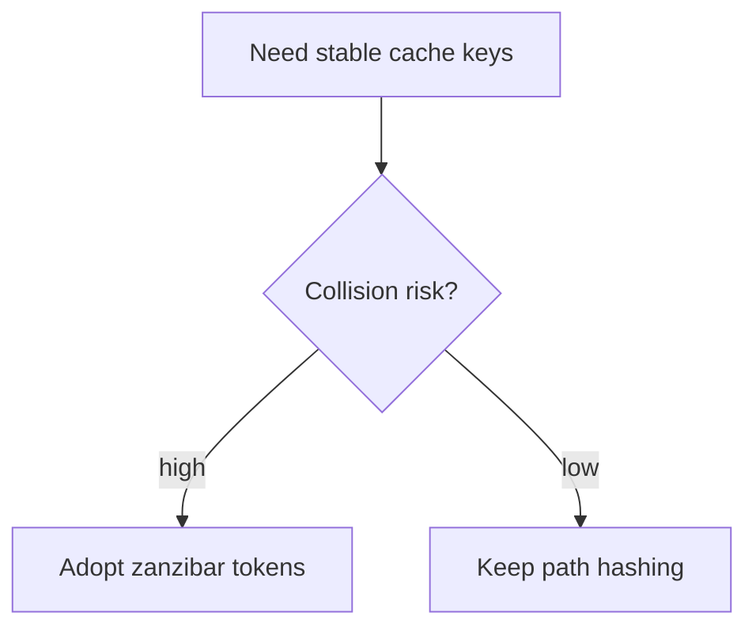

# Session Logging Skill

Use this skill when writing, validating, or repairing Memory Seed session entries.

## Session Log Format

Use dated files under `.memory-seed/sessions/` with file-level frontmatter:

````markdown
---
tags:
  - session-log
  - memory-seed
session_date: 2026-05-02
---

## 2026-05-02 14:35 - Switch cache key to content hash

```yaml
entry_id: mse_0123456789abcdef
user_initials: USER
agent_type: codex
project_path: .
subproject_path: null
related_entries:
  - ms-db2d715c
```

### Summary

- Required for every newly appended entry: state the context, change, or check.

### Records

#### D1 - Decision: State the decision

- D: State the decision that was made or implemented. (mandatory)
  - Scope: Name the behavior, artifact, or boundary this record covers. (mandatory)
  - Disposition: State its outcome, such as accepted, rejected, deferred, or implemented. (mandatory for decisions)
- R: Explain the decisive reason in 1-3 bullets. (mandatory)
- A: Alternative considered or rejected, with reason, if it mattered. (optional)
- F: Files, artifacts, or behaviors changed. (optional)
- T: Tests or validation outcome. (optional)
- S: Source proposal, specification, research, or evidence artifact, when one materially informed the decision. Use one backtick-quoted repo-relative path per line. (conditionally required)
````

`agent_type` is the LLM model or vendor. `related_entries` is an optional list of related `entry_id` values, legacy `ms-` or current `mse_`, that link this entry to prior entries. It forms the canonical graph edges surfaced by `memory_search` / `memory_get_chunk` and validated by `memory-seed links check`. To fill it, prefer the `memory_link_suggest` MCP tool (or `memory-seed link suggest`), which ranks older candidate entries and returns a paste-ready list instead of guessing. To append the entry, use `memory_session_append` (or `memory-seed session append`); a `dry_run` returns the resolved target path, the canonical `entry_id`, and `rendered` — the exact block a real call would append — without writing; when committing after a preview, echo the returned `timestamp` into the real call so a minute tick cannot change the id.

`replaces` is an optional sibling list of `entry_id` values marking earlier decisions this entry explicitly replaces or deprecates — a typed status edge, kept separate from `related_entries` (relatedness) and never merged with it. Forward-only: reference only entries that already existed when this one was written; `links check` rejects a `replaces` ref whose target postdates the referencing entry, a self-reference, or a cycle. A replaced entry stays fully retrievable — supersession deprioritizes, never hides. A feature removal with no successor still replaces the removed feature's decision entries — the removing entry's `D:`/`R:` states that nothing replaces it. The computed inverse (`replaced_by`) is available read-time via `memory-seed link show`, `memory_get_chunk`, and on `memory_search` results; it is never written into any file — `links check` flags a stored `replaced_by:`/`evolved_by:` key as `authored-inverse-field`. Legacy corpora may still spell this field `supersedes:` (renamed 2026-07-24); every reader and validator accepts both, and new entries must write `replaces:`.

`evolves` is an optional sibling list of `entry_id` values marking earlier decisions this entry extends, refines, or partially replaces **while they remain valid** — a freshness edge, not a retirement. Use the three-way rule: old decision now wrong or dead → `replaces`; old decision still right but incomplete without this entry → `evolves`; old decision merely context → `related_entries`. Same forward-only guards as `replaces` (`links check` rejects dangling refs, self-references, postdating targets, and cycles, independently per edge kind). Being evolved never dampens the target's `importance_score` and never feeds `exclude_replaced`. The computed inverse (`evolved_by`) is read-time only — never hand-write it.

**Applying the three-way rule — the patterns that decide it** (measured against 68 validated corrections, 2026-07-24): an entry that *implements what an earlier entry proposed, scoped, or drafted* **evolves** it (the proposal stays valid as rationale) — this is the single most under-declared shape; an entry that *completes a design call an earlier entry explicitly deferred* (an evaluation, a selection, a scoping) **evolves** the deferring entry; an *explicit rewrite* of an earlier decision **replaces** it. Two shapes that are NOT lifecycle edges: an entry whose decision is to merge/land/integrate/publish existing work does not evolve the work it lands, and parallel steps of one campaign (audits of different files, batches of one sweep) are `related` at most. When in doubt between related and evolves, ask whether the newer entry changes or completes the older *decision itself* — not merely follows it in time.

**Record-level refs at write time — MANDATED** (grammar v2, JNL 2026-07-24): `entry_id:dN` addresses the numbered record, whether its kind is Decision or Documentation. Every `replaces:`/`evolves:` item names a Decision record on **both ends, but only when there is a choice to make**; Documentation records may participate only in `related_entries` and cannot own lifecycle-authority edges. Target side: an entry with **2+ records must** carry `:dN` (several are comma-separated, `- mse_x:d1,d4`, one edge per ordinal); a **single- or no-record target stays a bare id** — its `:d1` and its bare id denote the same edge, so bare is canonical and `:d1` on a single-record target is *rejected* as redundant. Source side, symmetrically: when the writing entry has 2+ records, prefix each item with the authoring record as `- d2 -> mse_x:d1,d4`; a single-record writer omits the prefix (implicit `d1`). `session append`/`memory_session_append` refuse a ref that leaves a multi-record end unnamed, over-specifies a single-record end, names a nonexistent ordinal, or gives a Documentation record `replaces`/`evolves`. The same arrow grammar applies in link-sidecar blocks. **`related_entries` may carry `:dN`, but precision remains optional**: a related ref to a multi-record target may name the record (`related_entries: - mse_x:d2`, or `- d1 -> mse_x:d2`), while a bare related ref remains valid. Trace shows the record type and routes precise related edges to the addressed row.

`continuity` is an optional list of artifact-lineage items recording that this entry's work renamed, migrated, or removed an artifact — a name-level record (file path, directory, command, or product/concept term), distinct from the entry-level edges above. Each item is `kind: rename|migration|removal` with `from:` (always required) and `to:` (required for rename/migration, forbidden for removal). Values are historical labels like `branch:` — never validated against the live tree, because the old artifact is expected to be gone. Recorded mappings let `link suggest` bridge file-overlap ranking across renames (transitively), so record both the old and new names at the moment of the change:

```yaml
continuity:
  - kind: rename
    from: memory_seed/lense.py
    to: memory_trace/lense.py
  - kind: removal
    from: memory-seed lense command
```

`commits` is an optional list of full 40-character commit SHAs implementing this entry's decision. Backfill it only on the current/newest entry, in the same turn the commit lands — once a later entry exists, adding `commits:` becomes a historical edit requiring explicit user-requested correction. The commit side of the link is the `Memory-Entry: <entry_id>` message trailer (see Working Principles), which needs no backfill window; `memory-seed link commits <entry_id>` reads both sources. Ordinary commits get their `Memory-Entry:` trailers stamped automatically by the seeded `prepare-commit-msg` git hook (one per staged appended entry, deduplicated; `memory-seed hooks install` if not installed), and `session merge-branch` stamps them for every entry its fuse imports — hand-write a trailer only to link a commit to a motivating entry its diff does not contain. `links check` rejects short or malformed hashes always, and unknown hashes when a `.git` repository is present.

`topics` is an optional list of 1-3 controlled-vocabulary slugs from `.memory-seed/topics.yaml` marking which durable project themes this entry belongs to — deterministic neighbourhood membership, distinct from `related_entries` (relationship) and from hashtag `tags`/heading `contexts` (derived display fallbacks for old entries). **Read the topic index before writing; prefer an existing canonical slug (aliases also resolve) over inventing a new one** — invented slugs are exactly the sprawl `memory-seed topics check` exists to catch (unknown slugs are errors; more than 3 topics is a warning). A slug matches `^[a-z0-9][a-z0-9_-]{0,63}$`. When a genuinely new durable theme emerges, add it to `topics.yaml` (project-local, never overwritten by `update`) in the same turn. `memory_search` accepts a `topics` filter that resolves aliases both ways.

**Two axes, one of each.** In `schema_version: 3`, `topics:` branches first into **`area`** (WHAT you are working on) and **`activity`** (what KIND of work it was); each slug is a mapping key under one of those branches. Answer both questions: name where the work was *and* what the work was. Two slugs is the target and three the ceiling, so two activities and no area spends your budget recording that you were busy without recording what you were busy on. Neither word assumes software — a newsletter, a legal matter and a code repository all have areas and activities — and the axis is deliberately **not** called a "subsystem", which does not travel outside a codebase. The field stays `topics:` on every axis. Schema v1/v2 vocabularies remain readable for existing projects.

**Prefer the most specific slug that fits.** A slug may contain a `children:` mapping, forming a hierarchy within its axis; each child is another slug mapping and may have children of its own. Store only the child: its parent and axis are derived from tree position at read time, so the parent costs none of your 1-3 budget, filters on it still match you, and the specificity you recorded survives. This is the opposite of an `alias:`, which is a spelling variant and is discarded on resolution. Depth is earned — a slug takes children once it is carrying too much of its scope to distinguish anything, not because a tree looks tidy.

`branch` is an optional single scalar naming the git branch this entry's work happened on, captured at record time: read the current branch (`git rev-parse --abbrev-ref HEAD`) when writing a solo entry; for orchestrated multi-agent work the orchestrator backfills it from the Task Packet's `working_branch` when writing the Final Handoff Gate entry. It is a durable historical label like a commit SHA — forward-only, never backfilled onto older entries, and omitted entirely when unavailable (detached HEAD, no repository, or an agent that chooses not to record it). `links check` never checks that the branch still exists: feature branches are routinely deleted after merge, so a vanished branch is expected history, not an integrity error. There is deliberately **no `worktree:` field** — a worktree is an ephemeral, machine-specific local path with no evolution semantics; when that operational detail matters it belongs in the multi-agent handoff record, not the durable entry schema.

**Shared working trees: pass `--branch` yourself.** Auto-capture reads the HEAD of the working tree that owns the memory dir, and a session's own branch is never passed to the CLI — so when two or more sessions share **one** working tree their HEAD is genuinely identical and nothing can tell them apart. Auto-capture then records whichever branch happens to be checked out at write time, which may be the other session's. The answer is policy, not code: pass **`--branch <name>`** whenever several sessions may share a working tree, or **`--no-branch`** to omit the field rather than stamp a value you cannot vouch for — `branch:` is append-only history, so a wrong label is worse than none. An agent in its own worktree needs neither flag: a worktree that checks out its own `.memory-seed` resolves to its own HEAD, and auto-capture is correct there. When the memory dir belongs to a *different* working tree than the caller — `.memory-seed` untracked so the walk-up lands on the primary checkout, or a submodule caller under a superproject's memory dir — the tool omits `branch:` on its own, because neither HEAD is the truth in that layout. **Standing convention:** a multi-agent harness passes `--branch` unconditionally rather than relying on auto-capture; see "Branch And Worktree Defaults" in `agent_collaboration.md`.

In a final handoff, record the artifact produced by the project mode (local `session merge-branch` from the integration/base checkout, or task-branch `session open-pr`/`session integrate` for `pr` mode). A Task Packet's `integration_artifact` remains the per-task override; a declared `pr` mode authorizes only its normal non-force push and PR, while local-merge never pushes.

Keep new session files in month-grouped folders, such as `.memory-seed/sessions/2026-05/2026-05-02.md`. **Append entries with the scaffolder, not by hand**:
`memory-seed session append --title "<title>" --user-initials <XX> --agent-type <agent> --decisions-file <d.json> --body-file <f>` (or body on stdin).

**Use `--decisions-file`. The name is retained as a compatibility envelope, but it carries one object per body record.** Each object owns its Area + Activity topics, `related_entries`, and origin metadata; Decision records may additionally own `replaces`/`evolves`, while Documentation records may not. Example: `[{"decision": "d1", "origin": "agent", "topics": {"area": "lifecycle-edges", "activity": "bugfix"}, "links": {"evolves": [{"ref": "mse_x:d2", "type": "refines", "why": "supersedes the sampling rule it drafted"}]}}]`. At the MCP authoring boundary, **`origin` is required** and is exactly `user` (a direct user instruction, answer, or correction) or `agent` (a record discovered through implementation, investigation, testing, or review). The writer records supplied values under the compatibility metadata name `decision_origins:`. Older entries without that field remain valid; when the field is present, `links check` requires it to cover every body record exactly once.

A lifecycle link item is an object, not a bare id:

- **`why` is required on `replaces` and `evolves`** — one line of evidence for the edge. You know it exactly once, now; append-only makes the omission permanent. `related_entries` needs none and stays casual.
- **`type` is required on `evolves`** — `refines` (the next form of that decision) or `builds-on` (later work resting on it, which stays valid). A decision has **at most one `refines` successor**; `builds-on` is unlimited. That cap is what keeps a lineage walkable as a line instead of fanning to 25 terminal heads. `session append` refuses a second `refines`, and `links check` raises `multiple-refines-successors` across the corpus, since two branches can each author one without either being refused. Fix a conflict with `retracts:` — downgrade the loser to `builds-on` in a new block, never by editing the published one.

`--topics`/`--related`/`--replaces`/`--evolves` are **refused** as of 2026-08-09: they attribute at ENTRY level only, so every decision in a multi-decision entry inherited one shared list and none owned its own, and they have nowhere to put the evidence or the evolution type. That was measurably what happened when they were used — decision-keyed attribution across this corpus fell from 92% in July to 8% in August while coverage stayed at 100%. Governed by `adr_lifecycle_edges_live_in_sidecars`.
The tool owns structure — target resolution, the heading timestamp (now, refusing to append out of chronological order; a conflict is fixed consciously via `--timestamp` or `session reorder`, never silently), the canonical `entry_id`, YAML shape, ref validation (fabricated or forward-pointing ids are refused), topic vocabulary (aliases stored as canonical), and branch auto-capture. You own voice — title, record kind, lifecycle classification, and the D/Scope/Disposition/R/A/F/T/S body, passed through verbatim.

When a lifecycle link touches any current or historical ADR member, both CLI `session append` and MCP `memory_session_append` run the same content-bound review preflight: the first call returns the full matched ADR contexts plus a receipt and writes zero bytes. Put one `adrs` outcome (`revise` or `no-change`) per matched ADR into the owning decision object, then retry MCP with `adr_review_receipt` or CLI with `--adr-review-receipt`. When a review confirms the current ADR without warranting a new session decision, use `memory-seed adr reviewed --adr-id <id> --entry <existing-entry-id> --reason <text>` or its parity twin `memory_adr_reviewed`; both require real entry provenance and move no head.

`entry_id` is a deterministic 80-bit `mse_` ID from metadata only: timestamp, title, user initials, agent type, project path, and subproject path. The normal path is `memory_session_append` (or `memory-seed session append`), which mints the id and writes the entry through the guards. If you must assemble the entry text yourself, **never invent the id by hand** — take the canonical id (and the `rendered` block to copy verbatim) from a `memory_session_append` `dry_run`, or the id alone from `memory-seed session entry-id`. Hand-rolled ids are unique-but-arbitrary: not reproducible from the entry's metadata, and they drift outside the canonical Crockford alphabet (the corpus carries both shapes for exactly this reason; integrity checks tolerate them, but new entries must not add more). Compute the id AFTER fixing the title — title and timestamp are hash inputs — and **never author the timestamp yourself**: omit `timestamp` so the tool stamps from the machine clock and returns the value; write the returned timestamp into the heading verbatim. Estimated/authored times drifted hours from reality in practice (caught 2026-07-18); an explicit timestamp is for sanctioned backfill only and earns a `clock_drift_warning` when far from the server clock. Legacy `ms-` IDs and existing hand-rolled ids remain valid and must not be rewritten.

## Decision Diagram Sidecars

**An ADR earns a diagram when a decision is attached to it** (JNL, 2026-08-07) - **one answer per ADR, not one per attached decision** (JNL, 2026-08-07). The block keys on `adr_id` and is filed under the head's session date, so attaching eleven decisions to one concern owes one answer about that concern's shape, not eleven. Attachment is already a deliberate, recorded, human-gated act meaning *this decision governs a standing concern* — which predicts "worth drawing" far better than a judgement made in the moment of writing, and unlike that judgement it is mechanically determinable, so the obligation can be checked. The obligation is **to answer, not to draw**: supply a diagram, or record `diagram_status: not_applicable` with the reason there is no shape. That answer is a REVIEW TICK, and **evolution clears it** — because the answer is filed under the ADR's authoritative-decision date, an ADR that later moves onto a new decision no longer matches, and `links check` raises `needs-diagram-review` asking for another look. It is a warning, never an error: nothing mandates that an ADR carry a diagram, so a project that has not adopted the convention can never fail on it. `links check` validates both; ESR reports ADRs carrying no answer.

**The per-entry trigger list is RETIRED** (JNL, 2026-08-07). It formerly named branch/worktree/merge topology, layout migrations, schema or compatibility flows, multi-agent concurrency, command lifecycle flows and retrieval/data pipelines as positive triggers, and asked the author to judge each entry against them. It had no teeth and degraded measurably: 0% of entries carried a diagram across May–June, 6.8% in July, 2.3% in August. A keyword heuristic to enforce it was prototyped against the real corpus, flagged 35% of all entries, and was rejected — a check firing on one entry in three teaches its reader to skip it. A rule nobody follows is worse than no rule.

Those shapes remain good guidance for **what to draw** once a diagram is owed; they are no longer a rule about **when** one is owed. An ordinary entry may still carry a diagram whenever it genuinely helps — nothing below changes for one that does.

- Location: `.memory-seed/sessions/diagrams/YYYY-MM/YYYY-MM-DD.md` — **one file per date**, mirroring the month-grouped session-log convention, so a human browsing the filesystem without the Explorer can find a day's diagrams next to that day's session log. Existing legacy sidecars under `.memory-seed/sessions/diagrams/YYYY-MM-DD.md` remain readable.
- File shape: append a heading block shaped exactly like a session entry — `## <timestamp> - <title>`, followed by a fenced ` ```yaml ` block naming `entry_id:` (required — the single link to the entry it accompanies), followed by one or more fenced ` ```mermaid ` blocks. Multiple diagrams logged the same day append to the same date file, in ascending time order, exactly like session logs.
- **ADR diagrams key on `adr_id:` instead of `entry_id:`**, in the same file family and grammar. They additionally carry `grounded_in:` — the decision refs whose shape the diagram draws, validated for entry and ordinal existence, so a diagram cannot claim to draw decisions that do not exist. An ADR with nothing structural to draw takes `diagram_status: not_applicable` plus a `note:` saying why; such a block carries no Mermaid, and carrying both is a contradiction `links check` rejects. File an ADR diagram under the **session date of the ADR's current authoritative decision**, so it sits beside its ground truth — when the head later moves to a newer decision the file date stops matching, which is the signal that the picture predates the decision it claims to show. An ADR still at a `founding:` placeholder has no such date and falls back to the day the block was drawn.
- Match the heading timestamp to the entry's own heading timestamp when practical — it's a human convenience for eyeballing the session log and the diagrams file side by side, not a required key (`entry_id` is the only thing validated).
- Never inline diagrams in the session entry itself — the prose log stays clean, diffable, and append-only. The sidecar is the diagram's home; readers and the Explorer UI render it beside the entry.
- Sidecars are frozen point-in-time records of the decision **as made**; do not edit them when later decisions replace the entry (supersession is visible through the live graph, not by rewriting the diagram). **One narrow exception (Constitution 1.4):** a published *diagram* sidecar whose Mermaid fails to parse — so it never rendered as made — may be repaired in place, as a one-off the maintainer approves against a diff, changing only the content inside ` ```mermaid ` fences (heading, `entry_id`, diagram count, and the entry's prose all unchanged) and only ever turning an unrenderable diagram into a rendering one. This is not a licence to revise a diagram that already renders — that is a replacing entry. It does not extend to link sidecars, which own authoritative lifecycle edges.
- Same high bar as the Mermaid Working Principle: prose is the default for ordinary entries; never add a sidecar just for coverage. That bar is why the obligation is to ANSWER rather than to draw — `diagram_status: not_applicable` with a reason is a real answer, and a better one than a diagram drawn to satisfy a rule.
- `links check` validates sidecars: `malformed-diagram` (filename isn't a valid `YYYY-MM-DD.md` date, no heading+yaml block found, missing `entry_id`, no ```mermaid block, or unbalanced fence), `orphan-diagram` (`entry_id` resolves to no known entry), `diagram-date-mismatch` (the entry's actual session date differs from the diagrams filename date).

Example sidecar (`.memory-seed/sessions/diagrams/2026-07/2026-07-05.md`):

````markdown
---
tags:
  - session-log-diagrams
diagram_date: 2026-07-05
---

## 2026-07-05 13:10 - Cache key decision flow

```yaml
entry_id: mse_0123456789abcdef
```


```mermaid
flowchart TD
  A[Need stable cache keys] --> B{Collision risk?}
  B -- high --> C[Adopt zanzibar tokens]
  B -- low --> D[Keep path hashing]
```
````

## Local Identity and Session Layout

Two related but separate mechanisms:

- **Identity** (`.memory-seed/local.yaml`, gitignored): the active local user, set via `memory-seed user set <slug>`. Once configured, `user_initials` in new entries should reflect that user, resolved against `.memory-seed/project.yaml`'s `participants:` registry (`slug` / `initials` / `display_name`).
- **Layout** (flat vs. per-user file): purely a function of how many participants are registered, not whether identity is configured. `session_target()` writes shared flat logs to `.memory-seed/sessions/YYYY-MM/YYYY-MM-DD.md`. It only switches to `.memory-seed/sessions/YYYY-MM/YYYY-MM-DD/<user>.md` once `participants:` lists 2 or more entries; with 0 or 1, it stays on the shared flat month-grouped file regardless of a configured user. Per-user files exist to avoid concurrent-author merge conflicts, which isn't a concern until there is a second author to conflict with. An explicit `--user <slug>` CLI override bypasses this gate (a deliberate one-shot choice).

Practical effect: configuring identity alone never fragments an existing single-author project's log. Only registering a second `participants:` entry does — at that point `memory-seed migrate sessions-layout` can split existing flat history if wanted. Historical flat/day files remain readable; use `memory-seed migrate sessions-month-layout` when you explicitly want to reorganize old files into month folders.

**No local identity configured?** The SessionStart hook offers once, then never repeats regardless of whether the offer was accepted (tracked by a gitignored `.memory-seed/.identity-offer-stamp` file, written on first offer). This is optional and skippable — most projects are solo and don't need it. If offered, ask the user for a preferred slug/initials/display name, then run `memory-seed user set <slug>` and add a matching `participants:` entry.

**Consistency check:** `memory-seed doctor` warns (non-fatal) when a configured local user's slug has no matching `participants:` entry — that leaves `user_initials` unresolvable for multi-user tooling (`migrate sessions-layout`, `links check`) even though `session_target()` still works.

## Append-Only Chronology

The session file is strictly append-only and must stay in ascending time order.

- Append every new entry to the end of the day's file. Never insert an entry above an existing one.
- Append each entry at the physical end of the file; never insert above an existing entry.
- The entry heading timestamp is the actual current clock time at the moment you write it.
- Never reuse a time from context, memory, or an earlier message.
- Never backdate an entry to when the work happened.
- If recording work completed earlier, still stamp the heading with the current time and describe the original timing in the entry body if it matters.
- Read the real wall clock before stamping — authored times are inputs and nothing validates them at write time. `links check` warns (`entry-future-timestamp`) when a heading is more than ~10 minutes ahead of the clock at check time. It is a warning, never an error: published drifted stamps stay as they are (append-only); restamp only entries that are still unpublished.

## Record And Reason Rules

DRAFTS is the baseline record format for session entries. Its `D` means **Decision or Documentation record**. Use a Decision record for a choice with authority or future-governing effect; use a Documentation record for small work, verification, observations, and supporting notes that should remain searchable without pretending they govern later work. Historical `### Decision`/`### Decisions` records and DRAFT records without `S:` remain valid decisions and are never rewritten merely to adopt the newer shape.

Write DRAFTS records with **simple technical precision**: be concise but precise, use plain language by
default, and define a necessary technical term when its meaning may not be shared. Preserve the constraints,
reasoning, uncertainty, and distinctions needed to understand or challenge the decision; brevity must never
erase meaning. Remove repetition, ornamental jargon, and implementation detail that does not explain the
decision or its validation.

- D = Decision or Documentation record
- Scope = the behavior, artifact, or boundary the record covers
- Disposition = the decision outcome (for example accepted, rejected, deferred, or implemented)
- R = Reason
- A = Alternatives considered or rejected
- F = Files, artifacts, or behaviors changed
- T = Tests or validation
- S = Sources

Every newly authored record requires `D` plus an indented `Scope` sub-bullet. A Decision record also requires an indented `Disposition` sub-bullet and its own `R`. A Documentation record may include `Disposition` when an outcome is useful, but `R`, `A`, `F`, and `T` are optional. `S` is conditionally required when a proposal, specification, research document, or evidence artifact materially informed a record. Do not guess this condition with a keyword heuristic; the author decides applicability and the writer validates every supplied reference.

Write each source as its own `S:` item after the other fields, with exactly one backtick-quoted repository-relative file and an optional Markdown anchor: `- S: Architecture proposal \`docs/2_Todo/example.md#decision\``. Paths must resolve to files inside the repository when the entry is appended. Add another `S:` line for another source. External URLs are not part of the v1 contract.

- Do not invent reason. If the record only documents what happened and no decisive reason exists, use Documentation rather than fabricating `R`.
- If reason is inferred, label it `Inferred reason`.
- If reason is unknown, write `Reason not recorded`.
- Alternatives are optional unless they affected the decision or tradeoff.
- If an approach was **attempted and failed** or proved incompatible during the session, log it under `A` even when not explicitly asked to — this is empirical evidence for future sessions, not an optional nicety. State what was tried and why it failed in one line; that's enough for a future agent to skip it without re-deriving the failure.
- Do not borrow a prior entry's stated non-action ("left untouched," "not this session's work") as your own `R:` — accurate for that prior entry, it says nothing about whether logging is warranted for what changed this turn.
- Use `D1`, `D2`, and similar labels for every record, including a one-record entry.
- Do not rewrite old logs solely to match the newest schema unless the user explicitly asks.

## Fresh completion evidence

When an entry records a completion claim, its `### Validation` section must cite verification
executed after the relevant changed scope. Record the command or check, changed scope, execution
point or freshness marker, outcome, and one status: `passed`, `failed`, `blocked`, `unavailable`,
or `waived`. Only `passed` is passing validation. A pre-change result is stale and cannot support
completion; `blocked` and `unavailable` include the omission reason, while `waived` includes both
the reason and granting authority and remains non-passing. Start with the smallest relevant check
and broaden for shared behavior without weakening any stricter project policy requiring tests
before behavior changes.

## Review evidence record

When a task uses the collaboration review flow, the orchestrator's durable append-only session evidence
records the exact review range, review request acceptance criteria, authority/local rationale, fresh
validation evidence, changed-file scope, findings, and dispositions. For each finding, retain the exact
`accept`, `reject`, or `defer` disposition with its reason and evidence; a rejected or deferred
load-bearing/authority finding also names the governing resolution or escalation. Do not rewrite an
earlier review record to make later code look as though it was already reviewed.

If an accepted finding changes code, record the exact fix range and scoped fix/re-review outcome. Keep
deferred items visible to the final whole-branch review. The completion record separately identifies final verification
executed after the last accepted fix, including the changed scope, freshness marker, command
or check, outcome, and status. Earlier verification is stale and cannot close the review. These are
evidence fields in the existing session entry and handoff; they do not create a second review controller
or transfer Task Packet, worktree, integration, or cleanup ownership.

## When To Append

**Append at the milestone, not at the merge.** A long-running branch earns several entries, not one
summary written just before it merges.

**Append on the task branch, not on the trunk after merging.** This is what `merge_trigger: manual`
buys: the agent holds the landing, so several task branches coexist, each carrying its own on-branch
entries, and `session merge-branch` fuses them into the trunk in chronological order with the branch
lane preserved and a `Memory-Entry` trailer per entry. Logging on `main` after the merge collapses that
lane and starves the trailers. Under `merge_trigger: automatic` a branch lands as soon as it is stable,
so the window to write on-branch is short — append before the handoff, not after it.

The multi-decision shape (`D1`, `D2`, ...) is for decisions taken in **one deliberation** — you weighed
them together and settled them together. If substantive work happened *between* two decisions — you
implemented, reviewed, tested, or discovered something — they are **separate milestones and get separate
entries**, even on one branch, in one area, in one turn.

The test: **could you have written the first entry before you knew the second decision?** If yes, you
should have. Batching them afterwards silently reframes a discovery as something you knew all along,
and buries the sequence that made it a discovery.

Worked example — a branch that implements a writer, then a review finds a crash in it:

- *One entry, two decisions* — "ship the writer" and "refuse the unratified half" were settled together
  at design time, before any code. ✅ multi-decision shape.
- *A second entry* — "fixed the crash the review found" happened after implementing, running, and
  reviewing. It is a milestone, not a rationale bullet on the first decision. ✅ its own entry.

Batching all three would be well-formed and still wrong: it hides that the crash was *found*, not
foreseen.

Calibration: the corpus norm is **~1.0–1.5 decisions per entry**. Three or more usually means milestones
were batched; `links check` warns (`entry-decision-density`) so the smell is visible. It is a warning,
never an error — a genuine three-decision deliberation is legitimate, and the check cannot tell the
difference. You can.

This is not a licence to log noise. A milestone is a *durable decision plus the work that settled it* —
not every commit, file touched, or command run.

## Record Harvest (Decision Harvest)

Before choosing the entry shape, harvest both durable decisions and useful documentation made this turn.

1. List the accepted choices that changed project behavior, user workflow, file layout, schema,
   migration behavior, policy, skill behavior, agent coordination, release behavior, or architecture.
2. Count rejected alternatives, failed attempts, and compatibility constraints separately; they belong
   under `A:` unless they became their own accepted decision.
3. Capture routine edits, verification-only work, observations, and small documentation as Documentation records with explicit Scope; do not promote them to decisions merely to fit the format.
4. If exactly one durable choice remains, use one Decision record.
5. If two or more durable choices belong to one coherent task **and were settled in the same
   deliberation**, use the multi-decision shape with `D1`, `D2`, and so on. Do not bury accepted
   decisions as rationale, implementation detail, or alternatives under one broad `D:`.
6. Write separate entries when durable choices affect unrelated areas, **or when work happened
   between them** — see "When To Append". One coherent task is not, by itself, one entry: a task that
   spans implement → review → fix spans milestones, and each is its own entry.
7. If a single Decision record is still used after considering multiple candidate decisions, make the
   consolidation explicit in `R:` or `A:` so future readers know why the choices were treated as one.
8. Ask: does any harvested Decision record **replace, remove, or evolve** an earlier entry's decision?
   Replace or remove → `replaces`; extend-while-still-valid → `evolves`; merely related →
   `related_entries` only. **Start from the entries you consulted while grounding this turn** (the
   pre-work history retrieval): pass their ids as `memory_link_suggest`'s `consulted` set — they are
   your highest-signal candidates and the primary source for `replaces`/`evolves`, since deciding you
   replaced or extended a past decision means you just re-read it. `memory_link_suggest` also surfaces
   shared-file candidates to make the call concrete. Give every consequential fetched entry an
   explicit disposition before append: `replaces`, `evolves` (`refines` or `builds-on`),
   `related_entries`, or `no-edge`. Store the first three; `no-edge` is authoring-time evidence that
   the candidate was considered, not a new persisted relation. Most consults are no-edge — be
   conservative turning a mere consult into `related_entries` (co-occurrence is not a lifecycle edge).
9. Ask: did this turn **rename, relocate, or remove any artifact** (file, directory, command,
   concept/product name)? If so, record a `continuity:` block with the old and new names — that
   mapping is what keeps file-overlap ranking and traceability working across the change.
10. Ask: did this turn **establish durable project facts that are not decisions**? Roles and
   ownership ("Marcus owns the benchmark suite"), names and codenames, cadences, thresholds and
   budgets, environments, external locations. A fact is not a decision - it has no `R:` to give -
   so the harvest above will not catch it, and it has no home in an entry body. Promote it to
   `.memory-seed/index.md` under `## Active State` (short, current-state only, per
   `memory_consolidation.md`) in the same turn it was established, and name the promotion in the
   entry. **A turn that establishes only facts and changes no code still records.** Measured
   2026-08-05: a kickoff session that set the maintainer roster, release cadence, CI budget and
   1.0 codename recorded nothing at all, and every one of those facts was unanswerable afterwards -
   not because retrieval failed, but because nothing ever stored them.
   **One claim per bullet, filed by its own predicate.** When the fact's subject is already named
   in `## Active State`, do not append it to that subject's existing bullet - give the new fact its
   own line under the predicate it actually asserts. Appending to a *membership* bullet (a roster,
   an owner list, a checklist) silently asserts membership: measured 2026-08-05, a new joiner
   recorded as "specifically to own Windows CI" was appended to the `Maintainers:` bullet, and every
   later reader correctly answered that she was a maintainer, which she was not. The same fact was
   simultaneously filed correctly under `Ownership:` - so the tell is duplication: **if one subject
   appears on two Active State bullets, one of them is wrong.** Correct an existing bullet only to
   supersede what it claims, and say so in the entry.

`F` fields should support later lexical search. Prefer exact changed file paths and filenames as
standalone tokens, backtick-quoted and repo-relative (backtick-quoted path tokens are what
machine extraction reads for file-overlap ranking). Avoid ellipses (`...`), brace groups
(`{app.js,styles.css}`), or folder-only shorthand when specific files matter; use prose grouping
only after the exact paths are present.

## Entry Shapes

### Meaningful decision record

Use for one durable decision.

```markdown
### Summary

- Summarize the coherent task.

### Records

#### D1 - Decision: Short decision name

- D: State the decision. (mandatory)
  - Scope: Name the behavior, artifact, or boundary governed by this decision. (mandatory)
  - Disposition: State the outcome. (mandatory)
- R: Explain the decisive reason in 1-3 bullets. (mandatory)
- A: Alternative considered or rejected, with reason, if it mattered. (optional)
- F: Files, artifacts, or behaviors changed. (optional)
- T: Tests or validation outcome. (optional)
- S: Source artifact, when one materially informed the decision. (conditionally required)
```

**One record still uses `### Records` and `#### D1`.** There is one shape, whatever the count.
The `### Decision` and `### Decisions` headings are LEGACY: they are still read as Decision records because the store is append-only, but they are no longer authored.

The reason is not tidiness. Until 2026-08-06 the reader recognised only `#### Dn`, so a singular
entry produced no decision chunk, fell back to the whole-entry unit, and retrieval served 280
characters of it instead of the whole block - 45% of the corpus and 51% of its text, invisible, with
nothing reporting a problem. Numbering every decision also makes `entry_id:d1` addressing universal,
which lifecycle edges, ADR sidecars and decision-level topics already assume.

### Documentation / small work record

Use for routine edits, small fixes, observations, or verification-only work with no real decision. Do not invent reason.
This applies even when the fact is now fully expressed in the changed file itself — a README line or a
RELEASE.md note is what's true now, not why or when it became true, and is not a substitute for this entry.

```markdown
### Summary

- What changed or what was checked.

### Records

#### D1 - Documentation: Short record name

- D: State what was changed, checked, or observed. (mandatory)
  - Scope: Name the exact artifact, behavior, or check covered. (mandatory)
- F: Files, artifacts, or behaviors changed. (optional)
- T: Command or check and outcome. (optional)

```

Documentation records are searchable, topic-addressable, and linkable through `related_entries`. They do not establish lifecycle authority, cannot own `replaces`/`evolves`, and cannot become an ADR head or member.

### Multi-record session entry

Use one entry when several records belong to one coherent task, plan, or user goal. Decision and Documentation records may be mixed. Split entries when decisions affect unrelated areas, sub-projects, or goals.

```markdown
### Summary

- Summarize the coherent task.

### Records

#### D1 - Decision: Short decision name

- D: State the choice. (mandatory)
  - Scope: Name what the choice governs. (mandatory)
  - Disposition: State the outcome. (mandatory)
- R: Explain the decisive reason in 1-3 bullets. (mandatory)
- A: Alternative considered or rejected, with reason, if it mattered. (optional)
- F: Files, artifacts, or behaviors changed. (optional)
- T: Tests or validation outcome. (optional)
- S: Source artifact, when one materially informed the decision. (conditionally required)

#### D2 - Documentation: Short evidence name

- D: State what was changed, checked, or observed. (mandatory)
  - Scope: Name what the record covers. (mandatory)
- T: Record the check and outcome, if relevant. (optional)

### Implementation

- Summarize changed behavior, not every file.

### Validation

- Commands or checks and outcomes, not full output.

### Follow-up

- Residual risks or next actions.
```

### Format is enforced (not just guidance)

The DRAFTS record shapes above are checked by tooling, so a malformed entry cannot enter
through the sanctioned path and is caught everywhere else:

- `memory-seed session append` **rejects** a malformed body before writing - a missing `### Summary`
  on a new entry, bare
  `D:`/`R:` labels that are not `- ` list items, DRAFTS prose with no `### Records`
  section, an untyped `#### Dn` heading, a record without `Scope`, or a Decision
  without its own `Disposition` and `R`. The error names the fix.
- `links check` (surfaced by `esr`, merge-blocking under CI) flags the same across
  the whole corpus as `malformed-entry-format`, and separately flags an entry whose
  YAML metadata fence is opened but never closed as `malformed-entry-yaml` - an
  unterminated fence swallows the following text and leaves the entry unparseable
  to the fuse. The fix is to close the fence, never to delete the metadata.

The shared integrity check (`core.entry_body_format_issues`) is **structural only** - it never
decides whether a turn is one record or several (that stays authoring judgement), and it does not
retroactively flag historic entries without a Summary. Write-time append validation additionally requires
a Summary for new entries. Fix a flagged entry to the templates above; do not hand-write a malformed entry
to bypass the gate.
