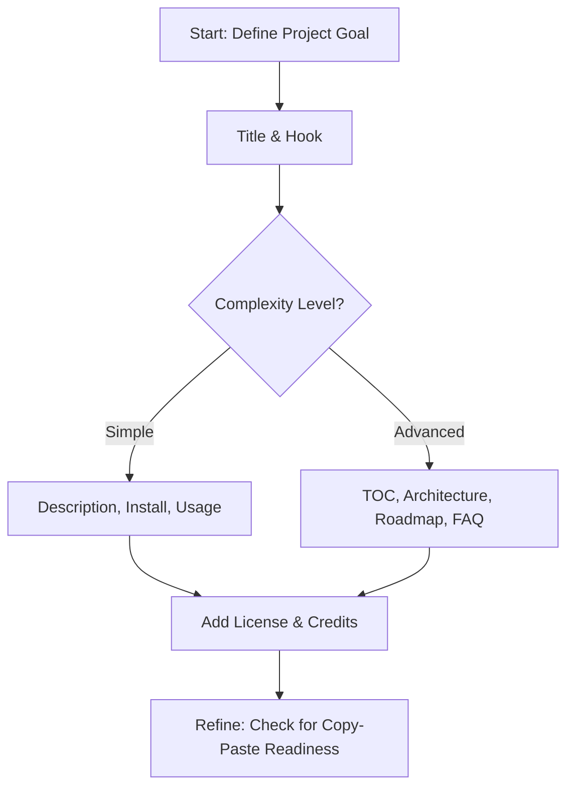
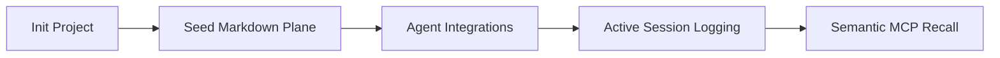

> Status: PROMOTED 2026-07-08. Source copy retained in inbox because the OneDrive reparse-point
> file could not be deleted by PowerShell or apply_patch. Canonical active plan:
> `docs/2_Todo/readme-front-door-refresh-plan.md`.

this document is intended as a suggested new format for the root level readme doc. it follows the following principles:
To create a README that achieves professional excellence, I have synthesized industry-standard best practices into a modular "skill" you can use for your repositories.

### The "README Architect" Skill

When you need to draft a documentation file, follow this mental workflow. It treats your README as a product—it must be marketable, accessible, and functional.

#### 1. The Hierarchy of Information (Top-Down)

* **The Hook:** Title + Subtitle (a single sentence describing the "who, what, and why").
* **The Value Proposition:** A bulleted "Highlights" section immediately following the description. Sell the benefits, not just the features.
* **The "Quick Start" (Crucial):** Don't make users hunt for installation. Place the primary `pip install`, `npm install`, or `git clone` command in the first 25% of the page.
* **The "Context" (Bottom):** Shift technical details (build instructions, testing frameworks, roadmap) to the bottom or external files like `CONTRIBUTING.md`.

#### 2. Visual & Structural Best Practices

* **Scannability:** Use a **Table of Contents** for long projects. Use emojis for header navigation (e.g., `🚀 Usage`).
* **Codeblocks:** Always include syntax highlighting and "copy-paste-ready" commands.
* **Visual Proof:** Use GIFs or screenshots for CLI tools or UI projects to demonstrate success instantly.
* **Badges:** Use [Shields.io](https://shields.io/) for dynamic status (build, version, coverage). It signals professionalism and active maintenance.

---

### Implementation Flowchart



---

### Checklist for Excellence

* [ ] **The "Dummy" Test:** Could a first-year student run your code using *only* this README? (Crucial for reproducibility).
* [ ] **Relative Paths:** Ensure all links and image references are relative or absolute and working.
* [ ] **Tone:** Approachable and concise. Avoid "manifestos"—keep it focused on user outcomes.
* [ ] **Maintenance:** If you stop working on it, add a status note at the top (e.g., "Maintained," "Archived," "Experimental").

### Strategic Advice

Since you work on agentic AI systems and CLI tools, **brevity is your highest leverage.** Developers prioritize "time to first successful execution."

**Counterpoint:** While comprehensive documentation is good, don't let it become a maintenance burden. If you find your README becoming a "user manual," link out to a dedicated `/docs/spec` folder or a Wiki instead. Keep the README as the **front door**, not the entire house.

here is an example for this projectL:

---

# Memory Seed

[](https://pypi.org/project/memory-seed/)
[](https://pypi.org/project/memory-seed/)
[](LICENSE)
[](https://github.com/jnl-tshi/memory-seed/actions/workflows/publish.yml)

**Portable, local memory for AI coding agents.** Memory Seed plants a Markdown-based control plane into your project, allowing agents to retain context—decisions, conventions, and project history—without relying on vendor-hosted memory services.

## 🚀 Highlights
* **Vendor-Agnostic**: Compatible with Claude Code, Gemini CLI, Codex, Cursor, and GitHub Copilot.
* **Developer-First**: Designed for solo developers and teams who value local, inspectable, and commit-ready data.
* **Agent-Native**: Uses the Model Context Protocol (MCP) to provide agents with precise, high-relevance recall.
* **Lightweight**: No databases or external services required; your project history is stored in standard Markdown files.

## ⚡ Quickstart
Get started in two steps from the root of your project:

```powershell
uvx --from memory-seed memory-seed init

```

Ask your coding agent to read `AGENTS.md` to begin the runtime discovery process.

---

## 🛠️ How It Works

Memory Seed maintains a `.memory-seed/` directory that acts as a local "control plane." It automates the maintenance of your project context through:

1. **Lifecycle Hooks**: Keeps memory current by reminding agents to log sessions and retrieve context.


2. **MCP Integration**: Provides agents with structured tool calls (`memory_search`, `memory_get_chunk`) for accurate historical recall.


3. **End-of-Turn Routines**: Performs orphan sweeps, consolidation reviews, and artifact checks to keep documentation clean.




---

## 🧩 Agent Support

Memory Seed automatically configures hooks and MCP registration for the following:

| Agent | Config File |
| --- | --- |
| **Claude Code** | `.claude/settings.json` |
| **Codex CLI** | `.codex/hooks.json` |
| **Gemini CLI** | `.gemini/settings.json` |
| **Cursor** | `.cursor/hooks.json` |
| **GitHub Copilot** | `.github/hooks/memory-seed.json` |

---

## 📚 Advanced Usage & Documentation

* **Memory Trace**: A separate, optional local UI for visualizing your project's memory timeline and graph.


* **Updating**: To update your project to the latest reusable templates, run `memory-seed update` after upgrading the package.


* **Configuration**: Customizations (users, participant registries, and skill profiles) are managed in `.memory-seed/project.yaml`.


> **Security Note**: Treat `.memory-seed` files as publishable. **Do not** store secrets, credentials, or sensitive client information in generated session logs or memory files.

---

*For full technical details, CLI command references, and architecture guides, see the [Project Documentation](https://www.google.com/search?q=https://github.com/jnl-tshi/memory-seed).*
