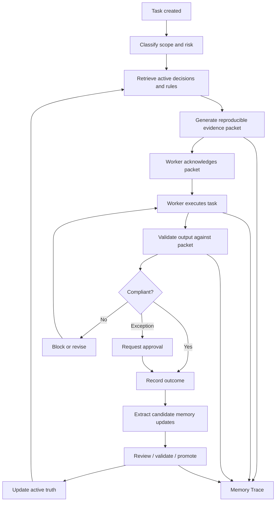

# Proposal: Active Truth and Execution Control for Memory Seed

**Status:** Proposal  
**Target:** Memory Seed inbox  
**Priority:** P0 / Foundational  
**Theme:** Trusted institutional continuity and agent governance  

---

## 1. Summary

Memory Seed should evolve from a system that primarily stores and retrieves project memory into a system that controls how current project truth is selected, applied, validated, and updated.

The central risk is not that Memory Seed forgets information. The more dangerous failure is that it confidently supplies stale, conflicting, irrelevant, unauthorised, or weakly supported context to agents and humans.

This proposal introduces three complementary control boundaries:

1. **Retrieval contract** — governs what Memory Seed supplies to an agent.
2. **Write contract** — governs what an agent is allowed to propose back into Memory Seed.
3. **Postflight validation** — checks whether the resulting action complied with the context and rules supplied to the agent.

Together, these create a closed governance loop:

> **Remember → select current truth → execute → validate → learn → update**

The immediate goal is not to add more memory. It is to make the memory already present reliable enough to govern consequential work.

---

## 2. Problem Statement

A memory system can retrieve information correctly and still cause the wrong action.

Examples:

- A six-month-old decision is retrieved even though it has been superseded.
- A speculative agent assumption is presented alongside an approved decision with similar apparent authority.
- Two agents working in parallel write incompatible updates into canonical memory.
- An agent receives a constitutional rule but ignores it during implementation.
- A reviewer can see a polished Memory Trace summary but cannot reconstruct the exact context packet the agent received.
- An external source contains prompt-injection-like instructions that are accidentally promoted into project memory.
- Retrieval expands until packets become large context dumps that dilute the most important constraints.

These are not primarily retrieval-quality problems. They are **truth-state, authority, lifecycle, execution, and governance problems**.

Memory Seed therefore needs an explicit concept of **active truth** and a controlled task lifecycle around it.

---

## 3. Core Principle

Memory Seed should optimise for:

```text
Current truth
× task relevance
× provenance
× enforceability
× inspectability
÷ maintenance burden
```

A low score in any one dimension can undermine the entire system.

The intended system-level rule is:

> **No consequential agent action without a versioned context packet, and no canonical memory change without a governed write proposal.**

---

## 4. Goals

This proposal should enable Memory Seed to:

1. Distinguish historical information from currently active truth.
2. Distinguish observations, assumptions, hypotheses, decisions, rules, evidence, outcomes, and unresolved questions.
3. Prevent agents from silently promoting generated content into canonical memory.
4. Make every consequential agent task reproducible from the exact context it received.
5. Validate agent outputs against the decisions and rules supplied before task completion.
6. Surface conflicting or stale project truth before execution.
7. Support safe multi-agent concurrency and memory updates.
8. Keep human and agent views aligned through Memory Trace.
9. Limit context packets to the smallest useful set of governing information.
10. Provide measurable evidence that Memory Seed prevented or detected errors.

---

## 5. Non-Goals

This proposal does **not** attempt to:

- replace the existing session or markdown storage model;
- make topic sidecars authoritative;
- make semantic links authoritative;
- require a complete ontology before retrieval can function;
- turn all tasks into human-gated workflows;
- block low-risk agent autonomy by default;
- make Memory Trace primarily a global graph explorer;
- replace MCP, REST, or CLI with a new interface;
- define a specific LLM vendor implementation.

The design should remain vendor-neutral across Claude, Codex, and other workers.

---

# 6. Proposed Architecture



The architecture creates three controlled boundaries:

```text
Memory Seed → Worker
      Retrieval Contract

Worker → Memory Seed
         Write Contract

Worker Output → Completion
         Postflight Validation
```

---

# 7. Proposal A — Active Truth Lifecycle

## 7.1 Problem

Historical records and current project truth are different things.

An ADR or decision may be valid historically while no longer being valid operationally.

Agents should not need to infer this from prose.

## 7.2 Proposed lifecycle

```text
Observed
    ↓
Candidate
    ↓
Proposed
    ↓
Active
    ↓
Superseded / Expired / Rejected
```

Not every memory type must use every state, but consequential project decisions and rules should have an explicit lifecycle.

## 7.3 Minimum active-truth metadata

```yaml
id:
type:
status:
scope:
effective_from:
effective_until:
owner:
source:
evidence:
supersedes:
superseded_by:
review_after:
confidence:
sensitivity:
```

## 7.4 Required validations

Memory Seed should detect:

- multiple active decisions covering the same exclusive scope;
- references to nonexistent superseded records;
- circular supersession chains;
- expired decisions still being returned as active;
- active decisions with no provenance;
- conflicting active rules;
- active records whose supporting evidence has changed or disappeared;
- updates based on stale memory snapshots.

## 7.5 Retrieval behaviour

Default retrieval should prioritise:

1. active truth;
2. unresolved conflicts;
3. explicitly relevant historical context;
4. superseded history only when requested or useful for explanation.

Superseded information should never silently compete with its active replacement.

---

# 8. Proposal B — Typed Knowledge States

## 8.1 Problem

If all project memory is represented as prose with similar metadata, agents may treat uncertain material as if it carries the same authority as approved decisions.

## 8.2 Proposed knowledge types

| Type | Meaning |
|---|---|
| Observation | Something occurred or was observed |
| Claim | Someone or something asserted something |
| Evidence | Material supporting or contradicting a claim |
| Assumption | Temporary belief without sufficient validation |
| Hypothesis | Explanation currently being tested |
| Decision | Selected course of action |
| Rule | Constraint future actions must follow |
| Exception | Authorised deviation from a rule |
| Open question | Known unresolved matter |
| Rejected alternative | Considered but deliberately not selected |
| Outcome | Observed result after execution |

## 8.3 Design principle

The system must be able to distinguish:

```text
"We decided X"
```

from:

```text
"Agent 3 suggested X"
```

from:

```text
"X is currently being tested"
```

from:

```text
"X was rejected because of Y"
```

This distinction must survive retrieval, compression, sidecars, UI rendering, and API boundaries.

---

# 9. Proposal C — Memory Write Contract

## 9.1 Problem

Agent-generated memory can create compounding errors:

```text
Agent makes incorrect inference
        ↓
Inference is written as memory
        ↓
Future agents retrieve it
        ↓
Inference gains apparent authority
        ↓
System-wide behaviour changes
```

Canonical memory therefore requires a controlled write path.

## 9.2 Proposed write lifecycle

```text
Agent observation
        ↓
Write proposal
        ↓
Classification
        ↓
Validation
        ↓
Approval or automatic policy
        ↓
Canonical activation
```

## 9.3 Proposed write contract

```yaml
write_proposal:
  proposed_type:
  statement:
  scope:
  source_task:
  source_packet:
  supporting_evidence:
  contradicting_evidence:
  confidence:
  suggested_status:
  suggested_supersession:
  risk_level:
```

## 9.4 Risk-adaptive promotion

| Memory type | Default behaviour |
|---|---|
| Session observation | Automatic |
| Derived topic | Automatic, non-canonical |
| Suggested semantic link | Automatic, confidence-labelled |
| Low-risk factual correction | Automated validation |
| Project decision | Human or designated-agent approval |
| Constitutional rule | Explicit authorised approval |
| Supersession of active decision | Mandatory validation/review |
| Security or safety constraint | Named owner approval |

The precise policy should be configurable by project.

---

# 10. Proposal D — Task Preflight

## 10.1 Problem

A memory system is ineffective if workers use it only when they remember to query it.

For governed tasks, retrieval should be part of task initialisation rather than an optional lookup.

## 10.2 Proposed lifecycle

```text
Task received
      ↓
Scope identified
      ↓
Risk classified
      ↓
Relevant active truth retrieved
      ↓
Conflicts surfaced
      ↓
Evidence packet issued
      ↓
Worker execution begins
```

## 10.3 Expanded task contract

```yaml
task:
  goal:
  affected_components:
  expected_artifacts:
  risk_level:
  autonomy_level:

retrieve:
  active_decisions:
  constitutional_rules:
  evidence:
  related_tasks:
  open_questions:
  rejected_alternatives:

constraints:
  token_budget:
  required_sources:
  forbidden_actions:
  human_approval_required:

writeback:
  observations:
  candidate_decisions:
  proposed_updates:
```

## 10.4 Retrieval questions

The retrieval layer should answer more than "what is semantically related?"

It should also determine:

- What is mandatory?
- What is current?
- What has been superseded?
- What remains unresolved?
- What is prohibited?
- What would make this task high risk?
- What evidence must be preserved?

---

# 11. Proposal E — Reproducible Evidence Packets

## 11.1 Problem

A reviewer must be able to reconstruct exactly what informed an agent action.

A summary saying that the agent "used architecture decisions" is insufficient.

## 11.2 Proposed packet manifest

```yaml
packet_id:
task_id:
agent_id:
generated_at:
retrieval_contract_version:
retrieval_engine_version:
memory_snapshot:

included_entries:
  - id:
    version:
    status:
    content_hash:
    reason_included:

excluded_entries:
known_conflicts:
unresolved_questions:
access_restrictions:
token_budget:
compression_applied:
source_references:
```

## 11.3 Required properties

A packet should allow a reviewer to answer:

- What exactly did the agent see?
- Which version did it see?
- Why was each item included?
- What relevant material was omitted?
- Was context compressed?
- Were known contradictions present?
- Did permissions hide any evidence?
- Can the same packet be reproduced?

## 11.4 Compression rule

ICM or any other semantic compression layer must remain traceable to source material.

Compression must be:

- visibly identified;
- versioned;
- reversible through references;
- testable for omission;
- prohibited from silently replacing canonical evidence.

Blocking constraints should retain exact wording unless a demonstrably lossless representation is used.

---

# 12. Proposal F — Postflight Validation

## 12.1 Problem

Retrieving a rule proves only that the information was available. It does not prove the worker complied with it.

## 12.2 Proposed flow

```text
Worker output
      ↓
Compare against evidence packet
      ↓
Check required rules
      ↓
Check prohibited changes
      ↓
Detect unexplained deviations
      ↓
Approve / warn / block / escalate
```

## 12.3 Enforcement levels

| Level | Behaviour |
|---|---|
| Informational | Context only |
| Advisory | Deviation should be explained |
| Required | Validation failure or warning on violation |
| Blocking | Task cannot complete until resolved |
| Human-gated | Requires authorised approval |

## 12.4 Validation result types

Every relevant rule should resolve to one of:

- compliant;
- justified exception;
- unresolved violation;
- rule not applicable;
- insufficient evidence.

---

# 13. Proposal G — Human/Agent View Parity in Memory Trace

## 13.1 Problem

Human oversight is unreliable if the UI shows an interpretation that differs from what the worker actually received.

## 13.2 Recommended default operational view

Memory Trace should prioritise:

```text
Task
  → context requested
  → evidence packet issued
  → decisions applied
  → worker action
  → validation result
  → memory updates proposed
```

The global knowledge graph remains useful but should be secondary to operational trails.

## 13.3 Required views

### What the agent saw

Display the exact packet content and versions supplied to the worker.

### Why this was included

Display retrieval rationale and contract requirement.

### What was excluded

Display omissions caused by budget, status, relevance, or permissions.

### What changed

Display task-level diffs across code, documents, decisions, and memory proposals.

### What controlled this action

Display the governing active decision or rule and its evidence.

### What conflicts remain

Display unresolved contradictions, unanswered questions, and unapproved exceptions.

---

# 14. Proposal H — Adaptive Context Budgeting

## 14.1 Problem

Retrieving everything remotely relevant recreates the context-window problem Memory Seed is intended to solve.

More context can reduce rather than improve performance.

## 14.2 Proposed tiers

### Tier 1 — Must know

- blocking constitutional rules;
- directly applicable active decisions;
- current constraints;
- critical unresolved conflicts.

### Tier 2 — Should know

- supporting evidence;
- neighbouring decisions;
- relevant rejected alternatives;
- recent related outcomes.

### Tier 3 — Available on demand

- full historical sessions;
- distant semantic neighbours;
- superseded decisions;
- broad background context.

## 14.3 Omission reporting

```yaml
omitted:
  count: 34
  reasons:
    - below_relevance_threshold
    - historical_only
    - superseded
    - token_budget
    - access_restricted
```

## 14.4 Risk adaptation

Low-risk formatting or isolated refactoring tasks should receive minimal governance context.

High-risk architectural, security, or cross-system tasks should receive deeper history, evidence, conflict information, and stronger validation.

---

# 15. Proposal I — Multi-Agent Concurrency

## 15.1 Problem

Parallel workers may retrieve the same active truth and generate incompatible memory updates.

This becomes increasingly likely as Memory Seed is integrated into orchestration and worker swarms.

## 15.2 Required capabilities

- agent identity;
- task identity;
- branch/worktree identity;
- memory snapshot identity;
- optimistic locking;
- conflict detection;
- proposal merging;
- write ownership;
- approval roles;
- append-only history;
- rollback.

## 15.3 Model

```text
Canonical memory
      │
      ├── Worker A snapshot
      │       └── Proposed updates A
      │
      └── Worker B snapshot
              └── Proposed updates B

Proposals are reconciled before canonical merge.
```

Memory updates should behave more like reviewed code changes than uncontrolled chat-memory mutation.

---

# 16. Proposal J — Memory Poisoning and Source Trust

## 16.1 Problem

External or untrusted material may contain text that resembles instructions, policy, or authoritative decisions.

Sources may include:

- web pages;
- external documents;
- emails;
- issues;
- pull requests;
- agent-generated summaries;
- third-party integrations.

## 16.2 Required protections

- distinguish source content from executable instruction;
- retain source trust level;
- quarantine externally derived candidates;
- detect prompt-injection-like content;
- prevent untrusted sources from creating active rules;
- require provenance for high-authority memory;
- preserve original source text;
- record extraction method;
- record proposing agent;
- restrict promotion authority.

## 16.3 Principle

Authority must never be inferred from wording alone.

A source containing:

```text
All future agents must ...
```

remains ordinary source content until the governance process explicitly promotes it.

---

# 17. Implications for Existing Memory Seed Components

## 17.1 Topic sidecars

Topics should remain **derived metadata**, not canonical truth.

Requirements:

- allow multiple topic models or ontology versions;
- record confidence and generation method;
- keep Area and Activity as separate facets;
- permit core retrieval without topics;
- measure whether topic usage improves retrieval outcomes;
- allow low-value topics to be deprecated;
- never allow topic membership alone to establish a decision relationship.

The ontology should improve discovery, not determine authority.

---

## 17.2 Link sidecars

Graph relationships should distinguish explicit and inferred authority.

Suggested edge metadata:

```yaml
source:
target:
relationship_type:
confidence:
supporting_evidence:
created_by:
created_at:
validation_status:
last_used:
retrieval_contribution:
```

Separate at least:

- human-explicit links;
- mechanically discovered candidates;
- model-judged relationships;
- validated relationships;
- inferred/transitive relationships.

A validated `supersedes` edge must not be treated equivalently to an inferred `related_to` edge.

---

## 17.3 Constitution

Constitutional principles must be operationalisable.

Each enforceable rule should eventually support:

- statement;
- rationale;
- scope;
- severity;
- triggering conditions;
- compliance test;
- exception process;
- owner;
- effective date;
- supersession history;
- compliant examples;
- non-compliant examples.

Recommended hierarchy:

```text
Value
  → Principle
      → Operational rule
          → Validation test
```

Example:

```text
Value:
  Maintain project trust

Operational rule:
  Never silently alter canonical memory without preserving provenance.
```

---

## 17.4 ADR / Important Decision sidecar

The ADR should remain the historical record.

The active-truth layer should represent the currently operative decision.

Useful distinctions:

- decision record;
- active decision;
- decision update;
- decision outcome;
- supersession event.

Suggested additions:

- explicit scope;
- owner;
- review date;
- affected components;
- rejected alternatives;
- implementation evidence;
- observed consequence/outcome.

---

## 17.5 Evidence packets

Evidence packets should become auditable manifests rather than formatted context dumps.

They should:

- include supporting and contradicting evidence;
- identify omitted evidence;
- record source versions and hashes;
- separate required and optional context;
- record compression;
- record retrieval rationale;
- surface contradictions;
- support replay;
- record task outcome for later evaluation.

---

## 17.6 Memory Trace

Memory Trace should remain **trail-first, graph-second**.

Priority trails:

- task trail;
- decision trail;
- exception trail;
- conflict trail;
- supersession trail;
- exact evidence-packet inspection;
- unresolved-governance trail.

The graph remains useful for exploration but should not become the primary representation of operational truth.

---

## 17.7 MCP / REST / CLI

All interfaces should expose the same canonical semantics.

Requirements:

- shared schema;
- shared validation library;
- contract versioning;
- conformance tests;
- replayable fixtures;
- identical packet IDs across interfaces;
- vendor adapter tests.

Vendor neutrality should be validated through automated tests rather than architectural intent alone.

---

## 17.8 Orchestrator and workers

For governed tasks, workers should participate in a context handshake:

```text
Task assigned
    ↓
Worker requests packet
    ↓
Memory Seed issues packet ID
    ↓
Worker acknowledges constraints
    ↓
Task execution
    ↓
Output references packet ID
    ↓
Postflight validation
```

A governed worker should not be considered fully initialised without a valid packet ID.

---

## 17.9 ICM / semantic compression

Compression should optimise context cost, not establish truth.

Requirements:

- source references retained;
- compressed spans identifiable;
- compression method/version recorded;
- contradictions and exceptions preserved;
- blocking rules protected from lossy rewriting;
- retrieval selection performed before aggressive compression.

---

## 17.10 Graphify / Semble / ontology generators

Automatically generated structure should be treated as proposed derived knowledge.

Generated sidecars should record:

- model/tool version;
- source snapshot;
- confidence;
- validation state;
- reproducibility metadata;
- replacement/deprecation policy.

These tools should propose structure rather than gain structural authority by default.

---

# 18. Implementation Priority

## P0 — Protect truth

Implement before major ontology, graph, or visualisation expansion.

- Active decision lifecycle.
- Typed knowledge states.
- Memory write contract.
- Conflict detection.
- Reproducible packet manifest.
- Source provenance and hashes.

### Rationale

Improving retrieval before these controls exist can increase the speed at which incorrect project truth propagates.

---

## P1 — Control execution

- Task preflight.
- Context handshake / packet ID.
- Postflight validation.
- Rule severity levels.
- Exact "what the agent saw" Memory Trace view.
- Packet-linked task trails.
- Outcome instrumentation.

---

## P2 — Reduce operational friction

- Automatic candidate extraction.
- Promotion/review queue.
- Adaptive context budgeting.
- Multi-agent merge semantics.
- Identity-aware permissions.

---

## P3 — Improve discovery and scale

- Topic sidecars.
- Probabilistic semantic links.
- Ontology generation.
- Rich graph exploration.
- Additional integrations.

This sequencing intentionally places visible graph/ontology functionality behind truth-state and governance infrastructure.

---

# 19. Critical Path

The recommended first implementation slice contains only seven capabilities:

1. **Decision lifecycle**
2. **Typed knowledge states**
3. **Memory write contract**
4. **Reproducible evidence-packet manifest**
5. **Preflight context handshake**
6. **Postflight rule validation**
7. **Task-linked audit trail**

These capabilities are sufficient to establish the main governance loop without requiring full ontology, permissions, UI, or multi-agent merge functionality.

---

# 20. Suggested Delivery Slices

## Slice 1 — Active truth model

Deliver:

- status field and lifecycle schema;
- `active`, `superseded`, `expired`, `rejected`, and `candidate` handling;
- supersession validation;
- active-truth retrieval filtering;
- conflict detector;
- tests.

### Exit condition

A superseded decision cannot be returned as current truth unless historical context is explicitly requested.

---

## Slice 2 — Packet manifest

Deliver:

- packet ID;
- memory snapshot ID;
- entry versions/hashes;
- inclusion rationale;
- omission reporting;
- conflict reporting;
- packet replay fixture.

### Exit condition

A completed task can be replayed against the exact project-memory snapshot and packet used when it ran.

---

## Slice 3 — Write contract

Deliver:

- candidate memory write API/schema;
- provenance requirements;
- automatic vs gated promotion policy;
- supersession proposal support;
- rejected/approved write history.

### Exit condition

A worker cannot silently convert generated inference into active project truth.

---

## Slice 4 — Task handshake

Deliver:

- governed-task flag or risk classification;
- packet request during task startup;
- packet acknowledgement;
- packet ID attached to worker output.

### Exit condition

A governed task cannot complete without identifying which packet informed execution.

---

## Slice 5 — Postflight validation

Deliver:

- informational/advisory/required/blocking rule levels;
- compliance result schema;
- deviation explanation;
- validation result stored with task trail.

### Exit condition

A task that violates a blocking rule cannot silently be marked successful.

---

## Slice 6 — Memory Trace operational trail

Deliver:

- exact packet inspection;
- why-included view;
- omitted-context view;
- task → packet → action → validation → write-proposal trail.

### Exit condition

A human can reconstruct why an agent acted, what governed it, whether it complied, and what it attempted to add to memory.

---

# 21. Inversion-Based Acceptance Tests

These should become end-to-end system tests where practical.

| Test | Expected behaviour |
|---|---|
| Insert a superseded decision highly similar to the task | Active replacement wins |
| Create two incompatible active decisions | Packet is flagged or blocked |
| Add an unsupported worker assumption | Remains non-canonical |
| Allow two workers to propose conflicting updates | Conflict is surfaced before canonical merge |
| Place prompt-injection text inside evidence | Treated as source content, not instruction |
| Retrieve under a restricted identity | Protected evidence is excluded and omission is recorded |
| Compress a decision containing an exception | Exception is preserved or compression fails validation |
| Remove topic metadata | Core active-truth retrieval still functions |
| Fill graph with weak inferred links | Validated decisions remain authoritative |
| Ask why an action happened months later | Exact packet and source versions can be reconstructed |
| Switch from Claude to Codex | Same retrieval/write contracts remain valid |
| Give a worker insufficient context | Outcome evaluation exposes packet insufficiency |
| Give a worker excessive context | Required context remains prioritised by budget tiers |
| Attempt automatic promotion of constitutional rule | Authorisation gate rejects it |
| Complete a task while violating a blocking rule | Postflight prevents silent success |

---

# 22. Metrics

The system should eventually measure more than retrieval relevance.

## Truth integrity

- stale-decision retrieval rate;
- conflicting-active-truth rate;
- unsupported canonical write rate;
- invalid supersession rate.

## Packet quality

- percentage of task-relevant active decisions retrieved;
- packet token cost;
- proportion of packet occupied by Tier 1 context;
- omitted-critical-context rate;
- contradiction-detection rate.

## Execution governance

- rule violations detected pre-completion;
- justified exceptions;
- blocking violations prevented;
- percentage of governed tasks with reproducible packet IDs.

## Maintenance burden

- human review actions per accepted canonical update;
- time/steps required to promote a valid candidate;
- percentage of candidate memory automatically resolved;
- duplicate/low-value candidate rate.

## Business / system value

The most important long-term metric should be:

> **How often did Memory Seed prevent, detect, or explain a consequential mistake that would otherwise have occurred?**

---

# 23. Open Design Questions

The implementation should explicitly resolve:

1. What is the canonical unit of active truth: entry, decision within entry, or promoted sidecar record?
2. Should status live in the source markdown, an active-truth index, or both?
3. What constitutes an exclusive scope where conflicting active decisions should be blocked?
4. How should confidence interact with authority?
5. Which memory writes can be auto-promoted safely?
6. How are constitutional-rule owners and approval identities represented locally?
7. What is the minimum viable snapshot mechanism for packet reproducibility?
8. How should packet replay work when source files have been deleted or rewritten?
9. Which rule classes can realistically be validated mechanically?
10. How should task risk be classified without creating excessive ceremony?
11. How should write conflicts map onto existing Git/worktree orchestration?
12. How should Memory Seed report uncertain retrieval without overloading the worker?

---

# 24. Decision Requested

Approve **Active Truth and Execution Control** as a first-class Memory Seed workstream.

If approved, the first implementation work should focus on:

```text
Active truth lifecycle
        ↓
Reproducible packet manifest
        ↓
Memory write contract
        ↓
Task context handshake
        ↓
Postflight validation
        ↓
Memory Trace audit trail
```

Topic sidecars, semantic-link expansion, ontology generation, and richer graph functionality should continue where they unblock retrieval, but they should not become dependencies for authoritative project truth.

---

# 25. Expected Result

With this proposal implemented, Memory Seed changes category.

Without these controls:

> Memory Seed is a persistent context and project-memory system.

With them:

> Memory Seed becomes infrastructure for maintaining, applying, auditing, and safely evolving institutional truth across humans and AI agents.

That should become the architectural target for the next phase of the system.
