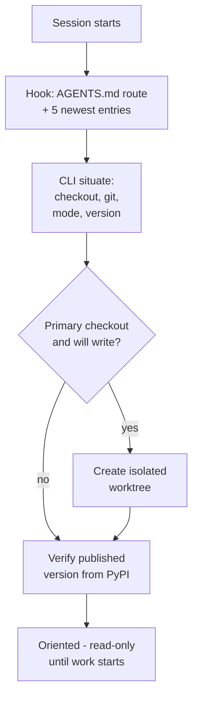
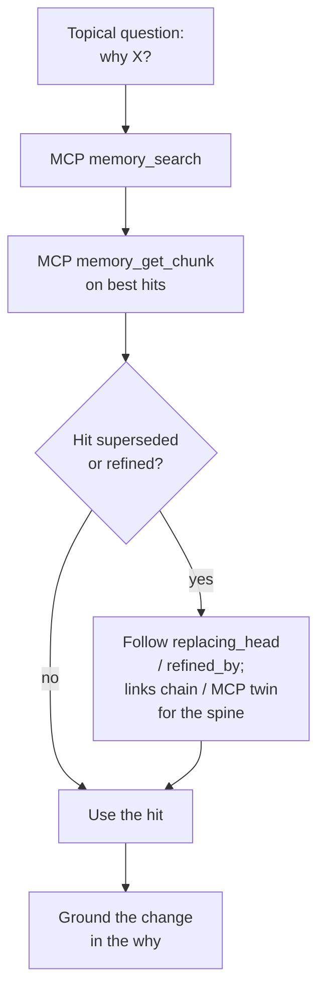
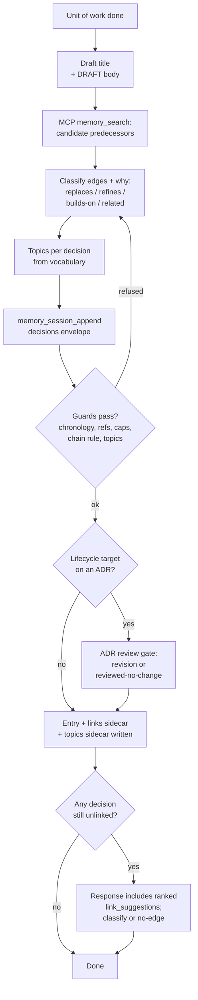
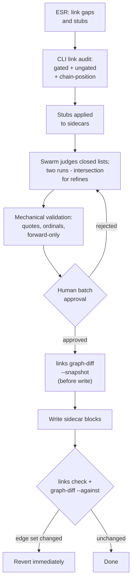
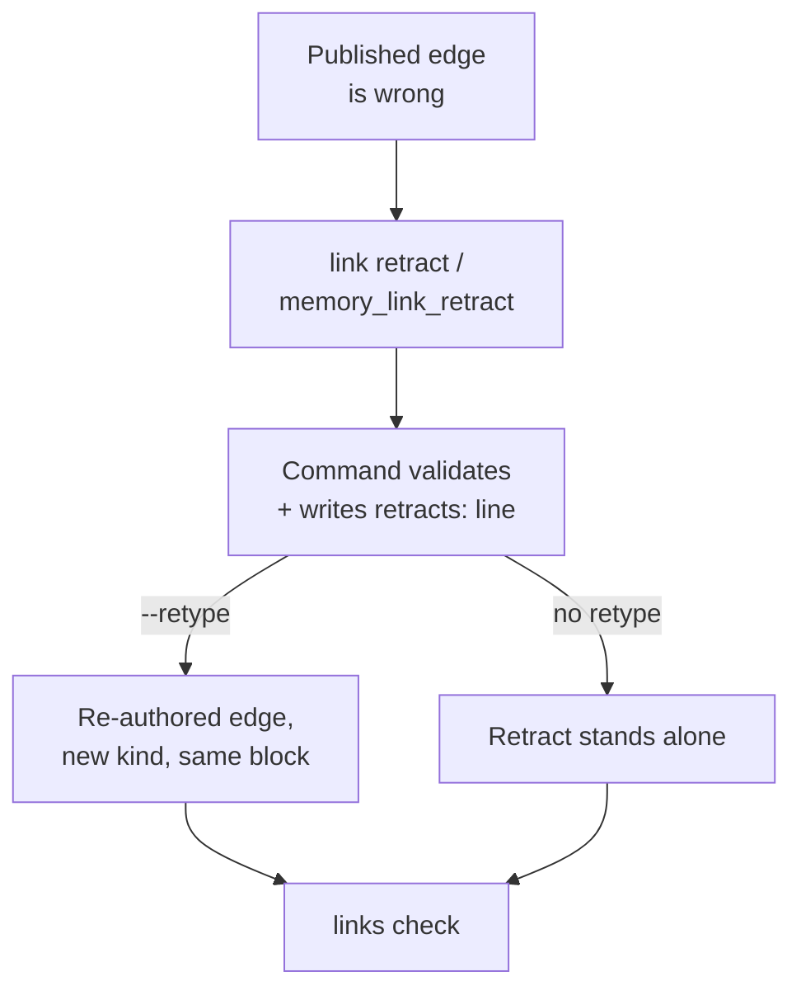
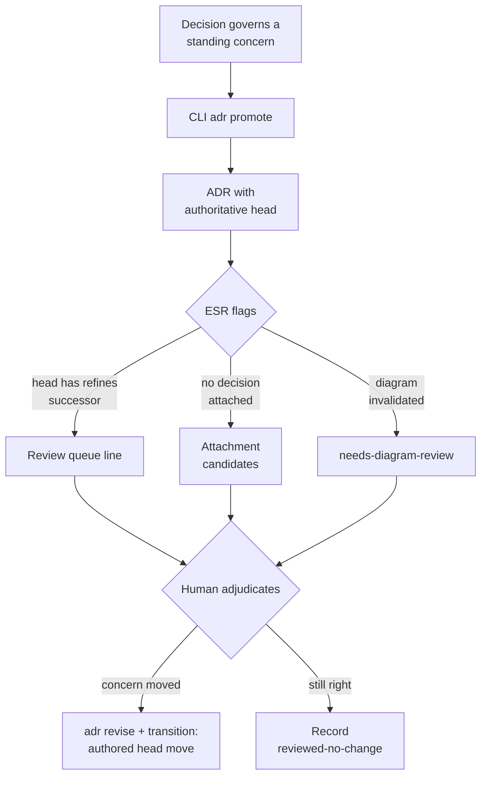
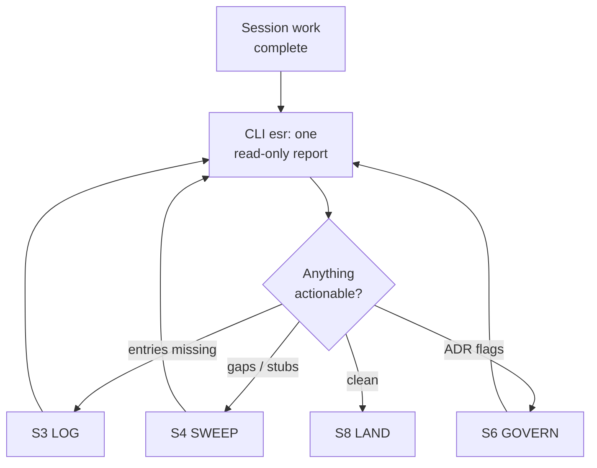
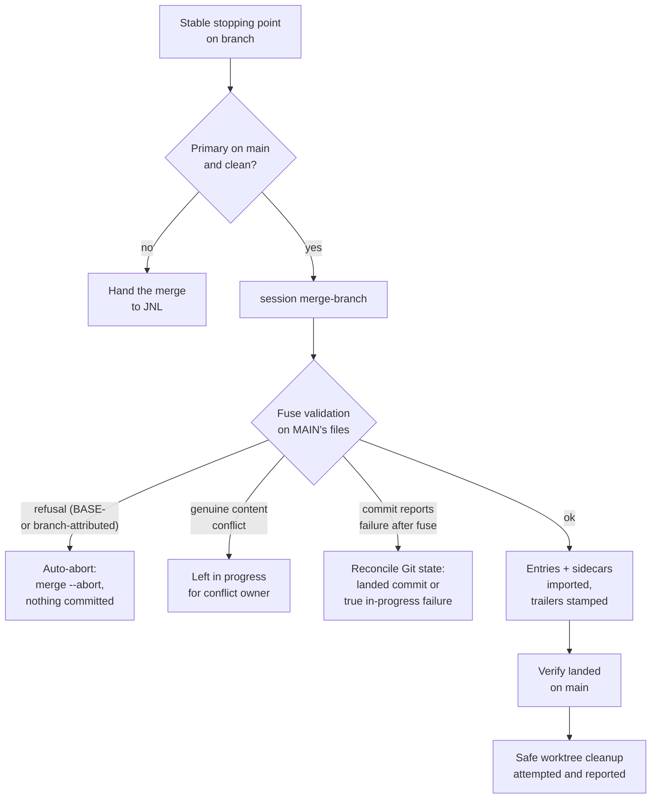

# Agent Interaction Storylines: process and tool review

Status: Living document (updated 2026-08-10; kept true as storylines change)

Every distinct way an agent interacts with Memory Seed, defined as a named **storyline**: what
triggers it, the steps it walks, which tool surface carries each step (MCP / CLI / convention), a
diagram, and an evaluation. The final sections cross-cut: a tool inventory mapped to storylines, a
surface-parity matrix, a numbered list of redundancies and inefficiencies (**R1–R13**) with
streamlining recommendations, and a separate redundancy audit of tools and endpoints considered for
outright deletion.

Ground truth: `memory_seed/mcp_server.py` (23 MCP tools), `memory-seed --help` (CLI tree),
`.memory-seed/skills/` (the prose that scripts each flow). Convention-only steps — ones no tool
enforces — are marked, because they are where process drift starts.

**Method note.** The original R1–R12 recommendations were written from code reading alone. A memory
pass on 2026-08-10 checked every open recommendation against recorded decisions and refuted R1, R2,
and R12 outright, and reframed R5 and R6 — the premise held but the proposed mechanism did not.
The implementation pass later that day closed R6 on the unconditional append-response path, gave
CLI and MCP one shared content-bound ADR review preflight, and added a standalone reviewed-no-change
parity pair. This refresh adds R13 from an observed integration false negative, checked against the
recorded commit-failure and safe-cleanup decisions. Recommendations in this document are trustworthy
only once checked against recorded decisions, not on code reading alone.

The [storyline gap tranche implementation plan](../2_Todo/storyline-gap-tranche-implementation-plan.md)
records the completed R5, R8, and R13 work and its validation evidence.

The nine storylines:

| # | Name | One line | Trigger |
|---|------|----------|---------|
| S0 | **BOOTSTRAP** | Establish the runtime and its durable authority map | A runtime is missing or incomplete |
| S1 | **ORIENT** | Establish where and when you are | Session start / re-entry |
| S2 | **RECALL** | Retrieve the *why* behind existing work | Before consequential conclusions on non-obvious behavior |
| S3 | **LOG** | Record a unit of work as a decision-carrying entry | After each meaningful unit of work |
| S4 | **SWEEP** | Find and judge missing lifecycle edges at scale | ESR gap report / periodic campaign |
| S5 | **CORRECT** | Downgrade or retype a published edge, append-only | A published edge is wrong |
| S6 | **GOVERN** | Promote, revise, and review standing concerns (ADRs) | A decision governs a standing concern |
| S7 | **CLOSE** | End-of-session mechanical preflight | Before ending a session |
| S8 | **LAND** | Integrate branch-local memory into main | A stable, tested stopping point |

---

## S0 BOOTSTRAP — establish the runtime and durable authority

**Trigger:** the reusable runtime is missing or `index.md` / `policy.md` has not been generated.

**Flow**

1. Inspect local evidence and ask only questions that materially change orientation or policy.
2. Classify future-session constraints as durable ADR candidates; keep transient state in the index
   or first session entry.
3. Create proposed founding ADRs from bootstrap evidence. A confirmed answer is accepted only after
   the first session records it; an unconfirmed assumption remains proposed and non-governing.
4. Detect an existing Constitution and declare its status; create one only when long-lived normative
   invariants justify it.
5. Generate a thin authority map in the index and concise policy rules that link to accepted ADRs.
6. Append the first session and validate doctor, topics, links, and ADRs.

**Tools:** bootstrap guide plus CLI `adr promote` (founding-source form), `adr transition`,
`session append`, `doctor`, `topics check`, `links check`, and `adr check`. ADR head writes remain
CLI-only by design.

---

## S1 ORIENT — establish where and when you are

**Trigger:** session start (automatic via SessionStart hook) or mid-session re-entry (`/situate`).

**Flow**

1. SessionStart directs the agent through the nearest `AGENTS.md` and `orientation.md`, then injects
   the shared `situate` report's measured facts and latest applicable session-file route. It injects
   no session bodies and never invokes a model.
2. The route is mechanical: read the entire file directly at or below 12,000 characters; above the
   boundary, ask one read-only economy worker to compress the entire file to an at-most-800-token,
   source-linked briefing. If no suitable worker is available, read directly; split only at entry
   boundaries when even the worker context cannot hold the source.
3. `situate` reports which checkout this actually is (worktree identity is measured, not declared),
   git branch + cleanliness, `integration_mode` / `merge_trigger`, latest-session size and route,
   worktree roster, and local version vs CHANGELOG state.
4. Published-version, roadmap, policy, Constitution, and ADR reads remain lazy until the task makes
   them relevant. Before consequential reasoning from a compressed briefing, reopen its exact source.
5. If the session will write and this is the PRIMARY checkout: create an isolated worktree first.

**Tools**

| Step | Surface |
|------|---------|
| Hook injection | Harness hook → CLI internals (no agent action) |
| Local report | CLI `situate` |
| Branch posture (piecemeal) | MCP `memory_branch_status`, `memory_worktree_guard`; CLI `branch`, `worktree` |
| PyPI check | Convention (printed `curl` command) |
| Recent-activity digest | CLI `compact` |

**Evaluation.** Solid: orientation is measured, not declared, and the hook makes recency-correct
context automatic — the "latest state via search" failure mode is designed out. The four posture
surfaces read as overlapping but are not (**R1**, refuted) — `situate` structurally cannot perform
the namespace-collision check `worktree`/`memory_worktree_guard` carry, and drops most of
`WorktreeGuardStatus`'s and `branch_status`'s fields. There is no MCP twin for `situate`; an
MCP-only agent still assembles orientation from the narrower posture reads. That broader orientation
surface was outside R8's approved three read-only twins.

---

## S2 RECALL — retrieve the *why* behind existing work

**Trigger:** before a consequential review, recommendation, design, or change on non-obvious
behavior; answering "why was X decided"; concluding that behavior is redundant, obsolete,
removable, replaceable, or ready to consolidate.

**Flow**

1. Frame the question topically (this is *not* the recency path — S1 owns "what is latest").
2. List ADRs and read the accepted/proposed record for the concern, if one exists.
3. `memory_search` over the corpus (lexical + semantic, decision granularity).
3. Pull full context for a hit: `memory_get_chunk`; follow lifecycle fields (`replacing_head`,
   `evolved_head`, `refined_by`) to the current form rather than the hit itself.
4. Inspect edges around it: `memory_link_show`; since this tranche, `links chain <ref>` shows the
   whole refines chain (root → head, owning ADR).
5. For repeatable retrieval shapes: retrieval-spec preview/resolve.

**Tools**

| Step | Surface |
|------|---------|
| Search | MCP `memory_search` (no CLI search command) |
| Chunk fetch | MCP `memory_get_chunk` |
| Edge view | MCP `memory_link_show`; CLI `link show`, `link commits` |
| Chain view | MCP `memory_links_chain`; CLI `links chain` |
| Spec retrieval | MCP `memory_retrieval_spec_preview` / `_resolve`; CLI `retrieval-spec` |

**Evaluation.** Solid: search is freshness-aware (heads boosted, replaced dampened), and the chain
view finally makes "what does this decision say NOW" one command. The control plane now treats this
recall as a prerequisite for every consequential conclusion, and Decision Harvest requires an
explicit `replaces` / typed `evolves` / `related` / authoring-only `no-edge` disposition for every
consequential fetched entry. That remains behavioral governance rather than a hard tool gate by
design; S3's unconditional response nudge catches unlinked appends without pretending a hook can
infer task intent (**R6 resolved**). Chain view now has a canonical read-only MCP twin, so the
MCP-only recall path no longer stalls (**R8 resolved**).

---

## S3 LOG — record a unit of work (the flagship storyline)

**Trigger:** after every meaningful unit of work, on the feature branch, not at session end.

**Flow** (this is the storyline JNL described, as actually implemented)

1. Draft the entry: title + D/R/A/F/T body (agent voice; tool owns structure).
2. **Recall pass:** `memory_search`, then `memory_get_chunk` for every consequential hit, before
   deriving the conclusion. Carry the fetched ids into authoring as the `consulted` set.
3. Classify every consequential fetched entry as `replaces` / `evolves (refines|builds-on)` /
   `related` / authoring-only `no-edge`. Stored lifecycle edges carry a `why`; one `refines`
   successor is allowed per target decision; chain rule: link a chain once, at its head.
4. Pick topics per decision from the controlled vocabulary (area + activity axes).
5. Append through the guards: `memory_session_append` (or CLI with `--decisions-file`). The tool
   mints the id, stamps the clock, validates refs/topics/caps/chains, renders the entry AND both
   sidecars (links, topics) in one transaction. If any decision is still unlinked, every passing
   dry-run and real-write MCP response returns the same draft-ranked `link_suggestions`, with
   consulted ids first and no edge auto-written.
6. If a lifecycle target is attached to an ADR, the **shared mandatory ADR review preflight** fires
   on both CLI and MCP. The first call returns every matched context plus a content-bound receipt
   while writing zero bytes; the retry supplies one revision or reviewed-no-change outcome per ADR.
7. If the decision earns a diagram (ADR attachment): diagram sidecar obligation (answer, not
   necessarily draw).

**Tools**

| Step | Surface |
|------|---------|
| Recall pass | MCP `memory_search` + `memory_get_chunk`; MCP `memory_link_suggest` / CLI `link suggest` |
| Topic check | MCP `memory_topics_list` / `memory_topic_inspect`; CLI `topics list` |
| Append + guards | MCP `memory_session_append`; CLI `session append --decisions-file` |
| ADR append preflight | MCP `memory_session_append` (`memory_adr_review` is optional pre-draft inspection); CLI `session append --adr-review-receipt` |
| Verify | CLI `links check` (fast confirmation, optional — guards already ran) |

**Evaluation.** This is the most guarded storyline in the system and the guards are genuinely
write-time (the cheapest moment). **R6 CLOSED**: memory retrieval now precedes consequential
conclusions in the universal workflow, and every passing MCP append response nudges an unlinked
decision with draft-ranked candidates on both dry-run and real write. It still never fabricates an
edge or treats retrieval as proof of relatedness. `link suggest` and `link audit` are not overlapping
candidate rankers but two structurally different ones answering different questions (**R2**,
refuted). One invocation now shares a single pre-write corpus snapshot through the append guards and
suggestion path; a source write remains independent of cache publication (**R5 resolved**).

---

## S4 SWEEP — find and judge missing lifecycle edges at scale

**Trigger:** ESR reports link gaps / open stubs; periodic swarm campaign.

**Flow**

1. `link audit` builds candidates per gap: lexical gate (files / title terms / topics) + semantic
   ranking + bounded ungated pass + **chain-position annotation** (interior = related-only;
   replaced replaced-by-substitute).
2. `link audit --apply` writes inert classification stubs into link sidecars.
3. Swarm judgment (link_swarm.md): closed candidate lists, per-gap verdicts with grounding quotes;
   **two runs, intersection for `refines`** (the agreement rule).
4. Orchestrator validates mechanically (quote grounding, ordinal existence, forward-only);
   the mechanical validator is the authority, never worker self-reports.
5. Human batch approval — never write without it.
6. Write approved edges to each source entry's own date sidecar; `links check`; then
   `links graph-diff --snapshot` (taken before the write) `--against` (diffed after) as the
   graph-level assertion for any bulk write — `links check` alone is NOT sufficient.

**Tools**

| Step | Surface |
|------|---------|
| Candidates | MCP `memory_link_audit`; CLI `link audit` / `--json` |
| Stubs | CLI `link audit --apply` |
| Single-target ranking | MCP `memory_link_suggest`; CLI `link suggest` |
| Judgment payloads | `--json` output (five projections carry chain-position flags) |
| Write | Hand-authored sidecar blocks or campaign script; CLI `link add` (related only) |
| Verify | CLI `links check` + `links graph-diff --snapshot`/`--against` — **no MCP twin** |

**Evaluation.** The strongest lesson-encoding in the system: closed lists, agreement gating,
mechanical authority, graph assertions — each one bought with a measured failure. **R4 CLOSED**:
`links graph-diff --snapshot`/`--against` moves the "edge set unchanged" assertion out of
throwaway campaign scripts and into a tool every write can call the same way. Weaknesses: the new
command remains CLI-only: graph-diff snapshots and all mutating sweep steps are deliberately outside
the approved MCP reads. `memory_link_audit` now gives MCP the canonical read-only candidate payload;
it never applies stubs. Audit and ESR can reuse the invocation snapshot rather than rebuilding the
canonical corpus independently (**R5/R8 resolved**).

---

## S5 CORRECT — downgrade or retype a published edge, append-only

**Trigger:** a published edge is wrong (wrong kind, wrong target, no longer holds).

**Flow**

1. Never edit the published block. `link retract` (CLI) or `memory_link_retract` (MCP) appends a
   NEW sidecar block keyed to the same entry — no hand-authoring.
2. The command names the exact edge (kind + ref, optionally pinned by date) and writes a
   validated `retracts:` line; one retract per edge (comma multi-ordinal refs expand to one line
   per ordinal, `--dry-run` previews the block before it lands).
3. A downgrade is `--retype`: the tool pairs the retract with a fresh edge of the new kind in the
   same block (retract-and-retype); the surviving-projection rule keeps the replacement's
   entry-level view.
4. Retracts reach entry-YAML edges too, scoped to the same entry — the same command, no branching.
5. `links check` validates (malformed / dangling / forward-only retracts; the untyped-evolves
   error is closable only this way) — now a confirmation of what the command already
   pre-validated, not the first gate the block meets.

**Tools**

| Step | Surface |
|------|---------|
| Author retract block | CLI `link retract`; MCP `memory_link_retract` |
| Validate | CLI `links check`; MCP `memory_topics_check` (topic retracts) |

**Evaluation.** The append-only semantics are now complete (entry-YAML reach closed the last silent
no-op), and the **zero-tool gap is CLOSED (R3)**: `link retract` / `memory_link_retract` write the
correctly-grammared block on both surfaces, with a `--dry-run` pre-validation pass so a malformed
retract never reaches the sidecar in the first place — `links check` is now a second, independent
confirmation rather than the only gate. Retract-and-retype (`--retype`) is the mandated fix for
three different `links check` errors, so this closes the clearest single gap the toolset had.

---

## S6 GOVERN — promote, revise, and review standing concerns

**Trigger:** a decision governs a standing concern; or ESR flags an ADR as stale.

**Flow**

1. Promote: an existing decision becomes a proposed ADR (`adr promote`). Bootstrap may instead use
   `--founding-source bootstrap` or a control-file line plus `--founding-quote`; bindings and
   supporting evidence are repeatable CLI flags. A founding ADR becomes accepted only after the
   first session ratifies a confirmed choice; unconfirmed bootstrap assumptions stay proposed.
2. Head movement is authored-only: `revision-proposed` + `revision-accepted` (`adr revise`,
   `adr transition`). Machine edges NEVER move heads.
3. Standing review inputs, all mechanical, all flag-only:
   - **ADR review queue**: head has a `refines` successor → propose a revision or record
     reviewed-no-change. The preamble names both answer paths verbatim: the revision path
     (author the successor decision, then `adr revise` + `adr transition`), the shared CLI/MCP
     append-review outcome, and the standalone `adr reviewed` / `memory_adr_reviewed` parity pair
     for a review that warrants no new session decision.
   - **Attachment candidates**: ADRs with no decision, ranked topic-gated + ungated.
   - **Diagram review**: `needs-diagram-review` when evolution invalidates the answer.
   - Both queues are now also machine-readable: `esr --json` carries `adr_attachment_candidates`
     and `adr_head_reviews` as top-level keys, not prose-only.
4. Write-time interlock with S3: touching an ADR-attached decision's lifecycle fires the same
   content-bound mandatory review preflight on CLI and MCP. `memory_adr_review` remains available
   to inspect impact before a draft exists.
5. Validate: `adr check` / `memory_adrs_check`.

**Tools**

| Step | Surface |
|------|---------|
| Promote / revise / transition | CLI `adr promote` / `revise` / `transition` — **no MCP write twin** |
| Append review preflight | MCP `memory_session_append`; CLI `session append --adr-review-receipt` |
| Standalone reviewed-no-change | MCP `memory_adr_reviewed`; CLI `adr reviewed` |
| Pre-draft review contexts | MCP `memory_adr_review` |
| Read | MCP `memory_adr_show` / `memory_adrs_list`; CLI `adr show` / `list` |
| Queues | CLI `esr` sections (review queue, attachment candidates) |
| Validate | MCP `memory_adrs_check`; CLI `adr check` |

**Evaluation.** The flag-only / authored-move split is consistently enforced and now has a
deterministic trigger (the refines spine) instead of keyword sweeps. **R7 CLOSED**: both ESR
queues reach `esr --json` / `to_dict()` as `adr_attachment_candidates` and `adr_head_reviews`, so
automation can consume them without scraping prose. **R9 CLOSED for this queue**: the review-queue
preamble now names both answering commands verbatim (see step 3). Weaknesses: ADR *write*
operations are mostly CLI-only while the review *gate* now runs identically on CLI and MCP. ADR
head-changing writes remain intentionally outside R8's approved read-only parity. Reviewed-no-change
has a standalone parity pair:
`adr reviewed` and `memory_adr_reviewed` (completed proposal:
`docs/5_Completed/adr-reviewed-recorder-proposal.md`).

---

## S7 CLOSE — end-of-session mechanical preflight

**Trigger:** before ending a session; the `/esr` skill.

**Flow**

1. `esr` runs every deterministic check read-only: links integrity, topics, link gaps (today's),
   open stubs, worktree posture + residues, seed-twin drift, docs check, diagram coverage, ADR
   attachment candidates, ADR review queue, semantic-provider health.
2. The agent acts on what is actionable now (log missing entries — S3; classify stubs — S4;
   answer review flags — S6), defers the rest visibly.
3. Lifecycle-edge sweep for the session's entries (`link audit --date <today>`).
4. Then LAND (S8).

**Tools**

| Step | Surface |
|------|---------|
| Report | MCP `memory_esr`; CLI `esr` / `--json` (including `adr_attachment_candidates`, `adr_head_reviews`, and read-only `corpus_cache` health) |
| Per-section follow-ups | The storyline tools of S3/S4/S6 |

**Evaluation.** One command, one report, everything deterministic — the right shape. **R7 CLOSED**:
the ADR attachment-candidates and review-queue sections are now first-class `--json` keys, not
prose-only, so automation consuming the report no longer has to re-derive them. **R9 CLOSED**: the
ADR review queue line now names its own answering commands rather than leaving the agent to guess
which surface answers "revision or reviewed-no-change". ESR now shares one live snapshot within its
report and independently inspects external-cache health. It does not create, repair, or trust an
unverified persistent artifact while certifying itself (**R5 resolved**). `memory_esr` returns the
same structured report read-only (**R8 resolved**).

---

## S8 LAND — integrate branch-local memory into main

**Trigger:** a stable, tested stopping point on an `<agent>/<kind>/<topic>` branch.

**Flow**

1. Pre-check the PRIMARY checkout right before merging: on `main`, clean (it is shared; another
   session may have moved it — if dirty, hand the merge to JNL).
2. `session merge-branch --branch <b>` from the primary: validates the branch's entries and
   sidecars **with main's parser**, imports them block-by-block, git-merges code, stamps
   `Memory-Entry` trailers, then attempts safe source-worktree cleanup.
3. Failure paths:
   - Non-chronological sidecar (or any other fuse/staging refusal) on MAIN blocks the fuse — the
     refusal message says WHICH side it validated (`the BASE side` vs `branch <label>`, gated on
     both "the working tree was reset to base" and "the path exists on base") so a repair lands on
     the correct side, not reflexively on the branch.
   - That same class of refusal now **auto-aborts its own merge**: `git merge --abort` runs
     automatically and the result reports `merge aborted automatically; nothing was committed`.
   - A GENUINE non-session content conflict is the one case still left in progress, for the named
     conflict owner to resolve by hand — it is not a refusal this code path can auto-resolve.
   - A genuine post-fuse `git commit` failure still leaves the merge in progress (the fused tree is
     worth inspecting before deciding how to proceed). After a non-zero or timeout result, the
     command accepts success only when Git proves this operation's exact two-parent merge, expected
     source tip, final `Memory-Entry` trailer equality, and absent `MERGE_HEAD`; ambiguity remains
     inspectable failure (**R13 resolved**).
   - Schema/parser changes must still merge BEFORE data that needs them.
4. Post-merge: verify the changeset actually landed. The command safely attempts to remove only a
   clean, merged, registered source worktree and reports its cleanup status; Windows/OneDrive may
   leave a deregistered residue for separately approved exact-path cleanup. Branch deletion remains
   a separate deliberate choice.

**Tools**

| Step | Surface |
|------|---------|
| Preview | MCP `memory_session_fuse_preview`; CLI dry-run |
| Merge | CLI `session merge-branch`; MCP `memory_session_integrate` (respects `merge_trigger`) |
| Posture | MCP `memory_branch_status` / `memory_worktree_guard`; CLI `branch` / `worktree` |

**Evaluation.** The fuse's validation is the right gate and trailer stamping preserves provenance.
**R10 CLOSED**: every refusal now carries side attribution, double-gated on "was the working tree
reset to base" and "does the path exist on base", so a BASE-side repair is never misdirected onto
the branch. **R11 CLOSED**: a refusal auto-aborts its own half-started merge instead of leaving
`MERGE_HEAD` behind — genuine content conflicts are still (correctly) left in progress for their
named owner, and a genuine post-fuse commit failure is the one deliberate exception, left in progress
so the fused tree can be inspected. **R13 RESOLVED**: a non-zero/timeout commit result is reconciled
only against the exact parent vector, source tip, final canonical trailer equality, and a cleared
`MERGE_HEAD`; otherwise it remains a fail-closed, inspectable failure. Proven reconciliation continues
through the existing safe cleanup path. **R12 STALE**:
worktree cleanup already runs automatically
inside `session merge-branch`'s post-merge step; what remains is an honestly-surfaced
`deregistered-with-residue` case on Windows/OneDrive, not a missing feature.

---

## Cross-cutting: tool inventory by storyline

**MCP (23):** `memory_search`, `memory_get_chunk`, `memory_retrieval_spec_preview/_resolve`,
`memory_links_chain` (S2);
`memory_session_append`, `memory_link_suggest`, `memory_topics_list/_check`, `memory_topic_inspect`,
`memory_adr_review` (S3); `memory_link_show`, `memory_link_retract` (S2/S4/S5); `memory_adr_show`,
`memory_adrs_list`, `memory_adr_reviewed`, `memory_adrs_check` (S6); `memory_branch_status`,
`memory_worktree_guard`,
`memory_session_fuse_preview`, `memory_session_integrate` (S1/S8); `memory_link_audit` (S4);
`memory_esr` (S7). (`memory_dir` is a `Runtime`
dataclass field in `memory_seed/core.py`, not a tool — it was previously miscounted into this list;
the true registry (`TOOLS` in `memory_seed/mcp_server.py`) holds these 23 and no more.)

**CLI (agent-facing subset):** `situate`, `compact`, `branch`, `worktree` (S1); `retrieval-spec`,
`links chain` (S2); `session append`, `topics list/check/suggest` (S3); `link audit/suggest/add/
retract/show/commits`, `links check/graph-diff` (S4/S5); `adr promote/revise/transition/show/list/
reviewed/check` (S6); `esr`, `docs check/index`, `quality`, `ranking-ab` (S7); `session merge-branch` (S8).
Setup/maintenance (`init`, `update`, `upgrade`, `agents`, `skills`, `hooks`, `migrate`, `encoding`,
`doctor`, `version`, `help`, `processes`, `shutdown`) sit outside the storylines.

**Surface parity matrix** (✓ = exists, — = missing):

| Storyline step | MCP | CLI |
|---|---|---|
| Orientation report (situate) | — | ✓ |
| Search | ✓ | — |
| Chain view | ✓ | ✓ |
| Entry append + guards | ✓ | ✓ |
| Candidate ranking (one target) | ✓ | ✓ |
| Gap audit (corpus sweep, read-only) | ✓ | ✓ |
| Edge retract | ✓ | ✓ |
| Graph snapshot/diff | — | ✓ |
| ADR read / check | ✓ | ✓ |
| ADR head write (promote/revise/transition) | — | ✓ |
| ADR append review preflight | ✓ | ✓ |
| Standalone reviewed-no-change | ✓ | ✓ |
| ESR report | ✓ | ✓ (`--json` now carries both ADR queues — see R7) |
| Merge / integrate | ✓ | ✓ |

---

## Redundancies and inefficiencies (the streamlining list)

- **R1 — Four posture surfaces overlap. REFUTED (2026-08-10).** `situate` calls
  `worktree_guard(cwd, write_intent=False)` with no `agent_type` (`situate.py:215`); per the guard's
  own contract, only an explicit guard with an expected agent can classify a different owner as
  foreign, so situate structurally cannot perform the namespace-collision check `worktree` /
  `memory_worktree_guard` exist for. It also carries 3 of `WorktreeGuardStatus`'s 17 fields
  (dropping `severity`, `safe_to_write`, `expected_namespace`, `actual_namespace_owner`,
  `recommended_next_action`) and never calls `branch_status`, so `upstream`/`ahead`/`behind`/
  `worktree_count`/`recent_merge_commit`/`recommendation` have no home in it either. Deprecating
  `branch`/`worktree` in favour of `situate` would remove the tools those facts and that check live
  on. The four surfaces stay: `situate` is the read-only preflight digest, not a replacement for the
  guard or the branch-history report.
- **R2 — Two candidate rankers. REFUTED (2026-08-10).** Rejected by name on 2026-08-09
  (`mse_1qwdqgn3gn1v55w7:d1`): reusing `suggest_related_entries` for `link audit`'s ungated tail was
  rejected on cost (a per-target re-embed, against the all-pairs matrix `audit_link_gaps` already
  holds) and on fit. The two are structurally different rankers — `suggest` is a dense semantic rank
  over every older entry with no membership gate, excluding only entry-YAML `related_entries`;
  `audit` gates membership lexically (cosine is dense, and using it for candidacy would make every
  earlier entry a candidate for every later one), appends a bounded ungated tail, and excludes
  against link sidecars separately, so it sees edges `suggest` cannot. Collapsing them into
  `audit --for <id>` would either lose the gate or lose `suggest`'s consulted-provenance axis. They
  stay two entry points because they answer two different questions — "what could this specific
  entry link to" versus "what gaps exist across a sweep" — at two different costs.
- **R3 — No retract tool (S5's write step is bare markdown).** Three `links check` errors name
  retract-and-retype as their fix, yet the fix has no command. *Recommend:* `link retract <kind>
  <ref> [--retype <kind>]` writing the correctly-grammared block; MCP twin.
  **RESOLVED (2026-08-10)** — `link retract` (CLI) and `memory_link_retract` (MCP) ship as twins,
  both validate and support `--retype` and `--dry-run`, and both reach entry-YAML edges.
- **R4 — Graph assertions live in throwaway scripts.** Every bulk sidecar write re-implements
  "edge set unchanged" by hand; `links check` cannot see it (proven twice). *Recommend:* a
  `links graph-diff` command (before/after snapshot + assert) so campaigns stop copy-pasting it.
  **RESOLVED (2026-08-10)** — `links graph-diff --snapshot`/`--against` (`--json` for scripted
  assertions) ships CLI-only; graph-diff has no MCP twin and remains outside R8's approved read-only
  scope.
- **R5 — Repeated corpus builds inside one operation.** `esr` builds the corpus or spine
  independently in at least three sections (`check_session_links`'s chain-spine, `audit_link_gaps`'s
  own corpus and embedding build, `_adr_head_reviews`'s spine) — measured at roughly 3s combined
  against a ~10.8s `esr` run on this corpus; `session append` runs three independent scans for its
  refines-cap, chain-guard and ordinal checks. No recorded freshness decision blocks sharing a build
  within one invocation: `mse_4av5twf24m6xy7br:d1` (2026-07-15) retracted exactly that objection,
  finding the live reads were a workaround for old mtime-only invalidation rather than a fundamental
  need, and `load_corpus` exists as the precedent for composing such a build once. *Recommend:* one
  shared corpus/spine build per invocation, passed down through the check and report layer —
  **except** where a call site needs a materially different composition. `esr`'s topic-attribution
  reminder deliberately reads the RAW, unaugmented corpus to measure the augmented-versus-raw gap
  (pinned by the `tests/test_corpus_read_path.py` allowlist), and callers needing a different
  granularity or ranking configuration keep their own build. Consolidate the load, not the
  configuration. **RESOLVED (2026-08-10)** — core now owns a reconstructable external corpus
  projection keyed by stable runtime/worktree identity with a HEAD watermark. It persists the exact
  six raw/augmented views, source manifest/fingerprint, schema and integrity binding; Markdown and
  sidecars remain authoritative. Corruption, source conflict or motion, incomplete delta, history
  rewrite, schema mismatch, no-Git state, lease contention, or failed verification falls to full or
  isolated source reconstruction. Publication is atomic and lease-bounded; source writes never
  depend on cache maintenance. One invocation snapshot is shared through ESR, core, and MCP append;
  ESR independently reports cache health read-only and never creates, repairs, or certifies from an
  unverified artifact.
- **R6 — The recall-before-linking step is convention-only.** S3's step 2 (search before you
  classify edges) is the storyline's soul, and nothing enforces or even nudges it — that much is
  real. But the original fix, surfacing link-suggest candidates from `memory_session_append`'s
  `dry_run` when the envelope declares no lifecycle links, attaches the nudge to an opt-in preview
  flag: an agent careful enough to call `dry_run` has already read the tool description telling it
  to call `memory_link_suggest` first, and an agent that skips the recall pass skips `dry_run` too.
  The nudge would reach only the callers who did not need it. Surfacing candidates does not violate
  the human-gate doctrine — classification stays with the author, no edge is auto-written, and
  "machine edges never move heads" governs ADR-head movement rather than session-entry candidacy —
  so the mechanism is sound and only its trigger is wrong. *Recommend:* attach the advisory to the
  unconditional response path instead — when a decision's `links` carries no
  `replaces`/`evolves`/`related_entries`, `memory_session_append` adds a `link_suggestions` field to
  the response payload it already returns on both dry-run and real writes.
  **RESOLVED (2026-08-10)** — passing dry runs and real writes now return the same draft-ranked
  `link_suggestions` for every unlinked decision. A caller may supply the entry ids it consulted;
  those candidates sort first, and the response requires an explicit replaces/evolves/related/no-edge
  disposition without auto-writing any edge.
- **R7 — `esr --json` / `to_dict()` omit the two ADR queues.** Attachment candidates and the
  review queue render only in prose; automation can't consume them. *Recommend:* add both fields.
  **RESOLVED (2026-08-10)** — both fields shipped: `adr_attachment_candidates` and
  `adr_head_reviews` are top-level keys on `esr --json` / `EsrReport.to_dict()`.
- **R8 — Surface split mid-storyline.** Search (MCP-only) to chain view (formerly CLI-only) in S2;
  ADR head-changing writes (CLI-only) in S6; S4/S7 lacked their canonical read surfaces. The append review gate
  and standalone reviewed-no-change path now have parity, so they are no longer part of this gap.
  Where a storyline
  crosses surfaces, an agent confined to one stalls. Read-only twins face no governance obstacle:
  `test_exactly_four_tools_can_write` pins only tools carrying a `dry_run` schema field, and
  Invariant #2's write-surface-parity clause binds only writes, so a `links chain` / `link audit` /
  `esr` MCP twin trips neither. *Recommend:* ship read-only MCP twins for those three now, and treat
  any future MCP twin for a WRITE surface (`adr promote`/`revise`/`transition`) as a separate,
  heavier decision that must consciously extend the pinned write-tool count and prove parity guards
  — exactly as `memory_link_retract` did on 2026-08-10. **RESOLVED (2026-08-10)** —
  `memory_links_chain`, `memory_link_audit`, and `memory_esr` call the shared canonical serializers
  and functions, bringing the registry to 23 while leaving its exact four mutators unchanged. They
  are read-only: audit cannot apply stubs; ESR neither creates nor repairs the external cache.
  This does **not** add MCP parity for graph-diff snapshots or any write operation, including ADR
  head-changing tools.
- **R9 — Queues don't route to their answers.** ESR's review-queue line tells the agent what is
  stale but not which command records reviewed-no-change vs proposes a revision. *Recommend:* each
  queue line carries its answering command verbatim.
  **RESOLVED (2026-08-10)** — the ADR review-queue preamble names the revision path, the shared
  CLI/MCP append review gate, and the standalone `adr reviewed` / `memory_adr_reviewed` parity pair.
- **R10 — Fuse failure misattributes the faulty side.** "Existing link sidecar blocks are not
  chronological" names the file but not that MAIN's copy (not the branch's) is what was validated;
  the natural fix-on-branch response deadlocks. *Recommend:* the message says which side failed
  and that the repair must land on main.
  **RESOLVED (2026-08-10)** — refusal messages now name the validated side (BASE at the reset
  commit, or the branch's contribution), double-gated on the fuse having actually reset the
  working tree to base AND the path existing on base, so the attribution is never asserted
  speculatively.
- **R11 — Fuse refusal leaves a partial merge.** The blocked merge stays in progress with a
  partial stage; committing it would half-apply. *Recommend:* auto-abort on refusal.
  **RESOLVED (2026-08-10)** — refusals now auto-run `git merge --abort` and report it; only a
  genuine non-session content conflict (no refusal to auto-resolve) and a post-fuse commit failure
  (deliberate — the fused tree is worth inspecting) still leave the merge in progress.
- **R12 — Manual worktree residue. STALE (already shipped 2026-07-30).** `session merge-branch`
  folds cleanup into its own post-merge step (`memory_seed/core.py`,
  `_cleanup_merged_source_worktree`): it re-discovers the merged branch's worktree, confirms it is
  clean, unlocked and merged, removes it through git with bounded retry, and reports
  `worktree_cleanup_status` / `_detail` / `_attempts` on the result. What remains is not a missing
  feature — `git worktree remove` can deregister a worktree while Windows or OneDrive denies
  deleting its directory, which is surfaced honestly as `deregistered-with-residue`. A raw-filesystem
  fallback to force that last step was proposed and explicitly rejected in
  `memory_seed/worktree_gc.py` ("an escape hatch is how that rule gets bypassed later"). Closed; if
  residue volume ever matters operationally, track it through ESR residue reporting rather than
  reopening the fallback question.
- **R13 — A commit timeout can report failure after the merge already landed.** The integration of
  `codex/feature/memory-grounded-conclusions` produced merge commit `c79b0627` with both expected
  `Memory-Entry` trailers, but `session merge-branch` returned `git commit failed: (no output)` and
  skipped source-worktree cleanup. The reason is structural: `_git_text` gives every Git command a
  30-second timeout and converts `TimeoutExpired` to `(1, "")`; `session_merge_branch` trusts that
  return code without checking whether `HEAD` advanced to the expected merge commit. A slow
  post-commit hook can therefore turn success into a reported failure. *Recommend:* after a
  non-zero/timeout commit result, inspect repository state. If `HEAD` is a new merge containing the
  expected source tip and trailers, report the operation committed and continue through the
  existing exact, clean, merged-worktree cleanup. Otherwise preserve the current fail-closed result
  and leave the genuine in-progress merge for inspection. Do not weaken the timeout or introduce a
  raw-filesystem cleanup fallback. **RESOLVED (2026-08-10)** — reconciliation accepts a failed
  subprocess report only when Git independently proves a new exact two-parent merge from the captured
  pre-commit base and source tip, exact final `Memory-Entry` trailer equality, and no `MERGE_HEAD`.
  Missing or malformed Git evidence is fail-closed and leaves the genuine failure inspectable;
  proven success continues through the existing safe cleanup path.

**Priority after this tranche:** there are **no open R-items**. Ten recommendations are resolved
(R3, R4, R5, R6, R7, R8, R9, R10, R11, R13); R1 and R2 are **REFUTED** by recorded decisions, and
R12 is **STALE** because its feature predated the review. That is not a claim that every original
recommendation was implemented: R1/R2 remain deliberately unimplemented, and R12 was already
shipped. The next work should be new evidence-backed findings, not a reopening of graph-diff or MCP
write parity: R8 discharged only the three approved reads.

---

## Redundancy audit (2026-08-10)

A second memory pass audited every apparently-redundant tool or endpoint — candidates for deletion,
not for reframing — against recorded decisions. Nothing was deleted.

The memory-trace HTTP API carries two surfaces: compatibility `/api/*` and versioned `/api/v1/*`.
The maintained React client uses only v1. JNL retired the vanilla frontend on 2026-08-11 after its
behavioral contract had moved to React and the accessibility/scale closeout landed; the old parity gate
is preserved at `docs/3_Spec/deprecated/memory-trace-vanilla-parity-checklist.md`. The unversioned
endpoints remain separate compatibility contracts and need their own evidence before deprecation.

`/api/timeline` has no frontend consumer, but it was deliberately retained twice on record: the
2026-07-11 Timeline-tab retirement kept the endpoint so that retirement stayed "cleanly
revertable", and the versioned-API decision the same day left it untouched "in case that ever
changes". Not dead code — an authored retention.

`/api/cache/rebuild` has no caller anywhere, but it is the only runtime rebuild lever: the CLI's
`--rebuild-cache` is launch-time only, so removing the endpoint would mean restarting the server to
force a repair. Unused, but uniquely capable — a documented operator lever, not dead code.

`session integrate` adds no behaviour over `session merge-branch` / `session open-pr` (it dispatches
to them with identical arguments on `integration_mode`), but it is referenced by the MCP refusal
payload's `cli_command`, by `.memory-seed/agent-rules.md`, by `agent_collaboration.md`, and is
governed by ADR `adr_integration_mode`. It stays.

`memory_adr_review` is largely subsumed by `memory_session_append`'s own refusal payload, which
computes the same contexts via the same function and returns them under the same `matched_adrs`
field. Its remaining unique use is checking ADR impact before a draft exists. Removing it would be a
breaking change to a published MCP surface and needs consent plus a release target.

Net: every candidate was either an authored retention, uniquely capable, ADR-governed, or a
published surface whose removal is a governed act, not a cleanup.
