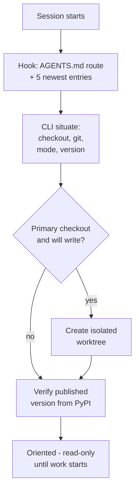
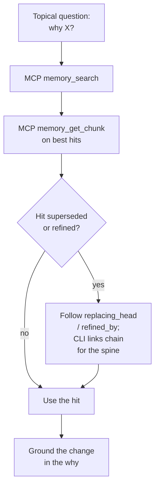
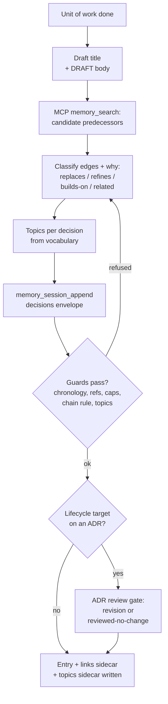
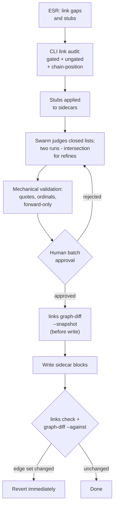
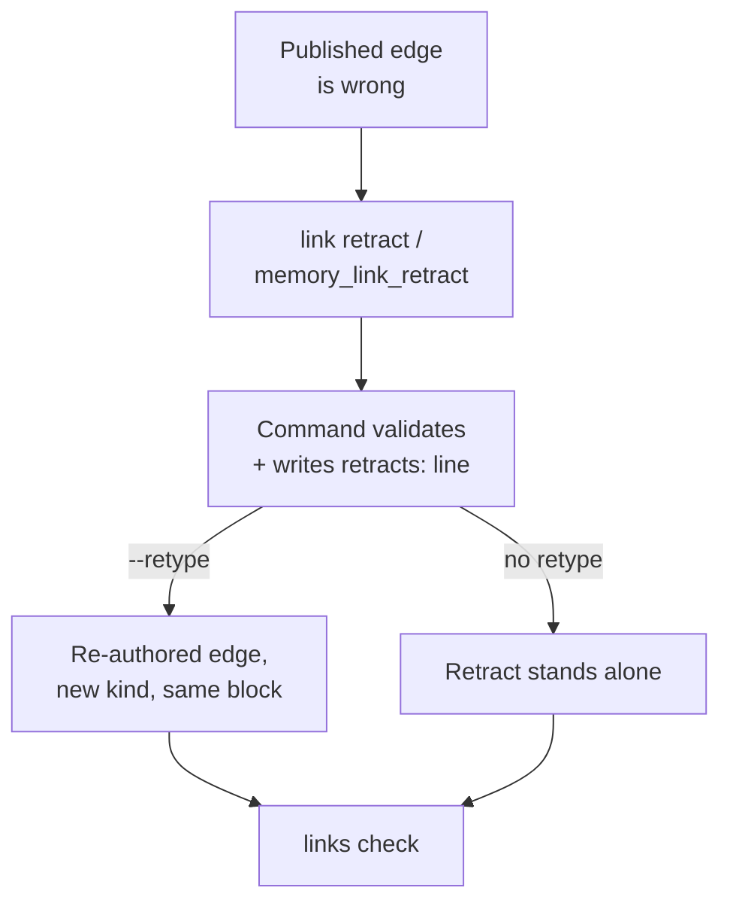
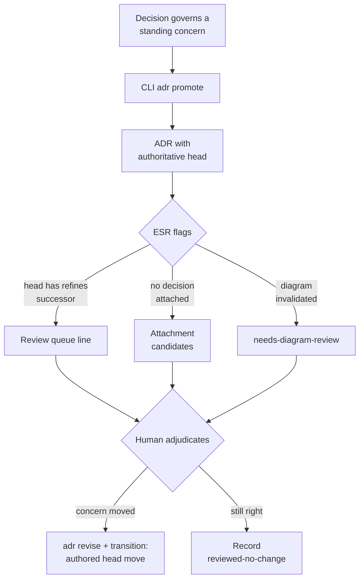
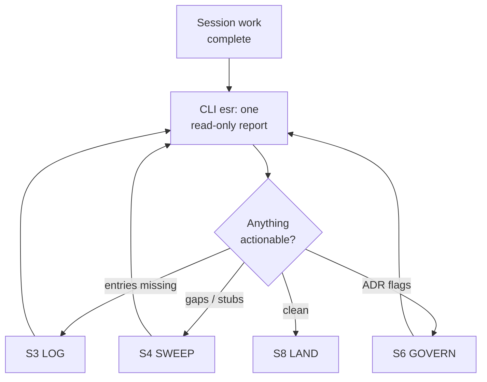
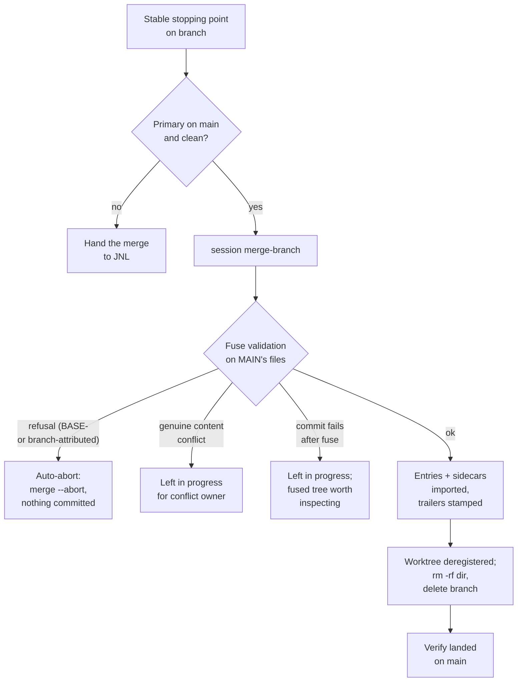

# Agent Interaction Storylines: process and tool review

Status: Living document (updated 2026-08-10; kept true as storylines change)

Every distinct way an agent interacts with Memory Seed, defined as a named **storyline**: what
triggers it, the steps it walks, which tool surface carries each step (MCP / CLI / convention), a
diagram, and an evaluation. The final sections cross-cut: a tool inventory mapped to storylines, a
surface-parity matrix, and a numbered list of redundancies and inefficiencies (**R1–R12**) with
streamlining recommendations.

Ground truth: `memory_seed/mcp_server.py` (19 MCP tools), `memory-seed --help` (CLI tree),
`.memory-seed/skills/` (the prose that scripts each flow). Convention-only steps — ones no tool
enforces — are marked, because they are where process drift starts.

The eight storylines:

| # | Name | One line | Trigger |
|---|------|----------|---------|
| S1 | **ORIENT** | Establish where and when you are | Session start / re-entry |
| S2 | **RECALL** | Retrieve the *why* behind existing work | Before design/change on non-obvious code |
| S3 | **LOG** | Record a unit of work as a decision-carrying entry | After each meaningful unit of work |
| S4 | **SWEEP** | Find and judge missing lifecycle edges at scale | ESR gap report / periodic campaign |
| S5 | **CORRECT** | Downgrade or retype a published edge, append-only | A published edge is wrong |
| S6 | **GOVERN** | Promote, revise, and review standing concerns (ADRs) | A decision governs a standing concern |
| S7 | **CLOSE** | End-of-session mechanical preflight | Before ending a session |
| S8 | **LAND** | Integrate branch-local memory into main | A stable, tested stopping point |

---

## S1 ORIENT — establish where and when you are

**Trigger:** session start (automatic via SessionStart hook) or mid-session re-entry (`/situate`).

**Flow**

1. SessionStart hook injects: nearest `AGENTS.md` routing, the five newest session entries (read
   directly by date, never by search), and skill inventory.
2. `situate` reports measured facts: which checkout this actually is (worktree identity is
   measured, not declared), git branch + cleanliness, `integration_mode` / `merge_trigger`, newest
   session entry, worktree roster, local version vs CHANGELOG state.
3. Published version verified from PyPI (printed command; never assumed).
4. If the session will write and this is the PRIMARY checkout: create an isolated worktree first.

**Tools**

| Step | Surface |
|------|---------|
| Hook injection | Harness hook → CLI internals (no agent action) |
| Local report | CLI `situate` |
| Branch posture (piecemeal) | MCP `memory_branch_status`, `memory_worktree_guard`; CLI `branch`, `worktree` |
| PyPI check | Convention (printed `curl` command) |
| Recent-activity digest | CLI `compact` |

**Evaluation.** Solid: orientation is measured, not declared, and the hook makes recency-correct
context automatic — the "latest state via search" failure mode is designed out. Weaknesses: four
overlapping posture surfaces (**R1**) and no MCP twin for `situate` itself, so an MCP-only agent
assembles orientation from three narrower tools (**R8**).

---

## S2 RECALL — retrieve the *why* behind existing work

**Trigger:** before designing or changing anything non-obvious; answering "why was X decided".

**Flow**

1. Frame the question topically (this is *not* the recency path — S1 owns "what is latest").
2. `memory_search` over the corpus (lexical + semantic, decision granularity).
3. Pull full context for a hit: `memory_get_chunk`; follow lifecycle fields (`replacing_head`,
   `evolved_head`, `refined_by`) to the current form rather than the hit itself.
4. Inspect edges around it: `memory_link_show`; since this tranche, `links chain <ref>` shows the
   whole refines chain (root → head, owning ADR).
5. For repeatable retrieval shapes: retrieval-spec preview/resolve.

**Tools**

| Step | Surface |
|------|---------|
| Search | MCP `memory_search` (no CLI search command) |
| Chunk fetch | MCP `memory_get_chunk` |
| Edge view | MCP `memory_link_show`; CLI `link show`, `link commits` |
| Chain view | CLI `links chain` only — **no MCP twin** |
| Spec retrieval | MCP `memory_retrieval_spec_preview` / `_resolve`; CLI `retrieval-spec` |

**Evaluation.** Solid: search is freshness-aware (heads boosted, replaced dampened), and the chain
view finally makes "what does this decision say NOW" one command. Weaknesses: search exists only on
MCP while chain exists only on CLI — the two halves of one storyline live on different surfaces
(**R8**); the recall-before-linking discipline is convention-only (**R6**).

---

## S3 LOG — record a unit of work (the flagship storyline)

**Trigger:** after every meaningful unit of work, on the feature branch, not at session end.

**Flow** (this is the storyline JNL described, as actually implemented)

1. Draft the entry: title + D/R/A/F/T body (agent voice; tool owns structure).
2. **Recall pass:** `memory_search` on the entry's topic to find candidate predecessors — the
   entry being written usually refines, builds on, replaces, or relates to something. (Convention;
   `link suggest` can rank candidates mechanically.)
3. Classify each edge: `replaces` / `evolves (refines|builds-on)` / `related` — one `refines`
   successor per target decision; every lifecycle edge carries a `why`; chain rule: link a chain
   once, at its head.
4. Pick topics per decision from the controlled vocabulary (area + activity axes).
5. Append through the guards: `memory_session_append` (or CLI with `--decisions-file`). The tool
   mints the id, stamps the clock, validates refs/topics/caps/chains, renders the entry AND both
   sidecars (links, topics) in one transaction.
6. If a lifecycle target is attached to an ADR: the **mandatory ADR review gate** fires —
   `memory_adr_review` context must be answered (revision / reviewed-no-change) before the write
   lands.
7. If the decision earns a diagram (ADR attachment): diagram sidecar obligation (answer, not
   necessarily draw).

**Tools**

| Step | Surface |
|------|---------|
| Recall pass | MCP `memory_search` (convention that it runs); MCP `memory_link_suggest` / CLI `link suggest` |
| Topic check | MCP `memory_topics_list` / `memory_topic_inspect`; CLI `topics list` |
| Append + guards | MCP `memory_session_append`; CLI `session append --decisions-file` |
| ADR gate | MCP `memory_adr_review`; CLI `adr revise` / `adr transition` for the outcome |
| Verify | CLI `links check` (fast confirmation, optional — guards already ran) |

**Evaluation.** This is the most guarded storyline in the system and the guards are genuinely
write-time (the cheapest moment). Weaknesses: the recall pass (step 2) — the heart of JNL's
description — is **pure convention**; nothing in `memory_session_append` asks "did you look"
(**R6**). `link suggest` and `link audit` overlap as candidate rankers (**R2**). One append
re-reads the corpus several times across independent guards (**R5**).

---

## S4 SWEEP — find and judge missing lifecycle edges at scale

**Trigger:** ESR reports link gaps / open stubs; periodic swarm campaign.

**Flow**

1. `link audit` builds candidates per gap: lexical gate (files / title terms / topics) + semantic
   ranking + bounded ungated pass + **chain-position annotation** (interior = related-only;
   replaced replaced-by-substitute).
2. `link audit --apply` writes inert classification stubs into link sidecars.
3. Swarm judgment (link_swarm.md): closed candidate lists, per-gap verdicts with grounding quotes;
   **two runs, intersection for `refines`** (the agreement rule).
4. Orchestrator validates mechanically (quote grounding, ordinal existence, forward-only);
   the mechanical validator is the authority, never worker self-reports.
5. Human batch approval — never write without it.
6. Write approved edges to each source entry's own date sidecar; `links check`; then
   `links graph-diff --snapshot` (taken before the write) `--against` (diffed after) as the
   graph-level assertion for any bulk write — `links check` alone is NOT sufficient.

**Tools**

| Step | Surface |
|------|---------|
| Candidates | CLI `link audit` / `--json` — **no MCP twin** |
| Stubs | CLI `link audit --apply` |
| Single-target ranking | MCP `memory_link_suggest`; CLI `link suggest` |
| Judgment payloads | `--json` output (five projections carry chain-position flags) |
| Write | Hand-authored sidecar blocks or campaign script; CLI `link add` (related only) |
| Verify | CLI `links check` + `links graph-diff --snapshot`/`--against` — **no MCP twin** |

**Evaluation.** The strongest lesson-encoding in the system: closed lists, agreement gating,
mechanical authority, graph assertions — each one bought with a measured failure. **R4 CLOSED**:
`links graph-diff --snapshot`/`--against` moves the "edge set unchanged" assertion out of
throwaway campaign scripts and into a tool every write can call the same way. Weaknesses: the new
command shipped CLI-only, which *enlarges* the surface split rather than closing it — the whole
storyline (candidates, stubs, and now the graph assertion) is CLI-only (**R8**); audit rebuilds
corpus+spine+graph on every call even inside ESR, which just built them (**R5**).

---

## S5 CORRECT — downgrade or retype a published edge, append-only

**Trigger:** a published edge is wrong (wrong kind, wrong target, no longer holds).

**Flow**

1. Never edit the published block. `link retract` (CLI) or `memory_link_retract` (MCP) appends a
   NEW sidecar block keyed to the same entry — no hand-authoring.
2. The command names the exact edge (kind + ref, optionally pinned by date) and writes a
   validated `retracts:` line; one retract per edge (comma multi-ordinal refs expand to one line
   per ordinal, `--dry-run` previews the block before it lands).
3. A downgrade is `--retype`: the tool pairs the retract with a fresh edge of the new kind in the
   same block (retract-and-retype); the surviving-projection rule keeps the replacement's
   entry-level view.
4. Retracts reach entry-YAML edges too, scoped to the same entry — the same command, no branching.
5. `links check` validates (malformed / dangling / forward-only retracts; the untyped-evolves
   error is closable only this way) — now a confirmation of what the command already
   pre-validated, not the first gate the block meets.

**Tools**

| Step | Surface |
|------|---------|
| Author retract block | CLI `link retract`; MCP `memory_link_retract` |
| Validate | CLI `links check`; MCP `memory_topics_check` (topic retracts) |

**Evaluation.** The append-only semantics are now complete (entry-YAML reach closed the last silent
no-op), and the **zero-tool gap is CLOSED (R3)**: `link retract` / `memory_link_retract` write the
correctly-grammared block on both surfaces, with a `--dry-run` pre-validation pass so a malformed
retract never reaches the sidecar in the first place — `links check` is now a second, independent
confirmation rather than the only gate. Retract-and-retype (`--retype`) is the mandated fix for
three different `links check` errors, so this closes the clearest single gap the toolset had.

---

## S6 GOVERN — promote, revise, and review standing concerns

**Trigger:** a decision governs a standing concern; or ESR flags an ADR as stale.

**Flow**

1. Promote: an existing decision becomes a proposed ADR (`adr promote`); founding sources allowed.
2. Head movement is authored-only: `revision-proposed` + `revision-accepted` (`adr revise`,
   `adr transition`). Machine edges NEVER move heads.
3. Standing review inputs, all mechanical, all flag-only:
   - **ADR review queue** (new): head has a `refines` successor → propose a revision or record
     reviewed-no-change. The preamble names both answer paths verbatim: the revision path
     (author the successor decision, then `adr revise` + `adr transition`) and the
     reviewed-no-change path (MCP `memory_session_append`'s review gate, `{"outcome": "no-change",
     "reason": ...}` — the CLI has no equivalent).
   - **Attachment candidates**: ADRs with no decision, ranked topic-gated + ungated.
   - **Diagram review**: `needs-diagram-review` when evolution invalidates the answer.
   - Both queues are now also machine-readable: `esr --json` carries `adr_attachment_candidates`
     and `adr_head_reviews` as top-level keys, not prose-only.
4. Write-time interlock with S3: touching an ADR-attached decision's lifecycle fires the mandatory
   review gate (`memory_adr_review`).
5. Validate: `adr check` / `memory_adrs_check`.

**Tools**

| Step | Surface |
|------|---------|
| Promote / revise / transition | CLI `adr promote` / `revise` / `transition` — **no MCP write twin** |
| Review gate contexts | MCP `memory_adr_review` |
| Read | MCP `memory_adr_show` / `memory_adrs_list`; CLI `adr show` / `list` |
| Queues | CLI `esr` sections (review queue, attachment candidates) |
| Validate | MCP `memory_adrs_check`; CLI `adr check` |

**Evaluation.** The flag-only / authored-move split is consistently enforced and now has a
deterministic trigger (the refines spine) instead of keyword sweeps. **R7 CLOSED**: both ESR
queues reach `esr --json` / `to_dict()` as `adr_attachment_candidates` and `adr_head_reviews`, so
automation can consume them without scraping prose. **R9 CLOSED for this queue**: the review-queue
preamble now names both answering commands verbatim (see step 3). Weaknesses: ADR *write*
operations are CLI-only while the review *gate* is MCP — an MCP-context agent can be asked a
question it cannot answer on the same surface (**R8**); reviewed-no-change still has no standalone
recorder on any surface, only the MCP review-gate route through a full session entry (design
proposal filed, see `docs/2_Todo/adr-reviewed-recorder-proposal.md`).

---

## S7 CLOSE — end-of-session mechanical preflight

**Trigger:** before ending a session; the `/esr` skill.

**Flow**

1. `esr` runs every deterministic check read-only: links integrity, topics, link gaps (today's),
   open stubs, worktree posture + residues, seed-twin drift, docs check, diagram coverage, ADR
   attachment candidates, ADR review queue, semantic-provider health.
2. The agent acts on what is actionable now (log missing entries — S3; classify stubs — S4;
   answer review flags — S6), defers the rest visibly.
3. Lifecycle-edge sweep for the session's entries (`link audit --date <today>`).
4. Then LAND (S8).

**Tools**

| Step | Surface |
|------|---------|
| Report | CLI `esr` — **no MCP twin**; `--json` now carries `adr_attachment_candidates` + `adr_head_reviews` alongside the other sections |
| Per-section follow-ups | The storyline tools of S3/S4/S6 |

**Evaluation.** One command, one report, everything deterministic — the right shape. **R7 CLOSED**:
the ADR attachment-candidates and review-queue sections are now first-class `--json` keys, not
prose-only, so automation consuming the report no longer has to re-derive them. **R9 CLOSED**: the
ADR review queue line now names its own answering commands rather than leaving the agent to guess
which surface answers "revision or reviewed-no-change". Weaknesses: ESR internally rebuilds the
corpus for nearly every section (integrity, gaps, spine, attachment search — measured 4+ full
corpus builds per run, **R5**).

---

## S8 LAND — integrate branch-local memory into main

**Trigger:** a stable, tested stopping point on a `claude/<kind>/<topic>` branch.

**Flow**

1. Pre-check the PRIMARY checkout right before merging: on `main`, clean (it is shared; another
   session may have moved it — if dirty, hand the merge to JNL).
2. `session merge-branch --branch <b>` from the primary: validates the branch's entries and
   sidecars **with main's parser**, imports them block-by-block, git-merges code, stamps
   `Memory-Entry` trailers, deregisters the source worktree.
3. Failure paths (all hit this session, now revised):
   - Non-chronological sidecar (or any other fuse/staging refusal) on MAIN blocks the fuse — the
     refusal message says WHICH side it validated (`the BASE side` vs `branch <label>`, gated on
     both "the working tree was reset to base" and "the path exists on base") so a repair lands on
     the correct side, not reflexively on the branch.
   - That same class of refusal now **auto-aborts its own merge**: `git merge --abort` runs
     automatically and the result reports `merge aborted automatically; nothing was committed`.
   - A GENUINE non-session content conflict is the one case still left in progress, for the named
     conflict owner to resolve by hand — it is not a refusal this code path can auto-resolve.
   - A post-fuse `git commit` failure also leaves the merge in progress (the fused tree is worth
     inspecting before deciding how to proceed) — this is a narrow, deliberate exception, not a
     gap.
   - Schema/parser changes must still merge BEFORE data that needs them.
4. Post-merge: worktree dir needs manual cleanup on Windows (`rm -rf`); delete the merged branch;
   verify the changeset actually landed.

**Tools**

| Step | Surface |
|------|---------|
| Preview | MCP `memory_session_fuse_preview`; CLI dry-run |
| Merge | CLI `session merge-branch`; MCP `memory_session_integrate` (respects `merge_trigger`) |
| Posture | MCP `memory_branch_status` / `memory_worktree_guard`; CLI `branch` / `worktree` |

**Evaluation.** The fuse's validation is the right gate and trailer stamping preserves provenance.
**R10 CLOSED**: every refusal now carries side attribution, double-gated on "was the working tree
reset to base" and "does the path exist on base", so a BASE-side repair is never misdirected onto
the branch. **R11 CLOSED**: a refusal auto-aborts its own half-started merge instead of leaving
`MERGE_HEAD` behind — genuine content conflicts are still (correctly) left in progress for their
named owner, and a post-fuse commit failure is the one deliberate exception, also left in progress
so the fused tree can be inspected. Weaknesses: worktree cleanup is manual-by-known-bug (**R12**).

---

## Cross-cutting: tool inventory by storyline

**MCP (19):** `memory_search`, `memory_get_chunk`, `memory_retrieval_spec_preview/_resolve` (S2);
`memory_session_append`, `memory_link_suggest`, `memory_topics_list/_check`, `memory_topic_inspect`,
`memory_adr_review` (S3); `memory_link_show`, `memory_link_retract` (S2/S4/S5); `memory_adr_show`,
`memory_adrs_list`, `memory_adrs_check` (S6); `memory_branch_status`, `memory_worktree_guard`,
`memory_session_fuse_preview`, `memory_session_integrate` (S1/S8); `memory_dir` (infra).

**CLI (agent-facing subset):** `situate`, `compact`, `branch`, `worktree` (S1); `retrieval-spec`,
`links chain` (S2); `session append`, `topics list/check/suggest` (S3); `link audit/suggest/add/
retract/show/commits`, `links check/graph-diff` (S4/S5); `adr promote/revise/transition/show/list/
check` (S6); `esr`, `docs check/index`, `quality`, `ranking-ab` (S7); `session merge-branch` (S8).
Setup/maintenance (`init`, `update`, `upgrade`, `agents`, `skills`, `hooks`, `migrate`, `encoding`,
`doctor`, `version`, `help`, `processes`, `shutdown`) sit outside the storylines.

**Surface parity matrix** (✓ = exists, — = missing):

| Storyline step | MCP | CLI |
|---|---|---|
| Orientation report (situate) | — | ✓ |
| Search | ✓ | — |
| Chain view | — | ✓ |
| Entry append + guards | ✓ | ✓ |
| Candidate ranking (one target) | ✓ | ✓ |
| Gap audit (corpus sweep) | — | ✓ |
| Edge retract | ✓ | ✓ |
| Graph snapshot/diff | — | ✓ |
| ADR read / check | ✓ | ✓ |
| ADR write (promote/revise/transition) | — | ✓ |
| ADR review gate | ✓ | — |
| ESR report | — | ✓ (`--json` now carries both ADR queues — see R7) |
| Merge / integrate | ✓ | ✓ |

---

## Redundancies and inefficiencies (the streamlining list)

- **R1 — Four posture surfaces overlap.** `situate`, `branch`, `worktree`, `compact` (+ MCP
  `memory_branch_status`, `memory_worktree_guard`) all report overlapping slices of "where am I".
  `situate` already subsumes most of the others. *Recommend:* make `situate` the one orientation
  surface, keep the narrow tools as its internals, deprecate standalone `branch`/`worktree` from
  the agent-facing story.
- **R2 — Two candidate rankers.** `link suggest` (single target, consulted-provenance) and
  `link audit` (gap sweep) rank the same kind of candidates with different scorers and payloads.
  *Recommend:* one ranking engine, two entry points; `suggest` becomes `audit --for <id>` sugar.
- **R3 — No retract tool (S5's write step is bare markdown).** Three `links check` errors name
  retract-and-retype as their fix, yet the fix has no command. *Recommend:* `link retract <kind>
  <ref> [--retype <kind>]` writing the correctly-grammared block; MCP twin.
  **RESOLVED (2026-08-10)** — `link retract` (CLI) and `memory_link_retract` (MCP) ship as twins,
  both validate and support `--retype` and `--dry-run`, and both reach entry-YAML edges.
- **R4 — Graph assertions live in throwaway scripts.** Every bulk sidecar write re-implements
  "edge set unchanged" by hand; `links check` cannot see it (proven twice). *Recommend:* a
  `links graph-diff` command (before/after snapshot + assert) so campaigns stop copy-pasting it.
  **RESOLVED (2026-08-10)** — `links graph-diff --snapshot`/`--against` (`--json` for scripted
  assertions) ships CLI-only; no MCP twin, so it also widens R8 rather than closing it.
- **R5 — Repeated corpus builds inside one operation.** `esr` builds the corpus/spine 4+ times
  across sections; `links check` parses files once and then builds the effective corpus again for
  the chain/untyped passes; one `session append` runs several independent corpus scans (refines
  cap, chain guard, ref existence). *Recommend:* one shared corpus/spine build per invocation,
  passed down (the `load_corpus` precedent, applied to the check/report layer).
- **R6 — The recall-before-linking step is convention-only.** S3's step 2 (search before you
  classify edges) is the storyline's soul and nothing enforces or even nudges it. *Recommend:*
  `memory_session_append` dry-run returns top link-suggest candidates for the entry's targets when
  the envelope declares no lifecycle links — a nudge, not a gate.
- **R7 — `esr --json` / `to_dict()` omit the two ADR queues.** Attachment candidates and the
  review queue render only in prose; automation can't consume them. *Recommend:* add both fields.
  **RESOLVED (2026-08-10)** — both fields shipped: `adr_attachment_candidates` and
  `adr_head_reviews` are top-level keys on `esr --json` / `EsrReport.to_dict()`.
- **R8 — Surface split mid-storyline.** Search (MCP-only) → chain view (CLI-only) in S2; review
  gate (MCP) → revision write (CLI) in S6; the whole of S4 and S7 CLI-only. Where a storyline
  crosses surfaces, an agent confined to one stalls. *Recommend:* MCP twins for `links chain`,
  `link audit`, `esr` (read-only ones first — they are cheap wrappers).
- **R9 — Queues don't route to their answers.** ESR's review-queue line tells the agent what is
  stale but not which command records reviewed-no-change vs proposes a revision. *Recommend:* each
  queue line carries its answering command verbatim.
  **RESOLVED (2026-08-10)** — the ADR review-queue preamble now names both answer paths verbatim
  (the `adr revise`/`adr transition` revision path and the MCP `memory_session_append`
  reviewed-no-change path); the reviewed-no-change side still has no standalone recorder command
  (see `docs/2_Todo/adr-reviewed-recorder-proposal.md`, design only).
- **R10 — Fuse failure misattributes the faulty side.** "Existing link sidecar blocks are not
  chronological" names the file but not that MAIN's copy (not the branch's) is what was validated;
  the natural fix-on-branch response deadlocks. *Recommend:* the message says which side failed
  and that the repair must land on main.
  **RESOLVED (2026-08-10)** — refusal messages now name the validated side (BASE at the reset
  commit, or the branch's contribution), double-gated on the fuse having actually reset the
  working tree to base AND the path existing on base, so the attribution is never asserted
  speculatively.
- **R11 — Fuse refusal leaves a partial merge.** The blocked merge stays in progress with a
  partial stage; committing it would half-apply. *Recommend:* auto-abort on refusal.
  **RESOLVED (2026-08-10)** — refusals now auto-run `git merge --abort` and report it; only a
  genuine non-session content conflict (no refusal to auto-resolve) and a post-fuse commit failure
  (deliberate — the fused tree is worth inspecting) still leave the merge in progress.
- **R12 — Manual worktree residue.** `git worktree remove` fails on Windows, so every LAND ends
  with a known manual `rm -rf`. Already tracked as a platform quirk; fold the cleanup into
  merge-branch's own post-merge step with the same fallback.

**Priority if streamlining now:** six of twelve items closed this tranche (R3, R4, R7, R9, R10,
R11) — S5's write step is no longer bare markdown, S4's graph assertion is a real command, both
ESR ADR queues are JSON-visible and self-routing, and S8's two worst failure modes (misattribution,
stranded merges) are fixed. What remains: **R8** (surface split) is now the sharpest item — R4
shipped CLI-only and *enlarged* it rather than shrinking it, on top of the pre-existing
search/chain, review-gate/revision-write, and whole-storyline splits; then **R5** (repeated corpus
builds, cost grows with corpus size); then the ergonomics (**R1**, **R2**, **R6**, **R12**).
