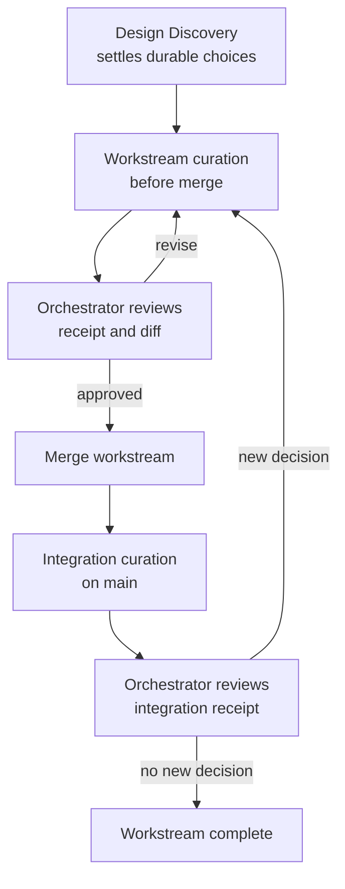

# Proposal: Decision Curator Orchestration

## Status

Inbox capture of an approved design direction. This is not yet an implementation plan or a normative
contract. It records the decisions reached during Design Discovery so they can be curated, planned, and
implemented without relying on the transient conversation.

## Summary

Memory Seed needs one purpose-built **Decision Curator** role. The orchestrator invokes it automatically
at decision gates to reconcile durable decisions with their topics, lifecycle links, ADR status, diagrams,
and Git provenance. The curator works in a fresh, bounded session whenever the host supports one; it is
not an inline continuation carrying the main conversation's full context.

The curator may perform safe, bounded curation in the assigned worktree, then returns a structured receipt
and proposed diff. The orchestrator reviews both before integration. Human approval remains mandatory for
authoritative lifecycle-edge classifications and ADR promotion, revision, attachment, or accepted-head
changes.

## Problem

Decision-heavy planning conversations can settle important choices without creating a durable, correctly
connected record. The resulting implementation may be sound while the decision graph is incomplete:

- user decisions are not consistently harvested from Design Discovery;
- accepted decisions may lack the explicit `user` or `agent` origin now required for new writes;
- topics, links, ADR dispositions, and diagrams drift from the decisions they explain;
- a worktree's ephemeral evidence can be lost or become difficult to reconcile after a merge;
- a generic persona catalogue has not been used in the project’s actual workflow, so it does not provide a
  reliable curation mechanism.

The desired mechanism is not another authority layer. It is a narrow, repeatable reconciliation pass that
keeps the existing Markdown records and their derived views in lockstep.

## Decision And Scope

Adopt one vendor-neutral Decision Curator role for Memory Seed. The role owns bounded decision curation;
the orchestrator owns dispatch, integration, and final judgement. It applies to all Memory Seed
installations, not only projects using Context Mode.

The implementation will retire the six unused generic persona templates from the live and seed inventories:
`developer`, `content-creator`, `researcher`, `sales-rep`, `solo-founder`, and `copywriter`. It will also
remove their installation/registry references. Historical session entries and archive material remain
untouched, and Git history remains recoverable.

This deliberately replaces the earlier local policy to deactivate personas rather than delete them. That
policy preserved optional domain personas after a weak usage signal. The new, explicit product direction
instead removes an unused generic catalogue and replaces it with one role that has an enforced job in the
workflow. The implementation record must link this change to `mse_498jee2br14bp2mp:d1` and
`mse_kvej10464e4qb99r:d1` as a supersession/evolution candidate, then obtain the normal human lifecycle
classification before authoring any live edge.

The Decision Curator does **not** replace the existing orchestrator/worker topology or the Worker Context
Contract. It is a specialised role within that topology, with a smaller packet and a distinct curation
objective.

## Design Principles

1. **Curation is automatic at named gates, not inferred silently from every message.** The orchestrator
   launches the gate when its trigger is met; the curator still distinguishes durable decisions from
   discussion.
2. **Decision origin is explicit.** Each newly recorded decision is tagged `user` when directly caused by
   user instruction or answer, and `agent` when it was discovered through implementation, investigation,
   testing, or review. The curator validates the tag and evidence but never relabels an agent inference as a
   user decision.
3. **Fresh context, bounded authority.** The preferred executor is a separate session with a compact task
   packet. It retrieves only the authority and history necessary for its curation pass.
4. **Same workstream before merge.** A pre-merge curator opens on the exact task worktree, branch, and HEAD
   being curated. It does not create a second worktree or a competing branch, and there is only one writer
   at a time.
5. **Review before integration.** The curator returns a receipt and proposed changes. The orchestrator
   judges them, requests correction if needed, and alone decides whether to integrate.
6. **Drafts are not authority.** The curator may create a draft ADR with cited evidence; it cannot accept,
   revise, attach, or advance an ADR head, nor classify a live lifecycle edge without the existing human
   gate.
7. **Vendor-neutral contract.** The role description names capability rather than a provider. A dispatch
   requests a small-to-medium capability tier with high reasoning effort and records the model actually
   selected or any substitution.

## Gate Topology

### Gate 1 — Workstream curation before merge

Run after Design Discovery has settled durable choices and again before a workstream is merged when
implementation, review, or testing has produced or changed durable decisions. The curator runs against the
same task worktree and branch, verifies the actual HEAD, and returns changes for the orchestrator to
review. The workstream is not merged until this gate has either produced an approved receipt or reported
that the change was genuinely decision-free and mechanical.

### Gate 2 — Integration curation after merge

Run on `main` after the workstream is integrated when the merged implementation created or changed durable
decisions. This pass checks the fused, canonical state: entry and commit identities, topics, proposed or
approved links, ADR drafts/membership, and any required diagrams. It may append a correction or an
integration-specific record, but never rewrites an entry published from the workstream. Its output is a
separate curation commit on `main`, reviewed by the orchestrator.

If that integration itself creates a durable decision, send that new decision through the workstream gate
on the integration branch before the task is declared complete. Skip the post-merge pass only for genuinely
decision-free mechanical work, and record why it was skipped.

## Dispatch And Fallback Contract

The gate always runs; only its executor changes:

1. **Preferred — external Decision Curator session.** Create a fresh session attached to the exact
   worktree, branch, and HEAD in scope. Give it the compact curation packet below. It may retrieve local
   evidence and make only the writes declared in its packet.
2. **Fallback — inline subagent.** If the host cannot create an external same-worktree session, the
   orchestrator invokes a bounded subagent with the same minimal packet, curation permissions, and receipt
   requirements.
3. **Fallback — orchestrator manual pass.** If neither mechanism is available, the orchestrator completes
   the same checklist manually and records that the gate used its manual fallback.

The fallback must not silently erase the gate, expand permissions, or inherit the full parent conversation
as a substitute for the packet.

## Curation Packet

Every dispatch contains:

- gate name: `design-discovery`, `workstream-pre-merge`, or `integration-post-merge`;
- exact repository path, worktree path, branch, base revision, and expected HEAD;
- a decision-harvest draft, including each decision’s proposed `user` or `agent` origin;
- source conversation evidence and relevant entry IDs;
- the smallest relevant current authority, ADR heads, and prior rationale;
- explicit allowed files and bounded write permissions;
- expected validations and the time/budget limit;
- the required receipt format and the instruction to stop for unresolved authority questions.

The curator must first confirm that its directory and revision match the packet. A mismatch is a failed
gate, not an invitation to curate a nearby checkout.

## Curation Work And Permission Boundary

Within its assigned checkout, the curator may:

- identify which proposed decisions are durable and record the evidence for that conclusion;
- validate explicit decision origins and request correction where origin is unsupported or missing;
- apply safe topic updates through the supported authoring surface;
- create or update diagrams where the decision shape warrants one;
- propose lifecycle edges and create only inert `classify_pending` stubs where the existing tools permit;
- review ADR relevance and automatically create a **draft** ADR with evidence and an appropriate diagram;
- run the bounded structural checks named in the packet.

It may not:

- invent user intent or turn ambiguous conversation into a user-origin decision;
- classify or publish a live `replaces`, `evolves`, or `related_entries` edge without human approval;
- accept, revise, attach, or advance an ADR’s accepted head;
- merge, push, force-update, delete unrelated content, or modify files outside its packet;
- integrate its own changes or treat its report as approval.

## Required Receipt

The curator returns a structured, human-readable receipt containing:

- gate, executor mode, repository/worktree/branch, base revision, and final HEAD;
- each candidate decision: durable or rejected, its `user`/`agent` origin, supporting evidence, and entry
  ID if written;
- topics applied and proposed lifecycle links, including any still awaiting classification;
- ADRs reviewed, draft ADRs created, and items requiring human ADR action;
- diagrams created or a reason one was unnecessary;
- files changed, validation commands/results, unresolved questions, and any denied or skipped action;
- a clear recommendation: approve, revise, or stop.

The orchestrator reviews the receipt and actual diff together. It may approve, request a bounded revision,
or reject the curation outcome. A passing structural check is evidence, not approval.

## Alternatives Considered

| Option | Why not selected |
| --- | --- |
| Keep the six generic personas inactive | Retains unused templates without creating an automatic, bounded curation capability. |
| Auto-capture every conversation sentence as a decision | Would confuse exploration with settled intent and cannot reliably establish origin or rationale. |
| Let Context Mode own decisions | Context Mode is an optional operational capture layer; Memory Seed remains the durable, tool-agnostic authority. |
| Let the curator accept ADRs and lifecycle edges | Violates the existing human approval boundary for authoritative metadata and ADR evolution. |
| Run every curator in a new worktree | Breaks provenance and review of the actual workstream state before merge. |

## Capability And Reuse Inventory

The design reuses existing Memory Seed capabilities rather than creating a second memory system:

- Design Discovery and Decision Harvest identify settled decisions.
- Session authoring validates chronology, controlled topics, decision envelopes, and provenance.
- Link audit can create inert pending classification stubs; humans classify live edges.
- ADR sweep retains its approval boundary for authoritative ADR changes.
- Mermaid guidance provides compact diagrams for topology, state, and handoff structure.
- The Worker Context Contract supplies the packeted, safety-preserving context model.
- Git worktree and session-fusion rules preserve branch provenance and post-merge reconciliation.

Context Mode may independently capture operational events, but it is not required for this design and must
never substitute for a Memory Seed decision, receipt, or approval.

## Implementation Boundaries

The later implementation plan should cover, at minimum:

1. A vendor-neutral `decision-curator` agent template and generated registry/install inventory.
2. Retirement of the six named live and seed persona templates plus all current references and tests.
3. A reusable packet/receipt schema and deterministic gate triggers in Design Discovery, pre-merge, and
   post-merge orchestration.
4. Dispatch adapters for external sessions, bounded inline subagents, and manual fallback reporting.
5. Safe topic/diagram/draft-ADR operations, with explicit rejection paths for authority-gated changes.
6. Validation of exact worktree/branch/HEAD provenance, one-writer discipline, and fused post-merge state.
7. Live/seed parity, migration/legacy behaviour, and documentation updates.

No implementation should start from this document alone. First perform the Decision-Harvest Curation Gate,
turn the approved direction into a sequenced plan, and obtain any approval required for destructive
persona retirement and live lifecycle/ADR actions.

## Observable Outcomes

The design is working when a decision-heavy workstream can show:

- which decisions came directly from the user versus agent investigation;
- a bounded curator receipt tied to the exact branch or integrated commit;
- complete topic, link, ADR, and diagram dispositions for durable decisions;
- a visible human approval point before authoritative relationship or ADR changes;
- a post-merge verification pass that reconciles the canonical `main` history; and
- a safe manual fallback when no external or inline executor is available.
