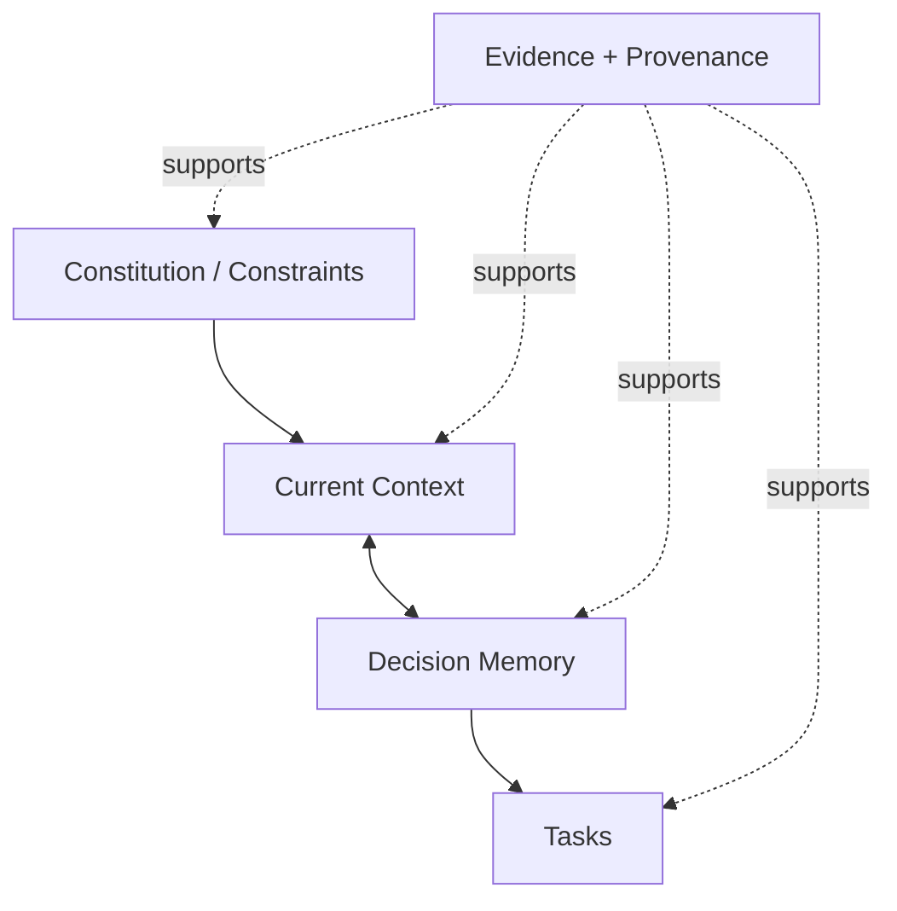
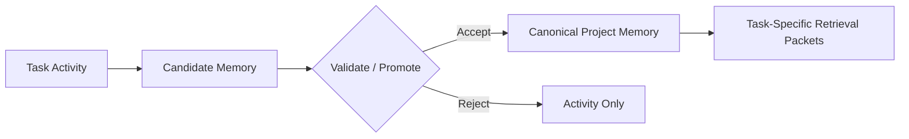
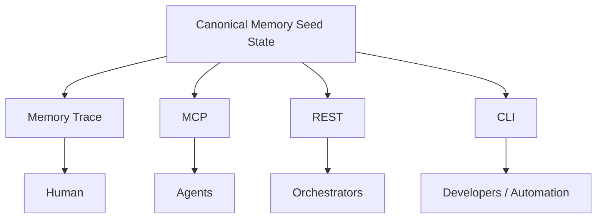
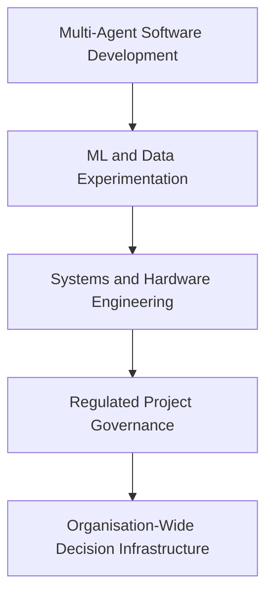
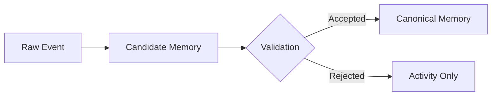
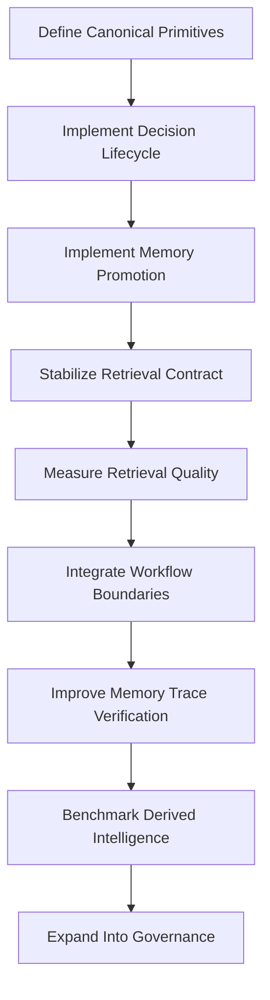

# Proposal: First-Principles Product Definition and Improvement Strategy for Memory Seed

**Status:** Proposal  
**Project:** Memory Seed  
**Date:** 2026-08-20

## Executive Summary

Memory Seed should be reduced to one fundamental job:

> **Preserve the decision state of a project and retrieve the smallest evidence-backed context a human or agent needs to act correctly.**

This is more precise than positioning Memory Seed primarily as AI memory, a knowledge graph, project governance, or agent infrastructure. Those may be capabilities or downstream outcomes, but the irreducible problem is preventing humans and agents from repeatedly reconstructing why a project is the way it is.

> **Memory Seed is Git-native decision memory for long-running, AI-assisted projects.**

The strongest initial wedge is **small AI-native engineering teams using multiple coding agents on long-lived Git repositories**. The natural expansion path is into ML/data experimentation, systems engineering, regulated engineering, and eventually organization-wide decision governance.

The strategic constraint is:

> **Do not allow the ontology, graph, orchestration layer, or governance narrative to become more sophisticated than the underlying ability to return the correct decision, with evidence, at the moment it is needed.**

## 1. First-Principles Problem

Projects produce six important forms of information:

| Information | Fundamental question |
|---|---|
| Current state | What is true now? |
| Constraints | What must remain true? |
| Decisions | Why did we choose this? |
| Evidence | What supports that decision? |
| Tasks | What are we trying to change next? |
| Activity | What happened during the work? |

Git preserves changes. Issue trackers preserve work items. Documentation preserves explanations someone remembered to write. Agent conversations preserve temporary reasoning. Code graphs describe present structure.

The missing object is usually:

> **A durable, current, attributable record of the decisions that produced the present state.**

Memory Seed should therefore optimize for the **cost of reconstructing project rationale**, not the quantity of memory stored.

## 2. Conceptual Model



### Constitution / Constraints
What must remain true: engineering principles, architectural boundaries, regulations, business requirements, security policies, and project non-negotiables.

### Current Context
What is presently true: architecture, interfaces, terminology, active components, data contracts, and accepted conventions.

**Context describes the current world.**

### Decision Memory
Why the current world became that way: decisions, rationale, rejected alternatives, evidence, assumptions, risks, and supersession history.

**Memory describes the project's evolution.**

### Tasks
What is intended next. Tasks are normally ephemeral. Only meaningful decisions, evidence, and state changes should be promoted into durable memory.



## 3. Canonical Information Model

| Primitive | Meaning | Current equivalent |
|---|---|---|
| **Constraint** | What must remain true | Constitution |
| **State** | What is currently true | Project context |
| **Decision** | What was chosen and why | ADR / Important Decision |
| **Evidence** | What supports a claim | Evidence anchors and packets |
| **Task** | What is intended next | Task layer |
| **Artifact** | What was affected | Files, commits, PRs, issues, datasets |

Actors and provenance identify who or what produced each object.

> **Sessions are activity logs, not canonical memory.**

> **Topics, links, ontologies, and graphs are indexes or derived views, not canonical truth.**

The canonical layer should contain the smallest validated set of objects necessary to reconstruct the project's decision state.

## 4. Humans and Agents

Humans and agents should share canonical records, lifecycle states, evidence, retrieval semantics, and provenance, but receive different projections.

| Consumer | Appropriate projection |
|---|---|
| Human | Timeline, Trail, reader, evidence inspection |
| Agent | Bounded structured packet with requirements and citations |
| Orchestrator | Machine-readable retrieval contract |
| Auditor | Decision lineage, evidence, actors, supersession |

> **Same source of truth, different projections.**



## 5. Product Fit

**Memory Seed Fit ≈ (Decision Density × Cost of Forgetting × Project Duration × Handoffs/Agent Concurrency × Audit Requirement) / Capture Friction**

| Project type | Fit |
|---|---:|
| Long-running, multi-agent software | **Very high** |
| AI-forward consultancy / agency | **High** |
| ML and data-science experimentation | **High** |
| Regulated / safety-sensitive engineering | **Very high** |
| Large platform migration | **Very high** |
| Complex solo project | **Medium-high** |
| General project management | **Low-medium** |
| Personal note-taking | **Low** |
| Disposable prototypes | **Low** |
| General conversational memory | **Low** |

### Initial Wedge

> **Small AI-native engineering teams using multiple coding agents on long-lived Git repositories.**

This has a version-controlled substrate, visible daily context loss, high agent fragmentation, low organizational adoption requirements, and measurable implementation outcomes.

### Expansion Path



## 6. Audit of Current Initiatives

| Initiative | Judgment |
|---|---|
| Retrieval contract | **Core product** |
| Evidence packets | **Core product output** |
| ADRs / Important Decisions | **Canonical memory primitive** |
| Constitution | **Stable constraint layer** |
| Memory Trace Trail | **Core trust surface** |
| Graph View | Secondary exploratory surface |
| Session logs | Raw input, not permanent memory by default |
| Topic sidecars | Keep where retrieval/filtering improves |
| Relationship sidecars | Keep if rebuildable, evidence-backed, benchmarked |
| Ontology generation | Means, not end |
| ICM | Experimental enrichment layer |
| Graphify | Complementary source-state provider |
| Semble | Potential relationship generator |
| Orchestrator / workers | Consumers, not irreducible core |
| Agent summaries | Evidence-bounded presentation layer |
| Multi-user collaboration | Expansion after core quality |

### Memory Seed Should Own

- canonical project memory;
- decision and constraint schemas;
- provenance;
- lifecycle and supersession;
- retrieval;
- evidence packaging;
- human inspectability;
- provider-neutral access.

### Memory Seed Should Not Own

- general task management;
- agent execution;
- model routing;
- full code understanding;
- generic personal memory;
- every project document or conversation;
- the entire orchestration stack.

## 7. Highest-Leverage Improvements

### 7.1 Canonical Decision Contract

ADR and Important Decision should become views or subtypes of a common `DecisionRecord`.

```yaml
id:
type:
status:
scope:
decision:
rationale:
constraints:
alternatives_considered:
evidence:
affected_artifacts:
risks:
author:
agent:
created_at:
supersedes:
superseded_by:
confidence:
```

Specialized records can extend this for architecture, experiments, diagnosis, policy, or data contracts.

### 7.2 Explicit Memory Promotion



Candidates may be deterministically accepted, human-approved, agent-validated, rejected, or merged.

The primary enemy is not simply forgetting. It is **remembering too much indiscriminately**.

### 7.3 Retrieval Quality as the Primary Metric

> **Did Memory Seed return the critical project decisions required for this task without flooding the consumer with irrelevant material?**

| Metric | Purpose |
|---|---|
| Critical-decision recall | Necessary decisions retrieved |
| Irrelevant-context rate | Unnecessary packet content |
| Stale-memory rate | Superseded information returned as current |
| Provenance completeness | Claims linked to evidence |
| Decision adherence | Agent follows retrieved constraints |
| Token compression | Useful knowledge per token |
| Time-to-correct-action | Speed to correct work |
| Capture burden | Maintenance effort |

**Memory Quality = (Relevance × Correctness × Freshness × Provenance) / Capture and Retrieval Burden**

### 7.4 Lifecycle as First-Class State

Support: proposed, accepted, uncertain, rejected, superseded, invalidated, stale, archived.

The system should answer: Is this current? What replaced it? What depends on it? What conflicts with it? Has its evidence become invalid?

### 7.5 Capture at Natural Decision Boundaries

Prioritize task completion, PR creation, review, merge, release, experiment evaluation, architecture approval, and incident resolution. GitHub PR, commit, issue, and worktree linkage should be high priority.

### 7.6 Memory Trace as an Inspection Tool

For each retrieved record expose why it was included, query match, lifecycle state, evidence, supersession, dependencies, authorship, and human/agent origin.

### 7.7 Derived Intelligence Must Earn Complexity

Topics, links, ontologies, Graphify, Semble, and ICM must measurably improve task success, retrieval quality, explanation quality, or maintenance cost.

Every derived sidecar should be rebuildable, non-canonical, confidence-scored, evidence-linked, generator-versioned, and benchmarked.

### 7.8 Separate Product Positioning From Enterprise Outcomes

1. **Decision memory** — prevent rationale from disappearing.
2. **Coordination** — give humans and agents consistent context.
3. **Governance** — enforce constraints and expose deviations.
4. **Auditability** — reconstruct decisions and evidence organization-wide.

## 8. Validation Experiments

### Experiment A — Memory Seed Developing Itself
Test software and multi-agent coordination. Measure fresh-agent time to useful work, contradictory implementation, architectural-rule violations, repeated investigation, token use, and retrieved-record utilization.

### Experiment B — ML / Data-Science Project
Capture dataset versions, feature decisions, preprocessing, model comparisons, threshold rationale, leakage findings, rejected experiments, metrics, runtime constraints, and conclusions. Measure reproducibility, repeated disproven experiments, correct metric selection, and reconstruction time.

### Experiment C — Engineering Diagnosis / FTA Project
Capture diagnostic assumptions, expert rules, mappings, evidence, exceptions, revisions, dependencies, limitations, and uncertainty. Measure rule-to-evidence traceability, change impact analysis, onboarding time, contradictions, and decision-lineage completeness.

### Negative Control — Low-Decision Project
Use a disposable utility project to establish where Memory Seed's capture overhead exceeds its value.

## 9. Benchmark Design

| Condition | Contents |
|---|---|
| **A. Baseline** | Repository and normal documentation only |
| **B. Memory Seed Core** | Decisions, constraints, retrieval contract, evidence packets |
| **C. Memory Seed Enriched** | Core plus topics, links, ontology, ICM, etc. |

Keep model, task instructions, repository state, token allowance, execution time, validation tests, and task order constant where practical.

Evaluate:

1. task correctness;
2. critical decisions followed;
3. critical decisions omitted;
4. unsupported assumptions;
5. repeated work;
6. tokens consumed;
7. context-assembly time;
8. capture and maintenance cost;
9. final explanation quality;
10. evidence citation ability.

This separates two hypotheses:

> **H1: Durable decision memory improves project work.**

> **H2: Derived structures provide measurable additional value beyond core decision memory.**

Memory Seed Core must win before enrichment becomes a product requirement.

## 10. Strategic Sequence

### Phase 1 — Prove Memory Quality
Canonical primitives, decision promotion, lifecycle, retrieval contract, evidence packets, benchmark harness.

### Phase 2 — Prove Workflow Value
PR/commit linkage, issue/task linkage, worktree mapping, agent-session association, candidate extraction, Memory Trace explanations.

### Phase 3 — Prove Derived Intelligence
Independently benchmark topics, semantic relationships, ontology induction, ICM, Graphify, Semble, and advanced summarization.

### Phase 4 — Productize Governance
Organization constitutions, policy inheritance, project overrides, compliance evidence, approvals, permissions, and cross-project decision intelligence.

## 11. Critical Path



### Immediate Questions

1. What is the smallest canonical record required to preserve a project decision?
2. How does raw activity become candidate memory?
3. What validates or promotes that candidate?
4. How is supersession represented deterministically?
5. How does retrieval select minimum sufficient context?
6. How is retrieval quality measured?
7. How can a human inspect exactly why each record was returned?

Until these are demonstrably strong, ontology and graph sophistication should remain secondary.

## 12. Success Criteria

Memory Seed Core is validated when controlled experiments show that it can:

- reduce time for a fresh agent or human to understand a task;
- improve adherence to previous decisions and constraints;
- reduce repeated investigation and duplicated work;
- avoid presenting superseded decisions as current;
- return evidence for consequential claims;
- reduce context tokens without materially reducing critical-decision recall;
- reconstruct why the current project state exists;
- deliver these benefits without excessive capture burden.

Derived components should become first-class only when they demonstrate additional measurable lift against this baseline.

---

## 13. Final Product Definition

> **Memory Seed is not primarily a memory store. It is a system for maintaining and retrieving the decision state of a project.**

Its strongest immediate fit is:

> **Long-running Git-based engineering projects where multiple humans and agents must act without repeatedly reconstructing project history.**

The retrieval capability is the product core. Everything else should either **improve it, verify it, or consume it**.
