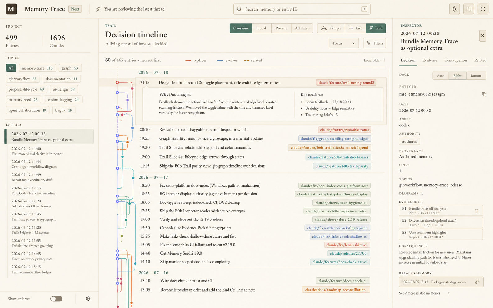
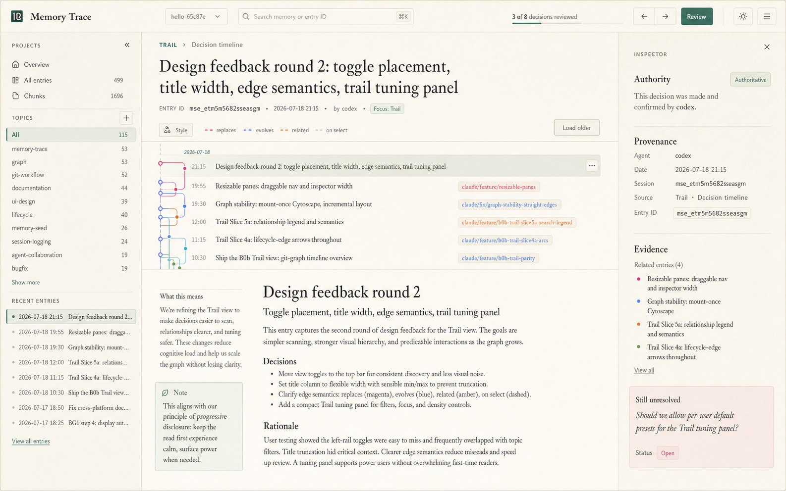
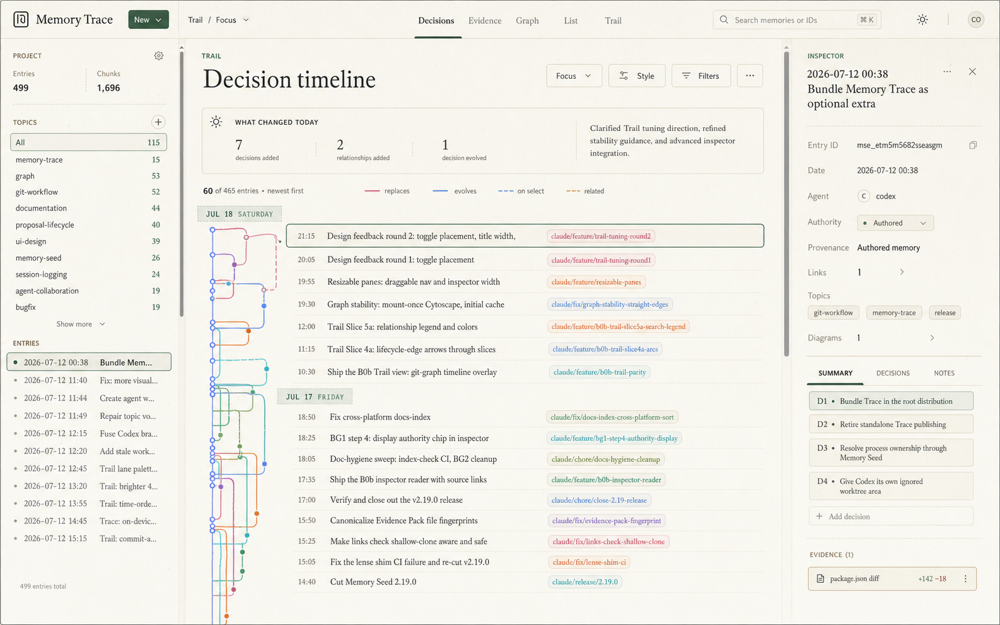
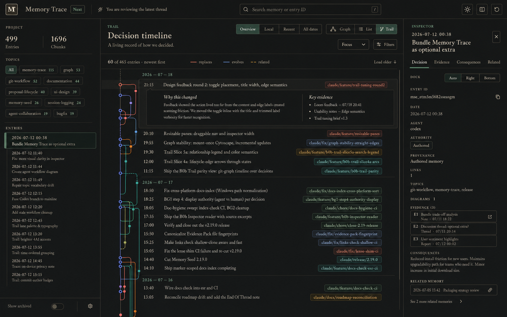
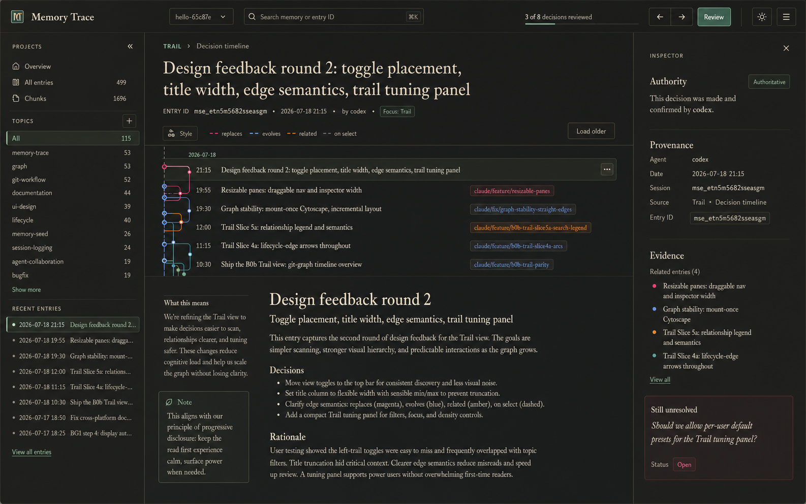

# Proposal: Living Archive for Community, Editorial Focus for Pro

Status: **INBOX — REFINED PRODUCT HYPOTHESIS, NOT APPROVED FOR IMPLEMENTATION**.

## 1. Product thesis

Memory Trace should have one humanised reading architecture with two progressively richer explanation
levels:

1. **Living Archive — Community:** a complete local, offline, deterministic reading experience that makes
   authored project memory understandable without an LLM.
2. **Editorial Focus — Pro:** an optional cited-synthesis layer that reads a bounded Evidence Pack and
   explains the story across multiple entries, decisions, evidence items, and unresolved questions.

The commercial boundary is synthesis, not comprehension. Community users must be able to understand and
trace their own history. Pro users pay to reduce the additional cognitive work of reconstructing a larger
story across that history.

This proposal does not create two applications. Both experiences use the same Trail, selection model,
reader, inspector, evidence contract, and visual system. Editorial Focus enriches the shared reading model;
it does not replace or obscure Living Archive.

## 2. Why this fits the current project

The proposal is a composition of existing work rather than a new platform:

| Current capability | Role here |
|---|---|
| React `/next` shell and shared selection | Common workspace for both editions |
| Trail timeline, branch lanes, lifecycle arcs, search dimming | Historical and relational context |
| Entry Reader | Authored document body and deterministic subsection display |
| Inspector authority/provenance rows | Trust boundary for authored and generated content |
| Deterministic Evidence Pack Phase 1 | Bounded input to Pro synthesis |
| Graph-edge contract | One source for related/supersedes/evolves relationships |
| Diagram and link sidecars | Additional authored evidence and navigation |
| Provenance/authority taxonomy | Keeps generated synthesis advisory and inspectable |
| Commercialisation proposal | Community Trail free; Pro analysis/generation; Team managed AI |

The missing product layer is a shared, readable **Decision Brief** presentation that can be populated from
authored facts in Community and enriched by a cited model result in Pro.

## 3. Design principles

1. **One archive, two explanation depths.** Layout and navigation remain familiar across editions.
2. **Authored before generated.** The archive always shows the source record; synthesis never becomes the
   only route to the evidence.
3. **Charge for synthesis, not access to memory.** Local history, Trail, evidence, and deterministic
   explanation remain useful without an account or model.
4. **Citations are interaction, not decoration.** Selecting a citation focuses the exact source entry or
   anchored section in the Trail and reader.
5. **Absence is explicit.** “No rationale recorded” and “insufficient evidence” are valid results.
6. **Generated content is advisory.** It exposes provider, model/revision, Evidence Pack fingerprint,
   generation time, freshness, and unsupported claims.
7. **No second source of truth.** Markdown entries and narrow authoritative sidecars keep their current
   ownership; briefs, caches, indexes, and model output are rebuildable projections.

## 4. Community experience — Living Archive

Living Archive transforms the current diagnostic-style workspace into a readable project chronicle while
remaining completely local and deterministic.



### 4.1 Main workspace

- Dated Trail sections behave like chapters rather than table separators.
- The relationship rail remains exact and visible, but secondary to entry titles and reading order.
- Selecting an entry expands a short inline brief without hiding neighbouring history.
- The right inspector becomes a document margin with `Decision`, `Evidence`, `Consequences`, and `Related`
  sections.
- Project counts and topic controls remain available but use progressive disclosure.

### 4.2 Deterministic “Why this changed”

Community may display an explanation only from material already present in the selected entry and its
validated relationships:

| Brief field | Deterministic source |
|---|---|
| What changed | entry title, Summary, Decision, changed files |
| Why | authored `R:` blocks or equivalent rationale section |
| Alternatives | authored `A:` blocks |
| Evidence | `T:` validation, commits, diagrams, source locations, evidence metadata |
| Consequences | explicit authored consequences; otherwise absent |
| Related memory | canonical graph neighbours and lifecycle edges |
| Still unresolved | explicit open-question metadata/sidecar only; never inferred silently |

The renderer must not turn file changes, test output, or semantic similarity into invented rationale. If
the source does not contain the answer, the interface says so and links to the underlying record.

### 4.3 Community capabilities

- local single-project Trail and full local history;
- decision and evidence reading;
- exact search-to-Trail navigation;
- authored rationale and alternatives;
- supersession/evolution context;
- diagrams, commits, and deterministic evidence surfaces;
- copy/export of authored briefs;
- offline operation, no account, no provider.

## 5. Pro experience — Editorial Focus

Editorial Focus adds a generated narrative beneath or alongside the selected Trail range. It is appropriate
when the question spans many records: “What happened?”, “Why did this direction win?”, “How did the decision
evolve?”, or “What remains uncertain?”



### 5.1 Focus interaction

1. The user selects an entry, date range, topic, branch, lineage, or graph neighbourhood.
2. Trace shows the deterministic Evidence Pack scope before generation.
3. The user requests a `Decision Brief`, `Change Brief`, `Handover Brief`, or `Open Questions Brief`.
4. The provider receives only the bounded Evidence Pack by default.
5. Trace validates the structured result and its citations.
6. The brief renders in the lower middle reading pane; every claim can focus its evidence in the Trail.

### 5.2 Generated brief content

- orientation: what period, feature, or lineage is being reviewed;
- executive summary;
- decisions and their authored rationale;
- how decisions evolved or were superseded;
- evidence supporting or weakening each conclusion;
- rejected alternatives;
- consequences and implementation outcomes;
- unresolved questions, assumptions, contradictions, and missing evidence;
- a source appendix with entry IDs, paths, sections, commits, and pack fingerprint.

### 5.3 Trust presentation

The brief must visibly say **AI-generated synthesis** and show:

- provider and model/revision;
- generated time and freshness state;
- Evidence Pack fingerprint and scope;
- cited/unsupported claim counts;
- “View Evidence Pack,” “Regenerate,” “Copy,” and “Compare” controls;
- authority `generated` and provenance `generated_artefact`, separate from confidence;
- no actionability unless a later explicit policy permits it.

## 6. Shared visual and interaction foundation

The first mockup remains useful as the design-system bridge between the two editions.



The shared language should include:

- warm paper neutrals, ink-like typography, forest green actions, and mineral relationship colours;
- serif titles for decisions and chapters, humanist sans controls, monospace only for identifiers;
- fewer containers and stronger typographic grouping;
- modest corner radii and fine rules rather than a wall of equal cards;
- plain-language orientation such as “What changed today” or “You are reviewing the latest thread”;
- exact, accessible selected/focus states that do not rely on colour alone;
- a restrained paper texture that can be disabled and never reduces contrast.

### 6.1 Dark-mode design contract

Dark mode is a first-class expression of the same editorial system, not a photographic negative of the
light theme. It should preserve hierarchy, evidence semantics, and product parity while changing the
material character from warm paper to warm ink.





- Use warm charcoal or espresso for the canvas, with stepped graphite/deep-olive surfaces; avoid pure
  black and bright-white glare.
- Use warm ivory for primary text and muted sand for metadata. Fine rules and disabled states must remain
  visible without becoming luminous chrome.
- Recalibrate forest, ochre, terracotta, dusty cyan, and mineral blue relationship colours independently
  for dark surfaces. `replaces`, `evolves`, `related`, focus, authority, and provenance must retain the
  same meaning in both themes.
- Selected, focused, warning, and generated states must combine colour with a marker, border, fill, icon,
  label, or typography change. Theme switching must never make colour the only signal.
- Keep reading surfaces matte. Reduce or disable texture at low contrast, high zoom, or when the user
  requests reduced visual effects; do not use glow, glass, or heavy shadows to separate panes.
- Community and Pro use the same semantic tokens. Editorial Focus may feel quieter and more concentrated,
  but generated synthesis must not become visually more authoritative than authored evidence.
- Support `light`, `dark`, and `system` preferences, persist an explicit choice locally, and update a
  `system` choice when the operating-system preference changes.

Dark-mode acceptance should cover both editions at normal and narrow pane widths, 200% zoom, keyboard-only
navigation, Windows high-contrast/forced-colours behaviour, and reduced texture/motion. Screenshot regression
fixtures should exercise the same representative Trail and inspector state in light and dark themes so
semantic drift is visible rather than hidden by different data.

## 7. Shared Decision Brief contract

Both editions should render the same versioned shape. Community produces a deterministic subset; Pro may
fill additional synthesis fields but may not overwrite authored values.

```json
{
  "schema_version": "1",
  "brief_kind": "decision",
  "scope": {
    "entry_ids": [],
    "selector": {},
    "evidence_pack_fingerprint": null
  },
  "orientation": {
    "title": "",
    "summary": "",
    "source": "authored_or_generated"
  },
  "decisions": [],
  "rationale": [],
  "alternatives": [],
  "evidence": [],
  "consequences": [],
  "unresolved_questions": [],
  "missing_evidence": [],
  "citations": [],
  "generation": null
}
```

### Ownership rule

- Authored fields resolve directly from entries or authoritative sidecars.
- Generated fields are a separate overlay carrying claim-level citations.
- The UI may interleave them for readability but must preserve their provenance visually and in data.
- A generated value cannot silently replace an authored value with the same semantic role.

## 8. Architecture

### 8.1 Community path

```text
Markdown entries + narrow sidecars
        -> existing retrieval and graph readers
        -> deterministic Decision Brief assembler
        -> Living Archive renderer
```

### 8.2 Pro path

```text
Community path
        -> deterministic Evidence Pack
        -> configured local/BYOK or managed provider
        -> schema + citation validation
        -> generated Decision Brief overlay
        -> Editorial Focus renderer
```

### 8.3 Likely implementation surfaces

| Surface | Expected responsibility |
|---|---|
| `memory-trace/client/src/TrailWorkspace.tsx` | chapter layout, range/lineage selection, inline brief placement |
| `memory-trace/client/src/EntryReader.tsx` | authored-source rendering and citation focus target |
| new `DecisionBrief.tsx` | shared Community/Pro brief renderer |
| `memory-trace/client/src/App.tsx` | edition capability state, selection, provider action routing |
| `memory-trace/memory_trace/evidence.py` | existing deterministic pack input |
| new shared brief assembler | deterministic Community brief projection |
| planned summary provider module | Pro provider abstraction and schema result |
| versioned `/api/v1` additions | brief/evidence-pack requests and capability status |

File names beyond existing surfaces are provisional. Promotion should confirm ownership before creating new
modules or contracts.

## 9. Edition boundary

| Capability | Community | Pro local/BYOK | Team managed |
|---|:---:|:---:|:---:|
| Full local Trail and history | Yes | Yes | Yes |
| Living Archive layout | Yes | Yes | Yes |
| Authored decision brief | Yes | Yes | Yes |
| Exact evidence navigation | Yes | Yes | Yes |
| Cross-entry AI synthesis | No | Yes | Yes |
| Local model / user API key | No | Yes | Optional |
| Managed AI allowance | No | No | Yes |
| Saved generated briefs | No | Local export | Shared reports |
| Cross-project synthesis | No | Candidate | Yes |

The file formats, Evidence Pack, citations, and exported brief must remain portable and readable without a
subscription. Entitlement gates the synthesis service or advanced module, never access to authored memory.

## 10. Delivery sequence

### Phase 0 — validate the reading model

- Test the light and dark Community/Pro mockups against five real decision trails.
- Confirm that the Living Archive hierarchy survives long titles, dense branches, missing rationale,
  keyboard navigation, and narrow panes in both themes.
- Test whether relationship recognition and reading comfort survive dark mode and whether generated content
  remains appropriately advisory.
- User-test the wording “Living Archive,” “Decision Brief,” and “Editorial Focus.”

**Exit:** one accepted Community information architecture and a measured comprehension improvement over the
current layout.

### Phase 1 — Community visual foundation

- Convert existing theme tokens into a documented semantic editorial token set with light and dark values;
  components consume semantic roles rather than literal palette colours.
- Implement chapter rhythm, quieter navigation, inspector sections, and progressive disclosure.
- Add `light`/`dark`/`system` selection, local preference persistence, operating-system change handling, and
  paired screenshot fixtures for shared Trail, reader, and inspector states.
- Preserve every current B0b parity and accessibility requirement.

**Exit:** the current Trail functions identically, with no provider or new data contract required.

### Phase 2 — deterministic Decision Brief

- Define the versioned shared brief schema.
- Assemble authored fields from existing parsed sections, graph edges, commits, diagrams, and evidence.
- Add explicit missing/unknown states and exact source navigation.

**Exit:** Community can explain a selected entry without generating prose or misrepresenting absence.

### Phase 3 — Pro provider adapter

- Implement the already-planned disabled-by-default provider interface over Evidence Packs.
- Start with local OpenAI-compatible/BYOK support; terminal-agent access remains out of scope.
- Validate structured output, citation resolution, pack membership, and provenance.

**Exit:** a model can produce a cited brief and fails closed when citations or schema are invalid.

### Phase 4 — Editorial Focus UI

- Add range/topic/lineage synthesis actions and the lower-middle focus pane.
- Add claim-to-source navigation, regeneration, comparison, freshness, and unsupported-claim display.
- Make provider absence degrade directly to the Community brief.

**Exit:** Pro adds synthesis without creating a different navigation model or hiding source evidence.

### Phase 5 — commercial validation

- Test Community versus Pro descriptions with users.
- Measure brief requests, citation opens, regeneration, time-to-understanding, and conversion intent.
- Decide whether local/BYOK belongs in Pro and managed AI in Team based on willingness to pay.

**Exit:** no managed-AI infrastructure is built before product and pricing evidence exists.

## 11. Acceptance criteria

### Community

- Living Archive remains fully usable offline with no account or model.
- All current Trail, search, graph, reader, inspector, diagram, and evidence functions remain reachable.
- “Why” is rendered only from authored rationale; missing rationale is explicit.
- A citation or relationship focuses its exact source.
- The interface passes keyboard, contrast, zoom, pane-resize, and large-history acceptance.
- Light, dark, and system themes expose identical capabilities and relationship semantics; explicit choice
  persists locally and `system` follows operating-system changes.
- Representative states pass contrast and screenshot-regression checks in both themes, including narrow
  panes, 200% zoom, and forced colours.

### Pro

- The provider receives only the visible Evidence Pack unless the user explicitly changes scope.
- Every material generated claim cites pack evidence; missing or invalid citations fail closed.
- Generated and authored values remain distinguishable in API data and presentation.
- No generated brief edits session history or becomes authoritative automatically.
- Provider absence, timeout, or invalid output leaves the Community experience intact.
- Cost/usage is visible before managed generation.
- Editorial Focus passes the same paired-theme checks, and dark treatment does not visually elevate
  generated synthesis above authored evidence, authority, provenance, or unsupported-claim warnings.

## 12. Risks and mitigations

| Risk | Mitigation |
|---|---|
| Free feels deliberately incomplete | Make authored briefs, evidence, and full history genuinely complete; gate synthesis only. |
| Model writes plausible narrative unsupported by sources | Evidence-Pack-only input, claim citations, strict validation, unsupported-state UI. |
| Community deterministic brief implies rationale that was never authored | Render extraction only and show explicit absence. |
| Generated prose visually outranks source truth | Keep source record visible, provenance-labelled, and one click from every claim. |
| Two editions fork the frontend | One `DecisionBrief` renderer and one selection model with capability-based enrichment. |
| “Open questions” duplicates Todo | Pilot against real records; admit only questions that qualify a decision or evidence scope. |
| Premium architecture arrives before demand | Build Community first; validate willingness to pay before managed AI. |
| Humanised styling harms dense technical use | Test long real entries, reduced motion/texture, high contrast, zoom, and keyboard operation. |
| Dark mode becomes a palette inversion or changes semantics | Use semantic tokens, paired-state fixtures, non-colour cues, and edition-parity review. |

## 13. Inbox ideas incorporated—and bounded

This proposal uses the strongest additions identified during inbox assessment:

- **Decision-level presentation:** useful for multi-decision entries, layered over existing entry identity.
- **Evidence addressing:** citations should target decisions/sections where deterministic anchors exist.
- **Queryable absence:** missing rationale/evidence/evaluation is different from `not_applicable`.
- **Open-question and assumption lenses:** eligible only as non-authoritative, evidence-linked Pro synthesis or
  a separately proven authored sidecar—not a generic task database.
- **Constrained-context evaluation:** compare time-to-understanding, citation correctness, context size, and
  unsupported-claim rate rather than optimizing token cost alone.

It explicitly rejects a comprehensive ontology, a second supersession graph, a general authoritative
sidecar manifest, mandatory historical intent backfill, or constitutional amendments before experiments.

## 14. Open decisions before triage

1. Is **Living Archive** the product name or only the internal design direction?
2. Is **Editorial Focus** a mode, a Pro capability label, or the name of the generated pane?
3. Should local/BYOK synthesis be paid Pro, or should a limited local-provider path remain Community while
   saved/comparative briefs are Pro?
4. Are generated briefs ephemeral by default, cached outside the repository, or exportable as explicit
   report artifacts?
5. Which first brief proves value: decision, change, handover, or unresolved-questions?
6. What user test demonstrates that Living Archive improves comprehension enough to become the B0b visual
   target rather than a later redesign?

## 15. Promotion criteria

Promote this proposal only when:

1. JNL selects Living Archive as the Community design direction.
2. Five representative real trails validate the information hierarchy and missing-data behaviour.
3. The shared Decision Brief schema does not duplicate an existing contract or create a second authority.
4. Community scope is demonstrably useful without AI.
5. Pro synthesis reuses the shipped Evidence Pack and planned provider boundary.
6. Free/Pro wording is tested with prospective users before licensing or managed-AI implementation.
