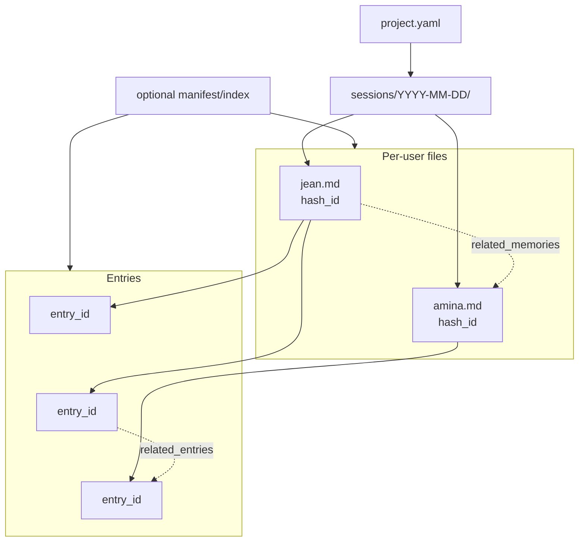
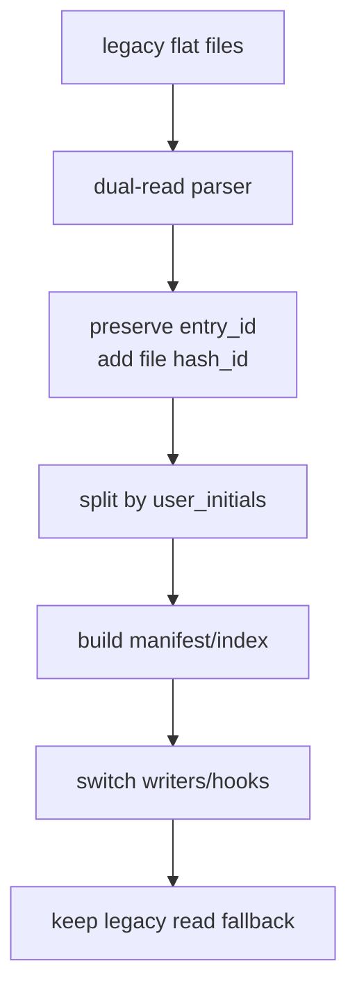

# Multi User Per Day Session Files and Hash Linked Memory Design for Memory Seed

## Executive summary

Memory Seed is already very close to supporting a strong multi-user session model. The project is a local-first memory/control-plane for coding agents, seeds a `.memory-seed/` runtime inside repositories, keeps session logs in Markdown, and already assigns stable per-entry identifiers that power MCP search and chunk retrieval. However, the *current* implementation, tests, and session hook all assume a **flat** session layout of `.memory-seed/sessions/YYYY-MM-DD.md`, so your proposed layout is **architecturally sound but not drop-in compatible** with the code as it exists today.

The strongest conclusion from the comparative review is that plain-text, local-first note systems tend to succeed when they separate **human-authored content** from **generated indexes**, keep metadata simple and durable, and reduce merge contention by sharding files. Dendron, SilverBullet, and historic file-based Logseq workflows all reinforce the value of Markdown plus metadata, while Joplin and Trilium show that true concurrent collaboration is easiest when a server/database mediates state and conflict handling. For Memory Seed, which is intentionally file-based and portable, the right answer is not "become a database", but rather "shard the human files and generate indexes separately".

I recommend adopting the directory layout `.memory-seed/sessions/YYYY-MM-DD/{user}.memory.md`, **with one crucial addition**: keep a **file-level** `hash_id` exactly as you proposed, but also retain or introduce a **per-entry** stable `entry_id`. Without entry-level IDs, `related_entries[]` is underspecified and fragile, because headings, line numbers, and content-derived hashes all move when the file is edited. Memory Seed already relies on per-entry IDs in tests, current session files, and MCP search results, so preserving that concept is the path of least resistance and the most robust design.

The implementation path should be a **dual-read, staged migration**. First, teach readers, compactors, hooks, and MCP search to understand both the legacy flat files and the new per-user/day tree. Second, migrate writes so new entries go to `{user}.memory.md`. Third, backfill file-level IDs and preserve existing `entry_id`s. Fourth, generate a manifest/index that maps `hash_id` and `entry_id` to file paths and line ranges. Finally, once tests and CI pass, make the new layout canonical. This gives you multi-user safety without losing history or breaking current search semantics.

The biggest design risks are not performance; they are **identifier stability**, **link semantics**, and **ownership/privacy expectations**. Today's entry IDs are generated from a truncated SHA-1 digest and are tested as `ms-` plus 8 hex characters. That is convenient, but too short for a growing multi-user corpus. Hashes should therefore move to at least **128 bits of effective identifier space**, preferably using SHA-256 in Python's standard `hashlib` and truncating only after generating a much larger digest. Also, per-user files improve attribution and reduce merge conflicts, but they do **not** create privacy by themselves; Memory Seed's own README explicitly warns that `.memory-seed` files are plain Markdown and should be treated as publishable unless the project is private.

## Project context

Memory Seed is described in its package metadata as a "portable local memory seed for file-reading AI coding agents", and the README presents it as a repository-local control plane that seeds files such as `AGENTS.md`, `CLAUDE.md`, `.memory-seed/agent-rules.md`, `.memory-seed/project-bootstrap.md`, hooks, skills, archive folders, and a sessions directory. The seeded runtime includes `.memory-seed/sessions/.gitkeep`, while project-specific runtime files such as `.memory-seed/index.md` and `.memory-seed/policy.md` are bootstrap-generated rather than part of the reusable seed.

The current runtime model is also hierarchical. `resolve_runtime()` walks upward to find the nearest `.memory-seed/` directory, and the test suite confirms that sub-project runtimes take precedence over the repository root when both exist. That matters for your proposal, because `project_id` should be derived from the active runtime boundary, not blindly from the top-level Git repository.

At present, session storage is flat. The code defines `SESSION_DATE_RE = r"^(\\d{4}-\\d{2}-\\d{2})\\.md$"`, and `compact_sessions()` iterates only the immediate contents of `.memory-seed/sessions`, ignoring non-date filenames. The compact tests likewise create files such as `2020-01-01.md` and `2099-12-31.md` directly under `.memory-seed/sessions/`. In other words, any switch to `sessions/YYYY-MM-DD/{user}.memory.md` will require changes to the filesystem walker, the date extraction logic, and the tests.

The present session schema is a hybrid of file frontmatter plus per-entry YAML metadata. The tests require the current session files to begin with frontmatter containing at least `session_date`, and they require every `##` entry block to contain a YAML block with `entry_id`, `user_initials`, `agent_type`, `project_path`, and `subproject_path`. A live session file in the repository shows exactly that pattern.

Identifier behaviour is already central to the project. `generate_session_entry_id()` currently produces `ms-` plus the first 8 hex digits of a SHA-1 digest over selected entry metadata, and the tests explicitly assert that this identifier is deterministic and matches the regex `^ms-[0-9a-f]{8}$`. MCP search uses entry-level chunks by default and normally exposes the entry YAML `entry_id` as the returned `chunk_id`, with optional section-level IDs extending that base identifier.

The project already has local search/indexing concerns that make your proposal timely. The README says MCP search currently reparses all session Markdown files on each call, and that the dominant cost is file I/O; it specifically notes that if logs grow large, parsed chunks and vectors could be cached by file modification time. Per-user/day sharding will not break that model, but it does make recursive discovery and manifest caching substantially more important.

The session reminder hook is even more strongly coupled to the current layout. It hard-codes `.memory-seed/sessions/{today}.md`, reads only that one file, parses `## YYYY-MM-DD HH:MM` headings, warns when no recent entry has been written in the last 15 minutes, and checks ordering inside that single file. In a per-user model, that logic needs to become user-aware, or it will silently stop reflecting the author's own session state.



## Comparative patterns from similar OSS systems

The closest open-source analogues do not all share the same storage model, but together they show a clear split between **file-native tools**, which rely on Git and disciplined sharding, and **database/server tools**, which rely on synchronisation services and explicit conflict handling. That makes them useful comparators for a Memory Seed design decision.

| System | Storage and file layout | Metadata and linking model | Multi-user strategy | Conflict handling | Key lesson for Memory Seed |
|---|---|---|---|---|---|
| **Logseq** | Historically file graphs used Markdown/Org files and a journals/pages concept; current DB graphs store graph state in SQLite. Journals are auto-created for the current day. | Properties are first-class metadata; official docs describe page properties/frontmatter and block properties. | Current official collaboration story is DB-graph sync/RTC, including real-time collaboration and optional self-hosting. | Collaboration is solved at the sync layer rather than by Git-merge discipline on Markdown files. | If you stay file-based, do not assume Logseq-style real-time collaboration semantics; you need explicit sharding and link/index rules. |
| **Dendron** | Local-first Markdown workspace made of one or more vaults; hierarchy is encoded in filenames/domains, and schemas are separate YAML files such as `{name}.schema.yml`. | Frontmatter is autogenerated metadata on every note; Dendron also has note IDs and schema-driven structure. | Collaboration is Git-centric: workspaces sync via Git, and multi-vault setups allow logical separation. | Dendron explicitly detects merge conflicts/rebases, stashes changes when pulling, and warns about misconfigured remotes. | Closest file-based precedent: keep plain Markdown, stable metadata, and Git-aware tooling rather than pretending concurrent edits do not happen. |
| **Joplin** | Notes are Markdown, but the apps use a local SQLite database/profile rather than a file-per-note workspace model. Search uses SQLite FTS4. | Notes, notebooks, tags, and items are synchronised entities; APIs expose them via REST and server sharing objects. | Official multi-user collaboration is notebook sharing via Joplin Cloud/Server. | Joplin documents explicit conflicts when a note or attachment is modified in two places and then synchronised, and tries to limit them by uploading changes quickly. | Server-mediated sharing works, but it is a different product shape; Memory Seed should not imitate Joplin's collaboration model unless it moves away from the filesystem. |
| **SilverBullet** | Content is a "Space": a collection of Markdown pages, stored as files on the server filesystem and indexed client-side. | Metadata is attached through frontmatter, tags, and attribute syntax. | Official docs/community position it as primarily single-user/private; sharing exists for publishing individual pages, not collaborative editing. | The maintainer explicitly says it was not designed for collaboration and that simultaneous edits can overwrite each other. | Very relevant caution: plain Markdown on disk is excellent for ownership and portability, but poor for same-file concurrent editing unless you design around that reality. |
| **TriliumNext** | Data lives in a SQLite database called `document.db`, containing notes, tree structure, and metadata. | Attributes are key/value metadata; relations connect notes; note IDs are random 12-character identifiers; anchors now support cross-note section linking. | Sharing is read-only publication of selected notes; sync across machines is via Trilium's own sync/web server. | The docs warn that Dropbox/Google Drive/OneDrive-style syncing is unsuitable because it can corrupt the database. | Trilium reinforces the value of stable IDs and explicit relations, but also shows why Memory Seed's file-native approach should *avoid* becoming a single opaque database file. |

Three patterns matter most.

First, the file-native systems that resemble Memory Seed most closely do not rely on one giant collaborative daily file. Dendron's vault/file approach and SilverBullet's page-per-file model both imply that smaller file units are easier to own, review, and merge than monolithic journals.

Second, the systems with the richest multi-user stories-Joplin sharing, Logseq DB sync, Trilium sync server-lean on a centralised synchronisation layer or database semantics. That is useful as a contrast: if Memory Seed wants to remain portable, repo-native, and text-first, it should optimise for **merge avoidance**, not pretend to offer real-time collaboration.

Third, durable links almost always need stable identifiers decoupled from filenames. Dendron keeps note identity and schema metadata; Trilium uses explicit note IDs and attributes/relations; Memory Seed already does this with `entry_id`. Your new file-level `hash_id` fits that pattern well, but it should complement rather than replace entry-level IDs.

## Assessment of the proposed layout and schema

Your proposed layout,

```text
.memory-seed/sessions/
  2026-06-13/
    jean.memory.md
    amina.memory.md
    theo.memory.md
```

is a strong fit for Memory Seed's goals because it keeps the repository readable, makes attribution obvious, and cleanly shards write activity by person and day. In Git terms, that is the single biggest win: most same-day collaboration will stop being "many people editing the same file" and become "many people editing sibling files in the same directory". That is exactly the kind of contention reduction that file-based systems need.

It is also highly discoverable. A human can answer "who worked on this project on 2026-06-13?" by opening a date directory, and answer "what did Jean do that day?" by opening a single predictable file. This is superior to both a single monolithic day file and a user-centric tree like `sessions/jean/2026-06-13.md` when the dominant query axis is "day, then contributor". That conclusion is analytical, but it aligns with Logseq's journal-by-day convention and Memory Seed's existing flat date-based session naming.

The important caveat is that the proposed file frontmatter is **necessary but not sufficient**. The fields you proposed-`hash_id`, `project_id`, `user`, `date`, `related_memories[]`, and `related_entries[]`-work well at the file/session-document layer. But `related_entries[]` implicitly points below the file level, and the current Memory Seed search stack already treats *entries* rather than whole files as the atomic retrieval unit. That means the system still needs a stable per-entry ID, whether you continue using `entry_id` or rename it. Otherwise, links between specific decisions, tasks, and sub-sections will either be brittle or impossible to resolve unambiguously.

A second caveat is compatibility. As implemented today, Memory Seed's compactor and hook only understand `.memory-seed/sessions/YYYY-MM-DD.md`, and its tests are written around that expectation. So the new layout is not a "schema-only" change; it is a **reader/writer contract change** that touches compacting, hook reminders, MCP retrieval, migration tooling, and CI fixtures.

A third caveat is privacy. Per-user files improve attribution and can support review ownership, but they do not create confidentiality. Memory Seed's own README warns that `.memory-seed` files are plain Markdown that may be committed and should be treated as publishable unless the project is explicitly private. If you want private personal notes coexisting beside shared project memory, that requires repository permissions, ignored local-only files, or encryption-not just filenames with user names in them.

The trade-off space looks like this:

| Alternative | Complexity | Merge-safety | Discoverability | Privacy | Implementation effort |
|---|---|---:|---:|---:|---:|
| Current flat daily file `sessions/YYYY-MM-DD.md` | Low | Low | High by day, low by author | Low | None |
| **Proposed per-day dir + per-user file** `sessions/YYYY-MM-DD/{user}.memory.md` | Medium | **High** | **High** by day and author | Low to medium | Medium |
| Per-user rolling files `sessions/{user}/YYYY-MM.md` | Medium | Medium | Medium | Medium | Medium |
| Append-only JSONL event log `sessions/YYYY-MM-DD.jsonl` | Medium | Medium | Low for humans | Low | Medium |
| Local SQLite/DB plus export manifest | High | High | Medium | Medium | High |

On balance, the proposed layout is the best fit for Memory Seed's ethos. It is the right recommendation **if** you pair it with stable entry IDs, generated indexes, and explicit migration support.

## Recommended design and integration

### Keep both file IDs and entry IDs

The cleanest design is a **two-level identity model**.

At the file level, keep your proposed `hash_id`. This identifies the session document, which in practice means "Jean's Memory Seed session file for 2026-06-13 within project X". It is useful for file-level cross-links, deduplication, indexing, and ownership. At the entry level, keep `entry_id`, because retrieval, `related_entries[]`, and future section links need a stable anchor below the file boundary. This mirrors Memory Seed's current MCP design, where entry-level chunks are the primary search return type.

The current identifier implementation is not strong enough for a larger multi-user corpus. Memory Seed currently generates `ms-` identifiers from the first 8 hex digits of a SHA-1 digest, which yields only 32 bits of visible identifier space. By the birthday bound, that means collision risk is already non-trivial once the corpus grows: at roughly 10,000 entries the collision probability is about 1.2%, and by roughly 100,000 entries it becomes very high. By contrast, a 128-bit identifier space makes collisions negligibly unlikely even at extremely large scales. Python's `hashlib` provides SHA-256 in the standard library, while RFC 9562's UUID model shows why 128-bit identifiers are widely used for durable uniqueness.

The safest rule is therefore:

- generate `hash_id` **once** at file creation from an immutable seed;
- generate `entry_id` **once** when an entry is created;
- never recompute either identifier from mutable content.

If you recompute IDs from the whole file body, every edit will rewrite links. If you derive them from titles or headings, renames will break references. The immutable seed should include a nonce or random component so that two independently created items with identical metadata do not collide.

A pragmatic format would be:

- file IDs: `msm_` + 20 to 26 characters of base32-encoded SHA-256 output;
- entry IDs: `mse_` + the same encoding strategy.

That preserves a readable namespace split between "memory/session file" and "memory/session entry".

### Make the frontmatter minimal, but augment it carefully

I would keep your exact requested file-level fields, but add a few optional ones that solve operational problems:

```md
---
schema_version: 1
hash_id: msm_G4K7M6P6QXJ8C0V8N2R4
project_id: memory-seed
user: jean
date: 2026-06-13
related_memories:
  - msm_7N1TQH5VQ3M8D2W6P9K1
related_entries:
  - mse_2X8W6K4R1N9C3Q7P5T0
created_at: 2026-06-13T09:12:44Z
updated_at: 2026-06-13T16:41:02Z
visibility: project
---
```

`schema_version` makes migrations explicit. `created_at` and `updated_at` help index invalidation and tooling. `visibility` is useful even if initially only `project` is supported, because it creates a forward-compatible place for local-only or redacted policies later. The existing Memory Seed system already mixes seeded files with bootstrap-generated runtime state, so explicit schema versioning is worth the slight overhead.

Inside the body, keep the current "heading + YAML block + narrative bullets" shape, because that is already what the tests and MCP search understand. The only change should be to strengthen the entry metadata:

```md
## 2026-06-13 09:12 - Implemented per-user session layout

```yaml
entry_id: mse_2X8W6K4R1N9C3Q7P5T0
ts: 2026-06-13T09:12:44Z
user: jean
agent_type: codex
project_path: .
subproject_path: null
related_entries:
  - mse_H3M8Q1C9R4T7W2K6V5P0
related_memories:
  - msm_7N1TQH5VQ3M8D2W6P9K1
```

- Added recursive session discovery for `sessions/YYYY-MM-DD/*.memory.md`.
- Preserved legacy flat-file read support.
- Began manifest generation for `hash_id` and `entry_id`.
```

This preserves today's search semantics while giving you file-level and entry-level cross-linking.

### Separate the human-authored project index from the generated search index

A single committed "project-level index file" sounds convenient, but it is also a likely merge hot spot. The safer pattern is to split project metadata from generated lookup state.

I recommend a **tracked human-authored** file, `.memory-seed/project.yaml`, plus a **generated** manifest or local database:

```yaml
schema_version: 1
project_id: memory-seed
session_layout: per-user-day
users:
  jean:
    initials: JN
    display_name: Jean Nathan Tshibuyi
  amina:
    initials: AM
  theo:
    initials: TH
linking:
  file_id_field: hash_id
  entry_id_field: entry_id
  related_memories_field: related_memories
  related_entries_field: related_entries
```

Then maintain one of these generated indexes:

- **preferred local runtime index**: `.memory-seed/index.db` using SQLite FTS5 and ignored by Git;
- **portable generated manifest**: `.memory-seed/index/manifest.jsonl`, optionally committed;
- **if committed, shard it** by month or date, not one giant file.

SQLite FTS5 is a good default for lexical indexing because it is built for full-text search and keeps deployment simple. That also fits the direction implied by Memory Seed's current README, which already notes that an mtime-keyed cache would remove most repeat parse cost once the log set grows.

The manifest row should include at least:

- `hash_id`
- `entry_id`
- `path`
- `date`
- `user`
- `heading`
- `line_start`, `line_end`
- `mtime`
- `content_hash`
- `related_memories[]`
- `related_entries[]`

That lets `memory_get_chunk()` and any future `memory_resolve()` avoid reparsing the whole repository just to locate one item.

### Update Git workflow rules to protect people, not just files

Git should be used to support the layout, not to "fix" it afterwards. For the human-authored `{user}.memory.md` files, use normal text merges. Do **not** blanket-apply `merge=union` or "ours" to Markdown session files, because YAML lists and entry order become corrupt very quickly under automatic union-style merging. Git attributes are powerful, but they should be reserved for generated artifacts, not primary session content.

The workflow I recommend is:

- contributors normally edit only their own `{user}.memory.md`;
- repositories use pull requests for shared branches;
- path-based `CODEOWNERS` map `**/jean.memory.md` to Jean, and so on;
- branch protection requires status checks and review before merge;
- generated manifest/index files are either ignored or regenerated in CI;
- teams that repeatedly resolve the same textual conflicts enable `git rerere`.

For conflict resolution, GitHub's own guidance still applies: line-level competing changes must be resolved manually or with a merge tool. In practice, the point of the per-user/day layout is to *prevent* those conflicts from appearing in the first place.

### Adapt the CLI and MCP surface around the new layout

Memory Seed already exposes `memory_search()` and `memory_get_chunk()`, and it already treats `entry_id` as the primary `chunk_id` for entry-level results. The new layout should preserve that external contract while enriching it.

The minimum integration surface should be:

- `compact_sessions()` recursively scans both legacy flat files and new day directories;
- the session hook checks the active user's file, not just `{today}.md`;
- `memory_search()` supports filters for `user`, `date_from`, and `date_to`;
- `memory_search()` returns both `entry_id` and `file_hash_id`;
- `memory_get_chunk(id)` accepts an `entry_id` and optionally a `hash_id` for whole-file retrieval;
- `memory_resolve(id)` is added to return path, heading, line range, and user;
- `memory-seed migrate sessions-layout` performs the staged conversion;
- `memory-seed links check` validates `related_memories[]` and `related_entries[]`.

This is consistent with the project's nearest-runtime philosophy and with its current retrieval model.

## Migration, tests, and CI

The migration should be staged and reversible.



### Migration plan

Start by adding **dual-read support**. Existing code should accept both:

- `.memory-seed/sessions/YYYY-MM-DD.md`
- `.memory-seed/sessions/YYYY-MM-DD/{user}.memory.md`

Only after that should you introduce new writes.

For historic data, parse each legacy daily file entry by entry, read `user_initials` from the YAML block, map those initials to canonical usernames via `.memory-seed/project.yaml`, and write each entry into the correct `{user}.memory.md`. Preserve the existing `entry_id` exactly where possible, because MCP search already uses it as a stable retrieval key. Add a new file-level `hash_id` during migration.

Because current reminder/order tooling assumes a single daily file, migration must also define "who is the active user?" The simplest answer is an environment variable or CLI setting such as `MEMORY_SEED_USER=jean`, falling back to a configured default in `project.yaml`. The hook should then inspect only the active user's file for staleness reminders, while chronology checks should be scoped per file rather than per day directory. That preserves the intent of the current hook without creating false warnings across contributors.

### Recommended tests

The existing test suite already gives you good anchors: it asserts flat date filenames for compacting, current session frontmatter, deterministic entry IDs, nearest-runtime resolution, and hook behaviour. Those tests should not simply be deleted; they should be expanded into **legacy-compatibility** and **new-layout** variants.

The most important new tests are these:

| Test area | What to assert |
|---|---|
| Recursive discovery | `compact_sessions()` finds `sessions/YYYY-MM-DD/*.memory.md` and still reads legacy flat files. |
| Entry/file ID stability | Editing body text does not change `hash_id` or `entry_id`; creating identical metadata twice still produces distinct IDs when seeds differ. |
| Migration idempotence | Running migration twice does not duplicate entries or regenerate IDs. |
| Link integrity | Every `related_memories[]` target resolves to exactly one file; every `related_entries[]` target resolves to exactly one entry. |
| Duplicate detection | CI fails if two files share a `hash_id` or two entries share an `entry_id`. |
| Hook behaviour | Staleness/order checks operate on the active user file and do not misread sibling files. |
| Search contract | `memory_search()` still returns correct `chunk_id`s and line ranges after migration. |
| Privacy policy checks | "Private-local" or ignored files, if you add them, are excluded from committed manifests and search results. |

### Recommended CI checks

CI should enforce the design rules that humans will otherwise forget. GitHub branch protection can require these checks before merge, and CODEOWNERS can ensure the right people are pulled into changes on per-user session files.

The CI pipeline should run:

- schema validation for file frontmatter and entry YAML;
- duplicate-ID detection across the repository;
- dead-link checks for `related_memories[]` and `related_entries[]`;
- migration round-trip tests on fixtures;
- MCP search fixture tests to confirm retrieval stability;
- a "manifest clean" check if generated index files are committed;
- linting that rejects usernames or filenames outside the canonical slug map.

If you do commit generated indexes, I would also add a job that rebuilds them and fails if the committed output differs. If you do **not** commit them, `.gitattributes` and `.gitignore` should make that explicit so contributors do not accidentally create merge noise around derived files.

## Open questions and limitations

A few design choices remain policy questions rather than purely technical ones.

The first is username canonicalisation. Existing session entries use `user_initials`, but your proposed layout uses full usernames in filenames and frontmatter. You need a single canonical source of truth-almost certainly `.memory-seed/project.yaml`-to map initials, display names, and valid filename slugs.

The second is privacy semantics. Per-user files provide attribution, not confidentiality. If you want "my personal local notes" and "shared project memory" to coexist, decide whether private files live in an ignored subtree, an encrypted subtree, or a separate runtime altogether. Memory Seed's own documentation already advises users to treat memory files as potentially publishable.

The third is how much generated state should be committed. A tracked manifest improves portability for agents and offline review, but it also becomes another merge surface. An ignored local index is cleaner operationally, but less self-describing in a fresh clone. The best default for Memory Seed is probably: track `project.yaml`, ignore `index.db`, and make manifest export optional. That is an inference from the project's current file-native model rather than an explicit upstream rule.

The central recommendation stands even with those open points: **adopt the per-day, per-user file layout, but keep stable per-entry IDs, generate indexes separately, and ship it through a dual-read migration path**. That gives Memory Seed a significantly better multi-user story without giving up the portability and plain-text durability that define the project today.