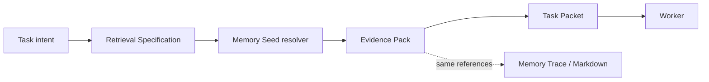
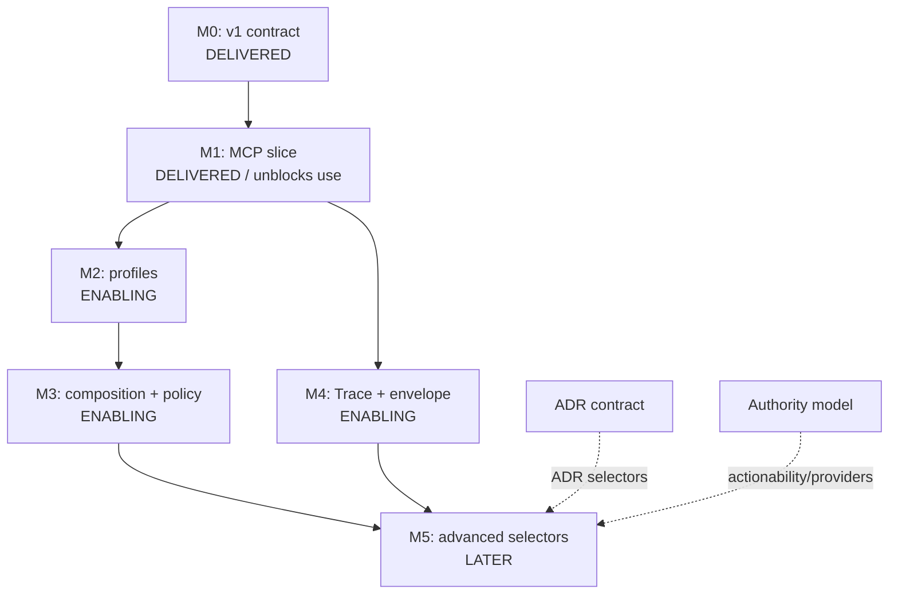

# Declarative Retrieval Specification Primitive

Status: **ACTIVE PROPOSAL — M0/M1 DELIVERED ON `main` 2026-07-30; M2–M5 remain planned.**

Priority: **P1**. The critical path is intentionally narrow enough to unblock real orchestrator/worker use through MCP before profiles, composition, caching, or UI authoring are complete.

Scope: Object model, schema, Task Packet binding, deterministic Evidence Pack resolution, MCP, profiles, composition, provenance, validation, observability, security, and delivery sequence.

Non-goals: Building an orchestrator; storing prompts or model reasoning; making a cache authoritative; changing default `memory_search` ranking; granting worker permissions; or extending the implemented M0/M1 slice into profiles, composition, Trace, caching, providers, or advanced selectors.

Five-question test: **Retrieval, Validation, Trust, Application**.

## Decision and problem

Establish **Retrieval Specification** as a first-class object alongside Task Packet, Evidence Pack, Session, ADR, Constitution, Topic, and Link.

```text
Retrieval Specification = reproducible context request
Evidence Pack           = resolved, bounded evidence result
Task Packet             = execution and safety contract
```

Today Task Packets bound execution but not reproducible retrieval; search/fetch require every orchestrator to invent query sequences and stopping rules; Evidence Packs do not explain how their selection was derived; and the Worker Context Contract has no inspectable sufficiency contract. The new primitive is a stable contract between intent and evidence.



## Authority boundaries

| Object | Owns | Does not own |
|---|---|---|
| Retrieval Specification | Selection intent, bounds, clauses, profile, overrides | Evidence, permissions, execution |
| Evidence Pack | Ordered typed IDs, sources, digests, revision, completeness, provenance, fingerprint | Retrieval policy, authority |
| Task Packet | Objective, files, worktree, validation, integration, handoff | Canonical knowledge |
| Session | Chronological rationale/evidence | Mutable current state |
| ADR | Promoted decision identity/lifecycle | Dispatch |
| Constitution | Governing invariants/principles | Query selection |
| Topic | Controlled classification | Query policy |
| Link | Explicit relation/lifecycle edge | Similarity |

Markdown remains authoritative. Profiles and inline specs are readable YAML; caches, manifests, indexes, and Trace views are rebuildable projections. Packs are ephemeral by default and exportable on request.

## Task Packet binding

A packet may reference a profile or embed a one-off spec; both together are invalid.

```yaml
objective: implement topic sidecars
retrieval:
  profile: implementation
  profile_version: 1
  overrides:
    filters: {topics: [session-fuse, topics]}
    required:
      related_decisions: {depth: 2}
evidence_envelope_ref: "msep_01J...:sha256:..."
```

```yaml
objective: investigate session-fuse failures
retrieval:
  inline:
    schema: memory-seed/retrieval-spec
    version: 1
    required:
      constitution: true
      related_decisions: {depth: 2}
      evidence: {mode: latest}
    optional:
      sessions: {neighbouring_entries: 15}
    filters: {topics: [session-fuse, worktree-integration]}
    limits: {max_entries: 30, max_tokens: 12000}
```

The worker consumes the resolved bounded result and does not reinterpret the profile unless delegated.

### M1 inline-only developer example

The minimum vertical slice supports only the inline object below. This is an illustrative Task Packet
handoff convention, not a new validated Task Packet field, named-spec registry, or profile API:

```yaml
objective: implement topic sidecars
retrieval:
  inline:
    schema: memory-seed/retrieval-spec
    version: 1
    required:
      constitution: true
      related_decisions: {depth: 2}
      evidence: {mode: latest}
    optional:
      sessions: {neighbouring_entries: 15}
    filters:
      topics: [session-fuse, worktree-integration]
      paths: [memory_seed/core.py]
    ordering: [required_first, graph_distance, recency, stable_identity]
    limits: {max_entries: 30, max_tokens: 12000}
    on_missing: {required: fail, optional: report}
    output: {include_resolution_trace: true, include_excerpts: true}
```

The orchestrator passes the value of `retrieval.inline` directly as the MCP `spec` argument. Preview
returns `{"ok": true, "preview": {...}}`; resolve returns
`{"ok": true, "pack": {...}}`, with the ephemeral pack inline and no cache/get registry. The equivalent
read-only CLI preview is:

```text
memory-seed retrieval-spec preview --spec-file retrieval-spec.json --cwd .
```

Both adapters serialize the same mapping with sorted keys, compact separators, and UTF-8 JSON. Error
payloads use `{"ok": false, "error": {"code", "message", "stage", "completed_stages", "details"}}`.
Profiles, `profile_version`, `overrides`, composition, named specs, Task Packet schema enforcement, and
Evidence Pack lookup remain later milestones.

### Operational Task Packet preparation convention

The collaboration skill's clean-session, high-signal Task Packet procedure is an **operational
documentation convention**, not a shipped retrieval or Task Packet API. An orchestrator may put a
source-grounded project frame, an inline retrieval input, a resolved-pack manifest, materialized excerpts,
and all-inclusive context-budget notes in its handoff. This makes an M1 result usable by a clean worker
without changing M1: `preview` and `resolve` remain the same read-only inline-spec operations.

In particular, this convention does **not** ship a profile, named-spec registry, Task Packet schema,
Evidence Pack registry, or native ADR selector. It does not validate those packet labels, persist packs,
or change `memory_search` ranking. ADR current views and decision slices are materialized by the
orchestrator from ordinary canonical Markdown references; lifecycle-aware/native ADR selectors remain
later work.

## Retrieval Specification v1

```yaml
schema: memory-seed/retrieval-spec
version: 1
id: implementation-default
required:
  constitution: true
  related_decisions: {depth: 2}
  related_adrs: {status: [accepted, proposed]}
  evidence: {mode: latest}
optional:
  sessions: {neighbouring_entries: 15}
  links: {kinds: [related_entries, evolves, replaces]}
filters:
  topics: [session-fuse, topics]
  paths: [memory_seed/core.py]
  include_superseded: true
ordering: [required_first, graph_distance, recency, stable_identity]
limits:
  max_entries: 40
  max_sections_per_entry: 4
  max_tokens: 16000
  timeout_ms: 5000
on_missing: {required: fail, optional: report}
output: {format: evidence-pack, include_resolution_trace: true, include_excerpts: true}
```

Unknown keys fail by default. Extensions require a namespaced `extensions:` block so typos cannot weaken requirements.

## Reusable profiles

| Profile | Emphasis | Default exclusions |
|---|---|---|
| `implementation` | Constitution, decisions/ADRs, topics/paths, evidence, validation constraints | Broad research |
| `bug-investigation` | Failures, sessions, files, regressions, rejected fixes, tests | General roadmap |
| `research` | Competing decisions, lineage, open questions, references, broad topics | Integration detail |
| `adr-review` | Current/superseded ADRs, lineage, Constitution, alternatives, evidence | Routine logs |
| `refactoring` | Architecture, continuity, tests, contracts, dependencies | Unrelated product research |
| `architecture` | Constitution, system map, ADRs, links, roadmap dependencies, risks | Fine activity |

```yaml
schema: memory-seed/retrieval-profile
version: 1
id: bug-investigation
spec:
  required:
    constitution: true
    related_decisions: {depth: 2}
    evidence: {mode: latest}
  optional:
    sessions: {neighbouring_entries: 20}
    tests: {include_failures: true}
    alternatives: {include_rejected: true}
  limits: {max_entries: 50, max_tokens: 18000}
```

Profile storage is intentionally unsettled. The minimum slice uses inline specs; project-local profiles follow after schema proof.

## Composition and overrides

Load exact profile/version; expand `extends` in listed order; reject cycles; recursively merge maps; replace scalars/lists; permit list `append`/`remove` only explicitly; apply packet overrides last; validate and return the expanded effective spec. Required clauses cannot be weakened without `allow_required_downgrade: true` plus policy approval. Composition is enabling, not a vertical-slice blocker.

## Deterministic resolution

CLI, MCP, and Trace call one core resolver:

1. Resolve runtime and corpus revision.
2. Expand and validate the spec.
3. Resolve authoritative required sources.
4. Generate candidates from declared selectors.
5. Apply filters and security boundaries.
6. Order with named deterministic tie-breakers.
7. Enforce limits.
8. Record omissions, unavailable inputs, and truncation.
9. Emit pack plus resolution trace.
10. Fingerprint canonical inputs and ordered evidence identities.

```text
effective spec + corpus revision + resolver version + policy context
    -> identical ordered evidence IDs, content digests, and fingerprint
```

V1 uses lexical, metadata, graph, date, and stable-identity ordering. Semantic candidates require explicit opt-in and pinned provider/version/parameters; failure follows a declared fallback.

## Evidence Pack and human verification

```yaml
pack_schema: memory-seed/evidence-pack
pack_version: 2
pack_id: msep_01J...
fingerprint: "sha256:..."
corpus_revision: "git:7ee7e019..."
resolver_version: 2
requested_spec: implementation-default@1
effective_spec_fingerprint: "sha256:..."
completeness: complete
warnings: []
evidence:
  - id: "adr_retrieval_entry_granularity"
    kind: adr
    source: ".memory-seed/decisions/adr_retrieval_entry_granularity.md"
    content_digest: "sha256:<digest-of-selected-content>"
    selected_by: path_filters
  - id: "mse_example:d1"
    kind: decision
    source: ".memory-seed/sessions/2026-07/2026-07-29.md"
    content_digest: "sha256:<digest-of-selected-content>"
    provenance: first-hand
    selected_by: related_decisions
    graph_distance: 1
```

Every evidence item has one `id`: ADRs use their frontmatter `adr_id`, decision slices use their canonical
decision ID, and non-semantic Markdown uses its canonical source path. `source` is always the canonical
Markdown fetch location. `content_digest` verifies the exact selected content and is not an alternate
identity. Trace shows requested/effective specs, revision/fingerprints, evidence by selector, selection
reasons, missing clauses, exclusions, and truncation. Humans can reconstruct exactly what workers received.

## Schema, versioning, provenance, observability

- Schemas/profiles pin integer semantic versions; resolvers never silently upgrade.
- Packs record resolver version, revision, effective-spec fingerprint, and completeness.
- Each result records its typed kind, stable ID, canonical source path, content digest, selecting clause,
  declared first-hand/reconstructed provenance, topic/path/date/graph reason, and disposition.
- `preview` returns expanded spec, validation, estimated counts, and policy decisions without persistence.
- `resolve` returns pack, warnings, fingerprint, and stage timing/counts.
- Observability never stores prompts, hidden reasoning, secrets, or raw vectors.

## Validation and failure modes

| Failure | Required behavior |
|---|---|
| Unknown schema/version/key | Fail before retrieval |
| Missing profile/version | Fail with exact identity |
| Composition cycle | Fail and print cycle |
| Required source absent | Fail unless `partial` explicitly permitted |
| Optional source absent | Continue with warning |
| Unknown topic/path | Fail if required; warn/empty if optional |
| Limit exceeded | Deterministically truncate/report; fail if required coverage is lost |
| Timeout | Never return `complete`; report completed stages |
| Corpus changes | Retry once at fresh revision or fail `corpus_changed` |
| Provider unavailable | Follow declared fallback |
| Evidence source or ID cannot resolve | Fail integrity |
| Content digest mismatch | Reject and re-resolve |
| Forbidden scope | Fail closed with redacted reason |
| Fingerprint mismatch | Reject and re-resolve |

Validation layers: schema, current-corpus/policy resolution, then pack identity/source/digest/fingerprint integrity.

Evidence Pack v2 is a deliberate replacement for the ephemeral v1 result shape. V1 used a generic `ref`
field and classified path-selected ADRs as generic Markdown. V2 uses `id` consistently, classifies valid
`.memory-seed/decisions/*.md` sources as `kind: adr`, and binds every record to a `content_digest`. Packs are
returned inline and are not authoritative stored artifacts, so there is no pack migration or backfill: a
v1 consumer re-runs its Retrieval Specification and receives v2. A v2 validator rejects v1 packs by version.

## Security boundaries

Specs are data, never instructions. Never execute evidence; constrain paths to the runtime; intersect paths with Task Packet `allowed_files` and caller permissions; redact secrets; cap entries/tokens/depth/time/provider use; deny network by default; preserve project/tenant boundaries; treat provider records as untrusted evidence; never grant write, shell, merge, or integration authority. Effective scope is the intersection of spec, packet, policy, and caller permissions.

## MCP surface

```text
memory_retrieval_spec_preview(spec|profile, task_hints, cwd)
memory_retrieval_spec_resolve(spec|profile, task_hints, cwd)
memory_evidence_pack_get(pack_id|fingerprint, cwd)
```

Preview/resolve are memory-read-only. Resolve creates an ephemeral pack outside authoritative memory. M1 may return the pack inline and defer `get`/caching.

## Prioritized critical path

**Blocker** is required for safe real MCP use. **Enabling** improves reuse/review. **Later** must not delay proof.

### M0 — v1 contract (blocker, delivered 2026-07-30)

Dependencies: current Evidence Pack builder and retrieval service.

Deliverables: freeze inline support for Constitution, topic/path filters, bounded related entries/decisions, recent sessions, deterministic ordering, and limits; define normalization/fingerprints; map every clause to a reader or reject it; create fixture corpus and ordered evidence identities.

Acceptance: no ambiguous defaults; each field supported/rejected/deferred; normalized YAML/JSON fingerprint identically; unsupported fields fail.

### M1 — minimum vertical slice (blocker, delivered 2026-07-30)

Dependencies: M0 and stable pack fields used by the slice.

Deliverables: shared `resolve_retrieval_spec()`; deterministic Constitution/session/topic/path/link resolution; pack revision/evidence identities/completeness/reasons/fingerprint; MCP preview/resolve; CLI preview; Task Packet example; fixture, parity, limit, missing, forbidden, timeout, corpus-change, and stale-pack tests.

Acceptance:

- A real MCP client submits the topic-sidecar example and gets a bounded pack.
- A worker fetches every evidence source without project-wide startup.
- CLI and MCP emit byte-equivalent canonical pack JSON.
- Repeated resolution at one revision has identical IDs, digests, and fingerprint.
- Required, forbidden, truncation, timeout, and stale-pack failures are proven.
- Preview/resolve write nothing under `.memory-seed/`.
- Every result is verifiable from Markdown without Trace.

**M1 unblocks real orchestrator/worker use.**

### M2 — profiles and packet references (enabling)

Deliver six fixture-backed, versioned profiles, project-local lookup, effective-spec preview, and optional packet binding. Existing packets remain valid; profiles do not alter `memory_search`.

### M3 — composition and policy intersection (enabling)

Deliver `extends`, cycle detection, explicit list operators, downgrade gate, scope/policy intersection, and structured trace. Prove no override broadens forbidden scope.

### M4 — Trace and Evidence Envelope (enabling)

Deliver Trace inspection, referential packet binding, optional external ephemeral cache. Humans reproduce the exact set; cache deletion loses no authority; stale envelopes fail.

### M5 — advanced selectors (later)

After owner contracts: ADR lifecycle/status, annotation actionability, git/PR/test failures, pinned semantic candidates, adaptive budgets, federation, analytics, migrations, editor support. No addition silently changes an existing profile version.



The critical path was **M0 → M1**, and it landed through merge `3577e9` on 2026-07-30. B0b, full ADR lifecycle, annotation authority, composition, Trace, semantic ranking, and hosted infrastructure did not block that useful first slice.

## Open decisions and status guard

Not blockers: final profile path, pack IDs, inline-pack threshold, token-count proxy, and separate MCP `get` versus inline-only first release.

M0/M1 delivered only inline spec objects, MCP preview/resolve, and CLI preview. The branch received its
whole-branch review and merged to `main` as `3577e9` on 2026-07-30. No profile, named spec, composition
rule, or Task Packet field is a supported API; existing `memory_search` ranking, packs, and packets remain
unchanged. This document stays active because M2–M5 are deliberately enabling/later work, not because the
first useful slice remains blocked.
