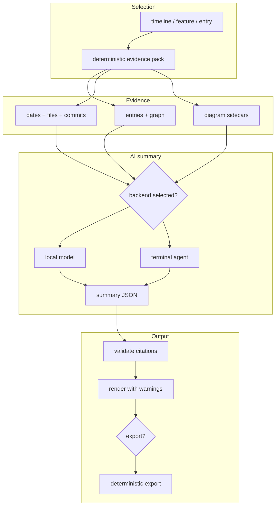

# Proposal: Optional Local-AI Summarisation Layer for Memory Trace Decision Timelines

Status: ACTIVE - promoted from inbox on 2026-07-07 as the canonical Memory Trace AI-summary plan.
Priority: P3 - after Memory Trace packaging/release ordering and before any AI-assisted paid report
pack; terminal-agent adapters remain P4.
Source: promoted from the inbox; the original proposal content is consolidated into this active todo file.
Scope: Optional, read-only Memory Trace explanation layer that builds deterministic evidence packs
from the public retrieval/graph surface, sends them to a configured local model first, validates
citation-bearing structured summaries, and optionally feeds deterministic export adapters.
Non-goals: No authoritative memory writes, no session-log rewrites, no hidden repository scan, no
default bundled model, no default terminal-agent execution, and no direct connector/tool-calling export
inside the core summarisation engine.
Dependencies: [`memory-trace-product-and-system-architecture-blueprint.md`](memory-trace-product-and-system-architecture-blueprint.md),
[`../3_Spec/memory-trace-derived-artifact-provenance-contract.md`](../3_Spec/memory-trace-derived-artifact-provenance-contract.md),
[`memory-trace-distribution-plan.md`](memory-trace-distribution-plan.md),
[`completed/memory-trace-product-and-trail-view-plan.md`](completed/memory-trace-product-and-trail-view-plan.md),
[`session-decision-diagrams-plan.md`](session-decision-diagrams-plan.md), and
[`../3_Spec/graph-edge-contract.md`](../3_Spec/graph-edge-contract.md).
Acceptance criteria: Evidence packs are deterministic JSON over selected entries/graphs; summaries
are schema-valid, cited by entry ID/source path, and labelled generated; local-model support lands
before terminal-agent support; no generated summary silently mutates `.memory-seed/sessions/`; export
adapters consume validated summary JSON rather than performing AI-driven tool calls by default.

> **Original status:** Draft proposal
> **Project:** `jnl-tshi/memory-seed`
> **Target product:** Memory Trace companion UI
> **Feature area:** Decision timeline summarisation, stakeholder review, local agent-assisted explanation
> **Disposition:** Promoted to `docs/2_Todo/memory-trace-ai-timeline-summarisation-plan.md` on
> 2026-07-07 after scope and safety posture were accepted for planning.

---

## Summary

Memory Trace should add an optional local-AI summarisation layer that helps users understand decision timelines, feature evolution, and project history from the existing Memory Seed session files.

The generated-output provenance boundary is now governed by
[`../3_Spec/memory-trace-derived-artifact-provenance-contract.md`](../3_Spec/memory-trace-derived-artifact-provenance-contract.md):
every material claim in a summary, report, presentation, or export needs cited evidence and a
machine-readable provenance appendix. This plan remains the implementation-specific AI provider and
summary-flow plan.

The feature should not replace Memory Seed's deterministic retrieval, graph, timeline, or Markdown audit trail. Instead, it should sit above the existing read-only retrieval and graph services as an **explanation layer**. The AI may summarise, compare, cluster, and narrate decisions, but every generated statement must point back to concrete session entries, files, dates, entry IDs, and graph edges.

The first implementation should support two execution backends:

1. **Local model backend** - a small locally runnable model for offline/private summarisation.
2. **Terminal agent backend** - a bounded subprocess adapter for tools such as Claude Code or Codex CLI, used in read-only scripted mode.

The recommended first milestone is **local-model summarisation only**, with terminal-agent execution treated as a later adapter because Claude/Codex-style agents can read, edit, and run code unless carefully sandboxed. Claude Code supports non-interactive `-p` / `--print` mode, JSON output, JSON Schema output, max-turn limits, session-persistence controls, and permission modes. Codex supports `codex exec`, prompt-plus-stdin workflows, JSONL output, read-only default sandboxing, structured output schemas, and explicit sandbox settings. Validate exact CLI flags during implementation because both tools evolve.

In addition, modern LLM tool-calling and plugin ecosystems make it technically plausible to extend summarisation outputs into structured document generation workflows such as PowerPoint, Google Docs, Excel, and Miro. However, this capability should be treated as a **downstream export layer**, not part of the core summarisation engine. The AI layer can emit structured, schema-constrained outputs compatible with document-generation adapters, but direct tool invocation introduces external dependencies, authentication concerns, and write-side effects that conflict with Memory Seed's local-first and read-only design principles.

A pragmatic approach is:

- Phase 1-3: AI produces structured summaries only (`JSON` + Markdown).
- Phase 4+: Optional **export adapters** transform summaries into:
  - Markdown -> Docs (Google Docs / Notion-style import)
  - structured JSON -> PowerPoint / slide decks
  - tabular sections -> Excel / CSV
  - graph/timeline structures -> Miro-style board layouts

These adapters should be deterministic transformers, not AI-driven tool calls. If tool-calling is later introduced, it should be:

- explicitly enabled;
- scoped to export-only operations;
- executed outside the core Memory Trace runtime;
- auditable and reversible.

This keeps the core system safe and local-first while still enabling integration into common stakeholder workflows.

---

## Repository Grounding

Memory Seed is currently a local-first, Markdown-first control plane for AI coding agents. It stores durable memory under `.memory-seed/`, exposes retrieval through MCP, and has the Memory Trace companion browser UI for human review. The README describes Memory Seed as a portable local memory system for AI coding agents, with Markdown files as the inspectable source of truth and MCP search for precise retrieval.

Memory Trace already provides a browser UI for search, filters, timeline, graph, Trail, and reader/detail views over Markdown session files, backed by a rebuildable SQLite cache outside the repository. The current architecture deliberately keeps the cache non-authoritative: Markdown remains the source of truth.

The companion UI split is already decided. The active distribution plan says the Memory Trace package should depend on `memory-seed`, import the public retrieval service, and never fork parsing or ranking. Phase 1 already created `memory_seed/retrieval.py` as the public retrieval service, with MCP and Memory Trace consuming the same contract; legacy Lense naming remains only for compatibility shims and internal class names that have not been worth renaming.

The current Memory Trace/Trail plan says Trace is the product/package direction, while Trail is the internal feature-evolution view combining supersession chains and branch lineage. It also states that Trace should continue using the shared retrieval service and must not fork parsing, ranking, graph, or diagram-sidecar logic.

This proposal extends that direction: Memory Trace should add AI-generated narrative summaries over the same canonical retrieval and graph substrate.

---

## Problem

Memory Trace is moving toward a UI that helps humans inspect local project memory, traverse files, review docs, and understand decision history. The current deterministic surfaces are necessary but not sufficient for stakeholder review.

A timeline or graph can show:

- which decisions happened when;
- which entries relate to each other;
- which entries supersede earlier entries;
- which files were touched;
- which commits reference an entry;
- which diagrams exist as sidecars.

But users still need to answer higher-level questions:

- "What changed in the project's direction over the last two weeks?"
- "Why was Memory Trace split from Memory Seed?"
- "Which decisions are still active, superseded, or unresolved?"
- "What should a project manager understand without reading 30 session entries?"
- "What was the decision timeline for this feature?"
- "What are the risks and unresolved questions?"

The repo already recognizes this gap in the decision-diagram plan. It states that deterministic Trace rendering cannot derive reasoning diagrams from prose, because turning freeform reasoning into a flowchart requires model interpretation.

The same argument applies to **decision timeline summaries**. A deterministic UI can render the evidence, but it cannot reliably narrate the meaning of that evidence without an AI layer.

---

## Proposed Design

Add a new optional component to Memory Trace:

```text
Memory Trace UI
  |- Deterministic views
  |   |- Search
  |   |- Reader
  |   |- Timeline
  |   |- Graph
  |   |- Trail view
  |   `- Diagram sidecar rendering
  |
  `- Optional AI summarisation layer
      |- Timeline summary
      |- Decision lineage summary
      |- Supersession explanation
      |- Stakeholder handover brief
      |- Risk / unresolved-question summary
      |- Exportable report text
      `- Structured export adapters (Docs / Slides / Sheets / Boards)
```

The AI layer should operate on **bounded evidence packs**, not on raw unrestricted repository access by default.

A typical summarisation flow:



The AI never decides what the source of truth is. It only explains a fixed set of source records chosen by Memory Trace.

---

## Feature Scope

### 1. Timeline Summary

Given a date range, produce:

- short executive summary;
- major decisions;
- superseded decisions;
- active decisions;
- changed files or docs;
- unresolved follow-ups;
- risks;
- recommended next reading.

Example UI action:

```text
Summarise decisions from 2026-07-01 to 2026-07-05
```

Output must cite entry IDs and source paths.

---

### 2. Trail Summary

Given a feature, branch, topic, or selected entry, produce:

- origin decision;
- major forks or shifts;
- supersession chain;
- current settled position;
- open questions;
- related files and docs.

This should build directly on the Trace/Trail plan, where Trail combines branch labels, supersession links, related entries, file paths, and commit references.

---

### 3. Decision Diff

Given two entries or two dates, explain:

- what changed;
- why the later decision superseded or refined the earlier one;
- what evidence supports that;
- what remains unresolved.

This should be particularly useful for `supersedes` chains.

---

### 4. Stakeholder Handover Brief

Given a date range or feature, generate a non-technical brief:

- what was decided;
- why it matters;
- what risks remain;
- what the next project action should be;
- what supporting entries/files should be reviewed.

This aligns with the existing decision-diagram plan's Phase 3 concept of exportable handover packs for non-technical readers.

---

### 5. Structured Export Targets (Docs / Slides / Sheets / Boards)

Extend the handover brief and summary outputs into structured export formats:

- **Docs (Google Docs / Markdown import)**
  Narrative summaries mapped to headings, sections, and citations.

- **PowerPoint / Slides**
  Executive summary -> title slide
  Timeline -> slide sequence
  Decisions -> bullet slides
  Risks -> dedicated slide

- **Excel / CSV**
  Timeline events, decisions, risks, and open questions as tabular data.

- **Miro / board tools**
  Timeline -> horizontal flow
  Decisions -> nodes
  Supersession -> directional edges

These exports should be generated via deterministic transformations from the structured summary JSON, not via direct AI tool-calling in the initial implementation.

---

## Backend Options

### Option A - Local Model Backend

Use a local model process for summarisation. This could be implemented through a provider abstraction rather than hard-coding one model runner.

Example provider interface:

```python
class SummaryProvider(Protocol):
    name: str
    mode: Literal["local_model", "terminal_agent"]

    def summarize(self, evidence_pack: EvidencePack, schema: dict[str, Any]) -> SummaryResult:
        ...
```

Potential local runners:

- Ollama-compatible local endpoint;
- llama.cpp-compatible command runner;
- local OpenAI-compatible server;
- future small summarisation model packaged as an optional dependency.

Recommended stance:

- no bundled LLM in `memory-seed`;
- no default model download;
- Memory Trace discovers configured providers;
- summarisation feature is disabled until configured;
- all prompts and evidence packs are visible to the user.

This preserves Memory Seed's minimal dependency and local-first posture.

---

### Option B - Terminal Agent Backend

Support Claude Code or Codex CLI as optional external summarisation engines.

Claude Code supports non-interactive print mode through `claude -p "query"` and supports JSON output, JSON Schema output, max-turn limits, session-persistence controls, and permission modes.

Codex CLI supports `codex exec` for scripts and CI, can pipe final output to other tools, uses read-only sandboxing by default, supports JSONL event output, and can enforce structured final output with `--output-schema`.

However, terminal-agent integration has a larger blast radius because these tools can inspect repositories, run commands, call MCP tools, and potentially edit files depending on configuration. For Memory Trace, the terminal-agent backend should therefore be:

- disabled by default;
- explicitly configured by the user;
- read-only by default;
- evidence-pack driven;
- schema-constrained;
- time-limited;
- isolated from write commands;
- visibly labelled as "AI-generated summary".

Recommended command pattern for Codex-style integration:

```bash
memory-trace evidence-pack --entry mse_x... --format json \
  | codex exec --json --sandbox read-only --output-schema summary.schema.json -
```

Recommended command pattern for Claude-style integration:

```bash
memory-trace evidence-pack --entry mse_x... --format json \
  | claude -p --output-format json --json-schema "$(cat summary.schema.json)" \
      "Summarise this Memory Trace evidence pack. Use only cited evidence."
```

The exact flags should be validated during implementation because CLI capabilities evolve.

---

## Evidence Pack Contract

The AI backend should not receive the whole repository by default. It should receive a structured evidence pack assembled by Memory Trace.

Example shape:

```json
{
  "pack_type": "decision_timeline",
  "workspace_label": "memory-seed",
  "generated_at": "2026-07-07T00:00:00Z",
  "selection": {
    "date_from": "2026-07-01",
    "date_to": "2026-07-05",
    "entry_ids": ["mse_x82bptzravde7h4x"]
  },
  "entries": [
    {
      "entry_id": "mse_x82bptzravde7h4x",
      "title": "Release 2.16.0: Trail Phase 1, diagrams, risk signaling",
      "session_date": "2026-07-05",
      "path": ".memory-seed/sessions/2026-07-05.md",
      "agent_type": "claude",
      "summary": "...",
      "decisions": ["..."],
      "files": ["docs/2_Todo/completed/memory-trace-product-and-trail-view-plan.md"],
      "tests": ["Full suite 257/257"],
      "related_entries": ["mse_j6m9c19ghfxwwbbw"],
      "supersedes": [],
      "superseded_by": [],
      "commit_reference_count": 1,
      "diagrams": []
    }
  ],
  "graph": {
    "edges": [
      {
        "source": "mse_a",
        "target": "mse_b",
        "type": "related"
      }
    ]
  },
  "constraints": {
    "use_only_evidence_pack": true,
    "cite_entry_ids": true,
    "do_not_infer_unseen_repository_state": true
  }
}
```

This should be generated from the existing retrieval and graph surfaces:

- `search_memory()`;
- `get_chunk(include_diagrams=True)`;
- `build_related_entry_graph()`;
- existing Memory Trace timeline and graph service methods;
- future `branch:` and `supersedes` rendering once Trail work lands.

The retrieval service already exposes canonical result dictionaries, graph metadata, commit reference count, and optional diagram sidecar metadata.

---

## Summary Result Contract

The AI should return structured output, not arbitrary prose.

Example:

```json
{
  "summary_title": "Memory Trace split and Trail Phase 1 release",
  "executive_summary": "...",
  "timeline": [
    {
      "date": "2026-07-05",
      "event": "Memory Trace name cleared and release 2.16.0 cut",
      "entry_ids": ["mse_x82bptzravde7h4x"],
      "confidence": "high"
    }
  ],
  "key_decisions": [
    {
      "decision": "Memory Trace is the product name; Trail remains a feature view.",
      "rationale": "Avoids the Trail naming collision while preserving the metaphor for feature evolution.",
      "entry_ids": ["mse_x82bptzravde7h4x"],
      "source_paths": [
        ".memory-seed/sessions/2026-07-05.md",
        "docs/2_Todo/completed/memory-trace-product-and-trail-view-plan.md"
      ]
    }
  ],
  "open_questions": [
    {
      "question": "Which package name should be registered: memory-trace or memory-seed-trace?",
      "entry_ids": ["mse_x82bptzravde7h4x"]
    }
  ],
  "risks": [
    {
      "risk": "Terminal-agent summarisation can exceed read-only intent if subprocess permissions are loose.",
      "mitigation": "Use evidence-pack-only prompts, read-only sandboxing, schema output, and disabled-by-default configuration."
    }
  ],
  "missing_evidence": [],
  "generated_by": {
    "provider": "local_model",
    "model": "configured-by-user"
  }
}
```

The UI should render generated summaries with:

- source entry chips;
- warning when a statement lacks evidence;
- "View evidence pack" button;
- "Regenerate" button;
- "Copy as Markdown" button;
- optional export into handover pack or structured document formats.

---

## Safety and Trust Rules

### Rule 1 - Markdown remains authoritative

Generated summaries are cached artifacts or ephemeral UI output. They must not silently edit `.memory-seed/sessions/`.

### Rule 2 - No hidden repository scan

The AI receives only the evidence pack unless the user explicitly enables a broader terminal-agent mode.

### Rule 3 - Read-only first

The initial version must not allow the AI backend to modify files. This keeps it consistent with the current Memory Trace read-only direction. The distribution plan explicitly keeps Trace read-only and says deep links should use `chunk_id`.

### Rule 4 - Citations are mandatory

Every key decision, risk, open question, and timeline event must cite entry IDs and source paths. If the AI cannot cite the evidence, the UI should mark the claim as unsupported or omit it.

### Rule 5 - Terminal agent adapter is a later milestone

Codex and Claude Code are powerful because they can act as coding agents. That same power is a risk inside a review UI. The terminal-agent adapter should be added only after the local-model evidence-pack flow is stable.

### Rule 6 - No automatic writes to session logs

If Memory Trace later supports user-approved annotations or curated summaries, they should be stored as separate annotation/report artifacts, not as rewrites of historical session entries. This matches the existing post-3.0 stance that later curation should use separate annotation or patch records, never silent rewrites.

### Rule 7 - Export adapters are deterministic by default

Document generation (Docs, Slides, Sheets, Boards) must be derived from structured summary output using deterministic transformations. AI-driven tool-calling for external services should be opt-in, auditable, and isolated from the core runtime.

---

## Implementation Plan

### Phase 0 - Proposal and design validation

Promoted from `docs/inbox/` into `docs/2_Todo/`; validate the design before implementation.

Acceptance criteria:

- proposal references current Memory Trace, retrieval, graph, and diagram-sidecar plans;
- explicitly distinguishes deterministic views from AI summaries;
- states that generated summaries are non-authoritative;
- chooses local-model backend as first implementation;
- defers terminal-agent backend behind safety design;
- treats document-generation integrations as deterministic downstream exports, not core AI behaviour.

---

### Phase 1 - Evidence Pack Builder

Add a deterministic evidence-pack builder to Memory Trace or, if still in-package, behind the retrieval service.

Candidate module while still in-package:

```text
memory_seed/trace_evidence.py
```

Candidate module after package extraction:

```text
memory_trace/evidence.py
```

Candidate functions:

```python
def build_timeline_evidence_pack(...) -> EvidencePack: ...
def build_entry_evidence_pack(...) -> EvidencePack: ...
def build_trail_evidence_pack(...) -> EvidencePack: ...
def build_handover_evidence_pack(...) -> EvidencePack: ...
```

Acceptance criteria:

- accepts date range, entry ID, topic, user, agent, or graph neighbourhood;
- uses existing retrieval/graph readers only;
- includes entry text, metadata, related edges, supersession edges, commit counts, and diagram metadata;
- produces deterministic JSON;
- has snapshot tests;
- does not add a new write path.

---

### Phase 2 - Local AI Provider Adapter

Add a provider interface and one local-model adapter.

Candidate config:

```yaml
ai_summary:
  enabled: true
  provider: local_openai_compatible
  endpoint: http://127.0.0.1:11434/v1/chat/completions
  model: qwen2.5-coder:7b
  max_input_entries: 30
  timeout_seconds: 60
  store_cache: false
```

Acceptance criteria:

- disabled by default;
- fails gracefully if no provider is configured;
- sends only the evidence pack;
- returns schema-valid JSON;
- renders summary with source entry links;
- never writes to session files.

---

### Phase 3 - UI Integration

Add "Summarise" actions to:

- timeline view;
- graph/Trail view;
- entry reader;
- export/handover pack builder.

Acceptance criteria:

- user can inspect the evidence pack before generation;
- summaries show entry citations;
- unsupported claims are rejected or flagged;
- AI output can be copied/exported but is labelled generated;
- no summary appears as canonical memory unless explicitly exported as a separate report artifact.

---

### Phase 4 - Structured Export Adapters

Add deterministic export adapters that transform summary JSON into portable stakeholder artefacts.

Candidate modules:

```text
memory_trace/export_markdown.py
memory_trace/export_slides.py
memory_trace/export_tables.py
memory_trace/export_board.py
```

Candidate outputs:

- Markdown handover brief;
- HTML handover pack;
- PPTX / slide-deck source structure;
- CSV / XLSX timeline tables;
- board-layout JSON for later Miro or FigJam import.

Acceptance criteria:

- export adapters consume only validated summary JSON and evidence-pack metadata;
- exports are deterministic and reproducible;
- external-service writes are not required for local export;
- any connector/API-based publishing is opt-in and outside the core runtime;
- generated documents preserve entry IDs and source paths.

---

### Phase 5 - Terminal Agent Adapter

Add optional adapters for:

- `codex exec`;
- `claude -p`.

Acceptance criteria:

- disabled by default;
- user must explicitly choose and configure the adapter;
- command preview is shown before first run;
- read-only / safest available mode is default;
- prompt is evidence-pack-only;
- output schema is enforced where the backend supports it;
- subprocess timeout and output-size limits are enforced;
- credentials are never passed in prompts or written to logs;
- execution logs are stored outside `.memory-seed/` unless the user exports them.

Codex is attractive because `codex exec` is designed for scripting, supports final-output piping, JSONL events, schema-constrained output, and read-only default sandboxing. Claude Code is attractive because `claude -p` supports non-interactive use, output-format selection, JSON Schema output, max-turn controls, no-session-persistence mode, and permission modes. Both should remain optional power-user adapters.

---

## Recommended Position

Proceed with the proposal, but keep the implementation staged.

The strongest design is:

```text
Memory Seed core:
  Owns Markdown runtime, parser, graph, retrieval, validation.

Memory Trace:
  Owns UI, Trail view, local docs/file review, report/export surfaces.

Memory Trace AI:
  Optional explanation layer.
  Consumes deterministic evidence packs.
  Produces cited summaries.
  Never becomes source of truth.

Memory Trace Export:
  Optional deterministic export layer.
  Turns validated summaries into stakeholder artefacts.
  Keeps external tool calls opt-in and outside the core runtime.
```

The local AI model path should be implemented before the Claude/Codex terminal path. It is more aligned with the local-first privacy story and has a smaller safety surface.

The terminal-agent path is still valuable, especially for users who already trust Claude Code or Codex in their repo, but it should be treated as a configured power-user backend rather than the default summarisation engine.

Document-generation integrations should be treated as export surfaces, not as part of the AI reasoning layer. This keeps Memory Trace useful to project managers and clients without turning the read-only UI into an uncontrolled tool-calling agent.

---

## Open Questions

1. Should generated summaries be ephemeral only, or should Memory Trace support a `.memory-seed/reports/` or `.memory-trace/reports/` export location?
2. Should summaries be cached outside the repo like the current Memory Trace SQLite cache, or regenerated on demand?
3. Should terminal-agent adapters be allowed to use MCP, or should they receive only static JSON evidence packs?
4. Should the first local backend target Ollama-compatible APIs, llama.cpp subprocesses, or a generic OpenAI-compatible local endpoint?
5. Should the handover pack include generated prose, or should AI summaries remain a separate optional layer?
6. Should the feature be named "AI Summary", "Timeline Brief", "Decision Brief", or "Trace Brief"?
7. Should export adapters live inside Memory Trace, or in separate optional packages such as `memory-trace-export-slides`?
8. Should connector-based exports to Google Docs, Slides, Excel, or Miro ever be supported directly, or should Trace only generate local files for users to import?

---

## Initial Acceptance Criteria

- A proposal exists and is linked from `NEXT_STEPS.md` only after promotion.
- The design preserves Memory Seed's Markdown source-of-truth model.
- The AI layer consumes the public retrieval service rather than forking parsing or ranking.
- The feature is optional and disabled by default.
- Local model support comes before terminal-agent support.
- Terminal-agent support is read-only, schema-constrained, and subprocess-bounded.
- Every generated summary is evidence-linked by entry ID and source path.
- No generated summary silently mutates session logs.
- Export adapters are deterministic by default and do not require external write access.

---

## References / Cross-References

- [`docs/2_Todo/completed/memory-trace-product-and-trail-view-plan.md`](completed/memory-trace-product-and-trail-view-plan.md) - Trace as product, Trail as branch/supersession evolution view.
- [`docs/2_Todo/memory-trace-distribution-plan.md`](memory-trace-distribution-plan.md) - companion distribution split and public retrieval-service seam.
- [`docs/2_Todo/session-decision-diagrams-plan.md`](session-decision-diagrams-plan.md) - two-class diagram model and no-LLM reasoning-diagram constraint.
- [`docs/3_Spec/graph-edge-contract.md`](../3_Spec/graph-edge-contract.md) - canonical graph/edge/metric contract.
- [`memory_seed/retrieval.py`](../../memory_seed/retrieval.py) - public MCP-independent retrieval service.
- [`memory-trace/memory_trace/service.py`](../../memory-trace/memory_trace/service.py) - current local read-only browser UI implementation.
- [Claude Code CLI reference](https://code.claude.com/docs/en/cli-reference) - terminal-agent adapter feasibility reference.
- [Codex non-interactive mode](https://developers.openai.com/codex/noninteractive) - `codex exec`, JSONL, schema, and sandboxing feasibility reference.
