# Memory Seed - Functionality Audit

> **Addendum 2026-07-13:** this inventory's as-of date predates the 2026-07-11/12 feature batch.
> For the newer surface see `CHANGELOG.md` (Unreleased): lifecycle-edge link sidecars +
> `memory-seed link audit` + the end-of-turn Lifecycle Link Sweep, `session append` /
> `session reorder` / `session entry-id` (+ `memory_entry_id` MCP tool), `memory-seed esr`,
> `memory-seed hooks install` (prepare-commit-msg trailer stamping), Memory Trace worktree
> switcher + commit-accurate Trail merges + `--static-root` + serve-time asset hashing, and the
> browserless golden-fixture harness. Test counts have grown accordingly (413 core + 92 trace as
> of 2026-07-13).
>
> **Addendum 2026-07-13 (later):** also unreleased - a project-local `integration_mode`
> (`local-merge` | `pr`) in `project.yaml` read by `read_integration_mode` and surfaced by `esr`
> (foundation for a configurable PR/branch-protection workflow); and a deterministic **entry DRAFT
> format lint** (`core.entry_body_format_issues` / `check_entry_format`) that `session append`
> enforces at write time and `links check` reports corpus-wide as `malformed-entry-format`
> (structural only - bare labels, missing section heading, multi-decision under a singular
> `### Decision`, `D:` without `R:`). See `docs/2_Todo/configurable-integration-mode-plan.md` and
> `docs/2_Todo/openssf-credibility-proposals.md`.

**As of:** 2026-07-05 - control-plane `2.16` - package `2.16.0`
**Scope:** every current feature, how the subsystems relate, how data flows, plus a roadmap section for upcoming work.

---

## 1. What Memory Seed is

Memory Seed is a **portable, local-first, Markdown-first memory and control-plane system for AI coding agents**, distributed as a Python package (`memory-seed`). It has no server and no database: durable memory lives in plain Markdown + YAML under a `.memory-seed/` runtime directory, discovered by walking upward from the working directory. A small CLI installs and maintains the control plane; an optional stdio **MCP server** exposes ranked retrieval over the session logs. It is vendor-neutral - one canonical `AGENTS.md` plus thin per-agent routing files, and auto-merged hook/MCP config for Claude Code, Codex, Cursor, Gemini, and GitHub Copilot.

---

## 2. System map
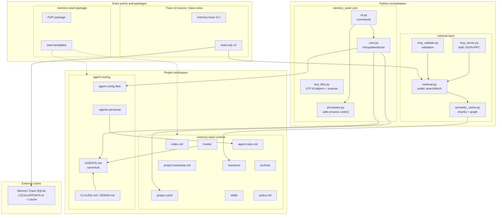
```mermaid
graph TD
  subgraph TopTier["Entry points and packages"]
    direction LR
    subgraph SeedPkg["memory-seed package"]
      direction TB
      PKG["PyPI package"] ~~~ SEED["seed templates"]
    end
    subgraph TracePkg["Trace UI source / trace extra"]
      direction TB
      TRACECLI["memory-trace CLI"] ~~~ TRACEUI["read-only UI"]
    end
  end

  subgraph CoreTier["Python orchestration"]
    direction LR
    subgraph SeedCore["memory_seed core"]
      direction TB
      CLI["cli.py<br>commands"]
      CORE["core.py<br>init/update/doctor"]
      TEXT["text_files.py<br>UTF-8 helpers + scanner"]
      PROC["processes.py<br>safe process control"]
      CLI --> CORE
      CLI --> PROC
      CORE ~~~ TEXT ~~~ PROC
    end
    subgraph Retrieval["retrieval layer"]
      direction TB
      RET["retrieval.py<br>public search/fetch"]
      CACHE["semantic_cache.py<br>chunks + graph"]
      MCP["mcp_server.py<br>stdio JSON-RPC"]
      VAL["mcp_validate.py<br>validation"]
      RET --> CACHE
      MCP --> RET
      VAL --> RET
    end
  end

  subgraph ProjectTier["Project workspace"]
    direction LR
    subgraph Runtime[".memory-seed runtime"]
      direction TB
      IDX["index.md"] ~~~ BOOT["project-bootstrap.md"] ~~~ PROJ["project.yaml"]
      RULES["agent-rules.md"] ~~~ SESS["sessions/"] ~~~ SKILLS["skills/"]
      HOOKS["hooks/"] ~~~ ARCH["archive/"] ~~~ POLICY["policy.md"]
    end
    subgraph Routing["agent routing"]
      direction TB
      AGENTS["AGENTS.md<br>canonical"]
      PERAGENT["CLAUDE.md / GEMINI.md"]
      CONFIGS["agent config files"]
      PERSONA[".agents personas"]
      AGENTS ~~~ PERAGENT
      CONFIGS ~~~ PERSONA
    end
  end

  subgraph CacheTier["External cache"]
    direction LR
    SQLITE["Memory Trace SQLite<br>LOCALAPPDATA or ~/.cache"]
  end

  TopTier ~~~ CoreTier
  CoreTier ~~~ ProjectTier
  ProjectTier ~~~ CacheTier

  SEED -.-> Runtime
  SEED -.-> Routing
  CORE --> PROJ
  CORE --> CONFIGS
  CORE --> AGENTS
  TRACEUI --> RET
  TRACEUI --> SQLITE
  CACHE --> SESS
  HOOKS --> AGENTS
  PERAGENT --> AGENTS
  PERSONA --> RULES

```
## 3. Feature inventory (current)

### A. Distribution & packaging
- Python package `memory-seed` (`pyproject.toml`, setuptools), Python >= 3.11, published to PyPI via GitHub Release -> `.github/workflows/publish.yml` with an OIDC **manual-approval `pypi` gate**.
- Console entry points: `memory-seed` (CLI), `memory-seed-mcp` (MCP stdio server), `memory-seed-mcp-validate` (retrieval validation harness).
- Seed templates under `memory_seed/seed/` are the source of truth installed into projects; the repo dogfoods its own seed (live `.memory-seed/` must stay in sync with the seed twin - enforced by tests).
- **Download footprint:** the `memory-seed` artifact itself remains small and pure Python +
  Markdown/HTML/CSS/JS templates (no compiled extensions). A full install also resolves the required
  runtime dependency, `model2vec` (which pulls `numpy`), so the installed on-disk footprint is
  dominated by transitive deps, not Memory Seed's own code. The review UI source lives under
  `memory-trace/`, but its web stack (`fastapi`/`uvicorn`) is installed only through the optional
  `memory-seed[trace]` extra. Plain `pip install memory-seed` remains web-framework-free, and
  `memory-seed[lense]` is a deprecated alias to the same optional UI dependencies.

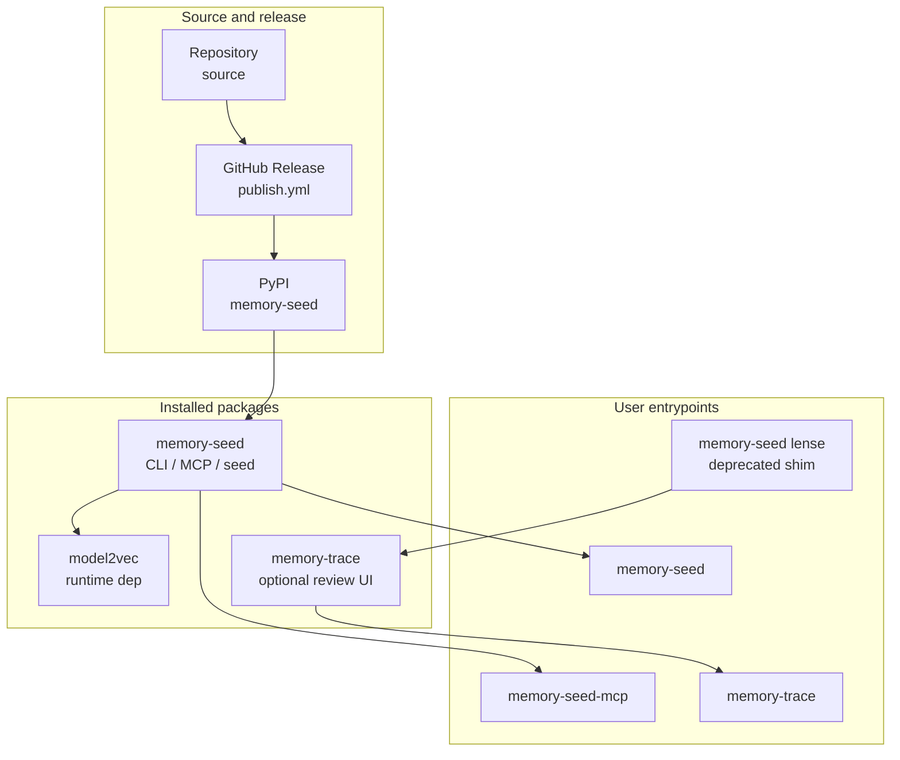
```mermaid
graph TD
  subgraph SourceTier["Source and release"]
    direction LR
    REPO["Repository<br>source"] ~~~ RELEASE["GitHub Release<br>publish.yml"]
    PYPI["PyPI<br>memory-seed"]
  end

  subgraph PackageTier["Installed packages"]
    direction LR
    CORE["memory-seed<br>CLI / MCP / seed"] ~~~ MODEL["model2vec<br>runtime dep"]
    TRACE["memory-trace<br>optional review UI"]
  end

  subgraph UserTier["User entrypoints"]
    direction LR
    CLI["memory-seed"] ~~~ MCP["memory-seed-mcp"]
    SHIM["memory-seed lense<br>deprecated shim"] ~~~ TRACECLI["memory-trace"]
  end

  SourceTier ~~~ PackageTier
  PackageTier ~~~ UserTier

  REPO --> RELEASE
  RELEASE --> PYPI
  PYPI --> CORE
  CORE --> MODEL
  CORE --> CLI
  CORE --> MCP
  SHIM --> TRACE
  TRACE --> TRACECLI
```

### B. CLI surface (`memory_seed/cli.py`)
| Command | Purpose |
|---|---|
| `init [--agents ...] [--no-agent-prompt] [--dry-run] [--force]` | Copy control plane + routing into a project; prompts on a TTY for opt-out agent integration selection unless skipped. |
| `update [--dry-run]` | Forward-only refresh of control-plane files; archives replaced versions; preserves generated/local memory. |
| `doctor` | Health check: missing files, version mismatches, bootstrap completeness, non-fatal warnings. |
| `compact [--days N] [--output]` | Summarise recent session activity; writes only with `--output`. |
| `agents list \| add <a> \| remove <a>` | Show selected/ignored agents or reconfigure installed agent integrations (cleanup-aware removal). |
| `user set <slug> \| show \| clear` | Manage the local active user in gitignored `.memory-seed/local.yaml` (new in 2.10). |
| `session target [--create] [--user <slug>] [--date ...]` | Print (and optionally create) the active grouped session-log target; flat or per-user depending on the resolved user and participant gate. |
| `session fuse --branch <branch> [--base <ref>] [--apply]` | Dry-run or apply branch-local session entries/sidecars into the current integration tree; apply requires an in-progress merge and validates branch provenance, chronology, immutable existing entries, and sidecar parent entries. |
| `session merge-branch --branch <branch> [--dry-run]` | One-step branch integration: fuse dry-run gate, `git merge --no-ff --no-commit`, session-path reset, fuse apply, stage, commit. Fails closed: fuse issues abort before the merge starts; non-session conflicts leave the merge in progress. Requires a clean working tree. |
| `branch status [--json]` | Read-only: report current Git branch/worktree posture and warn when distinct feature work should move to a task branch with `--no-ff` integration. |
| `links check` | Validate session-memory integrity across both layouts (duplicate/dangling IDs, per-user frontmatter problems); exits non-zero on any issue (new in 2.12). |
| `topics list` | Show the controlled topic vocabulary from `.memory-seed/topics.yaml` (canonical slugs, aliases, status). |
| `topics check` | Validate the vocabulary and entry `topics:` usage: unknown/malformed/duplicate/collision errors, deprecated-use and >3-count warnings, unused-topic info; exit 1 on any error. Separate from `links check` - topics are membership, not an edge kind. |
| `migrate sessions-layout [--dry-run]` | Split legacy flat session files into grouped per-user files using `project.yaml` participants; preserves entry IDs, backs up before removing migrated sources. |
| `migrate sessions-month-layout [--dry-run]` | Explicitly move old flat/day session files and old diagram sidecars into `YYYY-MM/` folders with backups; never automatic. |
| `link suggest [--for <entry_id>] [--top-k N]` | Read-only: rank older candidate entries to link from a target entry; prints a paste-ready `related_entries:` snippet (new in 2.13). |
| `link show <entry_id>` | Read-only: print an entry's stored outbound `related_entries`, computed inbound backlinks, `supersedes`/`superseded_by`, `inbound_relation_count`, and `importance_score`. |
| `link commits <entry_id>` | Read-only: print commit links from the entry's `commits:` field plus commits carrying the `Memory-Entry:` trailer. |
| `hooks status [--json]` | Read-only: report whether the `prepare-commit-msg` trailer hook is current, missing, stale, broken, or blocked by a foreign hook. |
| `hooks repair` | Install or refresh only missing or Memory Seed-managed trailer hooks; foreign hooks are reported and left untouched. |
| `processes [--json]` | Read-only: list active package-owned Memory Seed processes. |
| `shutdown [--dry-run] [--yes] [--json]` | Preview or stop only matching package-owned Memory Seed processes after confirmation; default answer is no. |
| `upgrade [--dry-run] [--yes] [--manager uv\|pipx\|pip] [--json]` | Handle active package-owned processes, then run the selected package-manager upgrade command; failed shutdown blocks upgrade. |
| `encoding check [path] [--json]` | Read-only: report invalid UTF-8, UTF-8 BOMs, CRLF line endings, non-NFC text, likely mojibake, and implicit text-mode Python I/O. |
| `encoding repair [path] [--dry-run] [--json]` | Preview or atomically repair safe BOM/newline/NFC drift after timestamped backup; block invalid UTF-8 and likely mojibake for manual review. |
| `lense [--cwd] [--host] [--port] [--no-open]` | **Deprecated shim** (new in 2.13, extracted post-2.16): the review UI now runs through the bundled `memory-trace` command when `memory-seed[trace]` is installed. Delegates to it when available, else prints an install hint. |
| `version` | Print bundled control-plane version. |
| `help` (or no args) | Full command reference. |

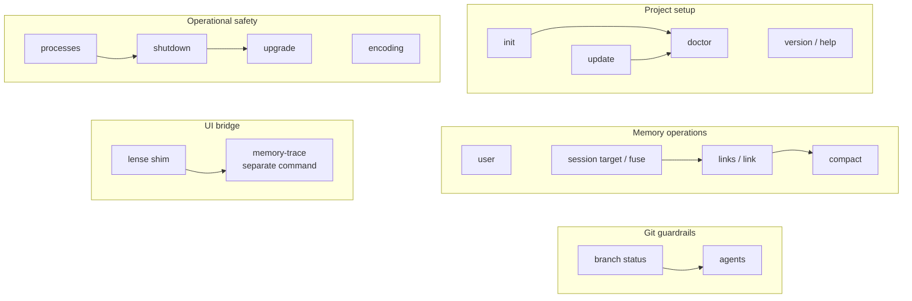
```mermaid
graph TD
  subgraph SetupTier["Project setup"]
    direction LR
    INIT["init"] ~~~ UPDATE["update"]
    DOCTOR["doctor"] ~~~ VERSION["version / help"]
  end

  subgraph MemoryTier["Memory operations"]
    direction LR
    USER["user"] ~~~ SESSION["session target / fuse"]
    COMPACT["compact"] ~~~ LINKS["links / link"]
  end

  subgraph GitTier["Git guardrails"]
    direction LR
    BRANCH["branch status"] ~~~ AGENTS["agents"]
  end

  subgraph OpsTier["Operational safety"]
    direction LR
    PROCESSES["processes"] ~~~ SHUTDOWN["shutdown"]
    UPGRADE["upgrade"] ~~~ ENCODING["encoding"]
  end

  subgraph UiTier["UI bridge"]
    direction LR
    LENSE["lense shim"] ~~~ TRACE["memory-trace<br>separate command"]
  end

  SetupTier ~~~ MemoryTier
  MemoryTier ~~~ GitTier
  OpsTier ~~~ UiTier

  INIT --> DOCTOR
  UPDATE --> DOCTOR
  SESSION --> LINKS
  LINKS --> COMPACT
  BRANCH --> AGENTS
  PROCESSES --> SHUTDOWN
  SHUTDOWN --> UPGRADE
  LENSE --> TRACE
```

### C. Agent-selective install (`core.py`)
- `init` installs only the chosen agents' files; the set persists in `.memory-seed/project.yaml` (`agents:` list).
- Backed by registries: `KNOWN_AGENTS = (claude, codex, cursor, gemini, copilot)`, `_AGENT_MERGES`, `_AGENT_UNINSTALLS`, and a per-`SeedFile` `agent` tag.
- Interactive init presents agent integrations as an opt-out selection step with all agents selected by default; `--no-agent-prompt` skips that prompt, and `--agents none` writes the explicit zero-agent state.
- **Absent `project.yaml` => all agents** (legacy default unchanged); **present-but-empty `agents:` => zero agents** (distinct state). `doctor`/`update` respect the selection. Init and `agents list` report both selected and ignored agents. `remove` strips only Memory Seed's own entries (foreign config preserved), backs up first, never deletes shared dirs. `codex`/`cursor` get no routing file (they read `AGENTS.md` natively).

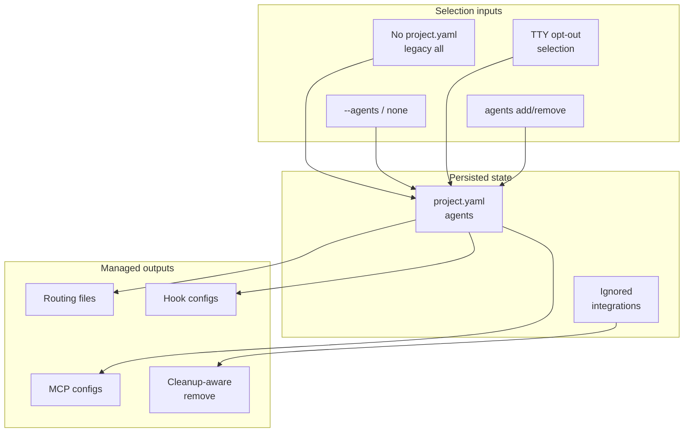
```mermaid
graph TD
  subgraph InputTier["Selection inputs"]
    direction LR
    LEGACY["No project.yaml<br>legacy all"] ~~~ FLAGS["--agents / none"]
    PROMPT["TTY opt-out<br>selection"] ~~~ LISTCMD["agents add/remove"]
  end

  subgraph StateTier["Persisted state"]
    direction LR
    SELECTED["project.yaml<br>agents"] ~~~ IGNORED["Ignored<br>integrations"]
  end

  subgraph ApplyTier["Managed outputs"]
    direction LR
    ROUTERS["Routing files"] ~~~ MCP["MCP configs"]
    HOOKS["Hook configs"] ~~~ CLEANUP["Cleanup-aware<br>remove"]
  end

  InputTier ~~~ StateTier
  StateTier ~~~ ApplyTier

  LEGACY --> SELECTED
  FLAGS --> SELECTED
  PROMPT --> SELECTED
  LISTCMD --> SELECTED
  SELECTED --> ROUTERS
  SELECTED --> MCP
  SELECTED --> HOOKS
  IGNORED --> CLEANUP
```

### D. Control-plane runtime (`.memory-seed/`)
- `agent-rules.md` (compact startup contract: discovery, read order, authority rules, change gates, **Working Principles**, **End Of Turn** pointers), `project-bootstrap.md` (bootstrap/repair only), `index.md` (orientation/active state/topology - bootstrap-generated), `policy.md` (constraints only - bootstrap-generated), `skills/`, `sessions/`, `archive/`, `hooks/`.
- Nearest-runtime discovery (`resolve_runtime`) supports nested sub-project runtimes; legacy `.AGENTS/` remains a code-level fallback.
- **Lazy-skill extraction (new in 2.13).** Detailed procedures that used to live directly in `agent-rules.md` were moved out into seeded skills - `history_retrieval.md`, `session_logging.md`, `end_of_turn.md`, `memory_hygiene.md`, `subproject_runtime.md` - so `agent-rules.md` now keeps startup-safe summaries plus explicit skill pointers, and seeded ESR commands point at `end_of_turn.md` for the full checklist.
- **Working Principles gained guard-preservation bullets (new in 2.14).** Follow-up to a fan-out evaluation of a third-party code-simplification plugin proposal (rejected as redundant with the built-in `code-review`/`simplify` skills and the existing orphan sweep): a decision-ladder-before-adding-code habit, and a reminder not to strip terse validation/ownership guards (a date-format check, an `is_ours` MCP-ownership check, an `isinstance` guard) without understanding what they protect against. Landed in Working Principles rather than a new skill file, since the risk applies to any incidental edit, not just tasks that self-identify as "code simplification." Backed by new regression tests for the two guards a codebase audit found genuinely untested (`_valid_session_date`; the `is_ours` check in the claude/cursor/gemini MCP-merge functions).
- **Mermaid usage guidance bullet (new in 2.14).** A third new Working Principles bullet: default to plain text; reserve Mermaid for genuinely spatial, temporal, or concurrent structure; keep blocks small; check syntax *and* semantic freshness (roadmap diagrams must be updated when shipped work changes status). From `docs/2_Todo/completed/mermaid-usage-guidance-plan.md`. `session_logging.md`'s Reason Rules simultaneously gained the failed-approaches rule: an attempted-and-failed or incompatible approach must be logged under `A` even unprompted (`docs/2_Todo/completed/failed-approaches-logging-plan.md`).
- **Visible branch history guidance (unreleased).** Working Principles now tell agents to load
  `agent_collaboration.md` before distinct feature/proposal/fix/refactor/test/docs work where the
  user expects the Git graph to show branch evolution. The default is task branch/worktree plus
  `git merge --no-ff`, unless the user explicitly chooses linear history, squash, rebase, or direct
  `main` work.
- **Skill architecture governance (unreleased).** `agent-rules.md` was trimmed further into a
  startup-safe contract, while optional `skill_architecture.md` now owns skill/profile boundary
  guidance, trigger-registry discipline, and seed/live parity workflow. It belongs to the
  `governance` skill profile so normal projects do not install it unless they maintain Memory Seed
  control-plane behavior.

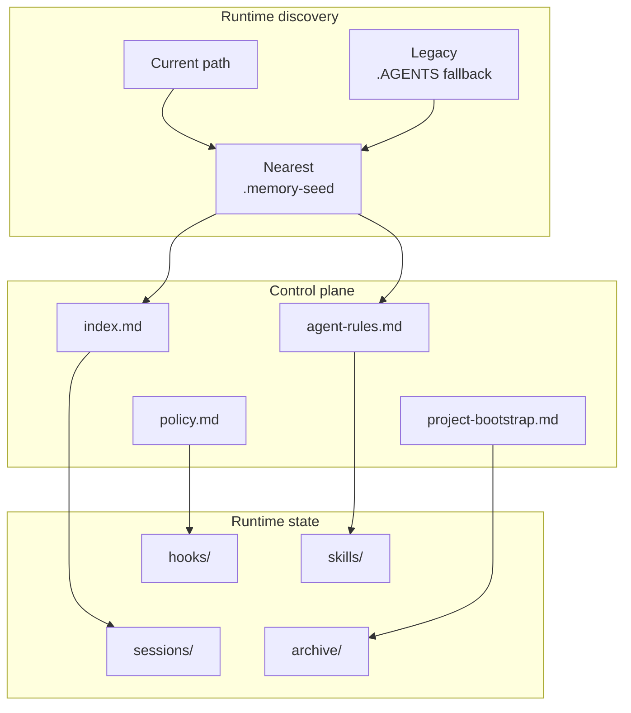
```mermaid
graph TD
  subgraph DiscoveryTier["Runtime discovery"]
    direction LR
    CWD["Current path"] ~~~ NEAREST["Nearest<br>.memory-seed"]
    LEGACY["Legacy<br>.AGENTS fallback"]
  end

  subgraph ControlTier["Control plane"]
    direction LR
    RULES["agent-rules.md"] ~~~ BOOT["project-bootstrap.md"]
    INDEX["index.md"] ~~~ POLICY["policy.md"]
  end

  subgraph StateTier["Runtime state"]
    direction LR
    SKILLS["skills/"] ~~~ SESSIONS["sessions/"]
    HOOKS["hooks/"] ~~~ ARCHIVE["archive/"]
  end

  DiscoveryTier ~~~ ControlTier
  ControlTier ~~~ StateTier

  CWD --> NEAREST
  NEAREST --> RULES
  NEAREST --> INDEX
  RULES --> SKILLS
  INDEX --> SESSIONS
  POLICY --> HOOKS
  BOOT --> ARCHIVE
  LEGACY --> NEAREST
```

### E. Routing files
- Canonical `AGENTS.md` (read by Codex, Cursor, and Copilot coding agent natively). Thin per-agent routers that point back to `AGENTS.md`: `CLAUDE.md`, `GEMINI.md`, `.github/copilot-instructions.md`.
- **Non-destructive routing into pre-existing files (new in 2.8).** Because these names collide with files other tools own (e.g. HyperFrames also uses `AGENTS.md`/`CLAUDE.md`), `init`/`update` decide per file by a 4-way ownership branch (`ROUTING_DESTINATIONS` in `core.py`): absent -> write full seed file; **ours** (carries `memory-system-version` frontmatter) -> version-gated archive+replace; **foreign with our markers** -> re-sync the managed block in place; **foreign without markers** -> inject a marker-delimited routing block (`<!-- BEGIN memory-seed -->...<!-- END memory-seed -->` pointing into `.memory-seed/`) appended at end. A foreign file is **never overwritten** - even under `init --force`. The in-place re-sync is gated on block-body equality (`_merge_routing_stanza`, mirroring `_merge_grouped_hook`), so a bare version bump causes no churn (the block carries no version stamp). Retired the legacy "versionless -> clobber" path: an unprovable-ownership file is merged, not destroyed.

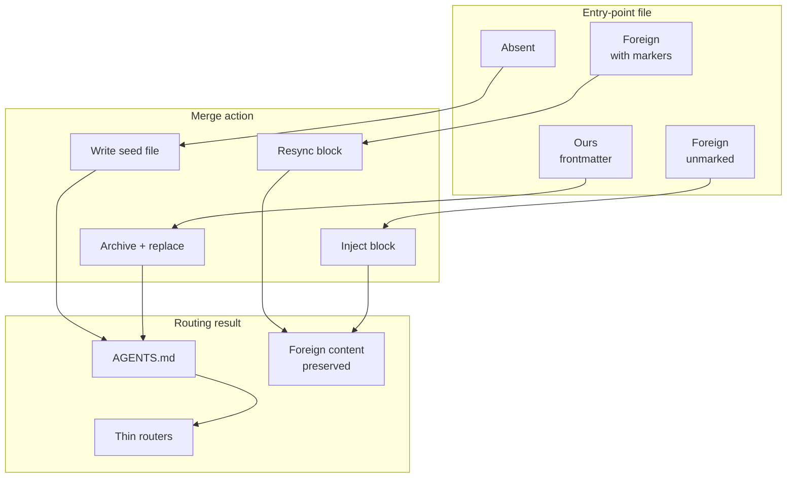
```mermaid
graph TD
  subgraph FileTier["Entry-point file"]
    direction LR
    ABSENT["Absent"] ~~~ OURS["Ours<br>frontmatter"]
    MARKED["Foreign<br>with markers"] ~~~ FOREIGN["Foreign<br>unmarked"]
  end

  subgraph ActionTier["Merge action"]
    direction LR
    WRITE["Write seed file"] ~~~ REPLACE["Archive + replace"]
    RESYNC["Resync block"] ~~~ INJECT["Inject block"]
  end

  subgraph ResultTier["Routing result"]
    direction LR
    AGENTS["AGENTS.md"] ~~~ THIN["Thin routers"]
    SAFE["Foreign content<br>preserved"]
  end

  FileTier ~~~ ActionTier
  ActionTier ~~~ ResultTier

  ABSENT --> WRITE
  OURS --> REPLACE
  MARKED --> RESYNC
  FOREIGN --> INJECT
  WRITE --> AGENTS
  REPLACE --> AGENTS
  RESYNC --> SAFE
  INJECT --> SAFE
  AGENTS --> THIN
```

### F. Skills system (`skills/`)
- `index.md` is a **deterministic trigger registry**: each skill listed with `required`, `load_when`, `do_not_load_when`, and an optional `persona:` scope. Agents read it at startup and **lazy-load** only the full runbooks that match the task.
- Current runbooks (22 total): `agent_collaboration`, `code_search`, `compact_mermaid_diagrams`,
  `data_architecture`, `docx_render_windows`, `document_ingestion`, `end_of_turn`,
  `history_retrieval`, `local_compilation`, `memory_consolidation`, `memory_doctor`,
  `memory_hygiene`, `office_document_editing`, `proposal_lifecycle`, `release_publishing`,
  `risk_signaling`, `security_triage`, `session_logging`, `skill_architecture`, and
  `subproject_runtime`, plus
  persona-scoped `copywriter-conversion` and `developer-rendered-ui-debugging`.
- `proposal_lifecycle` is path-aware: this repository uses `docs/1_Inbox/` -> `docs/2_Todo/` ->
  `docs/2_Todo/completed/` with `docs/3_Spec/` and `docs/4_Reference/`; newly initialized projects
  can still use the generic bootstrap anchors `docs/inbox/`, `docs/todo/`, `docs/todo/completed/`,
  and `docs/reference/`.
- **Fan-Out Recipe in `agent_collaboration` (new in 2.14).** A named "Explore / Plan / Implement / Validate" 9-gate pipeline (Scope, Exploration, Plan, Worker Identity, Worktree, Pre-Review Validation, Integration, Bounded Review-to-Rework Loop capped at 2 iterations, Final Handoff), new task-packet fields (`base_sha`, `expected_pwd`, `integration_artifact`, `capability_tier`, `shared_file_policy`, `conflict_owner`, `preflight`, `review_loop`), and vendor-neutral capability-tier guidance (planning and review both frontier-tier). From `docs/2_Todo/completed/agent-fanout-workflow-plan.md`.
- **Branch history preservation (unreleased).** `agent_collaboration.md` now distinguishes worktree
  isolation from visible Git topology: a worktree alone does not create a branch in the graph.
  Distinct parallel writing tasks get separate branches/worktrees, and integration uses
  `git merge --no-ff` when branch-and-merge shape matters. The read-only `branch status` command
  surfaces this as a warning/guidance check for all agent types.

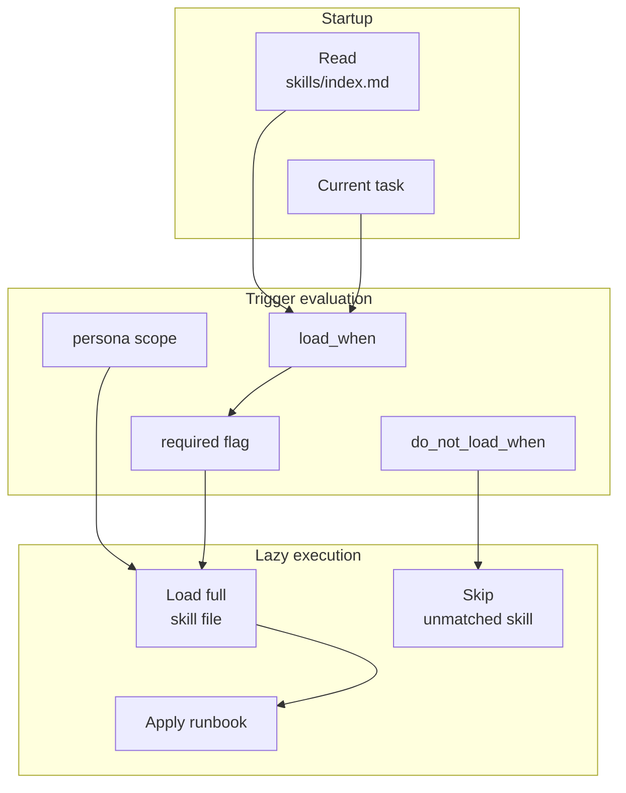
```mermaid
graph TD
  subgraph StartupTier["Startup"]
    direction LR
    READ["Read<br>skills/index.md"] ~~~ TASK["Current task"]
  end

  subgraph MatchTier["Trigger evaluation"]
    direction LR
    LOADWHEN["load_when"] ~~~ DONT["do_not_load_when"]
    PERSONA["persona scope"] ~~~ REQUIRED["required flag"]
  end

  subgraph RuntimeTier["Lazy execution"]
    direction LR
    SKILL["Load full<br>skill file"] ~~~ RUN["Apply runbook"]
    SKIP["Skip<br>unmatched skill"]
  end

  StartupTier ~~~ MatchTier
  MatchTier ~~~ RuntimeTier

  READ --> LOADWHEN
  TASK --> LOADWHEN
  LOADWHEN --> REQUIRED
  DONT --> SKIP
  PERSONA --> SKILL
  REQUIRED --> SKILL
  SKILL --> RUN
```

### G. Personas (`.agents/`)
- Vendor-neutral persona templates (developer, content-creator, researcher, sales-rep, solo-founder, copywriter) + `_registry.yaml`. Each defines identity, memory protocol, rules, skill routing, and an append-only `## Project Adaptations` log.
- **Persona evolution** is approval-gated: at session end an agent may draft <=3 adaptations and must get user approval before editing the persona file. `agent_name` is recorded in session entries when a persona is active.

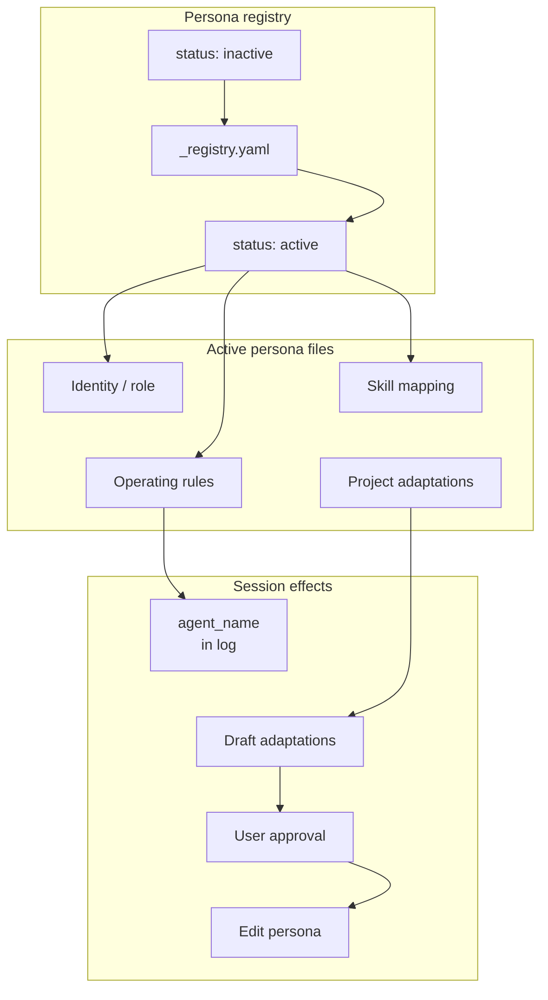
```mermaid
graph TD
  subgraph RegistryTier["Persona registry"]
    direction LR
    REG["_registry.yaml"] ~~~ ACTIVE["status: active"]
    INACTIVE["status: inactive"]
  end

  subgraph PersonaTier["Active persona files"]
    direction LR
    IDENTITY["Identity / role"] ~~~ RULES["Operating rules"]
    SKILLMAP["Skill mapping"] ~~~ ADAPT["Project adaptations"]
  end

  subgraph SessionTier["Session effects"]
    direction LR
    NAME["agent_name<br>in log"] ~~~ DRAFT["Draft adaptations"]
    APPROVAL["User approval"] ~~~ EDIT["Edit persona"]
  end

  RegistryTier ~~~ PersonaTier
  PersonaTier ~~~ SessionTier

  REG --> ACTIVE
  ACTIVE --> IDENTITY
  ACTIVE --> RULES
  ACTIVE --> SKILLMAP
  RULES --> NAME
  ADAPT --> DRAFT
  DRAFT --> APPROVAL
  APPROVAL --> EDIT
  INACTIVE --> REG
```

### H. Lifecycle hooks (`.memory-seed/hooks/`, auto-merged per agent)
| Script | Fires | Does |
|---|---|---|
| `session-start-context.py` | session start | Reads the newest dated session file directly and **injects** its path, all headings, and the latest entry body (recency over search). User-aware since 2.10: injects the **active user's** newest entry plus same-day co-contributor file counts. Its own user resolution mirrors `session_target()`'s participant-count gate (new in 2.14) so it reads whichever file that function actually writes to. **One-time identity-setup offer (new in 2.14):** if no local identity is configured at all, offers once to run `memory-seed user set <slug>`, tracked by a gitignored `.memory-seed/.identity-offer-stamp` so it never repeats. |
| `memory-retrieval-check.py` | before a prompt/turn | Reminds the agent to use `memory_search` for **topical** recall; throttled ~once per session. |
| `session-log-check.py` | turn end | Reminds the agent to append a session entry; warns on out-of-order entries. User-aware since 2.10: checks only the **active user's** file. **Escalation (unreleased):** a gitignored `.memory-seed/.session-log-check-state` (fail-open on corruption) tracks consecutive stale checks with no new entry appearing in between; a miss that survives one reminder escalates to explicit "repeated" wording naming the count and citing the discipline-failure framing from `agent-rules.md`, instead of repeating identically forever. |
| `prepare-commit-msg.py` | git commit message preparation | Stamps `Memory-Entry: <entry_id>` trailers for staged session entries. The installed git hook shim lives in the git common dir so it covers all worktrees; `hooks status` audits it, `hooks repair` refreshes missing/stale Memory Seed-managed shims, and foreign hooks are never overwritten. On Windows the shim uses the active Python executable directly to avoid Git-for-Windows shell startup failures. |

Per-agent event names differ (Claude/Codex: `SessionStart`/`UserPromptSubmit`/`Stop`; Gemini: `SessionStart`/`BeforeAgent`/`AfterAgent`; Cursor: `sessionStart`/`afterAgentResponse`; Copilot CLI: `sessionStart` prompt hook only). Hooks **nudge, never block**. The user-aware paths fall back to legacy flat-file behavior when no user is configured.

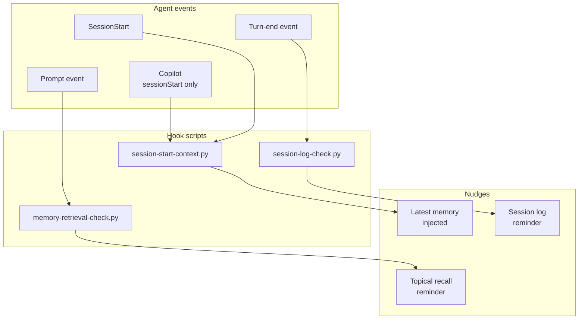
```mermaid
graph TD
  subgraph EventTier["Agent events"]
    direction LR
    START["SessionStart"] ~~~ PROMPT["Prompt event"]
    END["Turn-end event"] ~~~ COPILOT["Copilot<br>sessionStart only"]
  end

  subgraph HookTier["Hook scripts"]
    direction LR
    CONTEXT["session-start-context.py"] ~~~ RETRIEVAL["memory-retrieval-check.py"]
    LOGCHECK["session-log-check.py"]
  end

  subgraph OutputTier["Nudges"]
    direction LR
    LATEST["Latest memory<br>injected"] ~~~ TOPICAL["Topical recall<br>reminder"]
    LOGNUDGE["Session log<br>reminder"]
  end

  EventTier ~~~ HookTier
  HookTier ~~~ OutputTier

  START --> CONTEXT
  PROMPT --> RETRIEVAL
  END --> LOGCHECK
  COPILOT --> CONTEXT
  CONTEXT --> LATEST
  RETRIEVAL --> TOPICAL
  LOGCHECK --> LOGNUDGE
```

### I. MCP memory retrieval and control preview
- `mcp_server.py`: a dependency-light **stdio JSON-RPC** server. Retrieval tools are `memory_search` (ranked entries/sections) and `memory_get_chunk` (full text for one `chunk_id`). Authoring-support tools (read-only, unreleased) are `memory_link_suggest` (rank older entries to link — paste-ready `related_entries`), `memory_link_show` (one entry's graph node), and `memory_session_target` (resolve the append target, `create=False`) — together they close the write-side loop the retrieval tools open on the read side. Topic-management tools are `memory_topics_list`, `memory_topic_inspect`, and `memory_topics_check`, all read-only wrappers over the project-local topic index and `topics check` semantics. Collaboration/control-preview tools are `memory_branch_status` (read-only branch/worktree posture), `memory_worktree_guard` (read-only agent namespace pre-write classification), and `memory_session_fuse_preview` (read-only branch-local session/sidecar fuse plan). Unreleased after 2.15: retrieval is now a **thin wrapper over `retrieval.py`** with a byte-identical tool contract (parity-tested).
- `retrieval.py` (**new, unreleased - Memory Trace distribution Phase 1**): the public, MCP-independent retrieval service every consumer rides - `search_memory()`, `get_chunk()` (opt-in `include_diagrams`), `resolve_semantic_provider()`, the canonical `ranked_to_dict`/`chunk_to_dict` result dicts, the `EntryRollup`/`rollup_entry_matches()`/`rollup_entry_results()` entry-level rollup contract (one visible result per session entry; `best_match_chunk_id`, `matched_sections`, `score_source`), and `entry_diagram_sidecars()`. MCP wraps it; Memory Trace imports it as its frozen surface.
- **MCP skill surface (unreleased).** `skills/index.md` routes `memory_search`/`memory_get_chunk` plus the read-only authoring-support tools (`memory_link_suggest`/`memory_link_show`/`memory_session_target`) to `history_retrieval.md`, and routes `memory_branch_status`/`memory_worktree_guard`/`memory_session_fuse_preview` to `agent_collaboration.md`. Topic MCP tools (`memory_topics_list`/`memory_topic_inspect`/`memory_topics_check`) support the same history-retrieval/session-authoring loop by letting an LLM inspect the controlled vocabulary before choosing entry topics. Every MCP tool is read-only: the authoring-support tools help an LLM fill `related_entries` and find its append target, the topic tools help it choose/validate existing topics, the collaboration tools help it diagnose branch posture, classify agent namespace safety, and preview fuse blockers/plans, and all write application (session appends, fuse apply, topic-index edits, root-write overrides) stays on the CLI/direct-file path with user approval where required.
- `semantic_cache.py`: `extract_memory_chunks()` parses `sessions/*.md` into typed `MemoryChunk`s (entry- or section-granularity; `session_date` derived from filename; `entry_id` as `chunk_id`). `rank_memory_chunks()` combines **lexical + semantic + recency** signals:
  `final = (lexical_score + 3-max(semantic,0)) - recency_multiplier`, with semantic via Model2Vec (`model2vec:minishlab/potion-base-8M`, lexical fallback) and an exponential recency decay floored at `recency_floor`.
- **Metadata + filters.** `memory_search`/`memory_get_chunk` expose `session_date`, `path`, per-user `user`, `file_hash_id`, and entry-level `related_entries` (2.12); `memory_search` accepts `user`, `date_from`, and `date_to` filters applied before ranking. Unreleased after 2.14: `memory_get_chunk` also exposes `superseded_by`, `inbound_relation_count`, and `importance_score`; `memory_search` results carry stored `supersedes` and accept an opt-in `exclude_superseded` filter (default off) that drops superseded entries from a single query.
- **Related-entry graph (new in 2.13, extended unreleased).** `build_related_entry_graph()` computes the bidirectional related-entry graph at read time - each entry's stored outbound `related_entries` plus computed inbound backlinks from every other entry that points at it, without ever editing a historical entry. Unreleased extensions add typed `supersedes` edges, computed `superseded_by`, raw `inbound_relation_count`, and supersession-aware `importance_score`; the Trace graph's combined node-degree field is named `connectivity` to avoid colliding with the inbound-only metric.
- `mcp_validate.py` + `memory-seed-mcp-validate`: human-validatable search/fetch harness.

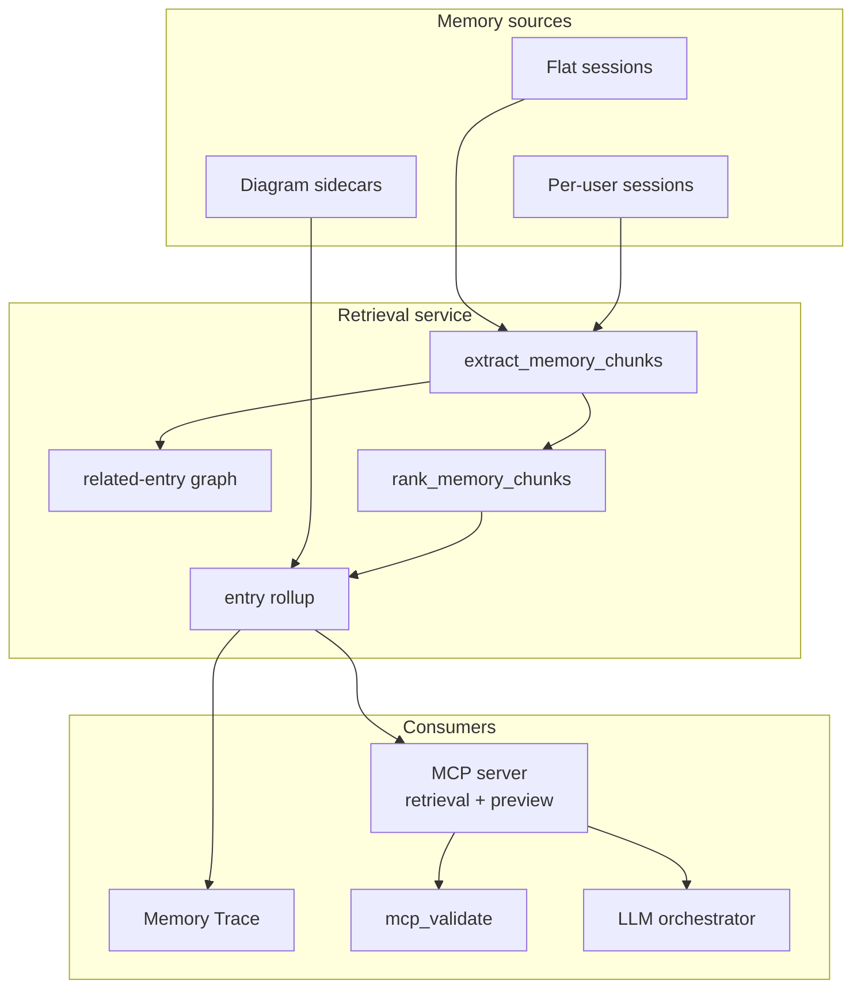
```mermaid
graph TD
  subgraph SourceTier["Memory sources"]
    direction LR
    FLAT["Flat sessions"] ~~~ USER["Per-user sessions"]
    DIAGRAMS["Diagram sidecars"]
  end

  subgraph ServiceTier["Retrieval service"]
    direction LR
    CHUNKS["extract_memory_chunks"] ~~~ RANK["rank_memory_chunks"]
    GRAPH["related-entry graph"] ~~~ ROLLUP["entry rollup"]
  end

  subgraph ConsumerTier["Consumers"]
    direction LR
    MCP["MCP server<br>retrieval + preview"] ~~~ TRACE["Memory Trace"]
    VALIDATE["mcp_validate"]
    ORCH["LLM orchestrator"]
  end

  SourceTier ~~~ ServiceTier
  ServiceTier ~~~ ConsumerTier

  FLAT --> CHUNKS
  USER --> CHUNKS
  DIAGRAMS --> ROLLUP
  CHUNKS --> RANK
  CHUNKS --> GRAPH
  RANK --> ROLLUP
  ROLLUP --> MCP
  ROLLUP --> TRACE
  MCP --> VALIDATE
  MCP --> ORCH
```

### J. Session log model
- Append-only dated files now write to `sessions/YYYY-MM/YYYY-MM-DD.md` or `sessions/YYYY-MM/YYYY-MM-DD/<user>.md`; legacy `sessions/YYYY-MM-DD.md` and `sessions/YYYY-MM-DD/<user>.md` remain readable. Entries carry a YAML block (`entry_id`, `user_initials`, `agent_type`, `agent_name?`, `project_path`, `subproject_path`, optional `related_entries`). The **DRAFT** record is the baseline shape: D (Decision) and R (Reason) mandatory; A (Alternatives), F (Files), T (Tests) optional. Strict ascending-time, append-at-end chronology.
- **Entry IDs (widened in 2.12).** New generated `entry_id`s use deterministic 80-bit `mse_` Base32 IDs (`generate_session_entry_id()`); legacy 32-bit `ms-` IDs remain valid and are never rewritten.
- **Integrity validation (new in 2.12, grouped-aware after current work).** `check_session_links()` / `memory-seed links check` scans for duplicate `entry_id`/`hash_id` and dangling refs, exiting non-zero as a CI gate. The legacy-flat `related_entries` scan gap was fixed in 2.14. It also validates `supersedes` refs (dangling/self/postdates/cycle), `commits:` hashes (malformed/unknown when git is present), and decision-diagram sidecars under both `sessions/diagrams/YYYY-MM-DD.md` and `sessions/diagrams/YYYY-MM/YYYY-MM-DD.md` (`malformed-diagram`, `orphan-diagram`, `diagram-date-mismatch`; sidecars always optional).
- **Decision diagram sidecars (diagrams plan Phase 1; grouped after current work; trigger tightened, unreleased).** Authored reasoning diagrams append to `sessions/diagrams/YYYY-MM/YYYY-MM-DD.md` - one dated file per day, mirroring the grouped session-log convention for filesystem readability; legacy sidecars under `sessions/diagrams/YYYY-MM-DD.md` remain readable. Each diagram is a `## <timestamp> - <title>` heading block naming its `entry_id` in a fenced yaml block, followed by fenced mermaid block(s), never inlined in the append-only session log itself. Sidecars stay optional and still require the same spatial/temporal/concurrent bar as the Mermaid Working Principle, but branch/merge topology, old-to-new layout migrations, schema/compatibility flows, multi-agent concurrency, command lifecycle flows, and retrieval/data pipeline decisions are now **positive triggers** rather than an "only if it clearly helps" judgment call - when one applies and no sidecar is written, the entry must state why under `A:`/`Follow-up`. Authoring guidance lives in `session_logging.md` + `end_of_turn.md` (live + seed); metadata surfaces through `retrieval.entry_diagram_sidecars()` (opt-in `include_diagrams`, never set by the MCP tool contract) and the Memory Trace chunk view.
- **Decision Harvest (session-logging, unreleased).** Before choosing an entry's shape, `session_logging.md`/`end_of_turn.md` now route through an explicit harvest step: list every durable choice made in the turn first, then pick single-DRAFT, multi-decision (`D1`/`D2`), or separate entries based on what was actually harvested - closing a gap where several distinct decisions were getting compressed into one broad `D:` record.
- **Branch-session fuse (unreleased).** `memory-seed session fuse --branch <branch>` lets an orchestrator dry-run branch-local memory before promotion, then apply it only during an in-progress `git merge --no-ff --no-commit <branch>`. It imports branch-only entries when `branch:` matches the source branch, existing entries are unmodified, IDs are present/unique, target chronology remains valid, paths can normalize to the grouped layout, and changed branch session/diagram files decode as UTF-8. A branch-delta decode failure blocks with the named file instead of silently omitting it; base-side decode failures remain non-blocking for already-present and sidecar-parent lookups. Diagram sidecars are accepted only when their parent entry already exists on the base/main tree or the parent branch entry is accepted for promotion in the same fuse; orphan or malformed sidecars block the fuse.
- **One-step branch integration (unreleased).** `memory-seed session merge-branch --branch <branch> [--dry-run]` wraps the fuse dance into a single command after two real incidents where the manual dry-run/apply steps were skipped and raw git line-merges landed session entries out of chronological order. Sequence: fuse dry-run gate (issues abort before any merge state exists), `git merge --no-ff --no-commit`, conflict classification (any non-session conflict leaves the merge in progress for manual resolution - never `merge --abort`), reset of branch-touched session paths to base content (defeats both conflict markers and silent out-of-order auto-merges), fuse apply, stage, and commit reusing git's prepared merge message. Requires a clean working tree and refuses with the specific dirty paths named. The recorded decision that fuse stays an explicit command rather than a git merge driver (`mse_9c151e4gbkkv1w5v`) is preserved - this is choreography around the same explicit primitives, not automation inside git.
- **Evolution edges and artifact lineage (unreleased).** Implements `docs/2_Todo/evolution-edges-plan.md`: (1) a typed `evolves:` edge - "this entry extends that decision, which remains valid" - with a read-time-only computed `evolved_by` inverse that never dampens `importance_score` and never feeds `exclude_superseded` (the semantic line vs. `supersedes`); (2) append-only enforcement via the `authored-inverse-field` links-check guard (a stored `superseded_by:`/`evolved_by:` key is a named integrity error, not a silently ignored no-op); (3) the structured `continuity:` field (`kind: rename|migration|removal` with `from`/`to`; `to` forbidden on removal) recording artifact lineage as historical labels, validated structurally (`malformed-continuity`); (4) rarity-weighted `F:` file-overlap ranking in `link suggest`/`memory_link_suggest` with per-suggestion `shared_files` evidence, alias-resolved transitively through recorded renames (boost-only - hub files contribute ~nothing via idf, absent `F:` is never penalized); (5) computed `superseded_by`/`evolved_by` on every `memory_search` result - freshness at the moment of consumption, additive fields with ranking and order untouched; (6) Decision Harvest lifecycle prompts (replace/remove/evolve an earlier decision + rename/relocate/remove an artifact) in `session_logging.md`/`end_of_turn.md` (live + seed). Forward-only guards (`dangling`/`self`/`postdates`/`cycle`) run independently per edge kind.
- **Multi-user session memory (phased).** `iter_session_documents()` now reads four layouts: legacy flat (`sessions/YYYY-MM-DD.md`), legacy per-day/per-user (`sessions/YYYY-MM-DD/<user>.md`), grouped flat (`sessions/YYYY-MM/YYYY-MM-DD.md`), and grouped per-user (`sessions/YYYY-MM/YYYY-MM-DD/<user>.md`). `memory_search`, `memory_get_chunk`, Memory Trace, hooks, `links check`, and `compact` consume that shared iterator. `session_target()` writes new flat targets to `sessions/YYYY-MM/YYYY-MM-DD.md`; when the per-user gate applies it writes `sessions/YYYY-MM/YYYY-MM-DD/<user>.md`. `--create` initializes per-user file frontmatter (`schema_version: 2`, `session_date`, immutable `hash_id`, `user`, `created_at`). Historical files are moved only by explicit migration.
- **Participant-count layout gating (new in 2.14).** A configured user alone no longer fragments the log: `session_target()` only honors an *ambiently*-resolved user (env var or `local.yaml`) once `.memory-seed/project.yaml`'s `participants:` list has 2 or more entries - with 0 or 1, it stays on the shared grouped flat file, since per-user files exist to avoid concurrent-author conflicts that don't arise until there's a second author. An explicit `--user <slug>` CLI override still bypasses the gate (a deliberate one-shot choice). `doctor` separately warns (non-fatal) when a configured local user has no matching `participants:` entry. This repository has one participant registered (`jean`, initials `JNL`), so it correctly stays on the grouped flat layout for new writes.

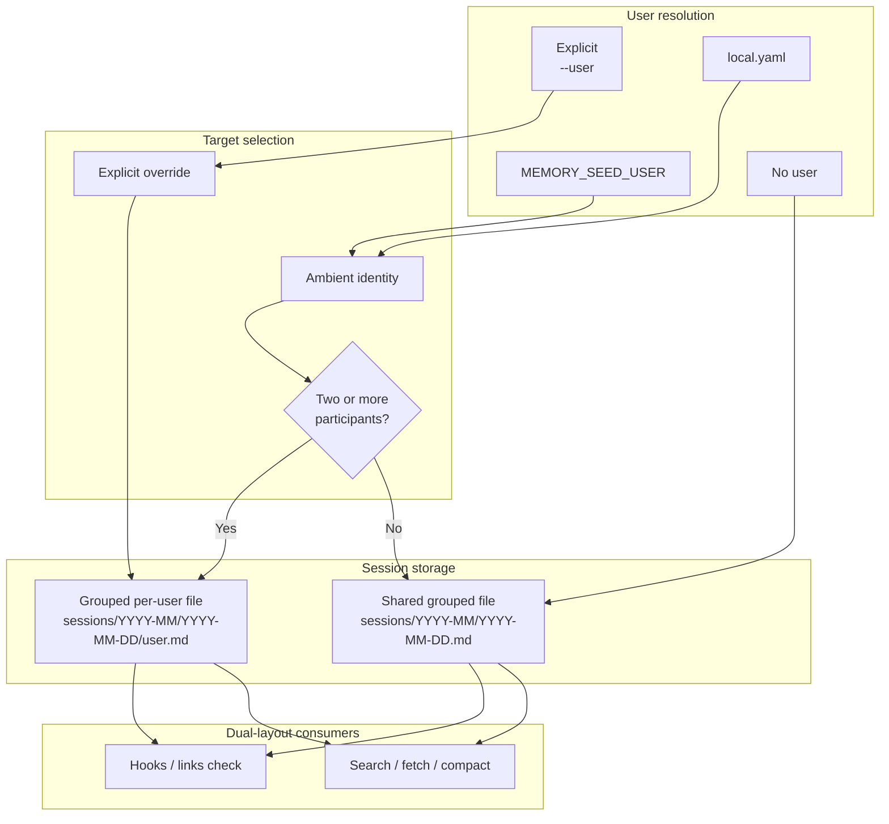
```mermaid
graph TD
  subgraph IdentityTier["User resolution"]
    direction LR
    CLI["Explicit<br>--user"] ~~~ ENV["MEMORY_SEED_USER"]
    LOCAL["local.yaml"] ~~~ NONE["No user"]
  end

  subgraph RoutingTier["Target selection"]
    direction LR
    EXPLICIT["Explicit override"]
    AMBIENT["Ambient identity"]
    GATE{"Two or more<br>participants?"}
    EXPLICIT ~~~ AMBIENT ~~~ GATE
  end

  subgraph StorageTier["Session storage"]
    direction LR
    FLAT["Shared grouped file<br>sessions/YYYY-MM/YYYY-MM-DD.md"]
    SPLIT["Grouped per-user file<br>sessions/YYYY-MM/YYYY-MM-DD/user.md"]
  end

  subgraph ReaderTier["Dual-layout consumers"]
    direction LR
    RETRIEVAL["Search / fetch / compact"]
    OPERATIONS["Hooks / links check"]
  end

  IdentityTier ~~~ RoutingTier
  RoutingTier ~~~ StorageTier
  StorageTier ~~~ ReaderTier

  CLI --> EXPLICIT
  EXPLICIT --> SPLIT
  ENV --> AMBIENT
  LOCAL --> AMBIENT
  AMBIENT --> GATE
  NONE --> FLAT
  GATE -- No --> FLAT
  GATE -- Yes --> SPLIT
  FLAT --> RETRIEVAL
  FLAT --> OPERATIONS
  SPLIT --> RETRIEVAL
  SPLIT --> OPERATIONS
```

### K. Versioning, seed/live twins, archiving
- `memory-system-version` frontmatter + `core.py VERSION` + `pyproject.toml version` must stay in lockstep (the "version-bump trap", guarded by `test_repo_root_control_plane_files_match_version`).
- Seed templates and the repo's own live runtime are **twins** (parity enforced by tests). `update` is **forward-only** and archives replaced files under `archive/<old-version>/`.

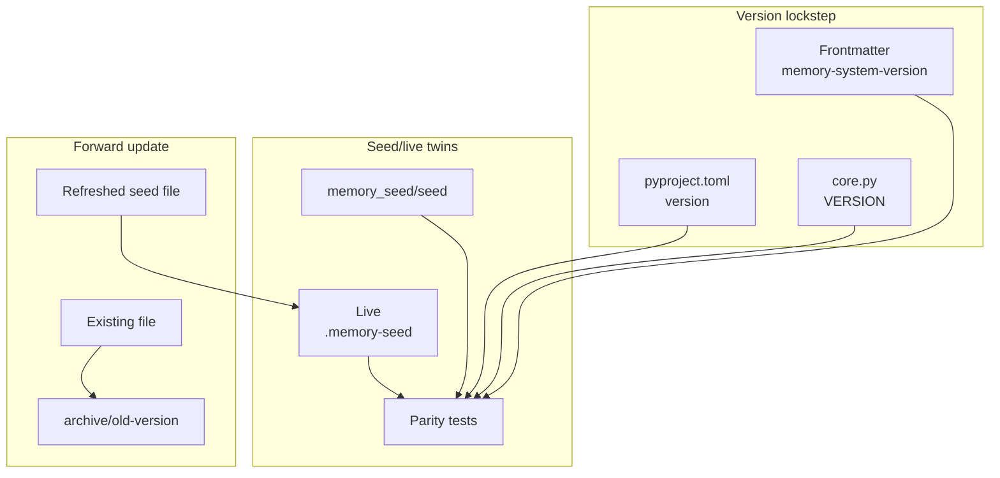
```mermaid
graph TD
  subgraph VersionTier["Version lockstep"]
    direction LR
    FRONT["Frontmatter<br>memory-system-version"] ~~~ CORE["core.py<br>VERSION"]
    PACKAGE["pyproject.toml<br>version"]
  end

  subgraph TwinTier["Seed/live twins"]
    direction LR
    SEED["memory_seed/seed"] ~~~ LIVE["Live<br>.memory-seed"]
    TEST["Parity tests"]
  end

  subgraph UpdateTier["Forward update"]
    direction LR
    OLD["Existing file"] ~~~ ARCHIVE["archive/old-version"]
    NEW["Refreshed seed file"]
  end

  VersionTier ~~~ TwinTier
  TwinTier ~~~ UpdateTier

  FRONT --> TEST
  CORE --> TEST
  PACKAGE --> TEST
  SEED --> TEST
  LIVE --> TEST
  OLD --> ARCHIVE
  NEW --> LIVE
```

### L. `doctor` health + warnings
- Reports missing files, version mismatches, bootstrap completeness. Non-fatal `warnings` channel covers: Codex MCP status (absent/stale-fixable/stale-manual); **orphan skills** (any `skills/*.md` not registered in `skills/index.md`, since 2.7); **orphaned runtime routing** (new in 2.8 - a `.memory-seed/` runtime exists but a present entry-point file is foreign and carries no routing block); a session-integrity summary pointing at `links check` (since 2.12); and a **local-user/participant mismatch** (new in 2.14; a configured `.memory-seed/local.yaml` user whose slug has no matching `participants:` entry in `.memory-seed/project.yaml`). Foreign routing files are not reported as version mismatches (the host owns the file; Memory Seed only manages its injected block).

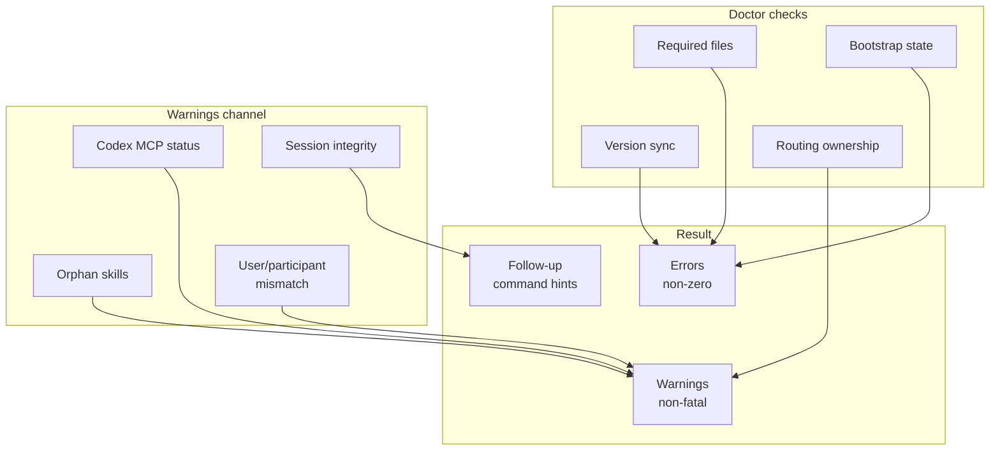
```mermaid
graph TD
  subgraph InputsTier["Doctor checks"]
    direction LR
    FILES["Required files"] ~~~ VERSION["Version sync"]
    BOOT["Bootstrap state"] ~~~ ROUTING["Routing ownership"]
  end

  subgraph WarningTier["Warnings channel"]
    direction LR
    MCP["Codex MCP status"] ~~~ SKILLS["Orphan skills"]
    SESSIONS["Session integrity"] ~~~ USERS["User/participant<br>mismatch"]
  end

  subgraph ResultTier["Result"]
    direction LR
    ERRORS["Errors<br>non-zero"] ~~~ WARNINGS["Warnings<br>non-fatal"]
    NEXT["Follow-up<br>command hints"]
  end

  InputsTier ~~~ WarningTier
  WarningTier ~~~ ResultTier

  FILES --> ERRORS
  VERSION --> ERRORS
  BOOT --> ERRORS
  ROUTING --> WARNINGS
  MCP --> WARNINGS
  SKILLS --> WARNINGS
  SESSIONS --> NEXT
  USERS --> WARNINGS
```

### M. End-of-turn routine (`/esr`)
- The vendor-neutral end-of-session routine lives in `agent-rules.md` "End Of Turn". It runs: session-log append; **consolidation review** (promote durable facts -> `index.md`/`policy.md` via `memory_consolidation`, since 2.11); index/policy review; a diff-scoped **orphan & artifact sweep** (new in 2.7 - confirm additions are wired in, resolve references dangling from deletions/renames, flag scratch debris; optionally run a project's own dead-code tool, never installs one); persona/skill evolution (approval-gated); and a **baseline-promotion check** (flag generic adaptations for reuse, record in `.memory-seed/plans/`, since 2.11).
- Shipped as a seeded **`/esr`** command (new in 2.11) for agents with a repo-level command mechanism: Claude (`.claude/commands/esr.md`, version-tracked) and Gemini (`.gemini/commands/esr.toml`, deploy-once). Codex/Cursor run the routine directly from `agent-rules.md`. **No blocking `Stop` hook** - evolution needs reasoning + user approval a hook cannot provide.

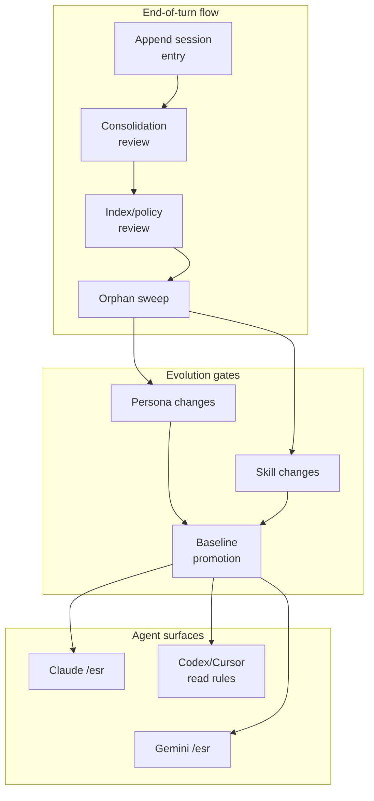
```mermaid
graph TD
  subgraph CloseoutTier["End-of-turn flow"]
    direction LR
    LOG["Append session<br>entry"] ~~~ CONSOLIDATE["Consolidation<br>review"]
    REVIEW["Index/policy<br>review"] ~~~ SWEEP["Orphan sweep"]
  end

  subgraph EvolutionTier["Evolution gates"]
    direction LR
    PERSONA["Persona changes"] ~~~ SKILL["Skill changes"]
    BASELINE["Baseline<br>promotion"]
  end

  subgraph DeliveryTier["Agent surfaces"]
    direction LR
    CLAUDE["Claude /esr"] ~~~ GEMINI["Gemini /esr"]
    CODEX["Codex/Cursor<br>read rules"]
  end

  CloseoutTier ~~~ EvolutionTier
  EvolutionTier ~~~ DeliveryTier

  LOG --> CONSOLIDATE
  CONSOLIDATE --> REVIEW
  REVIEW --> SWEEP
  SWEEP --> PERSONA
  SWEEP --> SKILL
  PERSONA --> BASELINE
  SKILL --> BASELINE
  BASELINE --> CODEX
  BASELINE --> CLAUDE
  BASELINE --> GEMINI
```

### N. Release / publish flow
- GitHub Release -> `publish.yml` builds, runs tests, then pauses at the `pypi` manual-approval gate before the OIDC push. Release commits land on `main`.

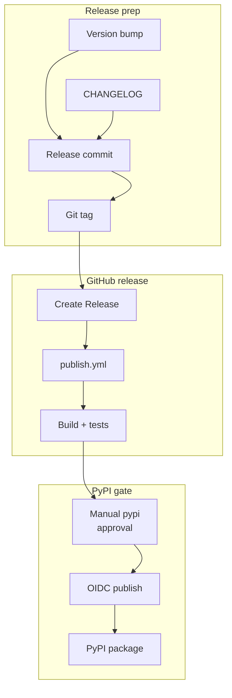
```mermaid
graph TD
  subgraph PrepTier["Release prep"]
    direction LR
    VERSION["Version bump"] ~~~ CHANGELOG["CHANGELOG"]
    COMMIT["Release commit"] ~~~ TAG["Git tag"]
  end

  subgraph GitHubTier["GitHub release"]
    direction LR
    RELEASE["Create Release"] ~~~ WORKFLOW["publish.yml"]
    TESTS["Build + tests"]
  end

  subgraph PublishTier["PyPI gate"]
    direction LR
    APPROVAL["Manual pypi<br>approval"] ~~~ OIDC["OIDC publish"]
    PYPI["PyPI package"]
  end

  PrepTier ~~~ GitHubTier
  GitHubTier ~~~ PublishTier

  VERSION --> COMMIT
  CHANGELOG --> COMMIT
  COMMIT --> TAG
  TAG --> RELEASE
  RELEASE --> WORKFLOW
  WORKFLOW --> TESTS
  TESTS --> APPROVAL
  APPROVAL --> OIDC
  OIDC --> PYPI
```

### O. Memory Trace (review UI; legacy Lense shim)
- The review UI shipped in 2.13 as the in-package `memory-seed[lense]` extra ("Memory Lense") and was **extracted** into a separate `memory-trace/` source/product boundary (Arc 1 of the Memory Trace roadmap). The public install path is now `memory-seed[trace]`, which exposes the `memory-trace` command while importing the public retrieval service (`memory_seed/retrieval.py`). `memory-seed[lense]` is now a deprecated alias, and `memory-seed lense` delegates to `memory-trace` when installed. Plain `memory-seed` ships **no** web framework.
- Serves search, filters, timeline, graph, and reader/details views over the same `semantic_cache` parsing/ranking + `retrieval` service MCP uses - no forked retrieval logic (parity tested across the Trace source boundary). Current Trace topic facets/edges historically derived display topics from Markdown hashtags plus heading contexts. Controlled entry-YAML `topics:` and project-local `.memory-seed/topics.yaml` are now implemented in the core parser/retrieval/CLI/MCP path; Trace indexed-topic rendering as chronological chains has landed, and optional `topics suggest --from <file>` remains in `docs/2_Todo/memory-trace-topic-neighbourhoods-plan.md`.
- **Cache architecture:** a rebuildable local SQLite cache stored **outside the repository** (`%LOCALAPPDATA%\memory-seed\lense` on Windows, `~/.cache/memory-seed/lense` elsewhere; keyed by a hash of the workspace root, with a `tempfile` fallback if the cache directory isn't writable). `TraceCache.rebuild()` does a full wipe-and-atomic-replace (`os.replace` after a `.tmp` write) whenever session-file mtime/size drift is detected - the cache is never authoritative and Markdown stays the source of truth. Because the cache lives outside the repo by construction, this also satisfies the project's OneDrive-sync-safety constraint (see section 6) without needing to gitignore anything.
- Static UI assets (`memory-trace/memory_trace/static/`: `index.html`, `app.js`, `styles.css`, `manifest.json`) ship inside the root `memory-seed` wheel/sdist when the `trace` extra is used.
- **Next-generation planning (promoted 2026-07-11):** `docs/2_Todo/memory-trace-product-and-system-architecture-blueprint.md` is the top-level product/system entry point; `docs/2_Todo/memory-trace-next-generation-implementation-roadmap.md` sequences the future API/React/Trail/evidence/hosted phases; `docs/2_Todo/memory-trace-next-generation-coverage-matrix.md` explains which older plans remain active; and the new live specs are `docs/3_Spec/memory-trace-trail-search-and-graph-ux.md` plus `docs/3_Spec/memory-trace-derived-artifact-provenance-contract.md`.

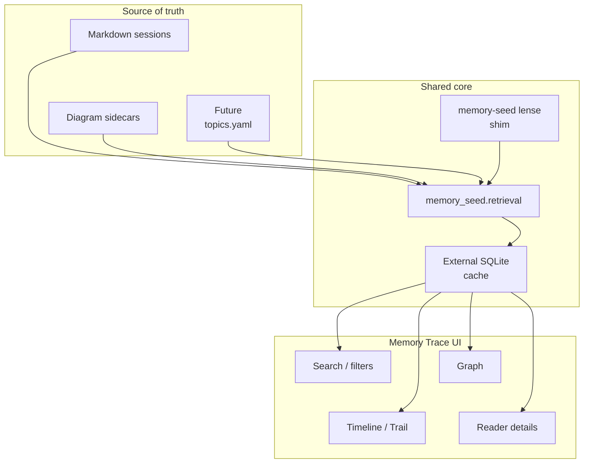
```mermaid
graph TD
  subgraph SourceTier["Source of truth"]
    direction LR
    MARKDOWN["Markdown sessions"] ~~~ SIDECARS["Diagram sidecars"]
    TOPICS["Future<br>topics.yaml"]
  end

  subgraph CoreTier["Shared core"]
    direction LR
    RETRIEVAL["memory_seed.retrieval"] ~~~ CACHE["External SQLite<br>cache"]
    SHIM["memory-seed lense<br>shim"]
  end

  subgraph TraceTier["Memory Trace UI"]
    direction LR
    SEARCH["Search / filters"] ~~~ TIMELINE["Timeline / Trail"]
    GRAPH["Graph"] ~~~ READER["Reader details"]
  end

  SourceTier ~~~ CoreTier
  CoreTier ~~~ TraceTier

  MARKDOWN --> RETRIEVAL
  SIDECARS --> RETRIEVAL
  TOPICS --> RETRIEVAL
  RETRIEVAL --> CACHE
  SHIM --> RETRIEVAL
  CACHE --> SEARCH
  CACHE --> TIMELINE
  CACHE --> GRAPH
  CACHE --> READER
```

---

## 4. Data-flow diagrams

### 4.1 `init` / `update` - install & merge

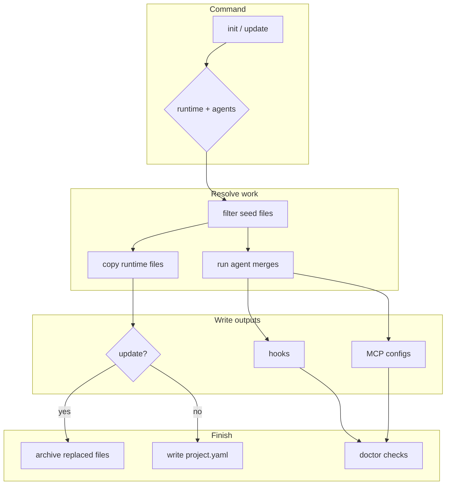
```mermaid
graph TD
  subgraph Input["Command"]
    direction LR
    A["init / update"] --> B{"runtime + agents"}
  end

  subgraph Plan["Resolve work"]
    direction LR
    B --> C["filter seed files"]
    C --> D["copy runtime files"]
    C --> E["run agent merges"]
  end

  subgraph Outputs["Write outputs"]
    direction LR
    E --> F["hooks"]
    E --> G["MCP configs"]
    D --> H{"update?"}
  end

  subgraph Finish["Finish"]
    direction LR
    H -- yes --> I["archive replaced files"]
    H -- no --> J["write project.yaml"]
    F --> K["doctor checks"]
    G --> K
  end

  Input ~~~ Plan
  Plan ~~~ Outputs
  Outputs ~~~ Finish

```

### 4.2 MCP retrieval pipeline

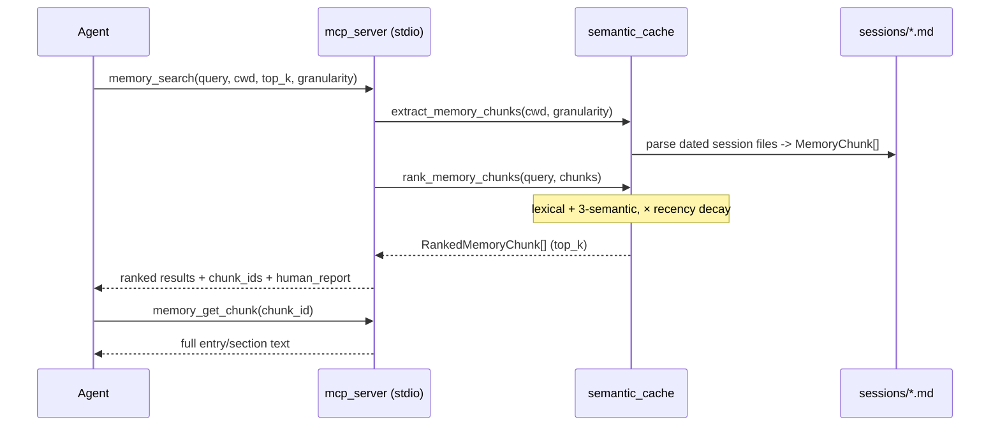
```mermaid
sequenceDiagram
  participant Agent
  participant MCP as mcp_server (stdio)
  participant Cache as semantic_cache
  participant FS as sessions/*.md
  Agent->>MCP: memory_search(query, cwd, top_k, granularity)
  MCP->>Cache: extract_memory_chunks(cwd, granularity)
  Cache->>FS: parse dated session files -> MemoryChunk[]
  MCP->>Cache: rank_memory_chunks(query, chunks)
  Note over Cache: lexical + 3-semantic, × recency decay
  Cache-->>MCP: RankedMemoryChunk[] (top_k)
  MCP-->>Agent: ranked results + chunk_ids + human_report
  Agent->>MCP: memory_get_chunk(chunk_id)
  MCP-->>Agent: full entry/section text
```

### 4.3 Session lifecycle (recency vs. topical retrieval)

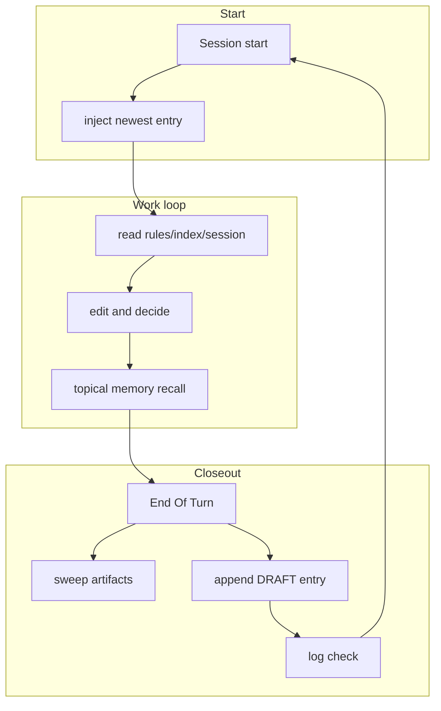
```mermaid
graph TD
  subgraph Start["Start"]
    direction LR
    S["Session start"] --> H1["inject newest entry"]
  end

  subgraph Work["Work loop"]
    direction LR
    R["read rules/index/session"] --> W["edit and decide"]
    W --> H2["topical memory recall"]
  end

  subgraph Close["Closeout"]
    direction LR
    EOT["End Of Turn"] --> SW["sweep artifacts"]
    EOT --> LOG["append DRAFT entry"]
    LOG --> H3["log check"]
  end

  H1 --> R
  H2 --> EOT
  H3 --> S
  Start ~~~ Work
  Work ~~~ Close

```

### 4.4 Agent config wiring

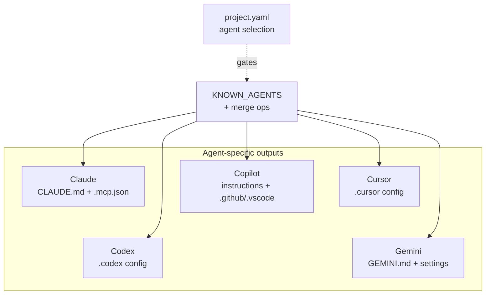
```mermaid
graph TD
  PROJ["project.yaml<br>agent selection"] -. gates .-> REG["KNOWN_AGENTS<br>+ merge ops"]

  subgraph Agents["Agent-specific outputs"]
    direction TB
    CL["Claude<br>CLAUDE.md + .mcp.json"] ~~~ CO["Codex<br>.codex config"]
    CU["Cursor<br>.cursor config"] ~~~ GE["Gemini<br>GEMINI.md + settings"]
    CP["Copilot<br>instructions + .github/.vscode"]
  end

  REG --> CL
  REG --> CO
  REG --> CU
  REG --> GE
  REG --> CP

```

---

## 5. Quality goals & non-functional requirements

The qualities the design optimises for (the "why it is shaped this way"):

- **Local-first / offline.** Core operations (init/update/doctor/compact, retrieval) need no network. Nothing is sent to a remote service.
- **Minimal dependency.** The CLI and core run on the standard library; the only runtime dependency is `model2vec` (for semantic ranking), and retrieval **degrades to lexical** if semantic scoring is disabled or fails.
- **Portable / cross-platform.** Windows, macOS, Linux; Python >= 3.11; hook output is ASCII-safe so it survives any console encoding.
- **Vendor-neutral.** One canonical `AGENTS.md` + thin per-agent routers; no agent is privileged. New agents are added via a registry, not scattered special-casing.
- **Human-readable & durable.** Plain Markdown + YAML, predictable paths, git-friendly diffs; no binary store that could rot or lock.
- **Deterministic where it matters.** The skill trigger registry, recency-by-filename-date reads, and append-only chronology are deterministic, not model-judgement.
- **Non-destructive.** `update` is forward-only; replaced files are archived; `remove`/`--force` back up first; foreign agent config is preserved.

## 6. Constraints & assumptions

- **Python >= 3.11** (uses `tomllib` and modern typing).
- **Stdlib-only core; `model2vec>=0.8.1` is the single declared runtime dependency** (it pulls `numpy`). A project that never uses semantic search still installs it.
- **Markdown + YAML, no database.** All state is files; there is no migration engine beyond `update`'s forward-only archive.
- **Session model is grouped and multi-user compatible (phased).** The current default write target is one shared month-grouped file, `sessions/YYYY-MM/YYYY-MM-DD.md`. Readers still support the legacy shared file (`sessions/YYYY-MM-DD.md`) and legacy per-user file (`sessions/YYYY-MM-DD/<user>.md`) indefinitely. The per-user grouped layout (`sessions/YYYY-MM/YYYY-MM-DD/<user>.md`) avoids concurrent-author Git merge conflicts. **Per-user layout additionally requires 2+ registered `participants:`** (new in 2.14) - a lone configured user stays on the grouped flat file regardless, since per-user files exist to avoid concurrent-author conflicts that don't arise with a single author. This repository has a local user configured (`jean`, participant registry entry with initials `JNL`) but only that one participant registered, so new entries correctly stay on the grouped flat layout; entries only fragment into `sessions/YYYY-MM/YYYY-MM-DD/<user>.md` once a second participant is added.
- **OneDrive-synced repos.** This project lives in a cloud-synced folder, so a cache **must not** use Drive-synced SQLite (corruption risk). The Memory Trace cache (section 3O, originally shipped under the Lense name in 2.13) honors this by storing its SQLite file outside the repository entirely (`%LOCALAPPDATA%`/`~/.cache`) rather than gitignoring an in-repo file - no cache file ever sits inside the synced folder.
- **Version lockstep.** `memory-system-version` frontmatter, `core.VERSION`, and `pyproject.version` must move together (guarded by a test).
- **Agent cooperation assumed.** Agents are expected to honour the `AGENTS.md` read order and the End Of Turn routine; hooks can only *nudge*, not enforce.

## 7. External interfaces & contracts

- **MCP tools (stdio JSON-RPC):**
  - `memory_search(query, cwd=".", top_k=8, granularity="entry"|"section", semantic_enabled, recency_enabled, lambda_days, recency_floor)` -> ranked chunks (`chunk_id`, scores, matched terms/fields) + a `human_report`.
  - `memory_get_chunk(chunk_id, cwd=".")` -> full entry/section text for one id.
  - `memory_link_suggest(cwd=".", entry_id=null, top_k=5)` -> `target` summary + ranked `suggestions` + paste-ready `related_entries` (read-only).
  - `memory_link_show(entry_id, cwd=".")` -> one entry's graph node: `outbound`/`inbound`/`supersedes`/`superseded_by`, `importance_score`, `commit_reference_count` (read-only).
  - `memory_session_target(cwd=".", date=null, user=null)` -> active session-log target (`path`, `layout`, `user`, `exists`); never creates the file.
  - `memory_topics_list(cwd=".")`, `memory_topic_inspect(topic, cwd=".")`, and `memory_topics_check(cwd=".")` -> read-only topic vocabulary listing, alias-aware single-topic inspection with entry usage, and validation mirroring `memory-seed topics check`.
  - `memory_branch_status(cwd=".")`, `memory_worktree_guard(agent_type, write_intent=false, allow_root_write=false, cwd=".")`, and `memory_session_fuse_preview(branch, cwd=".", base="HEAD")` -> read-only branch posture, agent worktree namespace classification, and branch-local fuse plan.
- **CLI exit codes:** `0` success, `1` failure (e.g. nothing to do, invalid agent slug, unhealthy runtime).
- **File-format contracts:** session-entry YAML keys (`entry_id`, `user_initials`, `agent_type`, `agent_name?`, `project_path`, `subproject_path`); per-user session **file** frontmatter (`schema_version: 2`, `session_date`, `hash_id`, `user`, `created_at`, since 2.10); `skills/index.md` trigger schema (`skill`, `required`, `load_when`, `do_not_load_when`, `persona?`); `project.yaml` (`agents:`, `skills:`, `participants:`); `memory-system-version` frontmatter on control-plane files; the routing managed block delimited by `<!-- BEGIN memory-seed -->` / `<!-- END memory-seed -->` in foreign entry-point files.
- **Local user identity:** gitignored `.memory-seed/local.yaml` (`user:` slug) and the `MEMORY_SEED_USER` environment variable select the active user for session targeting and the user-aware hooks (since 2.10).
- **Per-agent config targets:** see the wiring map in section 4.4 (each agent's hook + MCP files).

## 8. Deployment view

Memory Seed is a developer tool, not a service - "deployment" means how the CLI and MCP server reach a machine and a project.

- **Install paths:**
  - `uvx --from memory-seed memory-seed <cmd>` - one-off execution, nothing installed.
  - `uv tool install memory-seed` / `pipx install memory-seed` - persistent machine-wide CLI.
  - `pip install memory-seed` / `uv pip install memory-seed` - into the active virtualenv.
  - `uv add memory-seed` - only when a project itself depends on the package.
- **Runtime placement:** `init`/`update` write control-plane + routing files **into the target project** (no global state beyond the installed package). The MCP server runs as a **stdio subprocess** the agent spawns (`uvx --from memory-seed memory-seed-mcp --stdio`), registered in each agent's config by `init`/`update`.
- **Release pipeline:**

```mermaid
graph TD
  DEV["commit + tag"] --> REL["GitHub Release"]
  REL --> WF["publish.yml<br>build + tests"]
  WF --> GATE{"manual approval"}
  GATE -- approve --> OIDC["OIDC publish"]
  GATE -- hold --> STOP["no push"]
  OIDC --> PYPI["PyPI"]

```

## 9. Cross-cutting concepts

- **Security & privacy.** Public-memory hygiene rule (no secrets, credentials, or unnecessary personal data in memory/logs). PyPI publish uses OIDC with a manual-approval gate. Uninstall strips only Memory Seed's own entries and preserves foreign config. Hooks are read-only and cannot exfiltrate.
- **Error handling & resilience.** Hooks **degrade to silent** on any error (never block the agent). `project.yaml` parsing **fails open** (absent/malformed/no-`agents:` => all agents). `update` is forward-only (cannot downgrade a newer project). `remove` and `init --force` back up before touching files. `doctor` separates hard checks from a non-fatal `warnings` channel. Project-owned text writes now have an explicit UTF-8/LF/NFC helper plus repository `.editorconfig`/`.gitattributes`; **known gap:** file writes are direct, not atomic temp-then-rename - a crash mid-write could truncate a file (see Risks).
- **Persistence & concurrency.** Plain files; session logs are strictly append-only with current-clock timestamps so write order == time order. No file locking; the model assumes a single writer per day.
- **Encoding contract.** Project-owned text artifacts are UTF-8 without BOM, LF line endings, and NFC-normalized. `memory_seed.text_files` is the shared helper for generated text/JSON reads and writes; JSON helpers preserve readable Unicode (`ensure_ascii=False`). MCP stdio output is explicitly Unicode-preserving. `memory-seed encoding check` reports byte/normalization drift, likely mojibake, and implicit production Python text I/O. `encoding repair` uses atomic replacement and timestamped backups for mechanically safe BOM/newline/NFC fixes; invalid UTF-8 and likely mojibake remain manual.
- **Dependencies.** Runtime (required): `model2vec>=0.8.1` (+ `numpy` transitively). Runtime (optional, `memory-seed[lense]` extra only): `fastapi>=0.110`, `uvicorn>=0.27` - the default CLI/MCP path stays dependency-light; `lense` prints an install hint rather than failing when the extra isn't installed. Tests: stdlib `unittest`. No ORM, no message bus.

## 10. Architecture decisions

The living decision log is `.memory-seed/index.md` -> **Design Decisions** (terse, append-only). The records below add the *context -> decision -> consequence* framing for the load-bearing choices.

| # | Context | Decision | Consequence |
|---|---|---|---|
| ADR-1 | Memory must be agent-readable, durable, git-friendly, offline | **Plain Markdown + YAML, no database** | No query engine - retrieval is built in Python (`semantic_cache`); no transactions/atomic writes (see Risks) |
| ADR-2 | Monorepos and sub-projects need isolated memory | **Nearest-runtime discovery** (walk upward to the closest `.memory-seed/`) | `cwd` determines the active runtime; sub-projects can own local memory; legacy `.AGENTS/` kept as fallback |
| ADR-3 | Ranked search buries the newest entry for "what's current" | **Recency over search for current state** - SessionStart hook + direct newest-file read | Two retrieval modes coexist; per-agent SessionStart hooks must be wired |
| ADR-4 | The repo ships templates *and* dogfoods them | **Seed/live twins, enforced by tests** | Every control-plane edit must touch both copies; parity is mechanical, not trusted |
| ADR-5 | Projects already have their own agent config | **Merge (upsert), never copy; preserve foreign entries** | Idempotent per-schema merge helpers; uninstall strips only Memory Seed's own entries, backs up first |
| ADR-6 | Older projects predate agent-selection | **`project.yaml` fails open** (absent => all agents; empty => none) | Backward compatible; a zero-vs-None distinction in the parser |
| ADR-7 | Semantic search shouldn't add heavy infra | **Static Model2Vec embeddings + lexical fallback** | One runtime dep (`model2vec`); graceful degradation to lexical; recency is clock-sourced, not caller-supplied |

## 11. Performance & quality scenarios

Measured on this repository's own corpus on 2026-06-14 (Windows, Python 3.11). Indicative, not contractual.

- **Corpus:** 103 entry-chunks / 277 section-chunks parsed from `sessions/*.md`.
- **Extraction:** ~30 ms to parse all session files into typed chunks.
- **Lexical search (no model):** rank ~27 ms; end-to-end query ~55-60 ms.
- **Semantic search (Model2Vec `potion-base-8M`):**
  - First-ever call: ~3.7 s (includes a one-time ~tens-of-MB model download).
  - Cold per process, model cached: ~1.1 s (model load + embed the corpus once).
  - Warm per query: ~43 ms (~15 ms over lexical once loaded).

**Quality scenarios (target -> result):**
- *Interactive search feels instant after warm-up* (<100 ms/query) -> **met** (~43 ms semantic, ~27 ms lexical).
- *Cold start within a couple of seconds* -> **met** (~1.1 s with the model cached).
- *Retrieval still works with no model present* -> **met** - semantic scores degrade to `None` and ranking falls back to lexical + recency (verified: this benchmark environment had no model installed until explicitly added).

**Scaling note:** parsing and ranking are linear scans over chunks (no index), so cost grows O(entries). At hundreds of entries it is tens of ms; a corpus in the 10k+ range would warrant Memory Trace cache/index work rather than a per-query full scan.

## 12. Risks & technical debt

| Risk / debt | Impact | Status |
|---|---|---|
| Semantic/lexical search buries the newest entry | Agent misreads "current state" | **Mitigated** - SessionStart hook + direct newest-file read rule |
| Legacy 32-bit `ms-` entry IDs | Collisions at large history sizes | **Mitigated since 2.12.0** for new generated entries: `generate_session_entry_id()` now emits deterministic 80-bit `mse_` IDs while existing `ms-` IDs remain valid and are not rewritten |
| Drive-synced SQLite corruption | Rules out the obvious cache backend | **Resolved (2.13.0)** - the Memory Trace cache, originally shipped as Memory Lense, lives outside the repo entirely (`%LOCALAPPDATA%`/`~/.cache`), so no SQLite file is ever placed inside the synced folder |
| `links check` skipped legacy-flat `related_entries` validation | A dangling `related_entries` ref in this repo's own layout wasn't caught | **Fixed in 2.14.0** - entry-level scan moved out of the per-user-day-only gate; regression-tested |
| Version-bump trap (root files missed by scoped sed) | Shipping mismatched versions | **Guarded** by `test_repo_root_control_plane_files_match_version` |
| `update --dry-run` lists all targets, not just changed | Noisy preview | Documented in README |
| Non-atomic file writes (no temp+rename) | Corruption on crash mid-write | Open - candidate hardening item. Note: Memory Trace's cache *does* use temp-file + atomic `os.replace`, so this gap is specifically about control-plane/session file writes, not the cache. |
| Encoding drift / mojibake on Windows defaults | Corrupted Markdown, JSON, logs, or MCP payload readability | **Mitigated 2026-07-08** - `.editorconfig`, `.gitattributes`, UTF-8/LF/NFC helpers, MCP Unicode output, read-only checks, backup-first atomic repair for safe drift, production implicit-I/O checks, and non-fatal doctor summaries are implemented. Suspected mojibake remains intentionally manual. |
| Single-writer session model | Concurrent multi-author Git conflicts | **Phased migration underway** - dual-read (2.9), opt-in per-user write targets/hooks (2.10), integrity validation, ID widening, MCP filters, participant registry parsing, and migration support all shipped through 2.12.0 |

## 13. Glossary

- **Control plane** - the reusable runtime files (`agent-rules.md`, `project-bootstrap.md`, skills, hooks) versioned by `memory-system-version`.
- **Runtime** - the nearest `.memory-seed/` directory found by walking upward from `cwd`.
- **Seed / live twin** - a template under `memory_seed/seed/` and its byte-identical copy in the repo's own `.memory-seed/` (parity enforced by tests).
- **Routing file** - a thin per-agent file (`CLAUDE.md`, etc.) that points back to `AGENTS.md`.
- **Trigger registry** - `skills/index.md`, the deterministic map deciding which skill runbooks to lazy-load.
- **DRAFT** - the baseline session-entry shape: **D**ecision + **R**eason (mandatory), **A**lternatives / **F**iles / **T**ests (optional).
- **Chunk** - a `MemoryChunk` parsed from a session entry (`granularity="entry"`) or sub-heading (`"section"`); `chunk_id` is normally the `entry_id`.
- **Persona** - a vendor-neutral `.agents/*.md` role profile; evolution is approval-gated.
- **Orphan skill** - a `skills/*.md` runbook not registered in `skills/index.md` (flagged by `doctor`).
- **Memory Trace** - the companion local read-only browser UI (`memory-trace`; legacy `memory-seed lense` shim, section 3O), backed by a rebuildable SQLite cache stored outside the repository.
- **Related-entry graph** - the graph `build_related_entry_graph()` computes at read time from entries' stored `related_entries` (outbound), computed backlinks (inbound), typed `supersedes`, computed `superseded_by`, `inbound_relation_count`, and `importance_score`; surfaced via `link suggest`/`link show` and MCP metadata.

---

## 14. Upcoming / roadmap features

Sources: `docs/2_Todo/0_NEXT_STEPS.md` and `docs/2_Todo/`. Status reflects package `2.16.0`
plus verified unreleased work through `5daa3d6`.

**Shipped since the 2.7.0 audit:** 2.8.0 non-destructive foreign-routing merge + doctor route-presence backstop (section 3E, section 3L); 2.9.0 read-only dual-discovery of per-user session files (section 3J); 2.10.0 opt-in user-aware session targets/hooks + `user`/`session target` CLI (section 3B, section 3H, section 3J); 2.11.0 ESR generalization; 2.12.0 session-memory integrity validation, 80-bit entry IDs, MCP metadata/filters, participant registry, and `migrate sessions-layout`; 2.13.0 Memory Lense, related-entries generation P1, and lazy-skill extraction; 2.14.0 participant-count layout gating, one-time identity offer, doctor local-user warning, legacy-flat links-check fix, Working Principles additions, failed-approach logging, Mermaid guidance, and the Fan-Out Recipe; current unreleased work adds month-grouped session targets plus explicit `migrate sessions-month-layout`.

**Unreleased, queued under `CHANGELOG.md`'s `## Unreleased`:** typed supersession edges P1; git commit entry linking P1; ranking P1a/P1b (`inbound_relation_count`, `importance_score`); Trace graph `related_degree` -> `connectivity` rename; UTF-8 encoding policy plus check/repair/static enforcement; and safe process shutdown / package-manager-aware upgrade execution for Memory Seed and Memory Trace.
Additional unreleased control-plane documentation: `proposal_lifecycle.md` now governs proposal movement
through inbox -> todo -> completed -> reference/spec lanes, with repo-numbered and generic bootstrap
path conventions; worktree dependency strategy Phase 1 (dependency tiers,
dependency task-packet fields, and optional tmux control-room guidance) shipped into
`agent_collaboration.md` - see [docs/2_Todo/completed/worktree-dependency-strategy-plan.md](../2_Todo/completed/worktree-dependency-strategy-plan.md);
`risk_signaling.md` now provides qualitative risk tiers and STOP categories; and the seeded
`docx_render_windows.md` skill (Windows DOCX render fallback) joined the seed inventory and trigger
registry. The accepted topic-neighbourhood plan will make `topics:` a normal 1-3-topic field on new
meaningful entries and `.memory-seed/topics.yaml` a project-local core index once implemented.

### Near term - next candidate
- **`/esr` command shortcuts for Codex/Cursor** once those tools support repo-level custom commands
  (Codex project-scoped `.codex/prompts` is an open upstream request; Cursor unverified). Not
  blocking - the enriched routine in `agent-rules.md` already serves them today.

### Completed 3.0 foundation

**Multi-user per-day session memory** is complete
(`docs/2_Todo/completed/multi-user-session-memory-proposal.md`). Phase 1 dual-read (2.9), Phase 2
opt-in user-aware targets and hooks (2.10), integrity validation, 80-bit `mse_` IDs, MCP
metadata/filters, participant parsing, and explicit session-layout migration all landed through
2.12. The participant-count gate keeps a one-person project on the simpler shared file.

```mermaid
graph TD
  subgraph InputTier["Session target input"]
    direction LR
    A["Project participants"] ~~~ B["Configured local user"]
  end

  subgraph GateTier["Layout gate"]
    G{"Two or more<br>participants?"}
  end

  subgraph OutputTier["Write target"]
    direction LR
    FLAT["No: shared grouped file<br>sessions/YYYY-MM/YYYY-MM-DD.md"]
    SPLIT["Yes: grouped per-user<br>sessions/YYYY-MM/YYYY-MM-DD/user.md"]
  end

  InputTier ~~~ GateTier
  GateTier ~~~ OutputTier
  A --> G
  B --> G
  G -- No --> FLAT
  G -- Yes --> SPLIT
```

### Current implementation order

```mermaid
graph TD
  subgraph ReleaseTier["P0 - release order"]
    direction LR
    CORE["Publish Memory Seed 2.17"] --> TRACE["Publish Memory Trace 0.1.0"]
  end

  subgraph NextTier["Next small implementation run"]
    direction LR
    TOPICS["P1 - topic neighbourhoods"] --> README["P2 - README front door"]
  end

  subgraph LaterTier["Active later"]
    direction LR
    DIAGRAMS["Decision diagram<br>export packs"]
    LINKS["Related-entry<br>curation writers"]
    SUMMARIES["AI timeline<br>summaries"]
    DIAGRAMS ~~~ LINKS ~~~ SUMMARIES
  end

  ReleaseTier --> NextTier
  NextTier --> LaterTier
```

---

## 15. Test & verification surface

- `tests/test_memory_seed.py`, `tests/test_session_schema.py`, `tests/test_semantic_cache.py`,
  `tests/test_mcp_server.py`, `tests/test_retrieval.py`, `tests/test_processes.py`,
  `tests/test_text_files.py`, and `memory-trace/tests/` cover
  init/update/doctor, session schema, links validation (incl. diagram sidecars),
  related/supersession/commit graph metadata, MCP exposure, MCP/retrieval-service parity and one-way
  dependency, entry-level rollup, Memory Trace graph field naming, the `exclude_superseded` search
  filter, process shutdown/upgrade flows, encoding checks, and seed/live parity. Current suite:
  **276 core tests + 35 Memory Trace tests** (verified 2026-07-08).
- `memory-seed doctor` is the runtime health gate; `memory-seed-mcp-validate` validates retrieval end-to-end.
