# Agent Memory Product Functionality Report

This source report explains how eight adjacent memory products appear to work:
Mem0, Letta, Zep, Supermemory, Cognee, Pieces, Personal AI, and Limitless.

It is **source-only inbox material**, not an accepted Memory Seed proposal. Use it as background for
future market, UI, and architecture decisions.

## Summary Map

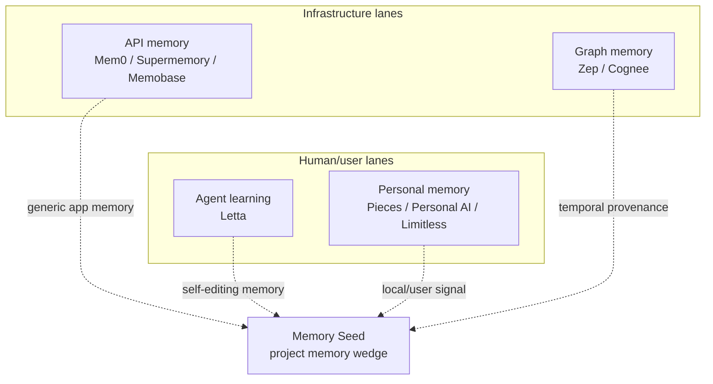

Memory Seed's distinct lane remains: **local-first project memory for AI-assisted software work**.

---

## 1. Mem0

**Category:** memory API / infrastructure.

**Functional model:** Mem0 sits between an application and its model. The app sends conversation turns
or facts to Mem0, Mem0 extracts durable memories, stores them with identifiers and metadata, and the
app calls search before a later model request to retrieve relevant memories.

Mem0 distinguishes raw messages from memories. By default, the system stores extracted facts rather
than the full transcript. It supports user, session/run, agent/app, and organizational scoping, and
uses backing stores for facts/metadata, embeddings, and optional entity/graph relationships.

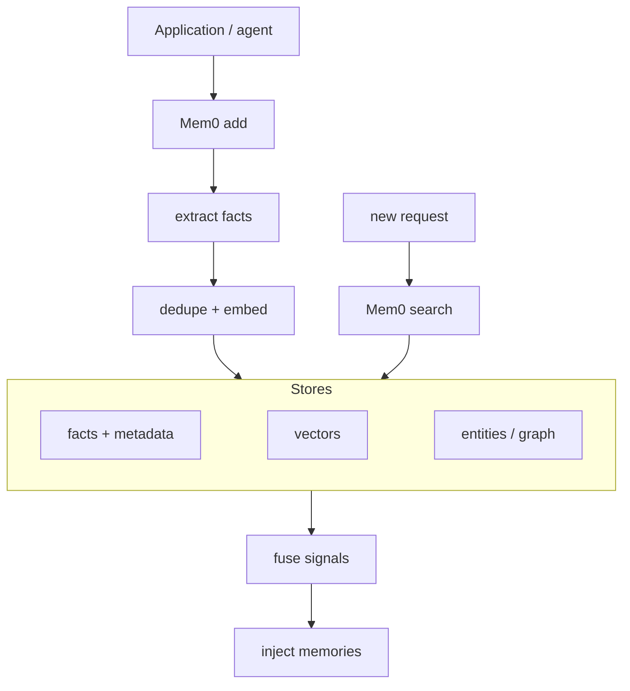

**How retrieval works:**

- The application scopes memory using IDs such as user, agent, app, run, and metadata.
- Search ranks stored memories against the query and filters.
- Managed Mem0 fuses multiple signals; open-source deployments depend on configured stores and
  optional rerankers.
- Updates/deletes are explicit operations; the default add path is additive.

**Strengths:**

- Clean app-builder API.
- Strong fit for personalization and agent memory in hosted products.
- Clear separation between "message observed" and "memory stored."
- Enterprise direction through audit/governance/private deployment options.

**Limits from a Memory Seed perspective:**

- It is not repo-native by default.
- Human audit happens through a service/API rather than Git diffs over project files.
- It is better at user/app memory than project decision provenance.

**Memory Seed implication:** do not compete with Mem0 as a generic hosted memory API. Emphasize
project memory, Git reviewability, decision trails, local files, and coding-agent handoffs.

**Primary sources:** [Mem0 overview](https://docs.mem0.ai/platform/overview),
[How Mem0 works](https://docs.mem0.ai/core-concepts/how-it-works),
[Memory types](https://docs.mem0.ai/core-concepts/memory-types).

---

## 2. Letta

**Category:** stateful agents / agent learning.

**Functional model:** Letta treats the agent itself as stateful. An agent has a system prompt, memory
blocks, messages, tools, runs, and steps. State persists in a database even when context is compacted
or evicted. Important "core" memory blocks can be pinned into the model context, and agents can update
their own memories through tools.

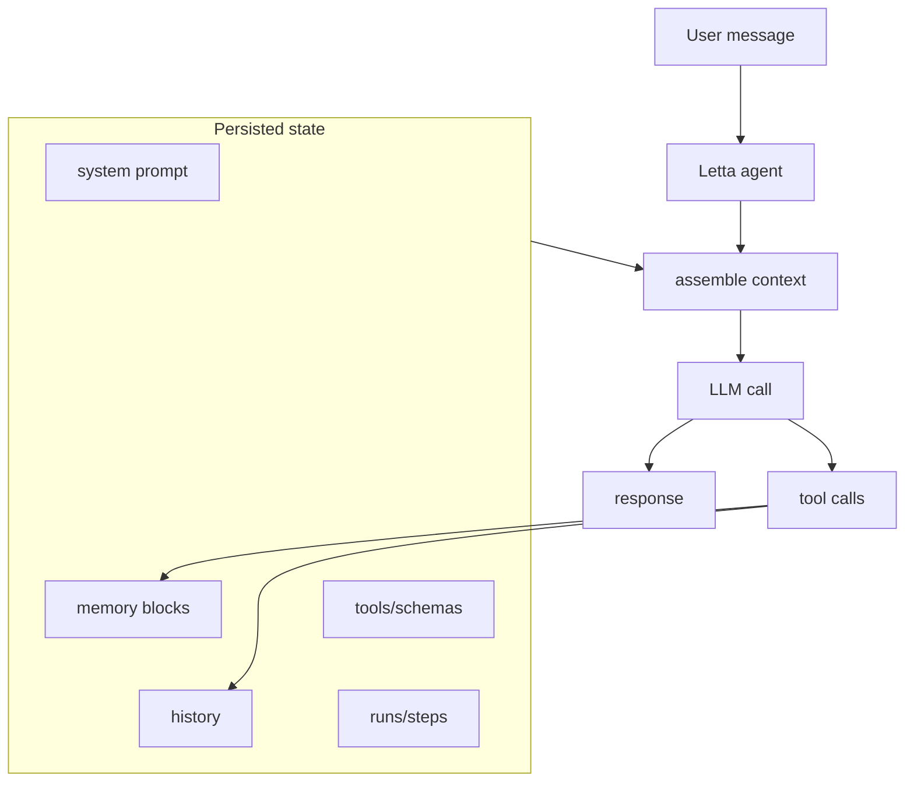

**How memory works:**

- Memory blocks are structured sections of the agent context.
- Blocks have labels, descriptions, values, and character limits.
- Blocks can be read-write or read-only.
- Blocks can be shared across agents.
- Archival memory supports larger out-of-context storage and retrieval.
- Messages remain stored even after compaction, so prior conversations are retrievable by API/tools.

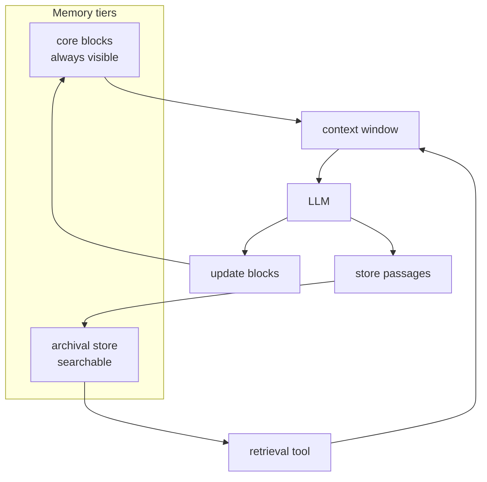

**Strengths:**

- Strongest model of self-editing agent state in this group.
- Memory is part of the agent's operating loop, not just external retrieval.
- Shared/read-only blocks create a useful multi-agent coordination primitive.

**Limits from a Memory Seed perspective:**

- The memory object is the agent, not the project.
- It is more ambitious and less inspectable than a plain Markdown project log.
- If the agent can rewrite memory, governance becomes a central concern.

**Memory Seed implication:** Letta validates the importance of memory as an agent capability, but
Memory Seed should keep its narrower promise: projects remember decisions; agents retrieve and act on
that inspectable record.

**Primary sources:** [Letta stateful agents](https://docs.letta.com/guides/core-concepts/stateful-agents),
[Memory blocks](https://docs.letta.com/guides/core-concepts/memory/memory-blocks),
[Archival memory](https://docs.letta.com/guides/core-concepts/memory/archival-memory).

---

## 3. Zep

**Category:** enterprise graph memory / temporal knowledge graph.

**Functional model:** Zep is built around temporally aware agent memory. Its published architecture
uses Graphiti, a temporal knowledge graph engine, to synthesize conversational and business data while
preserving historical relationships.

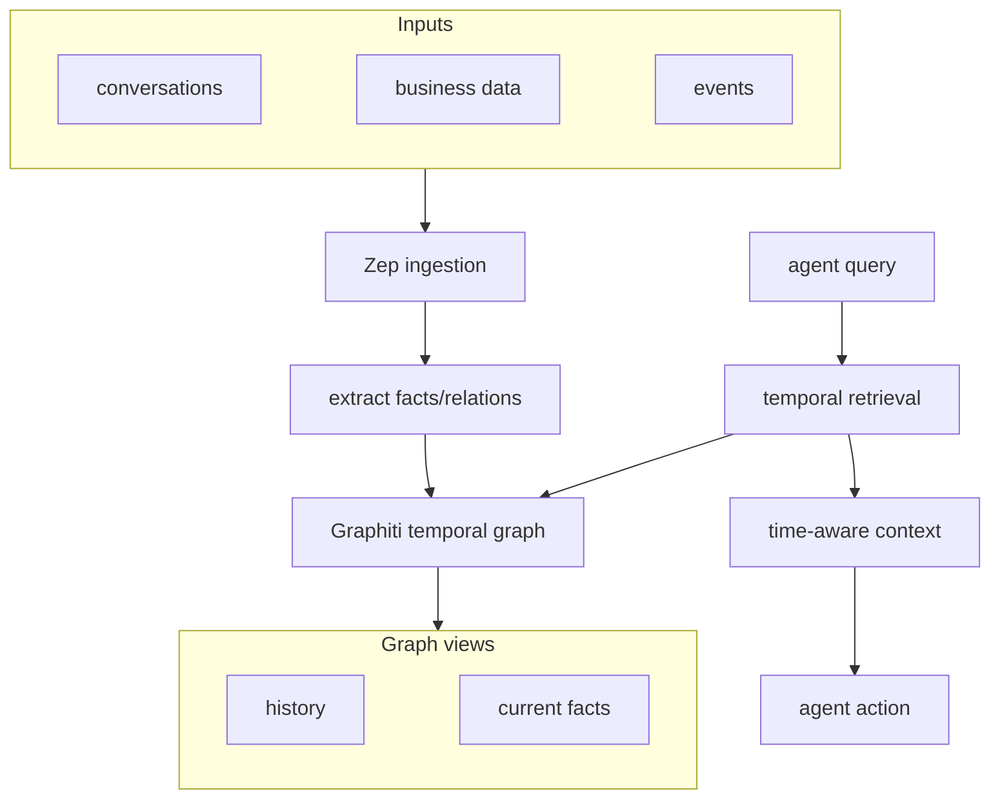

**How memory works:**

- It converts unstructured conversations and structured business data into a temporal graph.
- The graph stores entities, facts, relationships, and their evolution over time.
- Retrieval can use historical and current-state relationships rather than only semantic similarity.
- The enterprise posture emphasizes governed, auditable, low-latency context.

**Strengths:**

- Strong temporal model.
- Strong provenance/governance framing.
- Better suited to enterprise-scale, multi-source memory than flat vector retrieval.

**Limits from a Memory Seed perspective:**

- It is service/graph infrastructure, not a repo-local Markdown control plane.
- It is heavier than needed for a small project memory layer.
- Reviewability depends on graph/service tooling, not ordinary code review.

**Memory Seed implication:** borrow the language of temporal memory, provenance, and current-vs-
historical fact handling, but implement it as lightweight project history: session entries,
supersession links, commits, branches, and diagrams.

**Primary sources:** [Zep overview](https://help.getzep.com/overview),
[Zep paper](https://arxiv.org/abs/2501.13956).

---

## 4. Supermemory

**Category:** context cloud / memory API.

**Functional model:** Supermemory presents itself as context infrastructure for agents. It combines
memory, RAG, profiles, connectors, extraction, graph memory, and filesystem-style access into one
context layer.

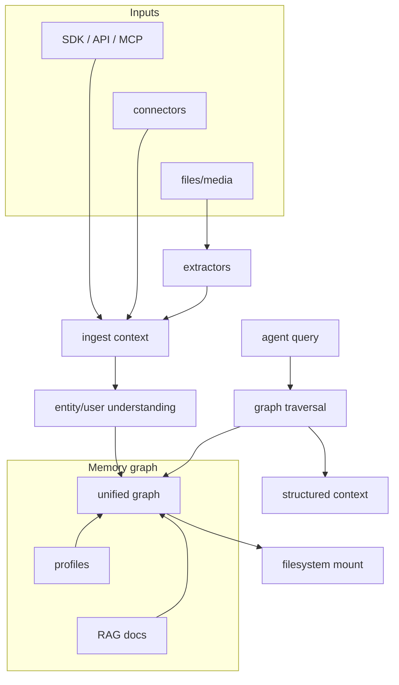

**How memory works:**

- Data comes from API calls, connectors, and files.
- Extractors normalize many content types into memory objects.
- A graph layer unifies memory, profiles, and document retrieval.
- Agents can retrieve through API/MCP, and Supermemory also advertises a filesystem mount where
  command-line operations become semantic access.

**Strengths:**

- Broad product surface.
- Strong connector and extraction story.
- Good "context cloud" positioning for app builders.
- Filesystem idea is highly relevant to file-native agent workflows.

**Limits from a Memory Seed perspective:**

- It is broad context infrastructure, not a project decision system.
- The memory source of truth is the platform/graph, not project-owned Markdown.
- It is optimized for app and agent context, not Git-reviewed development provenance.

**Memory Seed implication:** Supermemory shows demand for agent context as infrastructure. Memory Seed
should stay narrower: repo history, decisions, commits, tests, and multi-agent handoffs.

**Primary sources:** [Supermemory docs](https://supermemory.ai/docs/introduction),
[Supermemory product page](https://supermemory.ai/).

---

## 5. Cognee

**Category:** open-source graph memory for agents.

**Functional model:** Cognee turns raw documents and context into searchable memory through a pipeline
that chunks data, extracts entities and concepts, builds graph/vector-backed memory, and supports
remember/improve/recall operations.

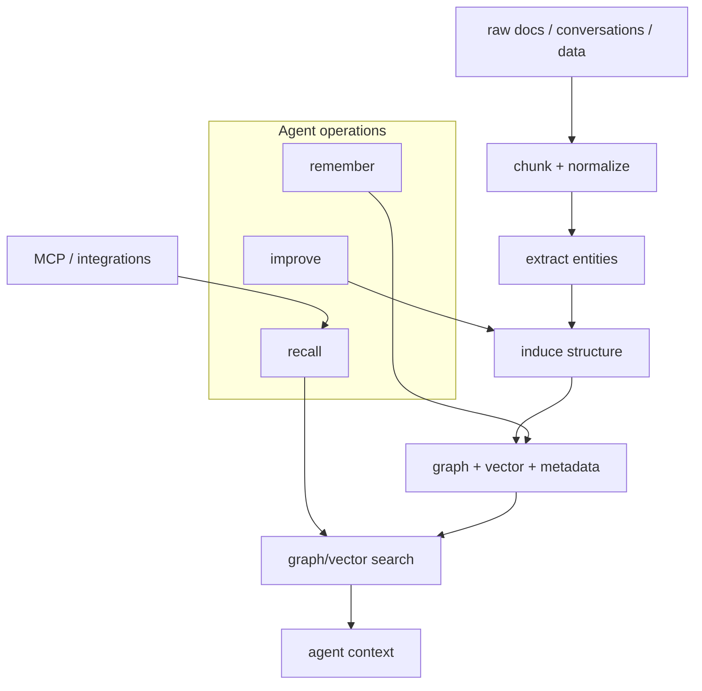

**How memory works:**

- Cognee is configurable around LLM providers, embedding providers, relational databases, vector
  stores, and graph stores.
- It exposes operations and integrations for building AI memory applications.
- It is closer to a graph-memory platform than a note/log format.

**Strengths:**

- Open-source and developer-facing.
- Graph-first memory model.
- Configurable local/cloud architecture.
- Close to coding-agent recall use cases.

**Limits from a Memory Seed perspective:**

- Heavier stack: graph/vector/relational components rather than simple repo files.
- The graph is powerful, but less directly reviewable in ordinary pull requests.
- It is memory infrastructure rather than project governance.

**Memory Seed implication:** Cognee is the closest technical adjacent competitor. Memory Seed should
differentiate as "boring memory you can review in a PR": Markdown/YAML, session logs, links check,
doctor, commit trailers, and local Trace/Lense inspection.

**Primary sources:** [Cognee docs](https://docs.cognee.ai/),
[Cognee architecture docs](https://docs.cognee.ai/core-concepts/architecture).

---

## 6. Pieces

**Category:** local developer/workflow memory.

**Functional model:** Pieces is an on-device artificial memory system for a developer's broader
workflow. PiecesOS runs in the background, captures work context across apps, and exposes that memory
through the desktop app, timeline, conversational search, CLI, and MCP integrations.

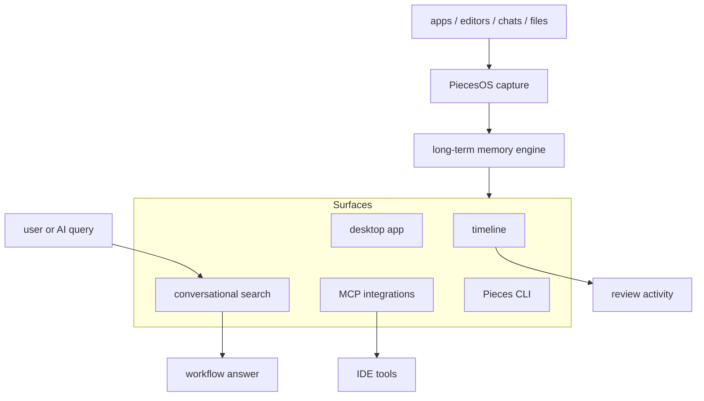

**How memory works:**

- The user turns on long-term memory.
- Pieces captures saved content, browser tabs, documents, code, conversations, and decisions.
- The timeline provides a browseable history.
- Conversational search answers questions over captured workflow context.
- MCP integrations let AI tools access Pieces memory.

**Strengths:**

- Local and private by design.
- Very relevant to developers because it remembers workflow context across tools.
- Strong human UI surface: timeline, desktop app, conversational search.
- MCP integrations overlap with agent workflows.

**Limits from a Memory Seed perspective:**

- It is personal/workflow memory, not repo-controlled project memory.
- Capture is broad and automatic rather than explicit and decision-record oriented.
- It is less Git-native: the memory is not naturally reviewed as part of a PR.

**Memory Seed implication:** Pieces can remember what the developer did. Memory Seed should remember
what the project decided, why, with which files/tests/commits, and how agents should continue.

**Primary source:** [Pieces docs](https://docs.pieces.app/products/meet-pieces).

---

## 7. Personal AI

**Category:** personal memory / user-owned digital mind.

**Functional model:** Public architecture detail is limited, so this section is a positioning-level
model rather than a verified internal pipeline. Personal AI presents itself as an AI memory platform
centered on personal, user-owned/user-trained memory and personalized generation.

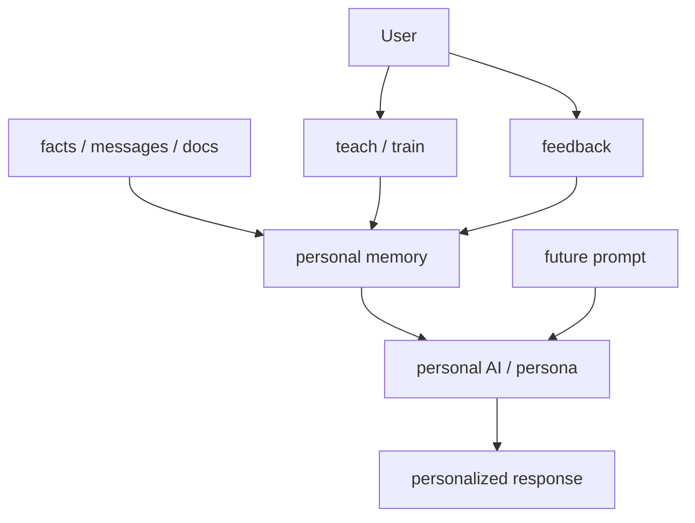

**How memory appears to work at the product level:**

- The user accumulates a personal memory base.
- The AI uses that memory to answer in a personalized way.
- Persona and identity are part of the product framing.
- The memory object is the person, not a software project.

**Strengths:**

- Strong category signal for user-owned AI memory.
- Clear personal-identity positioning.
- Useful contrast against generic stateless assistants.

**Limits from a Memory Seed perspective:**

- It is not coding-agent or repo memory.
- Public details do not expose the same kind of operational architecture available for Mem0, Letta,
  Zep, Supermemory, Cognee, or Pieces.
- Its memory is centered on a person/persona, not project provenance.

**Memory Seed implication:** useful market signal, but not a direct product model. The distinction
should be explicit: Personal AI remembers the person; Memory Seed remembers the project.

**Primary source:** [Personal AI](https://www.personal.ai/).

---

## 8. Limitless

**Category:** ambient personal memory / meeting and conversation memory.

**Functional model:** Limitless/Rewind is an ambient capture model. It records or imports
conversation/activity streams, turns them into transcripts and summaries, and lets users search or
export that memory. As of the current public site, Limitless has been acquired by Meta, new Pendant
sales have stopped, and support/export/delete options remain for continuing customers.

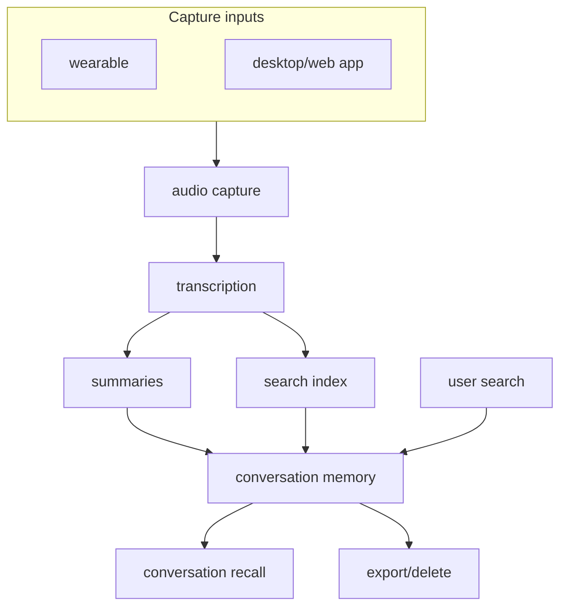

**How memory works at product level:**

- Capture happens from a device/app rather than from explicit notes.
- Transcripts and summaries become the memory substrate.
- Search retrieves prior conversations and meetings.
- The user can export or delete their stored data through product flows.

**Strengths:**

- Strong "ambient memory" category signal.
- Shows demand for search over past meetings and conversations.
- Wearable/app capture reduces manual logging friction.

**Limits from a Memory Seed perspective:**

- It is personal conversation memory, not project memory.
- It relies on capture/transcription, not a structured decision log.
- It is not designed around Git, commits, tests, or coding-agent handoffs.

**Memory Seed implication:** Limitless validates that users want memory of what happened. Memory Seed's
equivalent for software should be explicit, reviewable project memory: what changed, why, who/which
agent did it, and where the evidence lives.

**Primary source:** [Limitless acquisition/support notice](https://www.limitless.ai/).

---

## Cross-Product Comparison

| Product | Primary memory object | Source of truth | Retrieval style | Human inspection | Closest Memory Seed lesson |
|---|---|---|---|---|---|
| Mem0 | User/app/agent facts | Managed or OSS stores | Semantic, keyword, entity, temporal | Dashboard/API | Clean add/search/update/delete mental model |
| Letta | Stateful agent | Agent database and memory blocks | In-context blocks plus archival search | API/ADE | Self-editing memory needs governance |
| Zep | Enterprise facts and relationships | Temporal graph | Graph/temporal retrieval | Service tooling | Provenance and time-aware facts matter |
| Supermemory | Context graph and profiles | Platform graph/API | Graph traversal, RAG, filesystem access | Console/plugins/filesystem | Context infrastructure is becoming a platform |
| Cognee | Graph memory | Graph/vector/relational stores | Graph and vector recall | SDK/API tooling | Developer memory competitors are graph-first |
| Pieces | Developer workflow context | Local PiecesOS memory | Timeline and conversational search | Desktop app/timeline | Visible local memory is compelling |
| Personal AI | Person/persona | Personal memory platform | Personalized recall | Product UI | "User memory" is a distinct lane |
| Limitless | Meetings/conversations | Transcripts and summaries | Search over ambient capture | App/export flows | Capture is useful, but project decisions need structure |

## Implications For Memory Seed

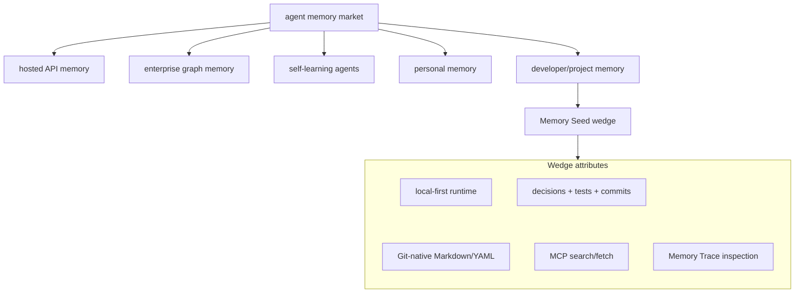

The clearest strategy is not to become a generic memory API, a graph platform, or an ambient personal
memory product. Memory Seed should own **inspectable project memory for AI coding work**:

- explicit session entries instead of automatic hidden memory;
- Git diffs instead of opaque memory stores;
- project decisions instead of user profiles;
- commit/branch/test links instead of generic recall;
- Memory Trace/Lense as the human inspection surface.

## Source Links

- Mem0 overview: <https://docs.mem0.ai/platform/overview>
- Mem0 how it works: <https://docs.mem0.ai/core-concepts/how-it-works>
- Mem0 memory types: <https://docs.mem0.ai/core-concepts/memory-types>
- Letta stateful agents: <https://docs.letta.com/guides/core-concepts/stateful-agents>
- Letta memory blocks: <https://docs.letta.com/guides/core-concepts/memory/memory-blocks>
- Letta archival memory: <https://docs.letta.com/guides/core-concepts/memory/archival-memory>
- Zep overview: <https://help.getzep.com/overview>
- Zep paper: <https://arxiv.org/abs/2501.13956>
- Supermemory docs: <https://supermemory.ai/docs/introduction>
- Supermemory product page: <https://supermemory.ai/>
- Cognee docs: <https://docs.cognee.ai/>
- Cognee architecture docs: <https://docs.cognee.ai/core-concepts/architecture>
- Pieces docs: <https://docs.pieces.app/products/meet-pieces>
- Personal AI: <https://www.personal.ai/>
- Limitless: <https://www.limitless.ai/>
